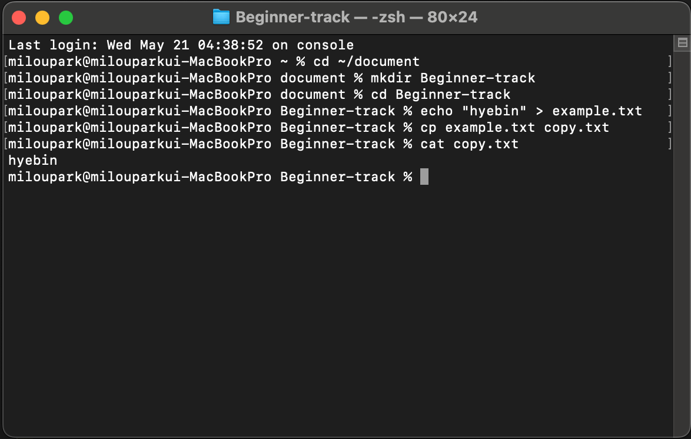

# 💻 CLI 환경 알아보기 <Badge type="info" text="250622" />

## 🤔 터미널이란?

### 터미널 (Terminal)

- 사용자와 컴퓨터가 텍스트 기반으로 소통하는 명령줄 인터페이스(Command Line Interface, CLI)
- 사용자는 명령어를 입력해 파일 탐색, 프로그램 실행, 시스템 설정 등 다양한 작업을 수행할 수 있다.

 

### 터미널의 정의

- 터미널은 사용자가 텍스트 명령어를 입력할 수 있는 환경으로, 입력된 명령은 운영체제의 쉘(Shell)을 통해 해석되고 실행된다. 쉘은 사용자와 운영체제의 핵심인 커널(Kernel) 사이에서 명령을 중계하는 역할을 한다.
- 터미널에서 사용되는 명령어는 파일 관리, 프로세스 제어, 네트워크 설정 등 다양한 작업을 수행할 수 있으며, 시스템 자원에 깊이 접근하고 정밀하게 제어할 수 있는 강력한 도구이다.

::: details 쉘(Shell)과 커널(Kernel)
<code>쉘(Shell)</code>

- 정의: 사용자가 입력한 명령어를 해석하고, 이를 커널에 전달하는 프로그램
- 기능:
  - 명령어 해석 (Command parsing)
  - 명령 실행 (Execute or forward to kernel)
  - 입력/출력 처리
  - 스크립트 실행 (쉘 스크립트)
- 종류: Bash, Zsh, Fish, Ksh 등

<code>커널(Kernel)</code>

- 정의: 커널은 운영체제의 핵심(Core)으로, 하드웨어와 직접 소통하며 시스템 전체를 관리하는 컴퓨터의 뇌이자 중앙관리자
- 기능:
  - 하드웨어 제어 (CPU, 메모리, 디스크 등)
  - 프로세스 관리 (프로그램 실행과 전환)
  - 메모리 관리 (사용 가능한 메모리 할당)
  - 파일 시스템 관리
  - 입출력(I/O) 관리

<code>작동흐름</code>

1. 사용자가 터미널에 명령어 입력
2. 쉘이 명령어를 해석하고 커널에 요청
3. 커널이 하드웨어에 명령을 내려 실행

:::

 

### CLI vs GUI

#### CLI (Command Line Interface)

- 텍스트 기반 명령어 인터페이스로, 사용자가 키보드로 명령어를 직접 입력해 시스템을 제어한다.
- 명령어 입력 결과도 텍스트 형태로 출력되며, 복잡한 작업이나 반복적인 작업을 간단하고 효율적으로 처리할 수 있다.

#### GUI (Graphical User Interface)

- 마우스 등의 포인팅 장치를 사용해 아이콘, 버튼, 창 등 시각적 요소를 클릭하여 시스템을 제어하는 방식이다.
- 사용자는 복잡한 명령어를 몰라도 직관적인 조작이 가능하여 초보자에게 친숙하다.
- 하지만, 자동화나 대규모 시스템 관리에는 CLI에 비해 제한적일 수 있다.

 

### CLI를 배워야 하는 이유

1.  다양한 개발 도구와 프레임워크가 CLI 기반으로 동작한다.
2.  서버 관리는 대부분 CLI 환경에서 이루어진다.
3.  자동화와 반복 작업에 탁월하다.
4.  가볍고 빠르며 리소스 소모가 적다.
5.  명령어 조합을 통해 유연한 작업 흐름을 만든다.
6.  GUI보다 더 많은 기능과 세부 제어가 가능하다.

## 운영체제 별 터미널

### MAC에서 터미널 실행 방법

- 실행방법

  1. 애플 메뉴 또는 Finder에서 응용 프로그램 > 유틸리티 > 터미널을 찾아 실행
  2. Command + Space를 눌러 Spotlight 검색창에 "터미널" 입력 후 실행

- 특징
  1. 기본 쉘은 Bash 또는 Zsh를 사용
  2. 유닉스 기반으로 리눅스와 유사한 명령어 환경 제공
  3. GUI 기반인 MacOS에서도 터미널을 통해 효율적인 명령어 작업 가능

## 터미널 기초 명령어

### 파일 및 디렉토리 관리

- <code>ls</code> : 디렉토리 내 파일과 폴더 목록 보기  
- <code>cd</code> : 디렉토리 이동
- <code>mkdir</code> : 새 디렉토리 생성
- <code>echo</code> : 텍스트를 파일로 저장 (파일 생성 및 내용 작성)
- <code>cp</code> : 파일 복사
- <code>rm</code> : 파일 삭제 (디렉토리 삭제 시 <code>rm -r</code>)

### 파일 내용 보기 및 텍스트 처리

- <code>cat</code> : 파일 내용을 터미널에 출력
- <code>echo</code> : 텍스트 출력

### 디렉토리 및 파일 정보

- <code>pwd</code> : 현재 작업 디렉토리 표시
- <code>clear</code> : 터미널 화면 지우기

### 프로세스 관리

- <code>ps</code> : 현재 실행중인 프로세스 목록 보기
- <code>kill</code> : 특정 프로세스 종료

### 네트워크 작업

- <code>ping</code> : 네트워크 연결 상태 테스트

### 환경 변수 관리

- <code>$PATH</code> : 시스템 경로 변수 확인
- <code>export</code> : 환경 변수 설정

## 실습 과제

