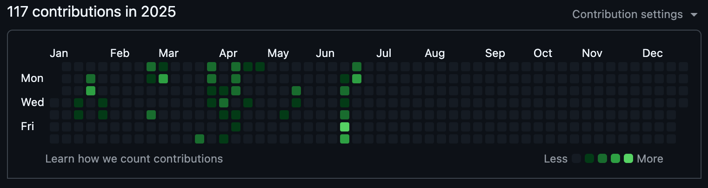
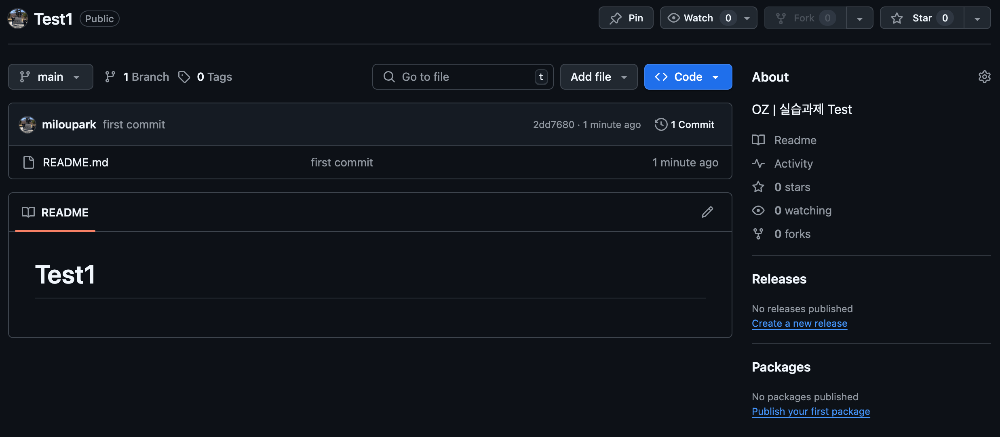

# 🔮 Git과 GitHub <Badge type="info" text="250623" />

## 1. Git과 GitHub

#### <code>Git</code>

- Git은 분산형 버전 관리 시스템(Distributed Version Control System)으로, 소스 코드의 변경 이력을 추적하고 관리할 수 있도록 도와주는 도구이다. 개발자들은 Git을 통해 협업하며, 안정적으로 프로젝트를 관리할 수 있다.
- 로컬에서 작동하기 때문에 인터넷 없이도 작업이 가능하며, 나중에 원격 저장소와 동기화할 수 있다.
- 다양한 브랜치와 커밋 기능을 통해 유연하고 안정적인 개발 환경을 제공한다.

#### <code>GitHub</code>

- GitHub는 Git을 기반으로 한 코드 호스팅 플랫폼이다. 개발자들이 Git으로 관리하는 프로젝트를 온라인에 저장하고 공유하며 협업할 수 있는 공간이다.
- 특히 오픈소스 활동과 팀 프로젝트에서 중요한 도구로, 버전 관리 외에도 코드 리뷰, 이슈 관리 등 다양한 협업 기능을 제공한다.
- 전 세계 개발자들과 협업하거나 포트폴리오를 쌓는 데에도 매우 유용하다.

## 2. Git과 GitHub 설치 및 설정

### Git 설치 (Mac)

- 1. 터미널 열기
- 2. Homebrew 설치 여부 확인 ([Homebrew 설치 안내](https://brew.sh/))

  ```bash
  brew --version
  ```

- 3. Git 설치 명령어 입력
  ```bash
  brew install git
  ```
- 4. 설치 확인
  ```bash
  git --version
  ```

### Git 설정 공통 방법 (Mac & Window)

Git은 커밋할 때 "누가 작성했는지" 기록하기 위해 사용자 정보를 필요로 한다. <br>
한 번만 설정해두면, 이후 모든 프로젝트에 자동으로 적용된다.

- 1. 터미널 열기
- 2. 사용자 이름 설정
  ```bash
  git config --global user.name "사용자 이름"
  ```
- 3. 이메일 주소 설정
  ```bash
  git config --global user.email "you@example.com"
  ```
- 4. 설정 확인
  ```bash
  git config --global --list
  ```
- 📎 참고 <br>
  <code>--global</code> 옵션은 전체 시스템에 적용된다.
  특정 프로젝트에서만 다르게 설정하고 싶다면 <code>--global</code>을 빼고 해당 프로젝트 디렉토리에서 설정하면 된다.
  ```bash
  git config user.name "프로젝트 전용 이름"
  ```

### GitHub CLI(GH CLI) 설치 및 로그인 방법

- 1. GitHub CLI 설치 확인
     터미널을 열고 GitHub CLI가 설치되어 있는지 확인한다.

  ```bash
  gh --version
  ```

- 2. GitHub CLI 설치
     GitHub CLI를 사용하면 터미널에서 직접 GitHub와 상호작용할 수 있다.

  ```bash
  brew install gh
  ```

- 3. GitHub CLI 로그인 <br>

  (1) 로그인 명령어 입력

  ```bash
  gh auth login
  ```

  (2) 호스트 선택

  ```bash
  ? What account do you want to log into?
  > GitHub.com   ← ✅ 선택
  GitHub Enterprise Server
  ```

  (3) 인증 방식 선택

  ```bash
  ? What is your preferred protocol for Git operations?
  > HTTPS        ← ✅ 선택
  SSH

  ? Authenticate Git with your GitHub credentials? (Y/n)  ← ✅ Y

  ? Authenticate GitHub CLI using your GitHub credentials
  > Login with a web browser ← ✅ 선택
  > Paste an authentication token
  ```

  (4) 브라우저로 로그인

  - <code>Login with a web browser</code> 선택 시, Enter! GitHub 로그인 페이지로 브라우저가 열리며 이동. 복사한 인증코드를 입력 후 로그인하면 된다.

  ```bash
  ! First copy your one-time code: XXXX-XXXX   ← ✅ 이 코드를 복사
  - Press Enter to open github.com in your browser...
  ```

  (5) 권한 부여
  로그인 후, GitHub CLI가 계정에 접근할 수 있도록 권한을 부여하는 화면이 나타난다.

  (6) 터미널에서 로그인 완료 메세지 확인

  ```bash
  ✓ Logged in as your-username
  ```

## 3. GitHub 잔디심기

### 실습과제

- <code>GitHub Overview</code>
  
  <br>

- <code>GitHub Repository</code>
  
