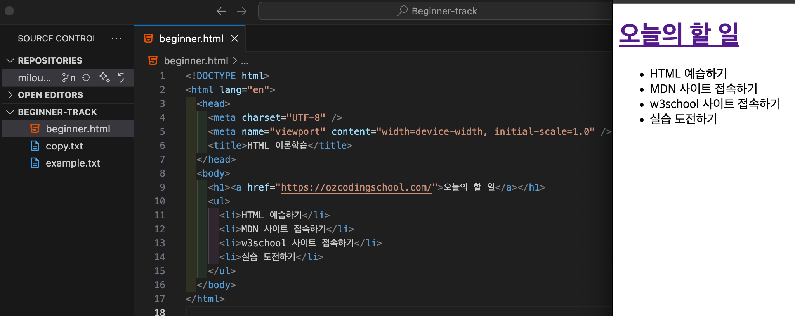

# ✏️ HTML 이론 <Badge type="info" text="250623" />

## HTML 기초

### 웹 문서의 구조를 표현하는 마크업 언어, HTML

- HTML(HyperText Markup Language)은 웹 페이지를 만들기 위한 기본적인 마크업 언어이다.
- HTML을 사용하면 문서의 구조와 내용을 정의할 수 있으며, 이렇게 작성된 문서는 웹 브라우저를 통해 사용자에게 시각적으로 보여진다.

#### <code>HTML 예시</code>

```html
<!DOCTYPE html>
<html lang="en">
  <head>
    <meta charset="UTF-8" />
    <meta name="viewport" content="width=device-width, initial-scale=1.0" />
    <title>문서 제목</title>
  </head>
  <body>
    <h1>Hello World!</h1>
    <p>이것은 간단한 HTML 문서입니다.</p>
  </body>
</html>
```

#### <code>HTML 예시 구조 (트리 구조)</code>

```less
Document
└── html [lang="en"]
    ├── head
    │   ├── meta [charset="UTF-8"]
    │   ├── meta [name="viewport" content="width=device-width, initial-scale=1.0"]
    │   └── title
    │       └── "문서 제목"
    └── body
        ├── h1
        │   └── "Hello World!"
        └── p
            └── "이것은 간단한 HTML 문서입니다."

```

- HTML 문서는 크게 <code>head</code>와 <code>body</code> 두 부분으로 구성된다.
  - <code>head</code> : 웹 문서의 정보를 담는 영역으로, 브라우저에 직접 표시되지 않는 설정(문서 제목, 문자 인코딩, 반응형 설정 등)을 포함한다.
  - <code>body</code> : 웹 브라우저에 직접 표시되는 콘텐츠가 위치하는 영역이다. 사용자가 실제로 보는 텍스트, 이미지, 버튼 등이 모두 여기에 포함된다.
- 따라서 브라우저 화면에 표시되는 것은 <code>body</code> 태그 안의 내용뿐이며, <code>head</code>에 작성된 내용은 보이지 않지만 웹 문서 동작에 중요한 역할을 한다.

:::tip

- <code>!DOCTYPE html</code>: 문서가 HTML5로 작성되었음을 선언 <br>
- <code>html lang="en"</code>: 문서의 시작 태그이며, lang 속성으로 언어를 지정 <br>
- <code>meta charset="UTF-8"</code>: 문자 인코딩 설정<br>
- <code>meta name="viewport" content="width=device-width, initial-scale=1.0"</code>: 반응형 화면 설정<br>
- <code>title</code>: 브라우저 탭에 표시되는 문서 제목<br>
- <code>h1</code>: 문서의 제목<br>
- <code>p</code>: 문단(텍스트 블록)
  :::
  <br>

### 웹 문서를 구성하는 요소 (Element)

- HTML 문서는 요소 (Element)로 구성된다.
- HTML에서는 요소 간의 계층 구조(부모-자식 관계)가 중요하다. 이 구조에 따라 콘텐츠가 브라우저에 표시되고, 스타일이나 동작도 결정된다.

```html
<body>
  <h1>Hello World!</h1>
  <p>이것은 간단한 HTML 문서입니다.</p>
</body>
```

- <code>body</code>로 둘러싸인 전체를 <code>body</code> 요소라고 한다.
- <code>body</code> : <code>h1</code>, <code>p</code>의 부모 요소
- <code>h1</code>, <code>p</code> : <code>body</code>의 자식 요소

<br>

### 여는 태그와 닫는 태그

- HTMl 요소는 여는 태그와 닫는 태그로 구성된다. 이 사이에는 텍스트나 다른 요소(자식요소)를 넣을 수 있다.

```html
<!-- <h1>: 여는 태그 </h1>: 닫는 태그-->
: 닫는 태그
<body>
  <h1>여는 태그와 닫는 태그 사이에 텍스트를 넣을 수 있습니다.</h1>
  <div>
    <h3>
      여는 태그와 닫는 태그 사이에 다른 요소를 자식 요소로 넣을 수 있습니다.
    </h3>
  </div>
</body>
```

<br>

#### 실습 과제



<br>
<Comment/>
