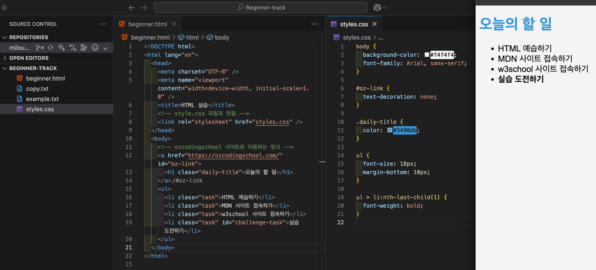
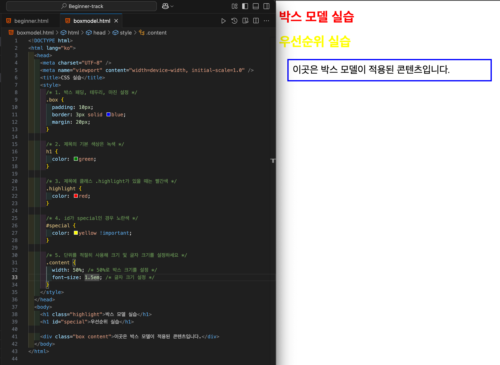

# ✏️ CSS 이론 <Badge type="info" text="250623" />

## 웹 문서를 디자인하는 스타일시트 언어, CSS

- CSS (Cascading Style Sheets)는 HTML, XML 같은 마크업 언어로 작성된 문서의 스타일을 꾸미기 위한 스타일시트 언어이다. HTML이 문서의 구조와 콘텐츠를 정의한다면, CSS는 그 문서를 시각적으로 꾸미고 스타일을 지정하여 레이아웃을 제어한다.

### CSS 적용 방법

#### <code>내부 스타일 (Internal CSS)</code>

- <code>style 태그</code> 요소 내부에 CSS 속성을 직접 입력할 수 있다.

```html
<!DOCTYPE html>
<html lang="en">
  <head>
    <meta charset="UTF-8" />
    <meta name="viewport" content="width=device-width, initial-scale=1.0" />
    <title>My Website</title>
    <style>
      /* 전체 문서의 배경색과 글꼴 지정 */
      body {
        background-color: #f4f4f4;
        font-family: Arial, sans-serif;
      }
      /* 제목의 글자색 지정 */
      h1 {
        color: #333;
      }
      /* 문단의 글자 크기 지정 */
      p {
        font-size: 16px;
      }
    </style>
  </head>
  <body>
    <h1>Welcome to My Website</h1>
    <p>This is a sample paragraph with some text.</p>
  </body>
</html>
```

#### <code>외부 스타일 시트 (External CSS) </code>

- 별도의 css 파일을 만들어 <code>link 태그</code>에 href 속성으로 연결한다.

```html
<head>
  <link rel="stylesheet" href="styles.css" />
</head>
```

#### <code>인라인 스타일 (Inline CSS)</code>

- HTML 요소의 style 속성에 직접 작성한다. (권장되지는 않음)

```html
<p style="color: blue;">이 문장은 파란색입니다.</p>
```

<br>

## CSS 선택자 (Selectors)

### <code>태그 선택자</code>

- 각각 해당 태그를 선택하는 태그 선택자

```css
body {
  background-color: #f4f4f4;
  font-family: Arial, sans-serif;
}

h1 {
  color: #333;
}

p {
  font-size: 16px;
}
```

### <code>클래스 선택자(.class)</code>

- 여러 요소에 공통 스타일을 적용할 때 사용한다. 하나의 요소에 여러 클래스를 지정할 수도 있다.

```html
<p class="highlight paragraph">
  이 문장은 강조되고 특별한 스타일이 적용됩니다.
</p>
```

```css
.highlight {
  background-color: yellow;
}

.paragraph {
  font-size: 16px;
}
```

### <code>아이디 선택자(#id)</code>

- 문서 내에서 유일한 요소를 선택할 때 사용된다. 동일한 id를 여러 요소에 쓰면 안된다.

```html
<div id="header">
  <!-- 내용 -->
</div>
```

```css
#header {
  background-color: #333;
  color: #fff;
  font-size: 24px;
}
```

## 속성과 값 (Property: Value)

- 스타일은 속성과 값의 쌍으로 지정한다.

```css
/* 속성과 값 예제 */
body {
  background-color: #f4f4f4; /* 배경색 */
  font-family: Arial, sans-serif; /* 글꼴 지정 */
}
h1 {
  color: #333; /* 글자색
지정 */
}
p {
  font-size: 16px; /* 글자 크기 */
}
```

:::tip 자주 쓰이는 스타일 속성

- <code>color</code>: 텍스트 색상
- <code>background-color</code>: 배경색
- <code>font-family</code>: 글꼴
- <code>font-size</code>: 글자 크기
- <code>margin</code>: 바깥 여백
- <code>padding</code>: 안쪽 여백
- <code>border</code>: 테두리
- <code>width</code>: 너비
- <code>height</code>: 높이
- <code>display</code>: 요소의 표시 방식 (예: <code>block</code>, <code>inline</code>, <code>flex</code> 등)

:::

## 박스 모델 (Box Model)

- 모든 HTML 요소는 사각형 박스 형태로 구성된다는 CSS의 기본 개념
- 박스는 총 4개의 영역으로 나뉘며, 각각은 레이아웃과 간격을 조정할 때 중요한 역할을 한다.
  1. <code>Content</code>: 실제 내용이 들어가는 영역 (텍스트, 이미지 등)
  2. <code>Padding</code>: 콘텐츠와 테두리 사이의 내부 여백
  3. <code>Border</code>: 요소의 테두리,
  4. <code>Margin</code>: 요소 바깥 여백, 다른 요소와의 거리 조절

```css
┌───────────────────────────────┐
│            Margin             │
│  ┌───────────────────────────┐│
│  │          Border           ││
│  │   ┌─────────────────────┐ ││
│  │   │       Padding       │ ││
│  │   │   ┌───────────────┐ │ ││
│  │   │   │    Content    │ │ ││
│  │   │   └───────────────┘ │ ││
│  │   └─────────────────────┘ ││
│  └───────────────────────────┘│
└───────────────────────────────┘

```

## 우선 순위 (Specificity)

- CSS에서는 하나의 요소에 여러 스타일이 겹칠 수 있기 때문에, 어떤 스타일이 적용될지 결정하는 기준이 필요하다. 이것을 우선순위(Specificity)라고 한다.
- 우선순위 계산 방식 (낮은 → 높은)

  1. <code>1점</code> 태그 선택자 (div, p, h1 등)
  2. <code>10점</code> 클래스 / 속성 / 가상 클래스 (.btn, [type="text"], :hover 등)
  3. <code>100점</code> ID 선택자 (#header)
  4. <code>1000점</code> 인라인 스타일 (style="")
  5. !important – 우선순위 계산을 무시하고 강제 적용

## 단위 (Units)

- CSS에서 요소 크기, 간격, 위치 등을 지정할 때 다양한 단위를 사용한다. 단위 선택에 따라 반응형 디자인 구현 여부나 유지보수 편의성이 달라진다.

### 고정단위

- <code>px</code>: 화면의 고정된 크기를 의미, 디바이스 화면 크기에 상관없이 일정하게 유지된다.

### 상대 단위

- <code>em</code>: 부모 요소의 글꼴 크기에 비례한다. 상속받은 글꼴 크기에 따라 변한다.
- <code>rem</code>: 루트 요소(html)의 글꼴 크기에 비례한다. 전체 문서에 일관된 기준
- <code>%</code>: 부모 요소 크기에 비례한다. 크기 비율로 반응형 설계에 활용된다.
- <code>vw</code>: 뷰포트의 너비에 비례한다.
- <code>vh</code>: 뷰포트의 높이에 비례한다.

<br>

#### 실습 과제

- <code>CSS 01</code>
  
  <br>
- <code>CSS 02</code>
  

<br>
<Comment/>
