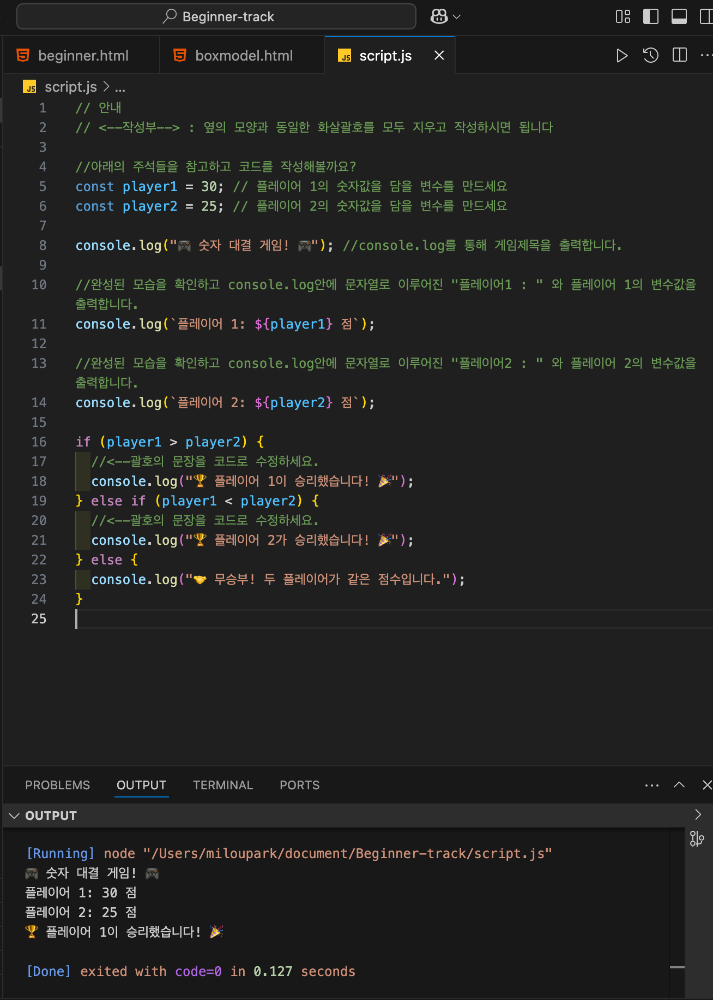

# 간단한 코드 <Badge type="info" text="250623" />

## 자바스크립트 숫자 대결 게임

### 문제

```js
// 안내
// <--작성부--> : 옆의 모양과 동일한 화살괄호를 모두 지우고 작성하시면 됩니다

//아래의 주석들을 참고하고 코드를 작성해볼까요?
const player1 = 30; // 플레이어 1의 숫자값을 담을 변수를 만드세요
const player2 = 25; // 플레이어 2의 숫자값을 담을 변수를 만드세요

console.log("🎮 숫자 대결 게임! 🎮"); //console.log를 통해 게임제목을 출력합니다.

//완성된 모습을 확인하고 console.log안에 문자열로 이루어진 "플레이어1 : " 와 플레이어 1의 변수값을 출력합니다.
console.log(`플레이어 1: ${player1} 점`);

//완성된 모습을 확인하고 console.log안에 문자열로 이루어진 "플레이어2 : " 와 플레이어 2의 변수값을 출력합니다.
console.log(`플레이어 2: ${player2} 점`);

if (player1 > player2) {
  //<--괄호의 문장을 코드로 수정하세요.
  console.log("🏆 플레이어 1이 승리했습니다! 🎉");
} else if (player1 < player2) {
  //<--괄호의 문장을 코드로 수정하세요.
  console.log("🏆 플레이어 2가 승리했습니다! 🎉");
} else {
  console.log("🤝 무승부! 두 플레이어가 같은 점수입니다.");
}
```

### 풀이



```js
// Me
console.log(`플레이어 1: ${player1} 점`);

// OZ
console.log("플레이어 1:" + player1 + "점");
```

- 나는 문자열 보간을 사용해 위와 같이 작성했지만, 코드 해설에서는 문자열을 + 연산자로 이어 붙이는 방식이 사용되어 있었다. 문자열을 출력하는 방식도 여러 가지가 있다는 것을 알게 되었다.
- 개인적으로는 문자열 보간이 가독성도 좋고, 변수와 텍스트를 구분하기 쉬워서 더 선호하게 될 것 같다!

<br>
<Comment/>
