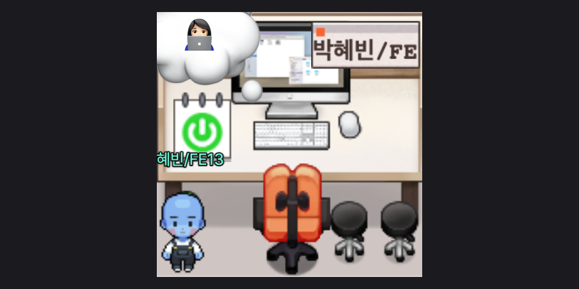

# 👩🏻‍💻 Frontend 13기 <Badge type="tip" text="2025-07-03 ~ 2025-12-29" />

::: details 💡 학습 Tip

#### 파레토의 법칙

- 100가지의 기능이 있다면 현업에서 쓰는 기능은 약 20% 정도 밖에 안 된다.
- 다 배우고 쓰려 하지 말고, 자주 쓰는 것부터 경험하면서 배우자.

#### First Word 법칙

- 자주 사용되는 단어를 나만의 언어로 정리하기.
- 딱딱한 정의보다 내가 쉽게 이해하기 쉬운 말로 기록하기

:::

내가 노력하고 도전한 만큼이 내 세계 💫  
6개월 동안 교육에서 학습한 것들을 기록해보려고 한다. 개인 공부도 꾸준히 이어갈 계획!

<!-- 수업은 매일 7시에 끝나지만, 매주 수요일 오후 8시부터 오후 10시까지 진행되는 추가 학습반 `🔥 열정반 Core JavaScript` 스터디에 참여하기로 했다. 단순한 공부를 넘어, 이해한 내용을 내 언어로 정리하고 발표하고, 토론과 피드백을 주고받는 과정으로 구성되어 있다. 스스로를 더 잡도리할 계획이다 👊🏼 -->

 
<Comment/>
