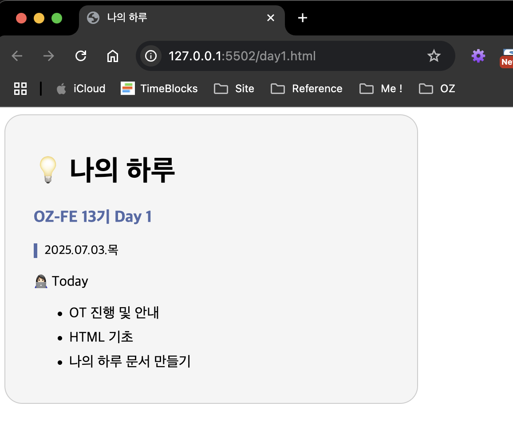
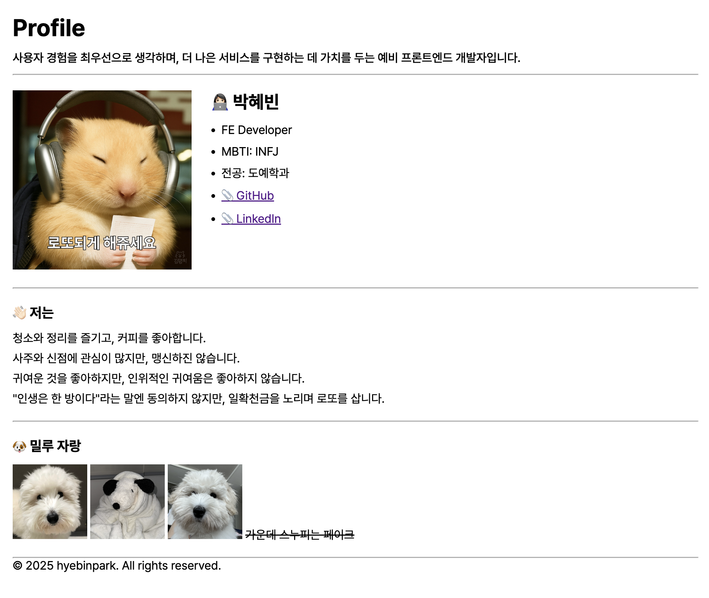
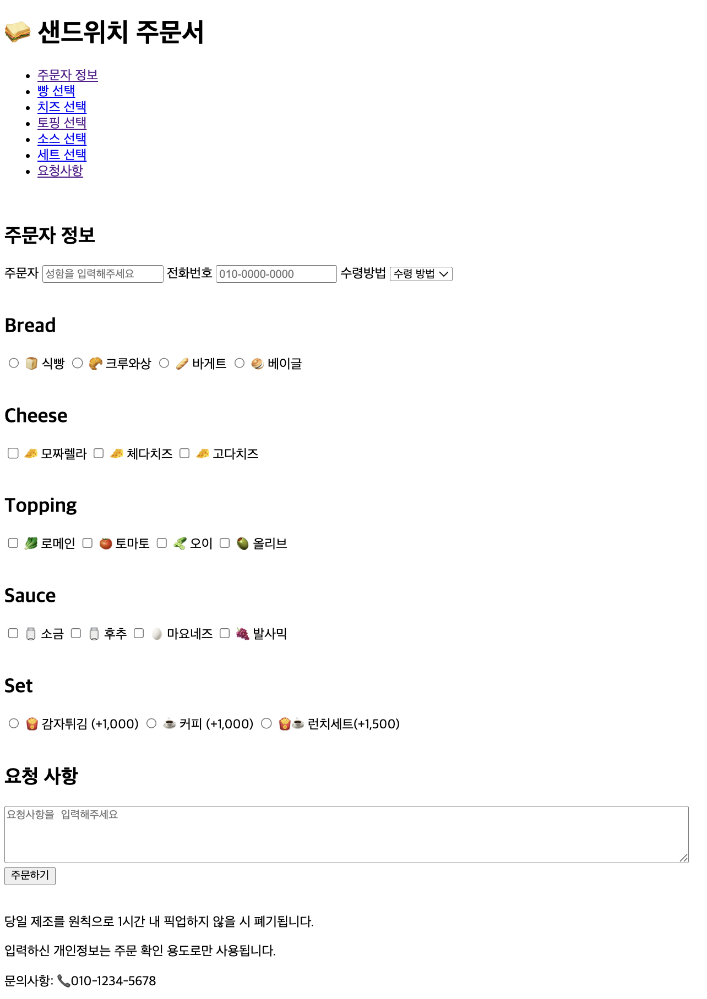
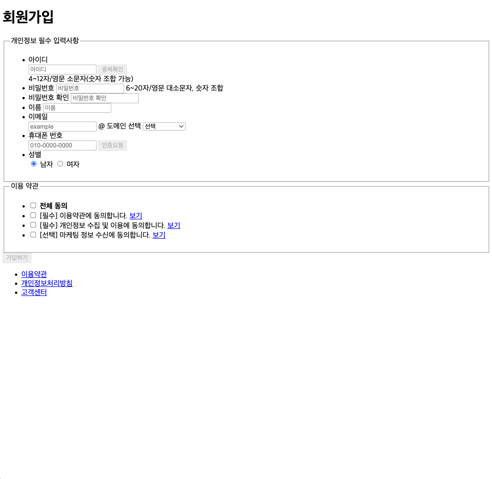
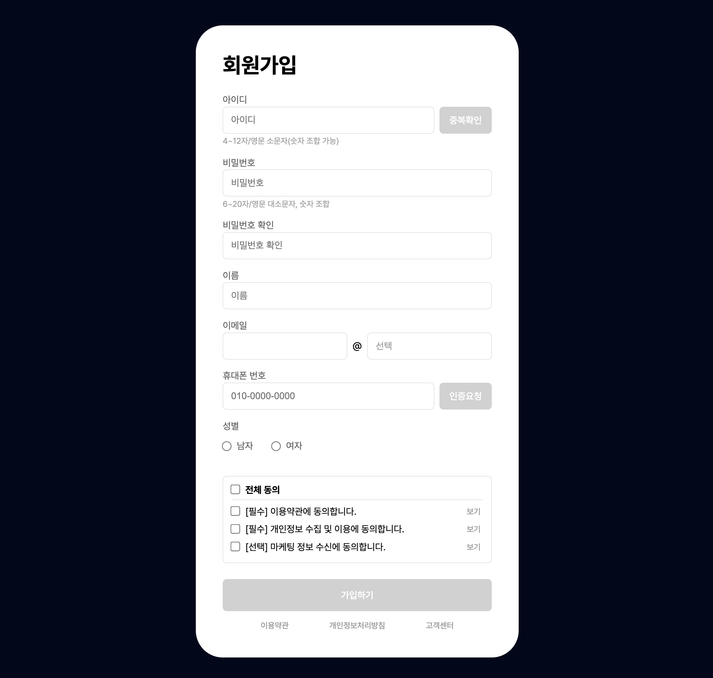
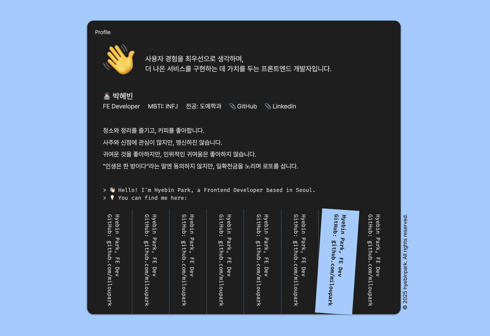
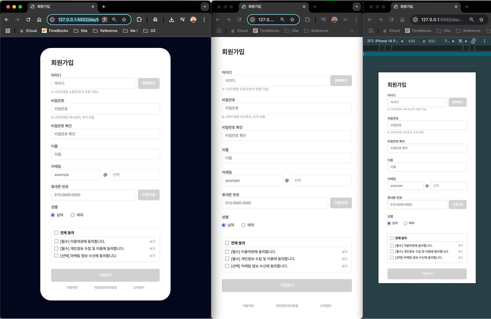
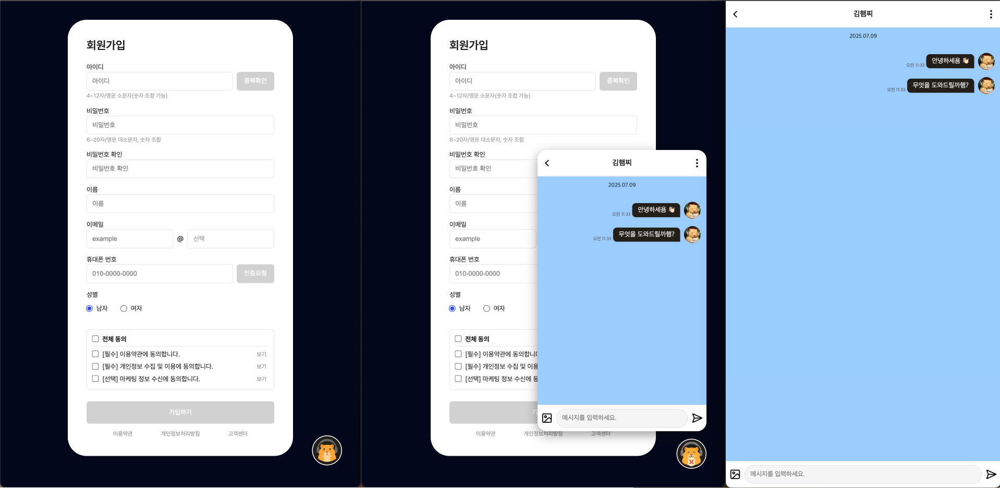
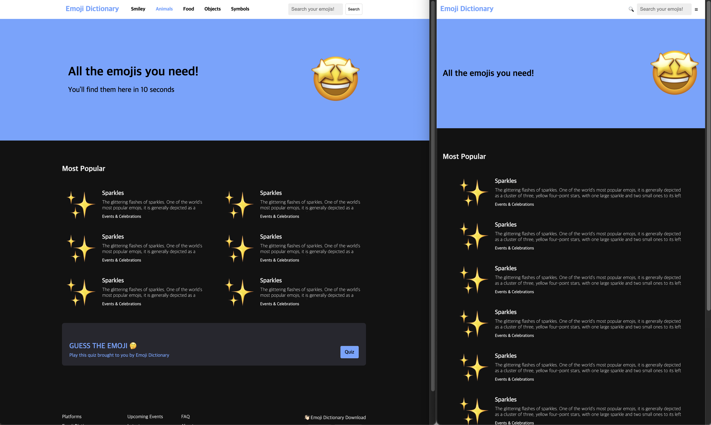

# 👊🏼 Daily Mission

### HTML/CSS

::: details `Day 1` 나의 하루 문서 만들기


<br>

[`👩🏻‍💻 제출한 코드보기`](https://github.com/miloupark/OZ-DailyMission/tree/main/day1)

:::
::: details `Day 2` 프로필 페이지 만들기



[`👩🏻‍💻 제출한 코드보기`](https://github.com/miloupark/OZ-DailyMission/tree/main/day2)

<br>

:::
::: details `Day 3` 설문조사 양식 및 회원가입 폼



[`👩🏻‍💻 제출한 코드보기`](https://github.com/miloupark/OZ-DailyMission/blob/main/day3/day3-1/survey.html)

<br>


<br>



[`👩🏻‍💻 제출한 코드보기`](https://github.com/miloupark/OZ-DailyMission/tree/main/day3/day3-2)

<br>
:::

::: details `Day 4` 프로필 페이지, 채팅방, 눈사람


<br>
[`👩🏻‍💻 제출한 코드보기`](https://github.com/miloupark/OZ-DailyMission/tree/main/day4/profile)

<br>


<br>
[`👩🏻‍💻 제출한 코드보기`](https://github.com/miloupark/OZ-DailyMission/tree/main/day4/chat)

<br>


<br>
[`👩🏻‍💻 제출한 코드보기`](https://github.com/miloupark/OZ-DailyMission/tree/main/day4/snowman)

<br>
:::

::: details `Day 5` 채팅방 디벨롭, 반응형 웹, 반응형 웹 디벨롭, 클론


[`👩🏻‍💻 제출한 코드보기`](https://github.com/miloupark/OZ-DailyMission/tree/main/day5/chat)

<br>



[`👩🏻‍💻 제출한 코드보기`](https://github.com/miloupark/OZ-DailyMission/tree/main/day5/responsive)

<br>



[`👩🏻‍💻 제출한 코드보기`](https://github.com/miloupark/OZ-DailyMission/tree/main/day5/responsive_develop)

<br>



[`👩🏻‍💻 제출한 코드보기`](https://github.com/miloupark/OZ-DailyMission/tree/main/market)

<br>
:::

### JavaScript

[`👩🏻‍💻 StackBlitz Collections`](https://stackblitz.com/@miloupark/collections/oz-dailymission-js)

::: details `day 6` 변수와 타입 개념

[`👩🏻‍💻 JavaScript 1일차 보물 상자열기`](https://github.com/miloupark/OZ-DailyMission/tree/main/market)

[`👩🏻‍💻 JavaScript 1일차 동물 출력하기`](https://stackblitz.com/edit/vitejs-vite-1zxmtbpj?file=main.js)

💡 Node.js 환경에서는 .js 파일을 실행할 때 터미널에서 node main.js처럼 명령어로 직접 호출해야 한다는 것을 이번에 새롭게 알게 되었다.

:::

::: details `day 7` 타입 개념 및 메서드 활용

[`👩🏻‍💻 JavaScript 2일차 오류 수정하기`](https://stackblitz.com/edit/vitejs-vite-bqoegzwp?file=main.js)

[`👩🏻‍💻 JavaScript 2일차 주사위 만들기`](https://stackblitz.com/edit/vitejs-vite-vt9dbulc?file=main.js)

```js
// min 이상 max 이하의 정수를 만들기 위한 공식
Math.floor(Math.random() * (max - min + 1)) + min;
```

:::

::: details `day 8` 조건문과 반복문

[`👩🏻‍💻 JavaScript 3일차 수열 계산하기 `](https://stackblitz.com/edit/vitejs-vite-dwasjr3q?file=main.js)

[`👩🏻‍💻 JavaScript 3일차 배달 주문하기`](https://stackblitz.com/edit/vitejs-vite-ppfmsdfq?file=main.js)

[`👩🏻‍💻 JavaScript 3일차 윤년 구하기 `](https://stackblitz.com/edit/vitejs-vite-jbjbxe3m?file=main.js)

[`👩🏻‍💻 JavaScript 3일차 별 찍기`](https://stackblitz.com/edit/vitejs-vite-dp5edziw?file=main.js)

[`👩🏻‍💻 JavaScript 3일차 소수 판별하기`](https://stackblitz.com/edit/vitejs-vite-pt88y7nf?file=main.js)
:::

::: details `day 9` 배열 기초 및 배열 반복문

[`👩🏻‍💻 JavaScript 4일차 주간 독서 이벤트`](https://stackblitz.com/edit/vitejs-vite-kyrr4fwm?file=main.js)

[`👩🏻‍💻 JavaScript 4일차 신규 고객 선별하기`](https://stackblitz.com/edit/vitejs-vite-vsrnopo5?file=main.js)

[`👩🏻‍💻 JavaScript 4일차 봄 옷 고르기`](https://stackblitz.com/edit/vitejs-vite-wwrf6erc?file=main.js)
:::

::: details `day 10` 함수 기초

[`👩🏻‍💻 JavaScript 5일차 주사위 만들기 2`](https://stackblitz.com/edit/vitejs-vite-lf1xfpcj?file=main.js)

[`👩🏻‍💻 JavaScript 5일차 윤년 구하기 2`](https://stackblitz.com/edit/vitejs-vite-vnsfbtdw?file=main.js)

[`👩🏻‍💻 JavaScript 5일차 카페 주문하기`](https://stackblitz.com/edit/vitejs-vite-xfvywc2w?file=main.js)

:::

::: details `day 11` 객체 기초

[`👩🏻‍💻 JavaScript 6일차 계산기 만들기`](https://stackblitz.com/edit/vitejs-vite-wfzpjbjy?file=main.js)

[`👩🏻‍💻 JavaScript 6일차 할 일 목록 관리하기`](https://stackblitz.com/edit/vitejs-vite-fkgxc8qd?file=main.js)

[`👩🏻‍💻 JavaScript 6일차 큐 자료구조 만들기 `](https://stackblitz.com/edit/vitejs-vite-jhxawjeq?file=main.js)

:::

::: details `day 12` 배열, 객체 응용

[`👩🏻‍💻 JavaScript 7일차 직원 관리하기`](https://stackblitz.com/edit/vitejs-vite-at4bxkad?file=main.js)

[`👩🏻‍💻 JavaScript 7일차 마왕 물리치기`](https://stackblitz.com/edit/vitejs-vite-m7nkgcdr?file=main.js)

[`👩🏻‍💻 JavaScript 7일차 스택 자료구조 만들기`](https://stackblitz.com/edit/vitejs-vite-7dhxvnwx?file=main.js)

:::

::: details `day 13` 함수 응용, 구조분해할당

[`👩🏻‍💻 JavaScript 8일차 오류 해결하기 2`](https://stackblitz.com/edit/vitejs-vite-7taguauw?file=main.js)

[`👩🏻‍💻 JavaScript 8일차 템플릿 만들기`](https://stackblitz.com/edit/vitejs-vite-txyprsjz?file=main.js)

:::

::: details `day 14` DOM 기초, 이벤트 객체

[`👩🏻‍💻 JavaScript 9일차 햄버거 주문서`](https://stackblitz.com/edit/stackblitz-starters-xvjgnfwf?file=script.js)

[`👩🏻‍💻 JavaScript 9일차 로또 번호 생성기 기능 추가 구현`](https://stackblitz.com/edit/stackblitz-starters-x1notbge?file=lotto.js)

[`👩🏻‍💻 JavaScript 9일차 로또 당첨 번호 및 로또 번호 자동 생성`](https://stackblitz.com/edit/stackblitz-starters-gs81befw?file=script.js)

:::

::: details `day 15` 비동기

[`👩🏻‍💻 JavaScript 10일차 순간 포착`](https://stackblitz.com/edit/vitejs-vite-p93mteu3?file=src%2Fmain.js)

[`👩🏻‍💻 JavaScript 10일차 콜백 탈출`](https://stackblitz.com/edit/vitejs-vite-cptdwcri?file=main.js)

[`👩🏻‍💻 JavaScript 10일차 반응 속도`](https://stackblitz.com/edit/vitejs-vite-bckhv8by?file=index.html&file=src%2Fmain.js)

:::

::: details `day 16` 데이터 fetch

[`👩🏻‍💻 JavaScript 11일차 강아지 페이지 만들기`](https://stackblitz.com/edit/vitejs-vite-u9umbwnv?file=breeds.js)

[`👩🏻‍💻 JavaScript 11일차 오늘의 날씨`](https://stackblitz.com/edit/vitejs-vite-zor67zl2?file=src%2Fmain.js)

[`👩🏻‍💻 JavaScript 11일차 오늘 뭐 입지?`](https://stackblitz.com/edit/vitejs-vite-fvch4kdg?file=src%2Fmain.js)

:::

::: details `day 17` 계산기 | DAY 1_HTML로 목업 만들기

[`👩🏻‍💻 계산기 GitHub`](https://github.com/miloupark/calculator)

#### 📋 진행 내용 요약

- 초기 프로젝트 셋업 및 환경 구성<br>
  → npm init으로 프로젝트 초기화, package.json 및 .gitignore 작성
- 계산기 UI 목업 및 레이아웃 작성
- 기본 스타일링 및 버튼 그룹 구성
- README 작성: 프로젝트 가이드 & 네이밍 규칙 정리

#### 🔨 개선할 점

미션 가이드에 명확한 클래스명 규칙이 없어, 개인적으로 BEM 방식에 따라 네이밍 규칙을 먼저 세워 작업을 진행했다.  
하지만 이후 DAY 2 미션지를 확인해보니 필수 클래스명이 추가로 지정되어 있어, 일부 클래스명을 수정해야 할 필요가 생겼다.

::: code-group

```html [index.html]
<!DOCTYPE html>
<html lang="ko">
  <head>
    <meta charset="UTF-8" />
    <meta name="viewport" content="width=device-width, initial-scale=1.0" />
    <title>Calculator</title>
    <link rel="stylesheet" href="./src/style.css" />
  </head>
  <body>
    <main class="calculator">
      <h1 class="a11y-hidden">Calculator</h1>
      <div class="calc-container p-40">
        <!-- calculator window buttons -->
        <div class="calc__window-btns">
          <button
            class="calc__window-btn--close btn-xs"
            aria-label="화면 닫기"
            title="닫기"
          ></button>
          <button
            class="calc__window-btn--min btn-xs"
            aria-label="화면 최소화"
            title="최소화"
          ></button>
          <button
            class="calc__window-btn--max btn-xs"
            aria-label="화면 최대화"
            title="최대화"
          ></button>
        </div>

        <!-- calculator display -->
        <div class="calc__display p-40"></div>

        <!-- calculator keypad -->
        <div class="calc__keypad p-40"></div>
      </div>
    </main>
  </body>
</html>
```

```css
/* reset */
* {
  margin: 0;
  padding: 0;
  box-sizing: border-box;
}

html,
body {
  height: 100%;
}

button {
  border: none;
  background: none;
  padding: 0;
  cursor: pointer;
}

/* color variables */
:root {
  --white: #ffffff;
  --black: #212121;
  --red: #ff5f57;
  --yellow: #ffbd2e;
  --green: #28c840;
}

/* calculator-layout */
.calculator {
  min-height: 100vh;
  display: flex;
  justify-content: center;
  align-items: center;
}

.calc-container {
  width: 600px;
  height: 800px;
  display: flex;
  flex-direction: column;
  gap: 20px;
  border: 4px solid #2d2f36;
}

/* calculator-inner */
.calc__window-btns {
  display: flex;
  gap: 8px;
}

.calc__window-btn--close {
  background-color: var(--red);
}
.calc__window-btn--min {
  background-color: var(--yellow);
}
.calc__window-btn--max {
  background-color: var(--green);
}

.calc__display {
  height: 120px;
  text-align: right;
  border: 4px solid #9000ff;
}

.calc__keypad {
  flex: 1;
  border: 4px solid #0085f9;
}

/* utils */
.a11y-hidden {
  position: absolute;
  overflow: hidden;
  width: 1px;
  height: 1px;
  margin: -1px;
  padding: 0;
  border: 0;
  clip: rect(0, 0, 0, 0);
  clip-path: inset(50%);
  white-space: nowrap;
}

.btn-xs {
  width: 32px;
  height: 32px;
  border-radius: 50%;
}

.p-40 {
  padding: 40px;
}
```

:::

::: details `day 18` 계산기 | DAY 2_HTML로 목업 만들기, Flexbox로 정렬 및 배치하기

[`👩🏻‍💻 계산기 GitHub`](https://github.com/miloupark/calculator)

-

:::

<Comment/>
