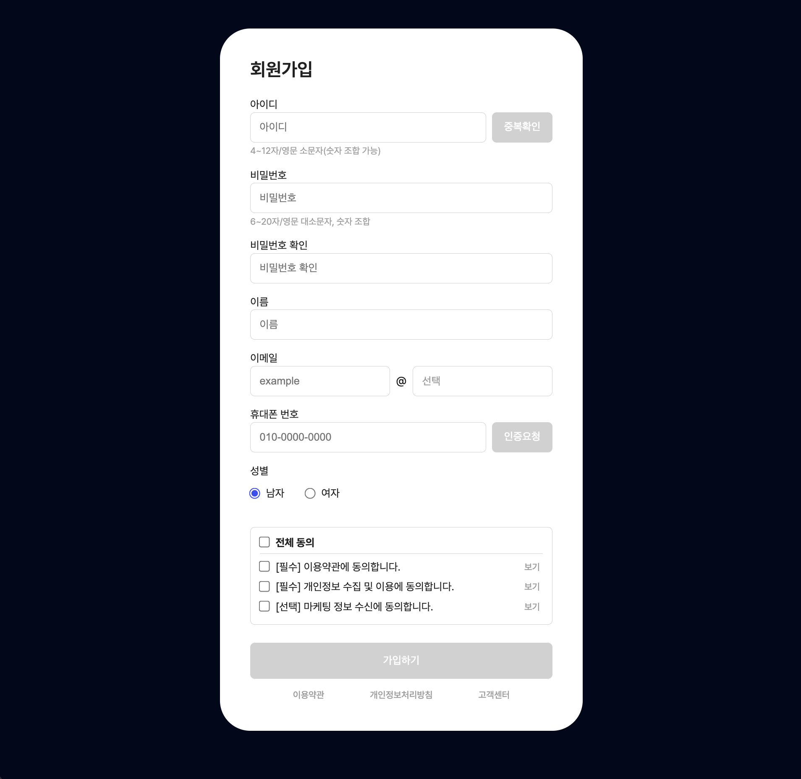

# 👊🏼 Daily Mission

### HTML

::: details `Day 1` 나의 하루 문서 만들기

 

[`👩🏻‍💻 제출한 코드보기`](https://github.com/miloupark/OZ-DailyMission/tree/main/day1)

:::
::: details `Day 2` 프로필 페이지 만들기

 

[`👩🏻‍💻 제출한 코드보기`](https://github.com/miloupark/OZ-DailyMission/tree/main/day2)

:::
::: details `Day 3` 설문조사 양식 및 회원가입 폼

 
[`👩🏻‍💻 제출한 코드보기`](https://github.com/miloupark/OZ-DailyMission/blob/main/day3/day3-1/survey.html)

 

 

 

[`👩🏻‍💻 제출한 코드보기`](https://github.com/miloupark/OZ-DailyMission/tree/main/day3/day3-2)

:::
<Comment/>
