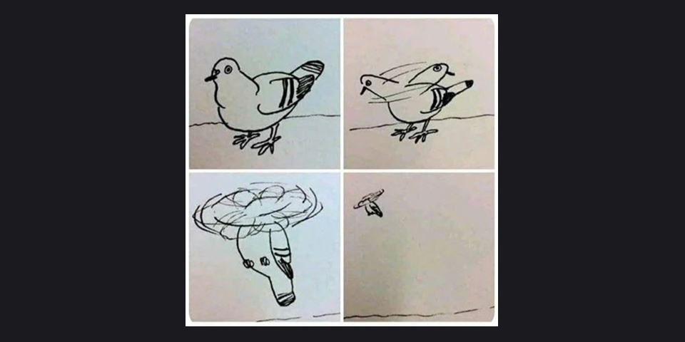

# Reflection

> 디버깅은 나부터... 🔫 

::: details <Badge type="tip" text="Week 1" /> <Badge type="info" text="🗓️ 25.07.03-25.07.04" />

- [본 수업] HTML

다시 처음부터 쌓아가는 중이다. 뿌리가 중요하다고 믿기에, 지금은 그 뿌리를 내리기 위해 단단히 다지는 기간이라 생각하고..
무너지지 않게 단단하게 올라가고 싶은 마음 뿐이다. 무지에서 오는 불안의 해답은 성실함과 꾸준함이라는 걸 누구보다 잘 알고 있다. 약간의 불안감과 긴장이 필요한 시기에 교육을 듣기 잘했다는 생각뿐 💭   
코로나 시작과 동시에 졸업하기도 했고, 이전 직장에서도 재택근무 중엔 카메라를 켜지 않아도 됐기 때문에 하루 8시간 내내 카메라 켜고 있다는 사실이 조금 어색하긴 하지만 하루 만에 익숙해졌다.. 역시 인간은..  
교육 끝난 저녁 시간대나 주말엔 리액트를 다시 시작해야할 것 같다. 분명 2월에 인강을 들었지만 휘발되어버렸다.
자바스크립트는 문제를 해결하는 힘을 길러야 할 것 같다. 인강을 두 바퀴나 봤는데도 여전히 어렵게 느껴지는 건 내 문제겠지.. 예전에 사두고 읽다만 딥다이브도 이참에 다시 정독해보려고 한다. 교육에서 코어 자바스크립트를 스터디로 진행한다고 하는데 어떻게 진행될지 넘 궁금하다!
:::

::: details <Badge type="tip" text="Week 2" /><Badge type="info" text="🗓️ 25.07.07-25.07.11" />

- [본 수업] HTML/CSS, 반응형, JavaScript 기초
- [스터디] OT 및 CoreJS 01. 데이터 타입

교육 시작 5일 동안 HTML,CSS로 기초 공사를 마무리하고 기다리던 6일 차 목요일에 자바스크립트를 시작했다. 이번 주는 과제 제출에 쫓겨 다른 것들을 많이 놓쳤다. 어제 코어 자바스크립트 스터디 첫날 다시 정신이 들었다. 이겨내 🙂🔫 다음 주 스터디 전까지 책을 미리 읽고 갈 계획이다.

html, css도 새로 알게 된 것들이 있어서 주말까지 블로그에 정리해 보려고 한다. 퀴즈를 맘 놓고 풀다가 막판에 반타작 엔딩... 무의식적으로 치던 css도 막상 설명하려고 하면 쉽게 말이 나오지 않는 것들이 있었다. 예를 들어, grid 사용 중 자식 요소에 overflow: auto를 줬는데 스크롤이 되지 않을 때, 부모 요소에 min-height: 0을 설정해야 한다. grid 컨텍스트에서는 min-height: auto가 기본값이라, 자식의 높이에 맞춰 부모가 커지려는 성질이 있기 때문이다. 설정해야 한다는 건 알았지만, 왜 그런지는 몰랐다. 심지어 나는 모두가 flex를 외칠 때, grid를 외치는 사람이었는데도.

이번 기회에 배움의 중요성을 다시 느끼며 게을렀던 나를 반성하며 오답노트를 정리해봐야겠다고 다짐했다.💭

:::

::: details <Badge type="tip" text="Week 3" /><Badge type="info" text="🗓️ 25.07.14-25.07.18" />

- [본 수업] JavaScript 변수, 데이터 타입, 조건문, 반복문, 배열, 함수, 객체 등
- [스터디] CoreJS 01. 데이터 타입

함수, 객체로 넘어오니까 점점 머릿속이 휘몰아치는 느낌이다. 그래도 어떡해 해야지 🙂🔫 매일 과제를 제출하는데, 최대한 그날 배운 내용을 활용해서 풀어보려고 하고 있다. 과제하는 시간동안 GPT는 일부러 사용하지 않고, 스스로 고민하는 시간을 충분히 가지고 다양한 방법으로 해결하고 있다. 이렇게 별 찍는거 이해하는데 3시간이 걸려..

과제 진행할 때는 문제 정의 > 요구 사항 정리 > 다양한 풀이 시도 > 시행착오 or 풀이에 대한 이유나 설명을 정리하는 습관을 들이고 있는데, 과제 제출 피드백으로 긍정적인 답변을 받았다. 프로그래머스에서도 정답률 높은 순으로 하루에 하나씩 풀어보는 루틴을 만들어야겠다.

이번주에 자바스크립트 본 강의가 시작됐고, 두번째 코어 스터디를 했는데 첫 시간보다 더 머리에 잘 들어오기 시작했다. 그리고 교육 시작 전에 자바스크립트 찍먹했던 게 도움이 은근 되는 것 같다. 물론 아직 흡수하려면 아직 멀었다는 것. 다음주부터는 코어 스터디에서 매주 짧은 발표를 진행하기로 했고, 이번엔 01강. 데이터 타입의 1-5. 불변 객체를 맡게 되었다.

그리고 혼자만의 목표로, 지금까지 공부한 내용을 바탕으로 계산기 구현에도 도전해보려고 한다.

:::

::: details <Badge type="tip" text="Week 4" /><Badge type="info" text="🗓️ 25.07.21-25.07.25" />

- [본 수업] JavaScript 배열, 객체, 배열의 응용, 구조분해할당, DOM 기초, 이벤트 객체, 비동기, 데이터 fetch, 자바스크립트 최종 과제 계산기
- [스터디] CoreJS 01. 데이터 타입\_05 불변객체 발표, 02. 실행 컨텍스트의 자료구조 워밍업

이번주는 들어오는 인풋이 많아서 실시간 세션이나 과제 진행하는 게 벅차게 느껴졌다. 새로운 개념이 낯설어서 정리가 잘 되지 않고, 그로 인해 학습 난이도가 더 높게 느껴졌다. 혼자 정리하는 시간이 부족해서 주말 시간을 더 투자해보려고 한다. 지금의 어려움은 새로운 내용을 소화하는 과정에서 생기는 자연스러운 혼란이라 생각한다..

자바스크립트 최종 과제는 총 4일 간 진행되고, 금요일에 1일차에 진입했다. 계산기 구현이고 주제이고, 요구 사항과 구현 단계를 잘 지키며 완성해보려고 노력 중이다.
:::

::: details <Badge type="tip" text="Week 5" /><Badge type="info" text="🗓️ 25.07.28-25.08.01" />

- [본 수업] 자바스크립트 최종 과제 계산기 구현, git & github 학습
- [스터디] CoreJS 02. 실행 컨텍스트

11일간의 자바스크립트 진도가 끝나고, 최종 과제로 계산기 구현 미션을 4일간 진행했다. 앞선 3일간은 큰 어려움 없이 진행했지만 4일 차에 고생을 좀 했다. 제출 후 토요일에 혼자 리팩토링을 해보려고 하루종일 붙잡고 있었는데, 결국 잠시 스탑하기로 했다. 추가로 공부할 게 많았기 때문..^\_ㅠ 나는 Sass처럼 쪼개고 합치면 되는 줄 알았지.. 막상 나눠보려 하니 그렇지가 않았다.. 나중에 돌아가 보기로..!

그리고 그동안 정말 기본적인 명령어들만 썼던 깃도 이번 수업에서 새롭게 알게 된 부분들이 많았다. 앞으로 적극 활용 예정. 다음주 화요일부터는 드디어 리액트다. 지금 자격증 준비 때문에 여유가 없어 미뤄뒀더니 벌써 리액트..😵‍💫 이겨내.

:::

::: details <Badge type="tip" text="Week 6" /><Badge type="info" text="🗓️ 25.08.04-25.08.08" />

- [본 수업] react basic
- [스터디] CoreJS 02. 실행 컨텍스트 발표

리액트도 새로 나가고 다음주에 정처기 필기 시험까지 있어서 너무 정신없고 몰아치듯 지나간 일주일.. 벼락치기하는 나 자신이 밉다. 스터디 발표는 미리미리 블로그에 책 내용 정리해둔 게 있어서 다행이었다.. 심지어 이 글도 8월 11일에 적고 있고..🫨 해야지~ 어떡해~

:::
::: details <Badge type="tip" text="Week 7" /><Badge type="info" text="🗓️ 25.08.11-25.08.15" />

- [본 수업] react basic
- [스터디] CoreJS 03. this

정처기 필기 일주일 벼락치기 성공적 엔딩으로 너무 뿌듯하구..🔥 실기까지 원큐에 가보자고..! 실기 인강 바로 결제하긴 했지만, 11월에 시험이라 9월 중순부터 공부하고, 당분간은 리액트에 집중할 계획이다! 해야지...

:::

 
<Comment/>
