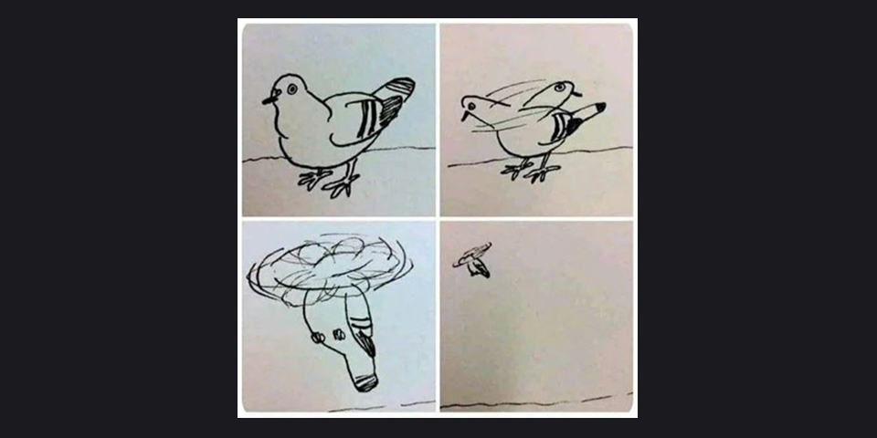

# Reflection

> 디버깅은 나부터... 🔫 

::: details <Badge type="tip" text="Week 1" />
🗓️ 25.07.03-25.07.04 

- HTML 학습

다시 처음부터 쌓아가는 중이다. 뿌리가 중요하다고 믿기에, 지금은 그 뿌리를 단단히 다지는 기간이라 생각하고..
무너지지 않게 단단하게 올라가고 싶은 마음 뿐이다. 무지에서 오는 불안의 해답은 성실함과 꾸준함이라는 걸 누구보다 잘 알고 있다. 약간의 불안감과 긴장이 필요한 시기에 교육을 듣기 잘했다는 생각뿐 💭   
코로나 시작과 동시에 졸업하기도 했고, 이전 직장에서도 재택근무 중엔 카메라를 켜지 않아도 됐기 때문에 하루 8시간 내내 카메라 켜고 있다는 사실이 조금 어색하긴 하지만 하루 만에 익숙해졌다.. 역시 인간은..  
교육 끝난 저녁 시간대나 주말엔 리액트를 다시 시작해야할 것 같다. 분명 2월에 인강을 들었지만 휘발되어버렸다.
자바스크립트는 문제를 해결하는 힘을 길러야 할 것 같다. 인강을 두 바퀴나 봤는데도 여전히 어렵게 느껴지는 건 내 문제겠지.. 예전에 사두고 읽다만 딥다이브도 이참에 다시 정독해보려고 한다. 교육에서 코어 자바스크립트를 스터디로 진행한다고 하는데 어떻게 진행될지 넘 궁금하다!
:::
::: details <Badge type="tip" text="Week 2" />
🗓️ 25.07.05-25.07.11 

- HTML/CSS
- 반응형
- JavaScript 기초

교육 시작 5일 동안 HTML,CSS로 기초 공사를 마무리하고 기다리던 6일 차 목요일에 자바스크립트를 시작했다. 이번 주는 과제 제출에 쫓겨 다른 것들을 많이 놓쳤다. 어제 코어 자바스크립트 스터디 첫날 다시 정신이 들었다. 이겨내 🙂🔫 다음 주 스터디 전까지 책을 미리 읽고 갈 계획이다.

html, css도 새로 알게 된 것들이 있어서 주말까지 블로그에 정리해 보려고 한다. 퀴즈를 맘 놓고 풀다가 막판에 반타작 엔딩... 무의식적으로 치던 css도 막상 설명하려고 하면 쉽게 말이 나오지 않는 것들이 있었다. 예를 들어, grid 사용 중 자식 요소에 overflow: auto를 줬는데 스크롤이 되지 않을 때, 부모 요소에 min-height: 0을 설정해야 한다. grid 컨텍스트에서는 min-height: auto가 기본값이라, 자식의 높이에 맞춰 부모가 커지려는 성질이 있기 때문이다. 설정해야 한다는 건 알았지만, 왜 그런지는 몰랐다. 심지어 나는 모두가 flex를 외칠 때, grid를 외치는 사람이었는데도.

이번 기회에 배움의 중요성을 다시 느끼며 게을렀던 나를 반성하며 오답노트를 정리해봐야겠다고 다짐했다.💭
:::

 
<Comment/>
