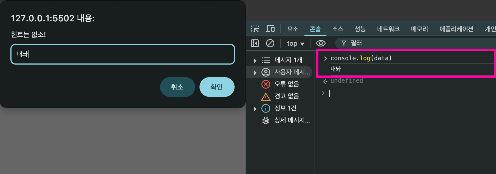
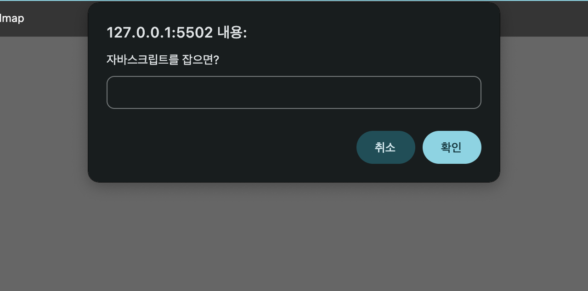
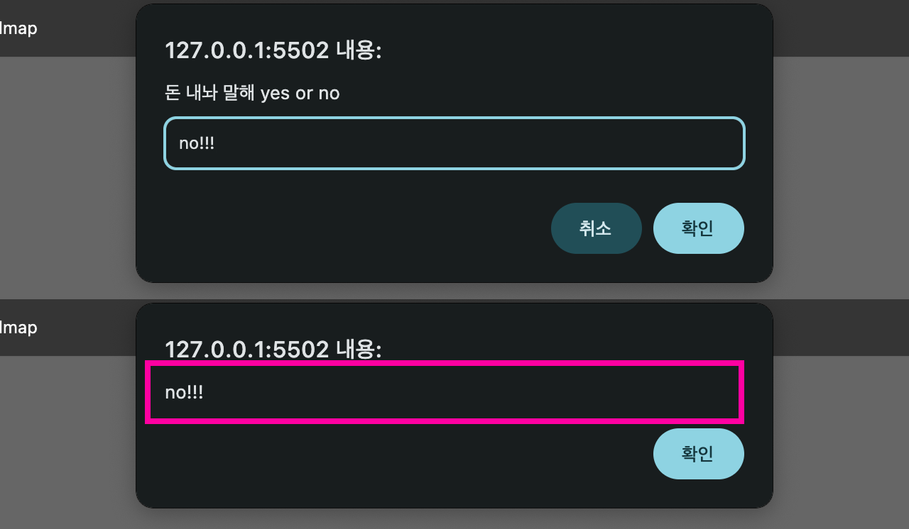

# JavaScript

> 웹 브라우저에게 명령을 내리는 언어

## JavaScript란?

자바스크립트는 웹 브라우저 등 소프트웨어 환경에서 `동작을 수행하도록 명령`을 내리는 프로그래밍 언어다.
명령의 대상은 웹 브라우저, HTML 요소, CSS 스타일 등 자바스크립트가 `제어할 수 있는 객체`들이다.

## 💡 프로그래밍의 기본 흐름

```text
입력 → 처리 → 출력
```

프로그래밍은 일반적으로 위와 같은 순서로 동작한다.<br>
자바스크립트 역시 이 흐름을 따라 객체에 명령을 내리고, 작업을 처리하며, 그 결과를 출력한다.

- 입력: 객체에게 어떤 작업을 수행하라는 명령을 전달
- 처리: 객체가 주어진 작업을 수행
- 출력: 처리한 결과가 사용자에게 반환

자바스크립트에서 `객체`는 속성과 동작을 가지며, 명령의 대상이 되는 `독립적인 데이터 단위`다.

<br>

## 💬 객체의 명령 형식

```js
obj.속성; // 객체가 가진 데이터
obj.메서드(); // 객체가 가진 기능
```

- 속성(property): 객체 내부에 저장된 값
- 메서드(method): 객체가 수행할 수 있는 함수형 기능

<br>

## 🪟 Window 객체

웹 브라우저도 하나의 객체이며, 이 브라우저와 상호작용할 수 있는 대표적인 객체가 바로 `window`다.

### window.alert();

```js
window.alert();
alert();
```

- 확인 버튼을 포함한 경고창을 띄운다.
- [`📎 MDN Window.alert()`](https://developer.mozilla.org/ko/docs/Web/API/Window/alert)

<br>

### MDN window.prompt()

```js
window.prompt();
prompt();
```

- 사용자에게 값을 입력받고 싶을 때 사용한다. `()`안에 대화 상제에 띄울 안내 메세지를 전달할 수 있다.
- 사용자가 입력한 문자열이 반환되고, 사용자가 취소를 누르면 null이 반환된다.
- [`📎 MDN window.prompt()`](https://developer.mozilla.org/ko/docs/Web/API/Window/prompt)

<br>

```js
const data = prompt("힌트는 없소!");
// const data = "내놔"; 처럼 동작
```

::: details 🖥️ 브라우저에서는?

:::

- prompt()는 그 자체가 사용자가 입력한 문자열로 바뀌는 것처럼 동작한다.

<br>

```js
const order = "자바스크립트를 잡으면?";

window.prompt(order);
```

::: details 🖥️ 브라우저에서는?

:::

- 위와 같이 사용할 수도 있다.

<br>

```js
let answer = prompt("돈 내놔 말해 yes or no");

alert(answer);
```

::: details 🖥️ 브라우저에서는?

:::

- 사용자가 입력한 값이 경고창에 출력된다.

<br>

## 🛠 console 객체

브라우저 내부에는 개발자가 상황을 확인하고 디버깅할 수 있도록 `console` 객체도 포함되어 있다.
이 객체 역시 window의 하위 객체이므로, 생략하고 바로 사용할 수 있다.

```js
window.console.log();
console.log();
```

- 콘솔 창에 메세지를 출력한다. 숫자, 문자열, 객체 등 다양한 자료형을 출력할 수 있다.
- [`📎 MDN console`](https://developer.mozilla.org/ko/docs/Web/API/console)
- [`📎 MDN console.log()`](https://developer.mozilla.org/ko/docs/Web/API/console/log_static)

<br>

## 🔢 연산자 (Operators)

- 산술 연산자: `+`, `-`, `\*`, `/`, `%`
- 대입 연산자: `=`(기본타입), `+=`, `-=`, `\*=`, `/=`(복합 대입 연산자)

::: tip 대입이란?
대입이란 오른쪽 값을 왼쪽 변수에 넣는 작업이다. 변수에 값을 저장하거나 수정할 때 사용된다.
:::

<br>

## 📦 변수 (Variable)

변수란 데이터를 저장할 수 있는 이름표이다. 데이터를 저장해두고, 그 이름을 통해 데이터를 재사용할 수 있다.

```js
let monkey = "banana";
monkey = "원숭이";
```

```js
const pi = 3.14;
pi = 3.1415; // TypeError
```

- let: 재할당 가능한 변수 선언 키워드
- const: 재할당 불가능한 상수 선언 키워드

<br>

### 변수 선언 및 초기화

```js
let name; // 변수 선언
name = "훈이"; // 변수 초기화
```

```js
let name = "훈이"; // 변수 선언과 초기화
```

<br>

### 변수명 규칙

- 변수명에는 오직 `문자`, `숫자`, `$`, `_` 만 포함될 수 있다.
- 변수명 첫번째 글자로 숫자가 올 수 없다.
- [`자바스크립트 예약어 사용 불가`](https://www.w3schools.com/js/js_reserved.asp)

<br>

## 🔒 상수

상수란 변하지 않는 값이다. 단 하나의 데이터를 위해 사용되는 이름표로 값의 변경이 불가능하다.

```js
const 상수이름 = 데이터;
```

<br>

### 상수 선언과 초기화

```js
const pi = 3.14;
pi = 3.1415; // TypeError
```

- 상수는 선언될 때 지정된 데이터로 고정된다. 따라서 선언 이후 데이터를 대입하려고 하면 에러가 발생한다.
- 상수는 선언과 초기화를 동시에 진행해야 한다.

<br>

## 🔤 문자열 (String)

자바스크립트의 문자열은 문자, 숫자, 특수문자 등 기호들의 나열이며, 큰따옴표 `"`나 작은따옴표 `'`로 감싸서 표현한다.

```js
let str1 = "안녕하세요";
let str2 = "1234";
```

<br>

## 🔍 자료형 확인 typeof

```js
typeof "hello"; // "string"
typeof 123; // "number"
typeof true; // "boolean"
typeof {}; // "object"
```

- [`📎 MDN typeof`](https://developer.mozilla.org/ko/docs/Web/JavaScript/Reference/Operators/typeof)

<br>
