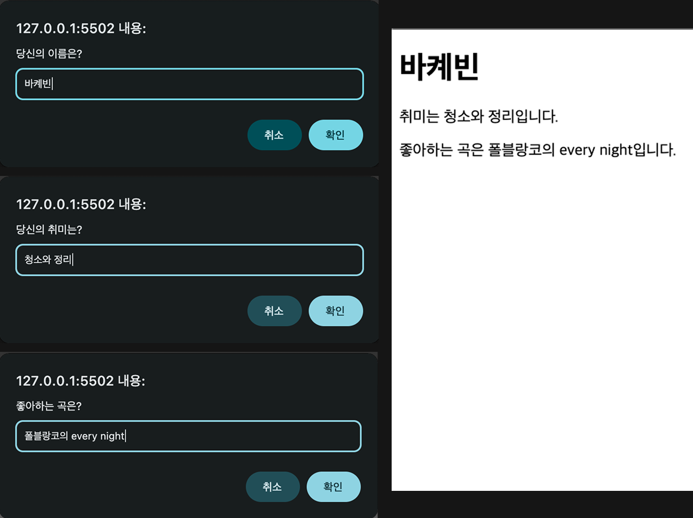

# JavaScript

> 웹 브라우저에게 명령을 내리는 언어

## JavaScript란?

자바스크립트는 웹 브라우저 등 소프트웨어 환경에서 `동작을 수행하도록 명령`을 내리는 프로그래밍 언어다.
명령의 대상은 웹 브라우저, HTML 요소, CSS 스타일 등 자바스크립트가 `제어할 수 있는 객체`들이다.

## 💡 프로그래밍의 기본 흐름

```text
입력 → 처리 → 출력
```

프로그래밍은 일반적으로 위와 같은 순서로 동작한다.<br>
자바스크립트 역시 이 흐름을 따라 객체에 명령을 내리고, 작업을 처리하며, 그 결과를 출력한다.

- 입력: 객체에게 어떤 작업을 수행하라는 명령을 전달
- 처리: 객체가 주어진 작업을 수행
- 출력: 처리한 결과가 사용자에게 반환

자바스크립트에서 `객체`는 속성과 동작을 가지며, 명령의 대상이 되는 `독립적인 데이터 단위`다.

<br>

## 💬 객체의 명령 형식

```js
obj.속성; // 객체가 가진 데이터
obj.메서드(); // 객체가 가진 기능
```

- 속성(property): 객체 내부에 저장된 값
- 메서드(method): 객체가 수행할 수 있는 함수형 기능

<br>

## 🪟 Window 객체

웹 브라우저도 하나의 객체이며, 이 브라우저와 상호작용할 수 있는 대표적인 객체가 바로 `window`다.

### window.alert();

```js
window.alert();
alert();
```

- 확인 버튼을 포함한 경고창을 띄운다.
- [`📎 MDN Window.alert()`](https://developer.mozilla.org/ko/docs/Web/API/Window/alert)

<br>

### MDN window.prompt()

```js
window.prompt();
prompt();
```

- 사용자에게 값을 입력받고 싶을 때 사용한다. `()`안에 대화 상제에 띄울 안내 메세지를 전달할 수 있다.
- 사용자가 입력한 문자열이 반환되고, 사용자가 취소를 누르면 null이 반환된다.
- [`📎 MDN window.prompt()`](https://developer.mozilla.org/ko/docs/Web/API/Window/prompt)

<br>

```js
const data = prompt("힌트는 없소!");
// const data = "내놔"; 처럼 동작
```

::: details 🖥️ 브라우저에서는?

:::

- prompt()는 그 자체가 사용자가 입력한 문자열로 바뀌는 것처럼 동작한다.

<br>

```js
const order = "자바스크립트를 잡으면?";

window.prompt(order);
```

::: details 🖥️ 브라우저에서는?

:::

- 위와 같이 사용할 수도 있다.

<br>

```js
let answer = prompt("돈 내놔 말해 yes or no");

alert(answer);
```

::: details 🖥️ 브라우저에서는?

:::

- 사용자가 입력한 값이 경고창에 출력된다.

<br>

```js
const name = prompt("당신의 이름은?");
const hobby = prompt("당신의 취미는?");
const music = prompt("좋아하는 곡은?");

document.write(`
  <h1>이름은 ${name}입니다.</h1>
  <p>취미는 ${hobby}입니다.</p>
  <p>좋아하는 곡은 ${music}입니다.</p>
`);
```

::: details 🖥️ 브라우저에서는?

:::

<br>

## 🛠 console 객체

브라우저 내부에는 개발자가 상황을 확인하고 디버깅할 수 있도록 `console` 객체도 포함되어 있다.
이 객체 역시 window의 하위 객체이므로, 생략하고 바로 사용할 수 있다.

- [`📎 MDN console`](https://developer.mozilla.org/ko/docs/Web/API/console)

<br>

### console.log()

```js
window.console.log();
console.log();
```

- 콘솔 창에 메세지를 출력한다. 숫자, 문자열, 객체 등 다양한 자료형을 출력할 수 있다.
- 브라우저에서는 console 탭에 출력되고, Node.js에서는 터미널에 출력된다.
- [`📎 MDN console.log()`](https://developer.mozilla.org/ko/docs/Web/API/console/log_static)

::: details script 태그의 src 속성과 실행 방식

```html
<body>
  <script src="script.js">
    console.log("이건 무시된다.");
  </script>
</body>
```

```js
console.log("Hello, World Inline"); // Hello, World Inline
```

HTML에서 `<script src="...">`를 사용하면 스크립트 파일만 로드되고, 내부에 작성한 코드는 완전히 무시된다. src 속성이 지정된 `<script>` 태그는 외부 파일만 로드해서 실행하고, 태그 내부의 내용은 무시한다. HTML5 명세에 따라 모든 브라우저가 그렇게 동작한다.

<br>

1. 외부 스크립트만 실행

```html
<script src="script.js"></script>
```

2. 인라인 스크립트만 실행

```html
<script>
  console.log("Hello, Inline!");
</script>
```

3. 둘 다 실행하고 싶을 때

```html
<script src="script.js"></script>
<script>
  console.log("Hello, Inline!");
</script>
```

:::

<br>

## 🔢 연산자 (Operators)

- 산술 연산자: `+`, `-`, `\*`, `/`, `%`
- 대입 연산자: `=`(기본타입), `+=`, `-=`, `\*=`, `/=`(복합 대입 연산자)

::: tip 대입이란?
대입이란 오른쪽 값을 왼쪽 변수에 넣는 작업이다. 변수에 값을 저장하거나 수정할 때 사용된다.
:::

<br>

## 📦 변수 (Variable)

변수란 데이터를 저장할 수 있는 이름표이다. 데이터를 저장해두고, 그 이름을 통해 데이터를 재사용할 수 있다.

```js
let monkey = "banana";
monkey = "원숭이";
```

```js
const pi = 3.14;
pi = 3.1415; // TypeError
```

- let: 재할당 가능한 변수 선언 키워드
- const: 재할당 불가능한 상수 선언 키워드

<br>

### 변수 선언 및 초기화

```js
let name; // 변수 선언
name = "훈이"; // 변수 초기화
```

```js
let name = "훈이"; // 변수 선언과 초기화
```

<br>

### 변수명 규칙

- 변수명에는 오직 `문자`, `숫자`, `$`, `_` 만 포함될 수 있다.
- 변수명 첫번째 글자로 숫자가 올 수 없다.
- [`자바스크립트 예약어 사용 불가`](https://www.w3schools.com/js/js_reserved.asp)

<br>

## 🔒 상수

상수란 변하지 않는 값이다. 단 하나의 데이터를 위해 사용되는 이름표로 값의 변경이 불가능하다.

```js
const 상수이름 = 데이터;
```

<br>

### 상수 선언과 초기화

```js
const pi = 3.14;
pi = 3.1415; // TypeError
```

- 상수는 선언될 때 지정된 데이터로 고정된다. 따라서 선언 이후 데이터를 대입하려고 하면 에러가 발생한다.
- 상수는 선언과 초기화를 동시에 진행해야 한다.

<br>

## 🔤 문자열 (String)

자바스크립트의 문자열은 문자, 숫자, 특수문자 등 기호들의 나열이며, 큰따옴표 `"`나 작은따옴표 `'`로 감싸서 표현한다. 다른 언어세서는 큰 따옴표는 문자열, 작은 따옴표는 문자인데 js에서는 구별없이 다 문자열을 의미한다.

```js
let a = "Hello";
let b = "World";
let c = `${a} ${b}`;
let d = "${a} ${b}";

console.log(c); // Hello World
console.log(c.length); // 11
console.log(d); // ${a} ${b}
```

- `` ` ``(backtick, backquote)으로 문자열을 표현할 수 있다. 이는 템플릿 리터럴로 `${}`를 사용해서 변수를 값으로 치환시킬 수 있다.
- 문자열은 `length`를 사용해서 길이를 볼 수 있다.

<br>

### `\` 이스케이프 시퀀스(이스케이프 문자)

```text
let str1 = "그는 말했다: \"안녕하`세요!\"";
console.log(str1);

let str2 = '나는 그를 \'친구\'라고 불렀다.';
console.log(str2);

let str3 = "윈도우 경로는 C:\\Users\\훈이";
console.log(str3);
```

```bash
그는 말했다: "안녕하세요!"
나는 그를 '친구'라고 불렀다.
윈도우 경로는 C:\Users\훈이
```

- `\` 역슬래시는 예약 문자를 문자 그대로 쓸 수 있게 해주는 기능이다.
- 이처럼 역슬래시를 앞에 붙여서 예약된 문자의 의미를 회피하거나, 특수한 의미를 가진 문자를 표현하는 방법을
  이스케이프 시퀀스(Escape Sequence)"라고 한다.

<br>

### 문자열에서 특정 문자 접근하기

```js
let a = "abcdefghijklmnopqrstuvwxyz";

console.log(a[0]); // a

console.log(a.charAt(1)); // b
console.log(a.charAt(-1)); // ""
console.log(typeof a.charAt(-1)); // string

console.log(a.at(2)); // c
console.log(a.at(-1)); // z
```

- `[]` 표기법은 비표준이지만, 대부분의 브라우저 및 JavaScript 엔진에서 동작한다.
- `charAt()`과 `at()`은 웹 표준 메서드이며, 문자열에서 특정 문자를 가져올 때 사용한다.
  - `charAt()`은 오래된 표준으로 음수 인덱스를 지원하지 않으며, 이 경우 빈 문자열("")을 반환한다.
  - `at()`은 음수 인덱스도 허용하여, 문자열의 뒤에서부터 접근할 수 있다.

<br>

### 문자열 일부 추출하기

```js
let a = "abcdefghijklmnopqrstuvwxyz";

// substr(start, length)
console.log(a.substr(1, 4)); // bcde

// substring(start, end)
console.log(a.substring(1, 4)); // bcd
console.log(a.substring(4, 1)); // bcd
console.log(a.substring(-4, -1)); // ""

// slice(start, end)
console.log(a.slice(1, 4)); // bcd
console.log(a.slice(4, 1)); // ""
console.log(a.slice(-4, -1)); // xyz
```

- substr(), substring(), slice()는 모두 문자열의 일부분을 추출할 때 사용하는 메서드이다.
- `substr()` start부터 length개의 문자를 선택, 비표준이므로 권장하지 않는다.
- `substring()` start부터 end 전까지 추출, 음수 인덱스는 불가능하다. start가 end보다 크면 자동으로 순서를 바꿔준다. 즉 `substring(4, 1)`은 내부적으로 `substring(1, 4)`처럼 동작한다.
- `slice()` start부터 end 전까지 추출, 음수 인덱스 가능하다.

<br>

### 문자열 비교는 유니코드(UTF-16) 순서

::: details 💡 유니코드 값을 확인할 수 있는 메서드는 없을까? charCodeAt() vs codePointAt()

자바스크립트에서 유니코드 값을 확인할 수 있는 메서드에는 charCodeAt()과 codePointAt()이 있다.

- 일반 알파벳이나 숫자에 대해서는 두 메서드의 결과가 동일하다.
- `codePointAt()`은 ES6(ES2015)부터 도입된 도입된 메서드로, 이모지, 한자, 고유문자처럼 유니코드 코드 포인트가 65536 이상인 문자를 다룰 때 더 정확하다.
- ⚠️ 이모지도 문자이다. 따라서 문자열로 취급되어야 한다.

<br>

##### charCodeAt()

```js
let str = "hello";

console.log(str.charCodeAt(0)); // 'h' → 104
console.log(str.charCodeAt(1)); // 'e' → 101
console.log(str.charCodeAt(4)); // 'o' → 111
```

<br>

```js
console.log("h".charCodeAt()); // 104
console.log("h".charCodeAt(0)); // 104
console.log("w".charCodeAt()); // 119
console.log("w".charCodeAt(0)); // 119
```

- 인덱스 0은 문자열 "h"에서 첫 번째 문자를 의미한다.
- 인덱스를 생략하면 자동으로 0으로 처리된다.
- 명시적으로 인덱스를 작성하는 것이 가독성과 명확성 면에서 더 좋다.
- 다만 charCodeAt()은 UTF-16 코드 단위(2바이트)만 처리할 수 있기 때문에
  이모지나 한자의 경우 두 문자처럼 인식할 수 있다.

<br>

##### codePointAt()

문자열에서 지정한 인덱스의 문자에 해당하는 유니코드 코드 포인트를 반환한다.
이모지나 한 글자가 2개의 코드 단위로 구성된 문자(서로게이트 페어)를 정확하게 처리한다.

```js
const fox = "🦊"; // U+1F98A

console.log(fox.length); // 2 (서로게이트 페어로 구성됨)
console.log(fox.codePointAt(0)); // 129418 (전체 코드 포인트 (U+1F98A))

console.log(fox.charCodeAt(0)); // 55358 (첫 번째 코드 유닛)
console.log(fox.charCodeAt(1)); // 57098 (두 번째 코드 유닛)
```

- codePointAt()은 문자 전체의 유니코드 코드 포인트를 반환한다.
- 이모지 🦊처럼 하나의 문자지만 내부적으로 2개의 코드 단위(서로게이트 페어)로 구성된 문자를 정확히 하나의 값으로 처리한다.
- 이런 경우 charCodeAt()은 2개 문자처럼 다루지만, codePointAt()은 정확히 하나의 문자로 인식한다.

:::

::: details 💡 서로게이트 페어(Surrogate Pair)란?
자바스크립트는 문자열을 UTF-16 형식으로 저장한다. 이 형식은 한 문자를 2바이트(16비트)로 표현한다.

- 유니코드 U+0000 ~ U+FFFF(0~65535)는 1개 2바이트로 표현 가능
- 하지만 유니코드 65536 이상(이모지, 일부 한자 등)은 2바이트로는 부족하다.

그래서 이때는 2개의 2바이트 조각을 짝지어 하나의 문자처럼 표현한다. 이 2개의 조각을 `서로게이트 페어(surrogate pair)`라고 한다.

<br>

```js
// 이모지 "🦊"의 유니코드: U+1F98A (10진수로 129418)

const emoji = "🦊";

console.log(emoji.length); // 2 → 문자 하나지만 코드 단위는 2개
console.log(emoji.charCodeAt(0)); // 55358 (상위 surrogate)
console.log(emoji.charCodeAt(1)); // 57098 (하위 surrogate)

console.log(emoji.codePointAt(0)); // 129418 (정확한 유니코드 값)
```

:::

<br>

#### `사전식 순서 (Lexicographical order)`

```js
// 'h'(104), 'w'(119)
let a = "hello";
let b = "world";

console.log(a > b); // false
console.log(a >= b); // false
console.log(a < b); // true
console.log(a <= b); // true
console.log(a <= a); // true
console.log(a >= a); // true
```

- 문자열 간의 우선순위 비교는 `사전식 순서(Lexicographical order)`를 따른다.
- 첫 글자부터 차례대로 각 문자의 유니코드 값을 비교하여 이루어진다.
- 프로그래밍 언어에서 사용하는 정렬 기준이고, 대소문자를 구분한다.
- 문자열 비교에는 `>`, `<`, `>=`, `<=` 등의 비교 연산자를 사용할 수 있다.
- [📎 문자 유니코드(ASCII) 코드값](https://namu.wiki/w/%EC%95%84%EC%8A%A4%ED%82%A4%20%EC%BD%94%EB%93%9C)

```js
// 'h'(104), 'W'(87)
let a = "hello";
let b = "World";

console.log(a > b); // true
console.log(a >= b); // true
console.log(a < b); // false
console.log(a <= b); // false
console.log(a <= a); // true
console.log(a >= a); // true
```

- 사전식 우선순위에서는 대문자가 소문자보다 유니코드 값이 작다.
- 따라서 대문자가 포함된 문자열은 원하는 비교 결과를 얻지 못할 수 있다.

<br>

#### `사전식 정렬 (Alphabetical order)`

```js
// 'h'(104), 'w'(119)
// 'H'(72), 'W'(87)
let a = "hello";
let b = "World";

console.log(a.toUpperCase() > b.toUpperCase()); // false
console.log(a.toUpperCase() >= b.toUpperCase()); // false
console.log(a.toUpperCase() < b.toUpperCase()); // true
console.log(a.toUpperCase() <= b.toUpperCase()); // true

console.log(a.toLowerCase() > b.toLowerCase()); // false
```

- Alphabetical order는 일반적인 사전에서 사용되는 정렬 방식이며, 보통 대소문자를 구분하지 않는다.
- 사람이 인식하는 자연스러운 순서를 따르기 때문에, 비교 전에 toUpperCase() 또는 toLowerCase()로 문자열을 통일한 후 비교하는 방식이다. 이를 통해 대문자/소문자 구분 없이 일관된 정렬 결과를 얻을 수 있다.

<br>

### 문자열 속 특정 값이 존재하는지 확인하는 메서드

```js
let str = "hello world";

console.log(str.indexOf("o")); // 4
console.log(str.indexOf("world")); // 6
console.log(str.indexOf("x")); // -1

console.log(str.includes("world")); // true
console.log(str.includes("x")); // false
```

```js
// 변수로 비교할 수도 있다.
const str = "hello world";
const a = "hello";
const b = "hi";

console.log(str.indexOf(a)); // 0 ("hello"는 문자열의 시작 부분에 존재)
console.log(str.indexOf(b)); // -1 ("hi"는 문자열에 포함되지 않음)
console.log(str.indexOf(b) === -1); // true (-1 === -1)

console.log(str.includes(a)); // true
console.log(str.includes(b)); // false
console.log(!str.includes(b)); // true
```

- `indexOf()`는 찾은 값의 첫 번째 인덱스를 반환하고, 값이 없으면 -1을 반환한다.
- `includes()` 해당 값의 포함 여부를 true / false로 반환한다.

::: details 🤔 `console.log(str.indexOf(b) === -1);` true ?
indexOf()는 찾는 문자열이 없을 경우 반드시 -1을 반환한다.
문자열이 포함되어 있는지를 조건식에서 검사할 때는 보통 이렇게도 작성한다.

```js
if (str.indexOf(b) === -1) {
  console.log("b는 포함되어 있지 않습니다.");
}
```

- (-1 === -1)
- `===` 연산자는 비교 연산자이고, 그 결과는 항상 boolean 타입이다.

:::

::: details 💡 두 메서드 모두 문자열과 배열에서 사용 가능하다.

```js
let fruits = ["apple", "banana", "orange"];

console.log(fruits.indexOf("banana")); // 1
console.log(fruits.includes("grape")); // false
```

:::

<br>

### 특정 문자열 교체 메서드

```js
const a = "red orange yellow green green";
const b = "green";
const c = "navy";

console.log(a.replace(b, c)); // red orange yellow navy green
console.log(a.replace(/yellow/g, b)); // red orange green green green

console.log(a.replaceAll(b, c)); // red orange yellow navy navy
console.log(a.replaceAll(/yellow/g, b)); // TypeError 발생
console.log(a.replaceAll("yellow", b);) // red orange green green green
```

- `replace()`는 맨 처음 일치하는 값만 변경된다.
- 전체를 바꾸고 싶으면 replace에 정규표현식을 쓰거나, replaceAll()을 사용한다.
- 단, replaceAll()은 문자열만 또는 플래그 없는 정규표현식만 받을 수 있다.

::: details 🤔 정규표현식이란? /pattern/flags;

[📎 MDN Regular expressions](https://developer.mozilla.org/ko/docs/Web/JavaScript/Guide/Regular_expressions)

정규표현식(Regular Expression)은 문자열에서 특정 패턴을 찾거나 검사하거나 치환하기 위해 사용하는 특수한 표현식이다.

<br>

#### 1. 리터럴 방식 (가장 직관적이고 자주 쓰는 방법)

```js
/pattern/flags
```

- `/`로 감싸서 정규표현식을 직접 만든다.
- 고정된 정규표현식을 쓸 때 자주 쓴다.

```text
// flags 예시

/yellow/        // 문자열에 "yellow"가 포함되어 있는지 검사
/yellow/g       // 전역 검색
/yellow/i       // 대소문자 구분 없이 검색
/yellow/gi      // 전역 + 대소문자 무시
```

- `flags`: g (global), i (ignore case), m (multi-line) 등

<br>

##### 문자열에서 정규표현식 사용 예

```js
const str = "Hello hello HELLO";

console.log(str.match(/hello/)); // ["hello"]
console.log(str.match(/hello/gi)); // ["Hello", "hello", "HELLO"]
```

<br>

##### replace()에 정규표현식 사용 예

```js
const fruits = "apple banana apple orange";

console.log(fruits.replace(/apple/, "grape"));
// grape banana apple orange

console.log(fruits.replace(/apple/g, "grape"));
// grape banana grape orange
```

<br>

#### 2. 생성자 방식 (new RegExp("patten", "option"))

```js
new RegExp("hello"); // /hello/
new RegExp("hello", "g"); // /hello/g
new RegExp("a\\.b"); // /a\.b/
```

- RegExp 생성자는 문자열로 정규표현식을 만든다.
- 패턴이나 플래그가 동적으로 정해질 때 유용하다.
- 문자열 기반이므로 변수를 끼워 넣거나 조합하기 쉽다.
- 문자열 안에서 \는 자바스크립트의 특수문자이기 때문에, 이스케이프 문자 \는 두 번 써야 한다.

<br>

##### 동적 패턴 예시

```js
const keyword = "apple"; // 검색할 키워드(사용자가 입력한 검색어)
const regex = new RegExp(keyword, "gi"); // 동적 정규표현식 생성

console.log("APPLE and apple".match(regex)); // ['APPLE', 'apple']
```

- RegExp() 생성자 방식은 검색어가 사용자 입력 등으로 동적으로 정해질 때 유용하다.
- `"APPLE and apple"` 문자열에서 정규표현식 `/apple/gi`에 매칭되는 모든 부분을 배열로 반환한다.

:::

<br>

## 🔍 자료형 확인 typeof

```js
typeof "hello"; // string
typeof 123; // number
typeof true; // boolean
typeof {}; // object
typeof []; // object
typeof function () {}; // function
```

- primitive type에 typeof를 사용할 경우 자기 타입을 문자열로 리턴한다.
- 다만, null일 경우는 object를 내보내는데 이는 [`📎 과거의 레거시`](https://2ality.com/2013/10/typeof-null.html)이다.
- reference type은 object가 나온다. 하지만 함수의 경우 편의를 위해 function이 반환된다.
- [`📎 MDN typeof`](https://developer.mozilla.org/ko/docs/Web/JavaScript/Reference/Operators/typeof)

<br>

```js
var a;
var b = undefined;

console.log(typeof a); // undefined
console.log(typeof b); // undefined
console.log(typeof c); // undefined
```

- a처럼 초기화되지 않은 변수는 undefined가 출력된다.
- b처럼 undefined로 초기화된 변수는 undefined가 출력된다.
- c처럼 정의가 안된 변수는 undefined가 출력된다.

<br>

## parseInt

문자열 인자를 파싱하여 정수를 반환한다.

- [`📎 MDN parseInt`](https://developer.mozilla.org/ko/docs/Web/JavaScript/Reference/Global_Objects/parseInt)

<br>
