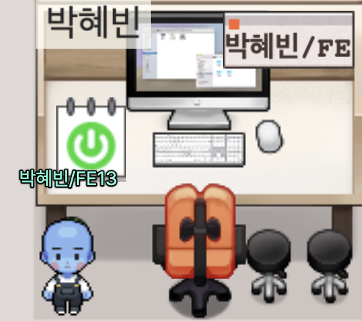

# OZ 초격차캠프 <Badge type="tip" text="2025-07-03 ~ 2025-12-29" />

### 👩🏻‍💻 Frontend 13기

<br>



#### 내가 노력하고 도전한 만큼이 내 세계 💫

6개월 동안 교육에서 학습한 것들을 기록해보려고 한다. 개인 공부도 꾸준히 이어갈 계획이다.<br>

수업은 매일 7시에 끝나지만, 매주 수요일 오후 8시부터 오후 10시까지 진행되는 추가 학습반 - 열정반 `Core JavaScript` 스터디에 참여하기로 했다. 단순한 공부를 넘어, 이해한 내용을 내 언어로 정리하고 발표하고, 토론과 피드백을 주고받는 과정으로 구성되어 있다. 교육 시작 전에도 자바스크립트 인강을 두 바퀴 돌았지만, 여전히 부족하다는 걸 느낀다. 스스로를 더 잡도리할 계획이다 👊🏼

<br>

```less
📁 OZ 초격차캠프
├── Daily Mission
├── Core JavaScript
├── HTML
├── CSS
├── JavaScript
├── React.js
├── TypeScript
├── Next.js
├── CS
└── 알고리즘

```

<Comment/>
