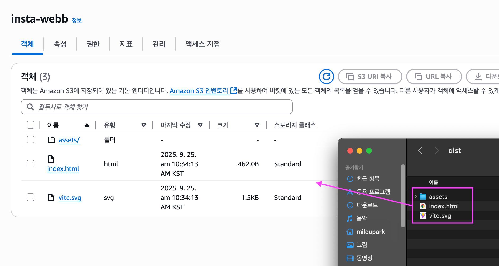

# Amazon Web Services (AWS)


::: info 🔖 Reference

- [AWS 공식 홈페이지](https://aws.amazon.com/ko/)
<!-- - []() -->

:::
::: info 📘 Glossary

- 배포: 내 컴퓨터 안에서만 실행되던 프로젝트를 인터넷에 공개해 다른 사용자도 접근할 수 있도록 만드는 과정
- 웹 호스팅: 웹 페이지를 인터넷에 공개하는 것 (= 배포)
- 버킷: S3 안에서 파일을 저장하는 큰 폴더
- 객체 : S3 버킷에 업로드된 개별 파일

:::

::: details 💡 학습 Tip

#### 파레토의 법칙

- 100가지의 기능이 있다면 현업에서 쓰는 기능은 약 20% 정도 밖에 안 된다.
- 다 배우고 쓰려 하지 말고, 자주 쓰는 것부터 경험하면서 배우자.

#### First Word 법칙

- 자주 사용되는 단어를 나만의 언어로 정리하기.
- 딱딱한 정의보다 내가 쉽게 이해하기 쉬운 말로 기록하기

:::

## AWS

AWS는, 원격으로 컴퓨터 자원을 빌려 사용할 수 있게 해주는 클라우드 서비스이다.

- 강력한 서버를 필요할 때만 빌려 쓸 수 있다.
- 배포, 데이터 저장, 인공지능 기능 등을 즉시 활용할 수 있다.
- 직접 서버를 구매·운영하지 않아도 되므로 비용과 관리 부담을 줄일 수 있다.

<br>

---

<br>

# S3 (Simple Storage Service)

Amazon S3는 AWS에서 제공하는 파일 저장소 서비스이다.

- 사진, 영상, 문서, 로그 파일 같은 데이터를 안전하게 저장하고 꺼내 쓸 수 있는 서비스

<br>

### S3의 특징

1. 객체 저장소(Object Storage)

   - 데이터를 파일 단위(객체)로 저장한다.
   - 각각의 파일은 고유한 주소(URL)를 가지기 때문에 웹에서 직접 접근 가능하다.

2. 버킷(Bucket)

   - 파일을 넣는 큰 폴더 같은 개념
   - 내 프로젝트에 필요한 모든 이미지를 한 버킷 안에 저장할 수 있다.

3. 무제한 확장성

   - 몇 개의 파일이든, 수십억 개든 자동으로 확장된다.
   - 용량 제한이 사실상 없다.

4. 저렴하고 안정적

   - 사용한 만큼만 비용을 낸다.
   - AWS가 여러 지역에 데이터를 복제해 두기 때문에 안전하게 보관된다.

<br>

### 백엔드에서 S3를 왜 쓸까?

- 회원 프로필 사진, 게시판 이미지 같은 파일 업로드에 자주 활용한다.
- 서버가 직접 파일을 들고 있지 않고, S3에 저장해 두고 URL만 관리하는 방식으로 쓴다.

### 프론트에서 배포에 왜 S3를 쓸까?

S3는 단순 저장소뿐만 아니라 정적 웹 호스팅 기능도 있다.
즉, HTML / CSS / JS / 이미지 파일 등을 브라우저가 다운받아 실행할 수 있도록 배포할 수 있다.

<br>

## S3 버킷 생성과 정적 웹 호스팅

### 버킷이란?

- 버킷은 S3에서 파일(객체)을 담아두는 큰 폴더 같은 개념이다.
- 내가 S3에 올리는 모든 파일은 반드시 어떤 버킷 안에 저장된다.

즉, `S3 = 클라우드 하드디스크`, `버킷 = 그 안의 폴더`라고 이해하면 된다.

<br>

### 버킷 생성 단계

#### 1. 버킷 만들기

- S3 콘솔에서 버킷 생성 클릭
- 버킷 이름과 리전을 지정

<br>

#### 2. 버킷 정책 설정 (권한 열기)


- 버킷 > 권한 > 버킷 정책
- 버킷 정책이란, 해당 버킷에 대한 접근 권한을 정의하는 JSON 문서이다.
- AWS는 기본적으로 보안을 위해 새로 만든 버킷을 잠신 상태(퍼블릭 접근 불가)로 둔다.
- 따라서 외부에서 접근 가능하게 하려면, 필요한 권한을 정책(JSON)으로 명시해 열어주어야 한다.


<br>

#### 3. 파일 업로드


- S3에 index.html 같은 정적 파일 업로드 (= 객체)

<br>

#### 4. 정적 웹 사이트 호스팅 활성화


- 속성 → 정적 웹 사이트 호스팅 → 편집 → 정적 웹 사이트 호스팅: 활성화
- 인덱스 문서: index.html 입력

이제 S3가 단순한 저장소를 넘어 웹 호스팅 서버처럼 동작한다.

<br>

#### 5. 배포 주소 확인

- S3가 제공하는 엔드포인트 URL 확인
- 이제 브라우저에서 접속하면, 올린 index.html 페이지가 표시된다.
- 예: http://insta-webb.s3-website.ap-northeast-2.amazonaws.com/

<br>

## Vite React 프로젝트 생성



```bash
$ npm create vite@latest insta-webb-vite -- --template react
```

- `npm run build` → `dist` 폴더 생성
- `dist` 폴더를 S3에 업로드하면 바로 배포 가능

<br>

## Next.js 프로젝트 생성


```bash
$ npx create-next-app@latest
```

- Next.js는 정적 배포 / 동적 배포 두 가지 방식이 있다.
- S3에서는 정적 배포만 가능 → 따라서 설정이 필요하다.

<br>

### Next.js 정적 배포 설정

::: code-group

```js [next.comfig.mjs]
/** @type {import('next').NextConfig} */
const nextConfig = {
  output: "export",
};

export default nextConfig;
```

:::

- 루트 디렉토리에 `next.config.mjs` 작성
- 설정 후 `npm run build` → `out` 폴더 생성
- `out` 폴더를 S3에 업로드하면 바로 배포 가능

<br>

::: info 📌 정리

- Vite → dist 폴더 업로드
- Next.js → `next.comfig.mjs` 수정 후 out 폴더 업로드
- 동적 배포는 S3 불가 (EC2, Vercel 등 필요)

:::

<br>

---

<br>

# CloudFront

Amazon CloudFront는 콘텐츠를 빠르고 안전하게 전송할 수 있도록 도와주는 AWS 서비스이다.  
주요 특징은 다음과 같다:

- 컨텐츠 전송 성능 향상 → 전 세계 어디서나 빠른 응답
- HTTPS 지원 → S3 단독은 HTTP만 가능
- 보안 강화 → DDos 방어, 접근 제어, 암호화 등 추가 기능 제공

💡 S3 + CloudFront 조합으로 배포하는 경우가 많다.

<br>

### 현업에서의 사용

- S3 + CloudFront는 AWS에서 정적 사이트 배포 시 흔히 사용하는 조합이다.
- 그 외에도 Netlify, Vercel, Cloudflare 같은 SaaS형 배포 서비스를 활용하기도 한다.

<br>

## CloudFront 작동 방식

CloudFront는 전 세계 여러 위치에 임시 저장소(Edge Location)를 두고 콘텐츠 복사본을 저장한다.
사용자는 가장 가까운 엣지 로케이션에서 콘텐츠를 가져오기 때문에, 원본 S3와 직접 통신하는 것보다 지연 시간이 줄어들고 속도가 빨라진다.

💡 이런 방식을 CDN(Content Delivery Network) 이라고 부른다.  
따라서 CloudFront는 CDN 서비스의 일종이다.

<br>

::: info 📌 정리

- S3 = 저장소 (정적 웹 배포 가능, 하지만 HTTPS 불가)
- CloudFront = CDN + HTTPS 지원 + 보안 강화
- S3 + CloudFront = 빠르고 안전한 배포 환경을 만들 수 있다.

:::

<br>

---

<br>

<br>
<Comment/>
