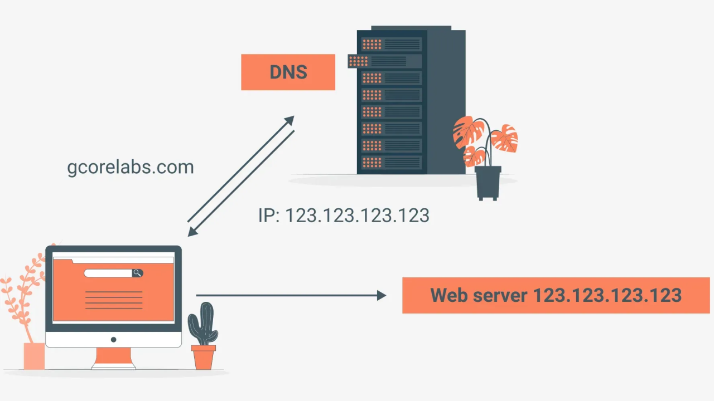

# Amazon Web Services (AWS)


::: info 🔖 Reference

- [AWS 공식 홈페이지](https://aws.amazon.com/ko/)
- [실전 Amazon S3와 CloudFront로 정적 파일 배포하기](https://aws.amazon.com/ko/blogs/korea/amazon-s3-amazon-cloudfront-a-match-made-in-the-cloud/)

:::
::: info 📘 Glossary

- 배포: 내 컴퓨터 안에서만 실행되던 프로젝트를 인터넷에 공개해 다른 사용자도 접근할 수 있도록 만드는 과정
- 웹 호스팅: 웹 페이지를 인터넷에 공개하는 것 (= 배포)
- 버킷: S3 안에서 파일을 저장하는 큰 폴더
- 객체 : S3 버킷에 업로드된 개별 파일

:::

::: details 💡 학습 Tip

#### 파레토의 법칙

- 100가지의 기능이 있다면 현업에서 쓰는 기능은 약 20% 정도 밖에 안 된다.
- 다 배우고 쓰려 하지 말고, 자주 쓰는 것부터 경험하면서 배우자.

#### First Word 법칙

- 자주 사용되는 단어를 나만의 언어로 정리하기.
- 딱딱한 정의보다 내가 쉽게 이해하기 쉬운 말로 기록하기

:::

## AWS

AWS는, 원격으로 컴퓨터 자원을 빌려 사용할 수 있게 해주는 클라우드 서비스이다.

- 강력한 서버를 필요할 때만 빌려 쓸 수 있다.
- 배포, 데이터 저장, 인공지능 기능 등을 즉시 활용할 수 있다.
- 직접 서버를 구매·운영하지 않아도 되므로 비용과 관리 부담을 줄일 수 있다.

<br>

---

<br>

# S3 (Simple Storage Service)

Amazon S3는 AWS에서 제공하는 파일 저장소 서비스이다.

- 사진, 영상, 문서, 로그 파일 같은 데이터를 안전하게 저장하고 꺼내 쓸 수 있는 서비스

<br>

### S3의 특징

1. 객체 저장소(Object Storage)

   - 데이터를 파일 단위(객체)로 저장한다.
   - 각각의 파일은 고유한 주소(URL)를 가지기 때문에 웹에서 직접 접근 가능하다.

2. 버킷(Bucket)

   - 파일을 넣는 큰 폴더 같은 개념
   - 내 프로젝트에 필요한 모든 이미지를 한 버킷 안에 저장할 수 있다.

3. 무제한 확장성

   - 몇 개의 파일이든, 수십억 개든 자동으로 확장된다.
   - 용량 제한이 사실상 없다.

4. 저렴하고 안정적

   - 사용한 만큼만 비용을 낸다.
   - AWS가 여러 지역에 데이터를 복제해 두기 때문에 안전하게 보관된다.

<br>

### 백엔드에서 S3를 왜 쓸까?

- 회원 프로필 사진, 게시판 이미지 같은 파일 업로드에 자주 활용한다.
- 서버가 직접 파일을 들고 있지 않고, S3에 저장해 두고 URL만 관리하는 방식으로 쓴다.

### 프론트에서 배포에 왜 S3를 쓸까?

S3는 단순 저장소뿐만 아니라 정적 웹 호스팅 기능도 있다.
즉, HTML / CSS / JS / 이미지 파일 등을 브라우저가 다운받아 실행할 수 있도록 배포할 수 있다.

<br>

## S3 버킷 생성과 정적 웹 호스팅

### 버킷이란?

- 버킷은 S3에서 파일(객체)을 담아두는 큰 폴더 같은 개념이다.
- 내가 S3에 올리는 모든 파일은 반드시 어떤 버킷 안에 저장된다.

즉, `S3 = 클라우드 하드디스크`, `버킷 = 그 안의 폴더`라고 이해하면 된다.

<br>

### 버킷 생성 단계

#### 1. 버킷 만들기

- S3 콘솔에서 버킷 생성 클릭
- 버킷 이름과 리전을 지정

<br>

#### 2. 버킷 정책 설정 (권한 열기)


- 버킷 > 권한 > 버킷 정책
- 버킷 정책이란, 해당 버킷에 대한 접근 권한을 정의하는 JSON 문서이다.
- AWS는 기본적으로 보안을 위해 새로 만든 버킷을 잠신 상태(퍼블릭 접근 불가)로 둔다.
- 따라서 외부에서 접근 가능하게 하려면, 필요한 권한을 정책(JSON)으로 명시해 열어주어야 한다.


<br>

#### 3. 파일 업로드


- S3에 index.html 같은 정적 파일 업로드 (= 객체)

<br>

#### 4. 정적 웹 사이트 호스팅 활성화


- 속성 → 정적 웹 사이트 호스팅 → 편집 → 정적 웹 사이트 호스팅: 활성화
- 인덱스 문서: index.html 입력

이제 S3가 단순한 저장소를 넘어 웹 호스팅 서버처럼 동작한다.

<br>

#### 5. 배포 주소 확인

- S3가 제공하는 엔드포인트 URL 확인
- 이제 브라우저에서 접속하면, 올린 index.html 페이지가 표시된다.
- 예: http://insta-webb.s3-website.ap-northeast-2.amazonaws.com/

<br>

## Vite React 프로젝트 생성


```bash
$ npm create vite@latest insta-webb-vite -- --template react
```

- `npm run build` → `dist` 폴더 생성
- `dist` 폴더를 S3에 업로드하면 바로 배포 가능

<br>

## Next.js 프로젝트 생성


```bash
$ npx create-next-app@latest
```

- Next.js는 정적 배포 / 동적 배포 두 가지 방식이 있다.
- S3에서는 정적 배포만 가능 → 따라서 설정이 필요하다.

<br>

### Next.js 정적 배포 설정

::: code-group

```js [next.comfig.mjs]
/** @type {import('next').NextConfig} */
const nextConfig = {
  output: "export",
};

export default nextConfig;
```

:::

- 루트 디렉토리에 `next.config.mjs` 작성
- 설정 후 `npm run build` → `out` 폴더 생성
- `out` 폴더를 S3에 업로드하면 바로 배포 가능

<br>

::: info 📌 정리

- Vite → dist 폴더 업로드
- Next.js → `next.comfig.mjs` 수정 후 out 폴더 업로드
- 동적 배포는 S3 불가 (EC2, Vercel 등 필요)

:::

<br>

---

<br>

# CloudFront

Amazon CloudFront는 컨텐츠를 빠르고 안전하게 전송할 수 있도록 도와주는 AWS에서 제공하는 CDN 서비스다.

::: info 💡 CDN (Content Delivery Network)

- CDN은 전 세계 여러 지역에 분산된 캐시 서버(Edge Location)를 두고, 사용자에게 가장 가까운 서버에서 콘텐츠를 제공하는 네트워크다.
- 이렇게 하면 원본 서버까지의 물리적 거리를 줄여 속도 향상과 트래픽 분산 효과를 얻을 수 있다.

:::


- 전 세계 엣지 로케이션에 콘텐츠 복사본을 저장하고, 사용자 요청을 가장 가까운 위치에서 처리해준다.
- S3, EC2, Lambda 같은 AWS 리소스뿐만 아니라 외부 서버와도 연동할 수 있다.

<br>

### CloudFront 주요 특징

- 빠른 응답 속도: 전 세계 어디서나 가까운 엣지 로케이션을 통해 콘텐츠를 제공
- HTTPS 지원: S3 단독은 HTTP만 지원하지만, CloudFront를 통해 HTTPS 적용 가능
- 보안 강화: DDoS 방어, 접근 제어, 암호화 등 제공
- 트래픽 비용 절감: 캐시 사용으로 원본 서버의 부하 감소
- 확장성: 글로벌 서비스 배포 시 안정적인 성능 유지
- 글로벌 서비스에 최적화: 전 세계 사용자에게 동일한 품질의 서비스를 제공 가능

💡 그래서, 실무에서는 S3 + CloudFront 조합으로 배포하는 경우가 많다.

<br>

## CloudFront 작동 방식

CloudFront는 전 세계 여러 위치에 임시 저장소(Edge Location)를 두고 콘텐츠 복사본을 저장한다.  
사용자는 가장 가까운 엣지 로케이션에서 콘텐츠를 가져오기 때문에, 원본 S3와 직접 통신하는 것보다 지연 시간이 줄어들고 속도가 빨라진다.

::: details 🔍 작동 과정

1. 사용자가 웹 사이트(정적 파일, 동영상, API 등)에 접근한다.
2. 요청이 CloudFront로 전달된다.
3. CloudFront는 가장 가까운 엣지 로케이션(Edge Location) 에서 캐시된 콘텐츠를 찾아 응답한다.
4. 캐시에 없는 경우, CloudFront가 원본 서버(S3, EC2 등)에서 데이터를 가져와 전달하고, 그 복사본을 엣지 로케이션에 저장한다.
5. 이후 동일한 요청은 엣지 로케이션에서 빠르게 제공된다.

:::

### S3 단독 배포 (지연 발생)


### S3 + CloudFront 배포 (Edge Location 캐싱)


<br>

::: info 📌 정리

- S3 = 저장소 (정적 웹 배포 가능, 하지만 HTTPS 불가)
- CloudFront = CDN + HTTPS 지원 + 보안 강화
- S3 + CloudFront = 빠르고 안전한 배포 환경을 만들 수 있다.

:::

<br>

---

<br>

# S3, CloudFront를 활용한 아키텍처 구성


`사용자 → CloudFront (Edge Location 캐시) → S3(또는 EC2, ALB 등 원본 서버)`

CloudFront가 사용자와 S3 사이에서 캐시 역할을 하기 때문에,  
사용자는 S3에 직접 접근하지 않고 CloudFront를 통해 빠르고 안전하게 콘텐츠를 전달받는다.

<br>

---

<br>

# HTTPS의 중요성


- HTTP: 웹에서 데이터를 주고받기 위한 통신 규약으로, 클라이언트(브라우저)와 서버 간 요청/응답을 처리한다. 하지만 데이터를 암호화하지 않고 평문으로 전송하기 때문에, 네트워크 중간에서 공격자가 그대로 볼 수 있다.
- HTTPS: HTTP에 SSL/TLS 암호화 계층을 추가한 프로토콜이다. 데이터를 암호화하여 전송하므로, 중간에서 공격자가 가로채더라도 실제 내용을 확인할 수 없다.

따라서 비밀번호나 개인정보와 같은 중요한 데이터는 반드시 HTTPS로 전송해야 한다.

<br>

### HTTPS의 이점

- 보안 강화: 전송 구간이 암호화되어 개인정보, 로그인 정보, 결제 정보 보호 가능
- 신뢰성 확보: 브라우저 주소창에 자물쇠 아이콘이 표시되어 사용자에게 안전한 사이트라는 신뢰를 준다.
- SEO 가산점: 구글은 HTTPS 사이트를 검색 순위에 반영하므로, 검색엔진 최적화(SEO) 측면에서도 유리하다.
- 데이터 무결성 보장: 전송 중 데이터가 변조되지 않았음을 확인할 수 있다.

💡 오늘날 모든 웹사이트는 HTTPS 적용이 기본이다.

<br>

---

<br>

# 도메인과 DNS



- [What is a DNS Server? | What They Are & How They Work](https://gcore.com/learning/dns-servers-what-they-are-and-how-they-work)

## 도메인 이전의 통식 방식

과거에는 특정 컴퓨터와 통신하려면 IP 주소를 직접 입력해야 했다.  
예: 12.134.122.11

하지만 숫자로만 이루어진 IP 주소는 기억하기 어렵고, 사람이 사용하기엔 불편했다.

## 도메인의 필요성

- 사람들이 쉽게 기억할 수 있도록 문자로 된 이름(도메인)을 붙이고 싶었다.
- 하지만 컴퓨터는 숫자를 더 빠르고 효율적으로 처리한다.
- 따라서 문자(도메인)와 숫자(IP 주소)를 자동으로 변환해줄 시스템이 필요했다.

## DNS(Domain Name System)의 등장

DNS는 도메인 이름을 IP 주소로 변환해주는 시스템이다.

- 사람이 입력: www.example.com
- DNS 변환: 93.184.216.34
- 컴퓨터: 변환된 IP 주소를 통해 해당 서버와 통신

이제 사용자는 복잡한 IP 주소를 외울 필요 없이, 기억하기 쉬운 도메인만 입력하면 된다.  
💡 즉, DNS는 사람 ↔ 컴퓨터를 이어주는 다리 역할을 한다.

<br>

---

<br>

# AWS Route 53

AWS Route 53은 도메인을 발급하고 관리할 수 있는 DNS 서비스이다.  
도메인 이름을 등록하고, 이를 특정 서버(IP 주소)와 연결해주는 역할을 한다.

## 왜 도메인이 필요한가?

웹 서비스 운영 시 대부분은 IP 주소가 아닌 도메인 기반으로 통신한다.
그 이유 중 하나는 HTTPS 보안 인증 때문이다.

- IP 주소만으로는 HTTPS 인증서를 발급·적용할 수 없다.
- 도메인 주소가 반드시 있어야 SSL/TLS 인증서를 발급받아 HTTPS를 적용할 수 있다.

따라서 실무에서 프론트엔드 페이지든, 백엔드 서버든 도메인 없이 운영하기는 거의 불가능하다.

## Route 53의 활용

- 도메인 등록 및 관리
- 도메인과 서버 IP 매핑 (DNS 기능)
- 서브도메인 설정 (예: api.example.com, dev.example.com)
- 다른 AWS 서비스와 연동 (EC2, S3, CloudFront 등과 연결)

::: info 🌍 AWS Route 53의 특징

- **고가용성**: 전 세계 리전 기반 인프라로 안정적 서비스 제공
- **유연한 라우팅 정책**: 단순 라운드 로빈, 지리적 라우팅, 지연 시간 기반 라우팅 지원
- **Health Check**: 서버 상태를 모니터링해 비정상 서버로는 트래픽을 보내지 않음
- **AWS 연동 최적화**: EC2, S3, CloudFront와 원활하게 연동 가능

:::

## 다른 DNS 서비스와 비교

Route 53 외에도 DNS 역할을 제공하는 서비스는 많다.  
예: 가비아, 후이즈, GoDaddy 등

즉, 도메인 발급 및 관리 자체는 특정 기업의 독점이 아니라, 여러 업체가 제공하는 서비스이다.  
단, AWS 환경에서 인프라를 운영한다면 Route 53을 쓰는 것이 연동 면에서 유리하다.

<br>

---

<br>

# 도메인 연결

- [내도메인한국 실습](https://xn--220b31d95hq8o.xn--3e0b707e/)


## DNS 레코드 종류

| 레코드           | 설명                               | 예시                            |
| ---------------- | ---------------------------------- | ------------------------------- |
| **A 레코드**     | 도메인을 직접 IP 주소와 연결       | `example.com → 203.0.113.10`    |
| **CNAME 레코드** | 도메인을 다른 도메인과 연결 (별칭) | `www.example.com → example.com` |

<br>

## 아키텍처 흐름


- Users: 브라우저에서 도메인 입력
- Route 53: DNS 조회 (A/CNAME)
- CloudFront: HTTPS/캐싱/전송 최적화
- S3: 정적 웹사이트 호스팅

<br>

## CloudFront에 도메인 연결 및 HTTPS 적용

## 1. CloudFront에 도메인 연결


- Alternative domain name (CNAMEs): CloudFront 기본 도메인 대신 내가 소유한 도메인으로 접속할 수 있도록 설정.
- Custom SSL certificate: HTTPS를 적용하기 위해 ACM에서 발급받은 인증서를 연결.

## 2. AWS Certificate Manager(ACM)에서 인증서 발급

### (1) 퍼블릭 인증서 요청


CloudFront에 사용할 SSL 인증서는 반드시 `버지니아 북부(us-east-1)` 리전에서 발급해야 한다.

- CloudFront는 글로벌 서비스라 특정 리전에 종속되지 않음
- 하지만 AWS 내부적으로 us-east-1 리전의 인증서만 참조하도록 고정되어 있음
- 따라서 HTTPS 적용 시 반드시 버지니아 북부에서 발급

<br>

### (2) 도메인 이름 입력


인증서를 적용할 도메인을 입력한다.  
이 단계에서 AWS는 도메인 소유권 검증을 요구한다

- DNS 검증(권장): Route 53에 자동으로 CNAME 레코드를 추가 → 간편 & 자동 갱신 지원
- 이메일 검증: WHOIS 등록 이메일로 인증 메일 확인

Route 53을 사용 중이므로 DNS 검증을 선택하는 것이 가장 쉽다.

<br>

## 3. 도메인 소유권 검증 (DNS 설정)

### (1) ACM이 제공하는 CNAME 확인


- ACM이 CNAME 이름과 CNAME 값을 제공한다.
- 이 값을 Route 53 또는 도메인 관리 업체의 DNS 레코드에 등록해야 한다.

<br>

### (2) Route 53/도메인 관리 업체에 CNAME 레코드 추가


이렇게 입력하면 AWS가 이 도메인이 내 소유임을 확인한다.

<br>

### (3) 검증 대기 → 발급 완료


<br>

## 4. CloudFront에 인증서 연결


- Alternative domain name (CNAMEs)에 도메인 입력
- Custom SSL certificate에서 ACM에서 발급받은 인증서 선택

이제 CloudFront가 HTTPS를 적용한 상태로 S3 콘텐츠를 서비스한다.

<br>

## 5. 결과 확인


## 요약

::: info 💡 AWS 배포 과정 한눈에 보기

1. React 프로젝트 S3에 업로드
2. CloudFront로 배포
3. Route 53을 통해 도메인 발급 및 연결
4. ACM 인증서를 발급하여 HTTPS 적용

:::

<br>

---

<br>

# IP와 Port의 개념

## IP(Internet Protocol)

IP란 네트워크 상에서 장치(컴퓨터, 서버)를 식별하기 위한 주소이다.

- 예: `192.168.0.1`, `203.0.113.10`
- 집 주소에 해당하는 개념

## Port

하나의 IP 주소 안에서 실행되는 특정 서비스(프로세스)를 구분하기 위한 번호이다.

- 예: 203.0.113.10`:443`
- `80` → HTTP (웹)
- `443` → HTTPS (보안 웹)
- `3306` → MySQL DB
- 집 주소(IP)에 있는 방 번호 같은 개념

## 잘 알려진 포트(Well-Known Port)란?

인터넷 표준에 의해 특정 서비스에 예약된 포트 번호를 말한다.  
이 범위는 `0 ~ 1023` 까지이며, 전 세계적으로 공통적으로 사용된다.

- `80` → HTTP로 통신을 할 때 사용
- `443` → HTTPS로 통신을 할 때 사용
- `22` → SSH, Secure Shell Protocol: 원격 접속을 위한 포트 번호
  - EC2 인스턴스에 연결할 때 22번 포트를 사용한다.
- `25` → SMTP (메일 전송)

💡 덕분에 브라우저나 프로그램은 별도의 설정 없이도 어떤 포트로 접근할지 알 수 있다.

::: info ⚠️ 위에서 정해놓은 규약을 꼭 지키지 않아도 된다.
즉, 규약으로 정해져 있는 포트 번호와 다르게 사용해도 된다는 뜻이다.  
예를 들어, 특정 서버와 HTTP 통신을 할 때 80번 포트를 쓰지 않고 3000번 포트나 8080번 포트를 써도 상관 없다.
:::

## 브라우저 창에 포트 번호를 입력하지 않는 이유

브라우저에 단순히 `https://www.example.com` 만 입력해도 잘 접속되는 이유는,  
브라우저가 자동으로 `기본 포트(Well-Known Port)`를 붙여주기 때문이다.

- HTTP → 기본 포트 `80`
- HTTPS → 기본 포트 `443`

즉, 사용자가 `https://www.example.com`을 입력하면 실제 요청은  
`https://www.example.com:443`으로 전송된다.

💡 그래서 일반 사용자는 포트를 직접 입력하지 않아도 된다.  
다만 개발 환경에서는 기본 포트 대신 `3000`, `5173` 같은 포트를 쓰기 때문에 주소창에 명시적으로 입력해야 한다.

<br>
<Comment/>
