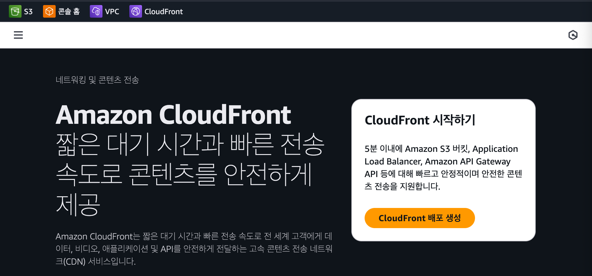
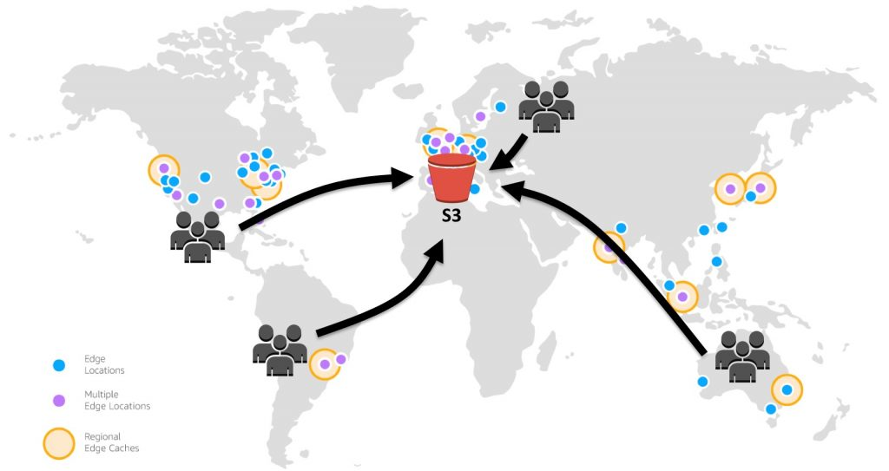
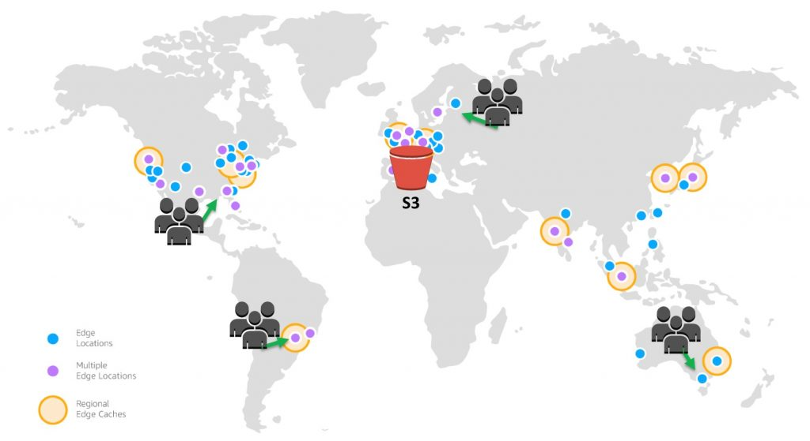
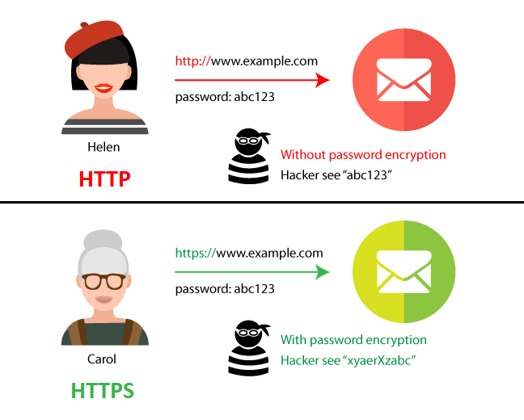

# CloudFront

Amazon CloudFront는 컨텐츠를 빠르고 안전하게 전송할 수 있도록 도와주는 AWS에서 제공하는 CDN 서비스다.

::: info 💡 CDN (Content Delivery Network)

- CDN은 전 세계 여러 지역에 분산된 캐시 서버(Edge Location)를 두고, 사용자에게 가장 가까운 서버에서 콘텐츠를 제공하는 네트워크다.
- 이렇게 하면 원본 서버까지의 물리적 거리를 줄여 속도 향상과 트래픽 분산 효과를 얻을 수 있다.

:::

 

- 전 세계 엣지 로케이션에 콘텐츠 복사본을 저장하고, 사용자 요청을 가장 가까운 위치에서 처리해준다.
- S3, EC2, Lambda 같은 AWS 리소스뿐만 아니라 외부 서버와도 연동할 수 있다.

 

## CloudFront 주요 특징

- 빠른 응답 속도: 전 세계 어디서나 가까운 엣지 로케이션을 통해 콘텐츠를 제공
- HTTPS 지원: S3 단독은 HTTP만 지원하지만, CloudFront를 통해 HTTPS 적용 가능
- 보안 강화: DDoS 방어, 접근 제어, 암호화 등 제공
- 트래픽 비용 절감: 캐시 사용으로 원본 서버의 부하 감소
- 확장성: 글로벌 서비스 배포 시 안정적인 성능 유지
- 글로벌 서비스에 최적화: 전 세계 사용자에게 동일한 품질의 서비스를 제공 가능

💡 그래서, 실무에서는 S3 + CloudFront 조합으로 배포하는 경우가 많다.

 

## CloudFront 작동 방식

CloudFront는 전 세계 여러 위치에 임시 저장소(Edge Location)를 두고 콘텐츠 복사본을 저장한다.  
사용자는 가장 가까운 엣지 로케이션에서 콘텐츠를 가져오기 때문에, 원본 S3와 직접 통신하는 것보다 지연 시간이 줄어들고 속도가 빨라진다.

::: info 🔍 작동 과정

1. 사용자가 웹 사이트(정적 파일, 동영상, API 등)에 접근한다.
2. 요청이 CloudFront로 전달된다.
3. CloudFront는 가장 가까운 엣지 로케이션(Edge Location) 에서 캐시된 콘텐츠를 찾아 응답한다.
4. 캐시에 없는 경우, CloudFront가 원본 서버(S3, EC2 등)에서 데이터를 가져와 전달하고, 그 복사본을 엣지 로케이션에 저장한다.
5. 이후 동일한 요청은 엣지 로케이션에서 빠르게 제공된다.

:::

 

### S3 단독 배포 (지연 발생)

### S3 + CloudFront 배포 (Edge Location 캐싱)

## CloudFront 캐시 무효화

- CloudFront는 캐시된 콘텐츠를 일정 시간 동안 유지한다.
- 그래서 S3에 새 코드를 업로드해도 즉시 반영되지 않을 수 있다.
- 이때는 CloudFront에서 `Invalidation(무효화)`를 실행하여 캐시를 강제로 새로고침해야 한다.
- 실무에서는 CI/CD 파이프라인에 자동 무효화 과정을 넣는 경우가 많다.

 

---

 

# HTTPS

CloudFront는 단순히 빠른 전송뿐 아니라, `AWS Certificate Manager`와 연동해 `HTTPS` 적용까지 가능하다.

## HTTPS의 중요성

- HTTP: 웹에서 데이터를 주고받기 위한 통신 규약으로, 클라이언트(브라우저)와 서버 간 요청/응답을 처리한다. 하지만 데이터를 암호화하지 않고 평문으로 전송하기 때문에, 네트워크 중간에서 공격자가 그대로 볼 수 있다.
- HTTPS: HTTP에 SSL/TLS 암호화 계층을 추가한 프로토콜이다. 데이터를 암호화하여 전송하므로, 중간에서 공격자가 가로채더라도 실제 내용을 확인할 수 없다.

따라서 비밀번호나 개인정보와 같은 중요한 데이터는 반드시 HTTPS로 전송해야 한다.

 

## HTTPS의 이점

- 보안 강화: 전송 구간이 암호화되어 개인정보, 로그인 정보, 결제 정보 보호 가능
- 신뢰성 확보: 브라우저 주소창에 자물쇠 아이콘이 표시되어 사용자에게 안전한 사이트라는 신뢰를 준다.
- SEO 가산점: 구글은 HTTPS 사이트를 검색 순위에 반영하므로, 검색엔진 최적화(SEO) 측면에서도 유리하다.
- 데이터 무결성 보장: 전송 중 데이터가 변조되지 않았음을 확인할 수 있다.

💡 오늘날 모든 웹사이트는 HTTPS 적용이 기본이다.

 

::: info 📌 정리

- S3 = 저장소 (정적 웹 배포 가능, 하지만 HTTPS 불가)
- CloudFront = CDN + HTTPS 지원 + 보안 강화
- S3 + CloudFront = 빠르고 안전한 배포 환경을 만들 수 있다.

:::

 
<Comment/>
