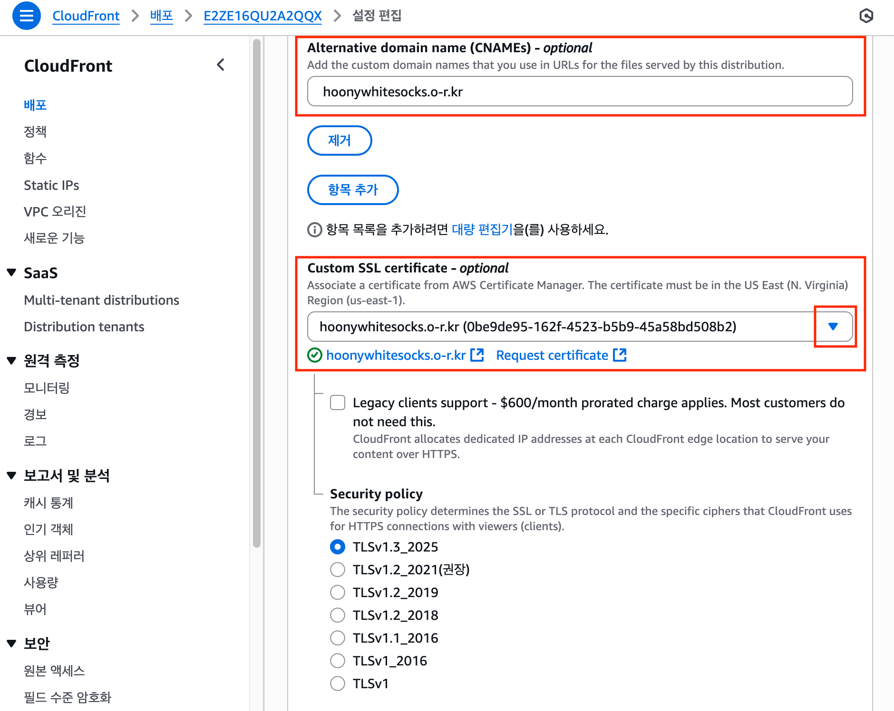

# 정적 사이트 배포 실습

## 프로젝트 준비

### Vite React 프로젝트 생성


```bash
$ npm create vite@latest insta-webb-vite -- --template react
```

- `npm run build` → `dist` 폴더 생성
- `dist` 폴더를 S3에 업로드하면 바로 배포 가능

<br>

### Next.js 프로젝트 생성


```bash
$ npx create-next-app@latest
```

- Next.js는 정적 배포 / 동적 배포 두 가지 방식이 있다.
- S3에서는 정적 배포만 가능 → 따라서 설정이 필요하다.

<br>

#### Next.js 정적 배포 설정

::: code-group

```js [next.config.mjs]
/** @type {import('next').NextConfig} */
const nextConfig = {
  output: "export",
};

export default nextConfig;
```

:::

- 루트 디렉토리에 `next.config.mjs` 작성
- 설정 후 `npm run build` → `out` 폴더 생성
- `out` 폴더를 S3에 업로드하면 바로 배포 가능

::: info 📌 정리

- Vite → dist 폴더 업로드
- Next.js → `next.config.mjs` 수정 후 out 폴더 업로드
- 동적 배포는 S3 불가 (EC2, Vercel 등 필요)

:::

## 전체 아키텍처 이해

### S3 + CloudFront


`사용자 → CloudFront (Edge Location 캐시) → S3(또는 EC2, ALB 등 원본 서버)`

CloudFront가 사용자와 S3 사이에서 캐시 역할을 하기 때문에,  
사용자는 S3에 직접 접근하지 않고 CloudFront를 통해 빠르고 안전하게 콘텐츠를 전달받는다.

<br>

## CloudFront에 도메인 연결 및 HTTPS 적용

### 도메인 연결

- [내도메인한국 실습](https://xn--220b31d95hq8o.xn--3e0b707e/)


<br>

### 도메인 연결 아키텍처


- Users: 브라우저에서 도메인 입력
- Route 53: DNS 조회 (A/CNAME)
- CloudFront: HTTPS/캐싱/전송 최적화
- S3: 정적 웹사이트 호스팅

<br>

## 단계별 배포 실습

### 1. CloudFront에 도메인 연결


- Alternative domain name (CNAMEs): CloudFront 기본 도메인 대신 내가 소유한 도메인으로 접속할 수 있도록 설정.
- Custom SSL certificate: HTTPS를 적용하기 위해 ACM에서 발급받은 인증서를 연결.

<br>

### 2. AWS Certificate Manager(ACM)에서 인증서 발급

#### (1) 퍼블릭 인증서 요청


CloudFront에 사용할 SSL 인증서는 반드시 `버지니아 북부(us-east-1)` 리전에서 발급해야 한다.

- CloudFront는 글로벌 서비스라 특정 리전에 종속되지 않음
- 하지만 AWS 내부적으로 us-east-1 리전의 인증서만 참조하도록 고정되어 있음
- 따라서 HTTPS 적용 시 반드시 버지니아 북부에서 발급

<br>

#### (2) 도메인 이름 입력


인증서를 적용할 도메인을 입력한다.  
이 단계에서 AWS는 도메인 소유권 검증을 요구한다

- DNS 검증(권장): Route 53에 자동으로 CNAME 레코드를 추가 → 간편 & 자동 갱신 지원
- 이메일 검증: WHOIS 등록 이메일로 인증 메일 확인

Route 53을 사용 중이므로 DNS 검증을 선택하는 것이 가장 쉽다.

<br>

### 3. 도메인 소유권 검증 (DNS 설정)

#### (1) ACM이 제공하는 CNAME 확인


- ACM이 CNAME 이름과 CNAME 값을 제공한다.
- 이 값을 Route 53 또는 도메인 관리 업체의 DNS 레코드에 등록해야 한다.

<br>

#### (2) Route 53/도메인 관리 업체에 CNAME 레코드 추가


이렇게 입력하면 AWS가 이 도메인이 내 소유임을 확인한다.

<br>

#### (3) 검증 대기 → 발급 완료


<br>

### 4. CloudFront에 인증서 연결



- Alternative domain name (CNAMEs)에 도메인 입력
- Custom SSL certificate에서 ACM에서 발급받은 인증서 선택

이제 CloudFront가 HTTPS를 적용한 상태로 S3 콘텐츠를 서비스한다.

<br>

### 5. 결과 확인


<br>

## AWS 배포 과정 요약

::: info 💡 AWS 배포 과정 요약

1. React/Next.js 프로젝트 빌드
2. S3에 파일 업로드
3. CloudFront로 CDN 적용
4. Route 53으로 도메인 발급 및 연결
5. ACM 인증서로 HTTPS 적용

:::

<br>

## 실습 시 자주 발생하는 문제들

### S3 접근 거부 (Access Denied)

- 버킷 정책 또는 퍼블릭 액세스 차단 설정을 확인해야 한다.
- CloudFront와 연결 시에는 보통 `OAC(Origin Access Control)`을 사용해 S3를 퍼블릭으로 열지 않고도 접근이 가능하도록 설정한다.

### CloudFront 캐시가 갱신되지 않음

- 새로운 코드를 S3에 업로드했는데 브라우저에서 반영되지 않을 수 있다.
- 이때는 CloudFront에서 `Invalidation(무효화)`을 생성하여 캐시를 강제로 새로고침한다.
- 실무에서는 배포 파이프라인에 자동으로 무효화 과정이 포함되기도 한다.

### ACM 인증서 검증 대기

- DNS 전파에는 시간이 걸릴 수 있다.
- Route 53을 사용하는 경우 자동으로 CNAME 레코드가 추가되므로 비교적 빠르지만, 직접 입력했다면 조금 더 기다려야 한다.

<br>
<Comment/>
