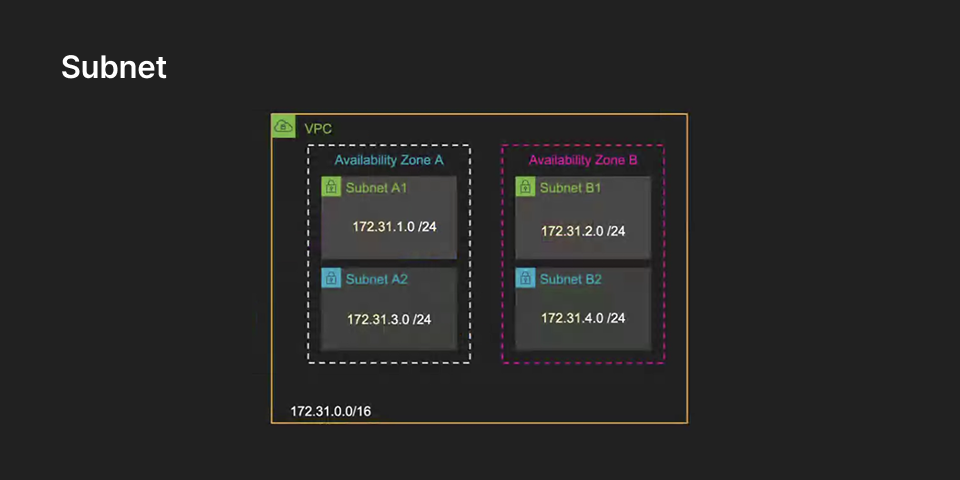

# VPC와 Subnet

## VPC (Virtual Private Cloud)

클라우드에서 제공하는 가상 네트워크 환경이다.  
실제 데이터센터 안에서 특정 공간을 `내 전용 네트워크`라고 가상으로 분리·지정하는 개념이다.

- 물리적(Physical): 실제 존재하는 서버, 스토리지, 네트워크 장비
- 논리적(Logical): 가상으로 정의된 네트워크 (VPC, Subnet, 보안 그룹 등)

💡 VPC를 통해 사용자는 네트워크 주소 범위, 서브넷, 라우팅, 게이트웨이 등을 직접 구성하며,  
마치 자기만의 데이터센터처럼 클라우드를 활용할 수 있다.

## Subnet

VPC 내부에서 IP 주소 대역을 쪼개어 만든 논리적 네트워크 단위다.

- 각 AZ 내부에 하나 이상의 Subnet을 생성 가능
- AZ 자체가 장애 격리를 제공하고, Subnet은 주소 공간을 나누는 역할 수행
- Subnet은 VPC CIDR 범위 안에서 IP 주소 집합을 관리

💡 쉽게 말해 IP 주소 공간을 층처럼 잘라 쓰는 것이며,  
Public Subnet(외부 인터넷 연결 가능)과 Private Subnet(내부 전용)으로 구분할 수 있다.

::: info 🧩 예시
VPC CIDR이 `10.0.0.0/16` 이라면

- Public Subnet → `10.0.1.0/24`
- Private Subnet → `10.0.2.0/24`

이처럼 큰 주소 공간을 잘라서 각 서브넷에 할당한다.
:::

 
<Comment/>
