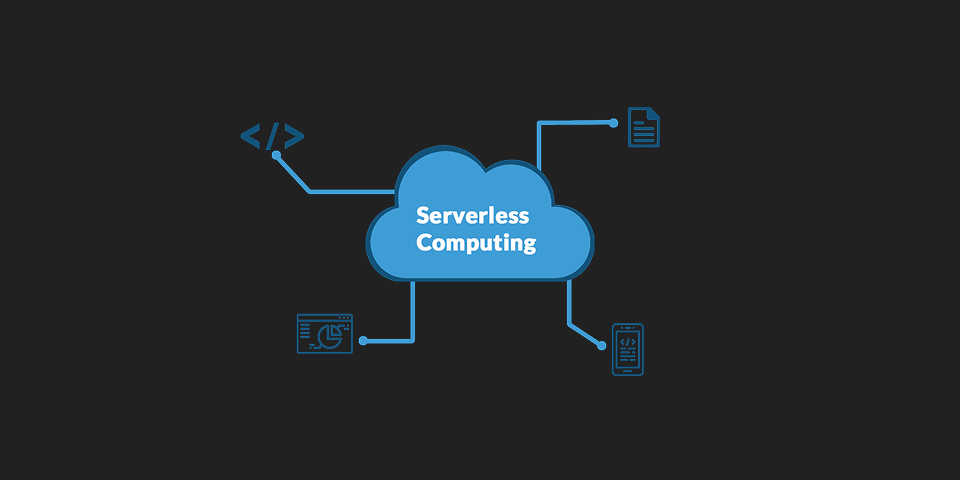

# Computing Models

## 클라우드에서의 컴퓨팅

클라우드에서 애플리케이션을 실행하는 방식은 다양하지만, 보통 3가지 주요 컴퓨팅 모델이 많이 쓰인다.

 

## 1. Virtual Server

물리적 서버를 가상화 기술로 여러 개의 독립된 서버처럼 나누어 사용

- 각 VM은 독립된 OS와 애플리케이션을 가짐
- 사용자가 직접 OS와 서버를 관리해야 함
- IaaS(서비스형 인프라)의 대표적인 형태

💡 특징: 무겁지만, 완전한 독립성을 제공 → 예: EC2

 

## 2. Container Server

- 애플리케이션과 필요한 실행 환경(코드, 라이브러리, 런타임)을 패키징하여 컨테이너로 실행
- 호스트 OS 커널을 공유하기 때문에 가상 머신보다 훨씬 가볍고 빠름
- 컨테이너 실행을 위해 Docker, Kubernetes 같은 오케스트레이션 도구 활용
- 사용자가 OS까지는 직접 관리

💡 특징: 가볍고 빠르며 이식성이 뛰어남 → 예: ECS, EKS

 

## 3. Serverless Computing

- 개발자가 서버 인프라를 직접 관리하지 않아도 애플리케이션 실행 가능
- 서버는 실제로 존재하지만, 클라우드 제공 업체가 관리
- 사용자는 코드만 작성하고, 실행 시간만큼 과금됨
- 자동 확장과 이벤트 기반 실행에 유리

💡 특징: 서버 관리 X, 코드 실행에만 집중 → 예: AWS Lambda

 

## Virtual Server vs Container vs Serverless

| 구분              | Virtual Server | Container Server        | Serverless               |
| ----------------- | -------------- | ----------------------- | ------------------------ |
| OS 관리           | 직접 관리      | 직접 관리 (공유 커널)   | 클라우드 업체가 관리     |
| 무게감            | 무거움         | 가벼움                  | 가장 가벼움              |
| 실행 단위         | VM (가상머신)  | 컨테이너                | 함수(Function) 단위 실행 |
| 확장성            | 수동 확장      | 자동화 도구로 확장 가능 | 자동 확장                |
| 예시 서비스 (AWS) | EC2            | ECS, EKS                | Lambda                   |

 
<Comment/>
