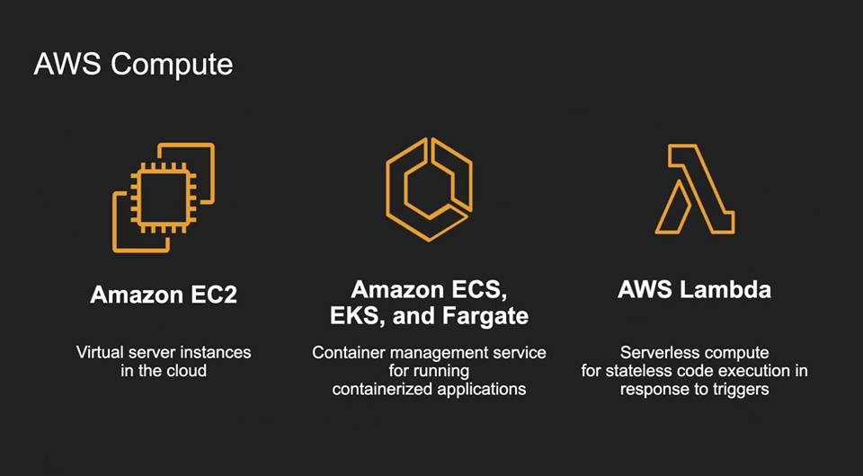
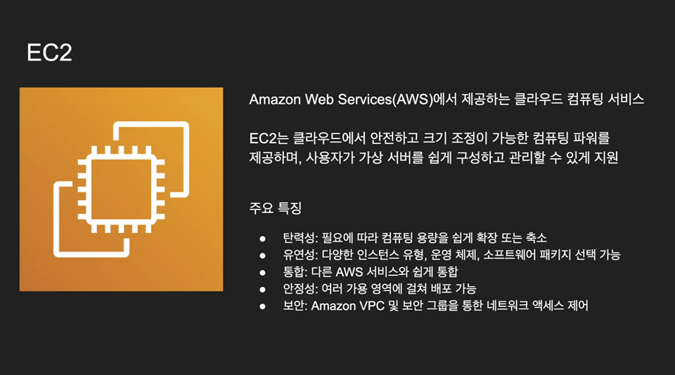
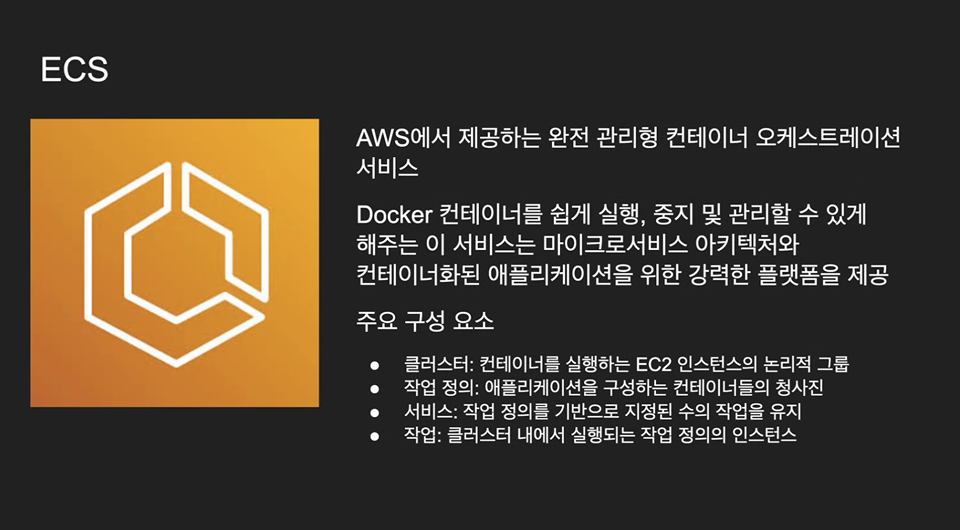
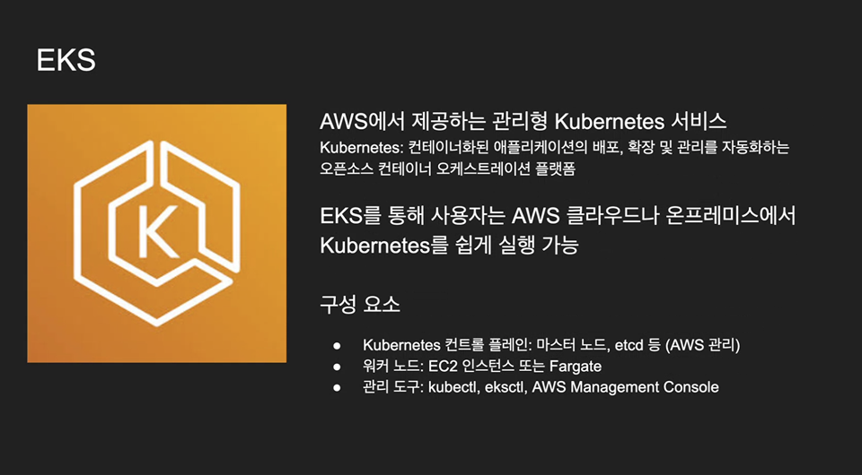
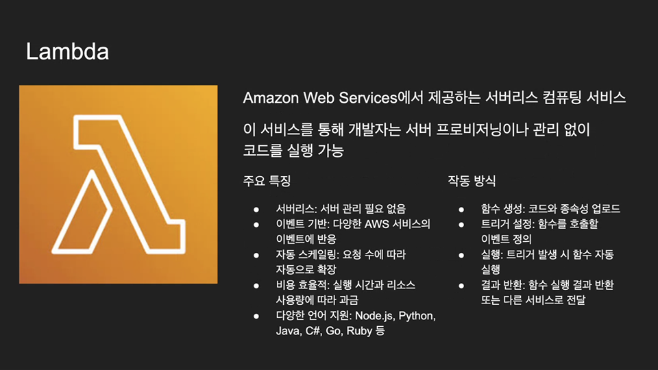

# AWS Compute

AWS의 컴퓨팅 리소스는 크게 가상 서버(EC2), 컨테이너(ECS/EKS/Fargate), 서버리스(Lambda)로 나눌 수 있다.

 

## EC2 (Virtual Server)

- 필요 시 컴퓨팅 리소스 확장/축소 가능 (탄력성)
- 다양한 인스턴스 유형 선택 가능
- 다른 AWS 서비스와 쉽게 통합
- VPC/보안 그룹으로 접근 제어

💡 전통적인 서버 운영 방식과 가장 유사. 사용자가 OS까지 관리해야 한다.

 

## ECS / EKS / Fargate (Container Service)

ECS: AWS 자체 컨테이너 오케스트레이션  
EKS: Kubernetes 기반 매니지드 서비스  
Fargate: 서버리스 컨테이너 실행 (서버 관리 X)

- 마이크로서비스 아키텍처에 적합
- 컨테이너 단위 배포/확장/관리 자동화
- VM보다 가볍고 빠름

💡 Virtual Server와 달리 OS 커널 공유 → 리소스 효율성 ↑

 

## Lambda (Serverless Computing)

- 서버 관리 필요 없음
- 이벤트 기반 실행 (트리거 발생 시 함수 실행)
- 자동 스케일링
- 사용한 만큼 비용 지불

💡 서버는 실제로 존재하지만, 관리 책임은 AWS가 맡음 → 개발자는 코드만 집중

 

## 정리

| 방식           | 관리 주체      | 특징                       | 예시 서비스     |
| -------------- | -------------- | -------------------------- | --------------- |
| Virtual Server | 사용자가 직접  | OS/미들웨어까지 관리 필요  | EC2             |
| Container      | 일부 관리 분리 | 가볍고, 컨테이너 단위 배포 | ECS/EKS/Fargate |
| Serverless     | AWS가 관리     | 코드만 작성하면 자동 실행  | Lambda          |

 
<Comment/>
