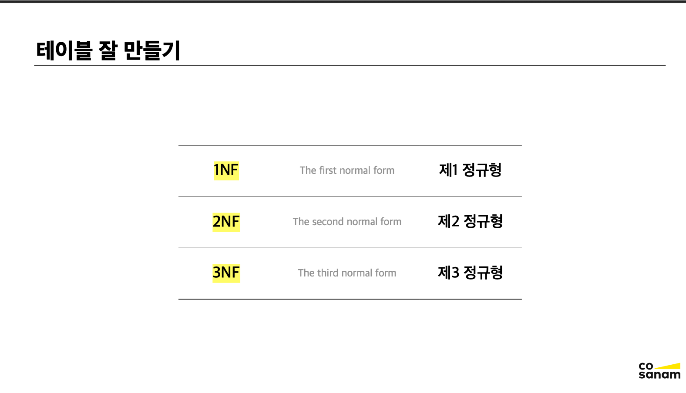
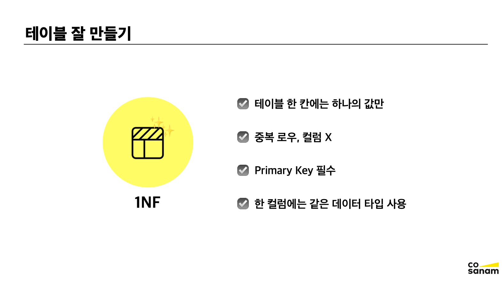
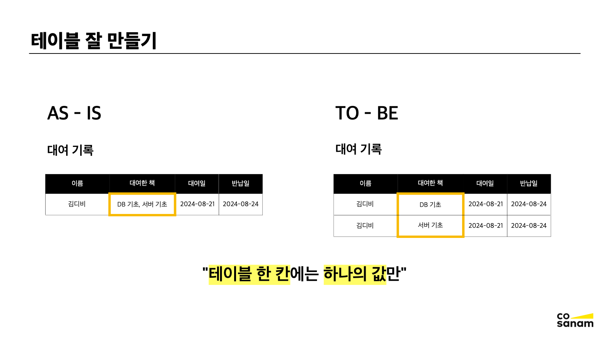
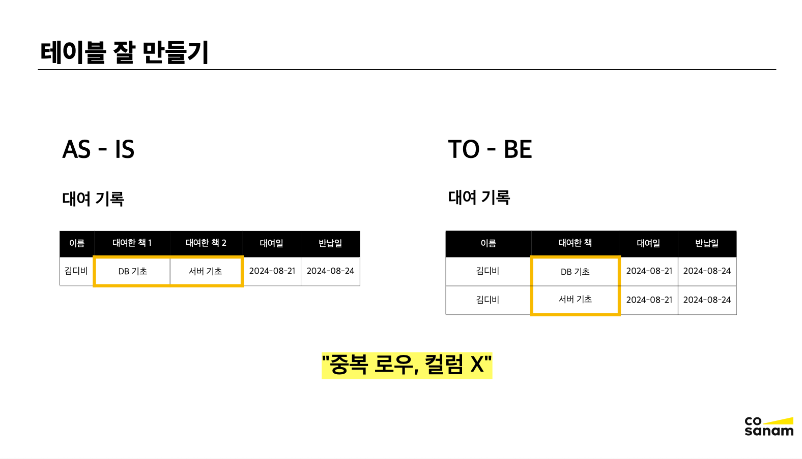
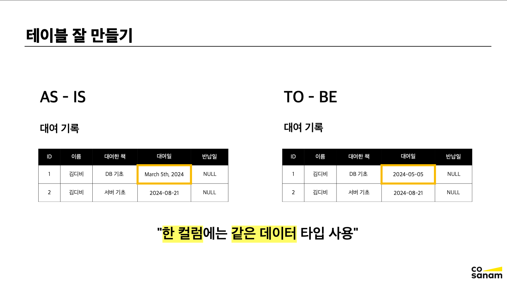
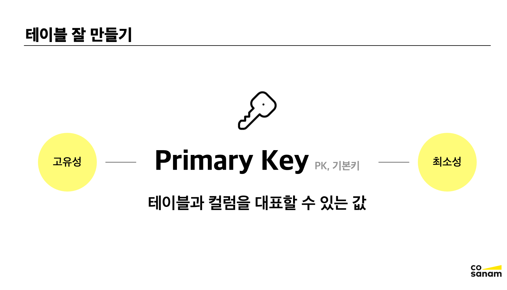
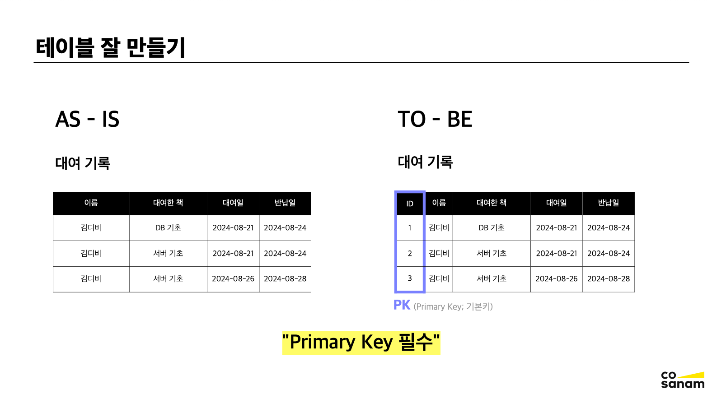
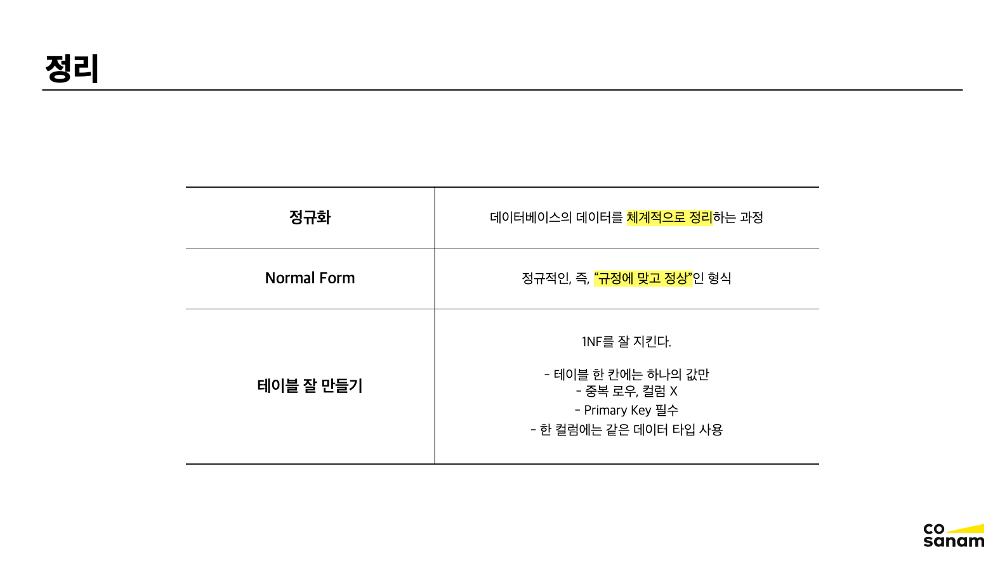

# 데이터 모델링 기초

## 테이블 만들기 (1NF)

#### 정규화 Normalization

정규화란 데이터베이스의 데이터를 체계적으로 정리하는 과정이다.

#### 정규 형식 Normal form

정규적인, 즉 규정에 맞고 정상인 형식

### 정규화 장점

- 데이터 중복 제거
- 데이터 무결성 준수
- 이상 현상 방지

 

### 1NF 제1 정규형

제1 정규형은 테이블을 어떻게 잘 구성하는 지에 대한 내용이기 때문에, 준수하는 것이 좋다.

 

 

### 정리

