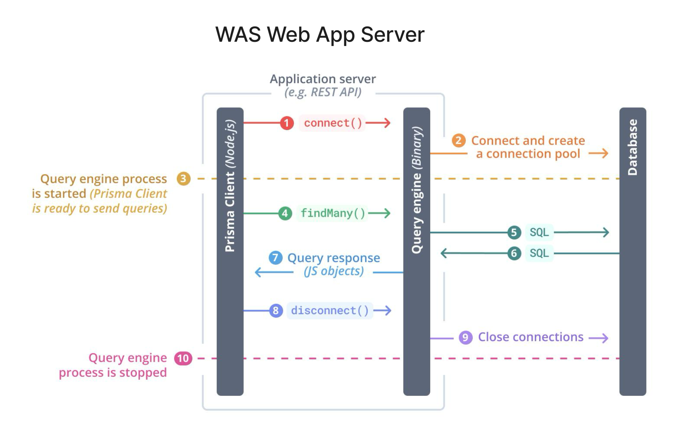
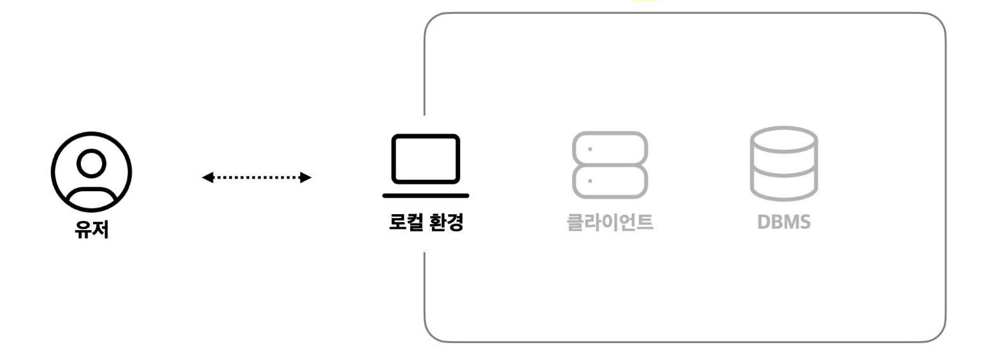
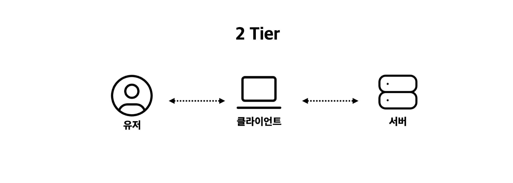
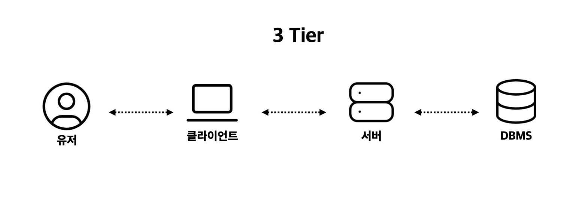

# 서버와 데이터베이스

서버와 데이터베이스는 현대 애플리케이션의 핵심 요소이다.  
서버는 클라이언트의 요청을 처리하고, 데이터베이스는 그 결과를 저장·조회한다.
이 두 요소는 애플리케이션에서 핵심적으로 연결되며, 어떻게 연결·구조화하느냐에 따라 개발 생산성과 서비스 안정성이 달라진다.

 

## ORM

ORM(Object-Relational Mapping)은 객체 지향 프로그래밍 언어에서 사용하는 객체와 관계형 데이터베이스의 테이블을 매핑해주는 기술이다.  
즉, 개발자가 SQL문을 직접 작성하지 않고도, 프로그래밍 언어의 객체(클래스, 인스턴스)를 통해 데이터베이스 조작을 가능하게 한다.

### ORM을 사용하는 이유

1. 생산성 향상

- SQL을 일일이 작성하지 않아도 되므로 코드가 간결해지고 개발 속도가 빨라진다.
- CRUD(Create, Read, Update, Delete) 작업을 메서드 호출로 간단히 처리할 수 있다.

2. 유지보수 용이성

- 비즈니스 로직을 객체 지향 코드로만 작성하면 되므로, DB 구조가 변경되더라도 ORM이 이를 추상화해서 관리한다.
- SQL 쿼리를 흩어 관리하지 않아도 되기 때문에 코드 유지가 쉽다.

3. DB 독립성 확보

- ORM은 다양한 데이터베이스를 지원한다.
- MySQL에서 PostgreSQL로 바꾸더라도 ORM 설정만 변경하면 코드 대부분을 그대로 활용할 수 있다.

4. 객체 지향 패러다임 일관성

- 애플리케이션 로직을 전부 객체 지향적으로 작성 가능하다.
- 개발자가 SQL과 객체 지향 사이를 번역하는 수고를 줄일 수 있다.

 

### ORM 단점 및 주의사항

1. 복잡한 쿼리 처리 어려움

- JOIN, 집계 같은 고급 SQL은 ORM만으로는 비효율적일 수 있다.

2. 성능 문제

- ORM이 자동으로 생성하는 SQL이 최적화가 덜 되어 있을 때가 있다.

3. 학습 곡선

- ORM 자체 개념과 문법을 배우는 비용이 필요하다.

💡 ORM은 단순한 CRUD에는 유용하지만, 복잡한 쿼리는 SQL과 병행하는 것이 바람직하다.

 

### ORM 동작 흐름 예시 (Prisma)

ORM은 객체 지향 코드와 관계형 데이터베이스(SQL) 사이의 불일치를 해소하는 도구다.  
아래 그림은 Prisma라는 Node.js 기반의 ORM이 실제로 어떻게 DB와 통신하는지를 보여준다.

`Prisma ORM 동작 흐름`  
: 애플리케이션에서 Prisma Client를 호출하면, Query Engine이 SQL로 변환하여 DB와 통신하고 결과를 다시 객체로 반환한다.

 

#### Prisma란?

Prisma는 Node.js와 TypeScript에서 널리 사용되는 현대적인 ORM이다.  
전통적인 ORM과 달리, 다음과 같은 특징이 있다:

1. 타입 안전성(Type-safety)  
   TypeScript와 긴밀하게 연동되어, 잘못된 필드 접근 시 컴파일 단계에서 오류를 잡아준다.

2. 자동 완성 지원  
   Prisma Client가 스키마를 기반으로 생성되므로, IDE에서 자동 완성 기능을 제공한다.

3. Query Engine 기반  
   내부적으로 바이너리 Query Engine이 동작해 SQL 최적화와 연결 관리를 담당한다.

4. 데이터베이스 독립성  
   MySQL, PostgreSQL, SQLite, MongoDB 등 다양한 DB를 지원하며, DB 교체 시 코드 변경을 최소화할 수 있다.

 

## Service Architecture

애플리케이션이 동작하는 방식은 서비스 아키텍처(Architecture)에 따라 크게 달라진다.  
특히 1-Tier, 2-Tier, 3-Tier 구조는 가장 기본적이고, 지금까지 이어져 온 아키텍처의 발전 단계를 보여준다.

 

### 1-Tier Architecture

1-Tier 아키텍처는 모든 요소(사용자 인터페이스, 비즈니스 로직, 데이터 관리)가 하나의 시스템 안에  
포함된 구조이다. 대표적으로 데스크톱 애플리케이션이나 간단한 로컬 프로그램이 여기에 해당한다.

- 장점: 구조가 단순하고 빠르게 개발 가능
- 단점: 확장성이 부족하고, 여러 사용자가 동시에 접근하기 어려움

 

### 2-Tier Architecture

2-Tier 아키텍처는 클라이언트와 데이터베이스가 직접 연결되는 구조다.  
클라이언트 애플리케이션에서 DB에 직접 SQL을 날려 데이터를 읽고 쓴다.  
대표적으로 클라이언트–서버 구조의 초기 애플리케이션이 해당된다.

- 장점: 구현이 단순하고 성능이 빠름
- 단점: 클라이언트 수가 많아지면 DB 부하 증가, 보안 취약, 비즈니스 로직 분리가 어려움

 

### 3-Tier Architecture

3-Tier 아키텍처는 `프레젠테이션(클라이언트) – 애플리케이션 서버 – 데이터베이스` 세 계층으로 분리된 구조다.
클라이언트는 서버(API)를 통해서만 DB와 통신하며, 서버는 비즈니스 로직과 데이터 처리를 담당한다.  
현대의 웹 서비스, 모바일 서비스 대부분이 이 구조를 따른다.

- 장점: 보안 강화, 유지보수 용이, 확장성과 재사용성이 뛰어남
- 단점: 구조가 복잡해지고 초기 개발 비용이 큼

 

### 3-Tier 이후 발전 구조

3-Tier 아키텍처는 현대 서비스의 기본 구조이고, 여기서 더 나아가 Microservices나 Serverless 아키텍처로 발전해왔다.

- N-Tier Architecture: 로직을 더 세분화 (API Gateway, Microservices 등).
- Microservices Architecture: 각 기능을 독립 서비스로 쪼개어 운영, 클라우드/컨테이너 환경에서 많이 사용.
- Serverless: 서버 관리 없이 클라우드 함수 단위로 DB와 연결.

 

### 아키텍처 비교

| 구분       | 구조                      | 장점                        | 단점                         | 사용 예시            |
| ---------- | ------------------------- | --------------------------- | ---------------------------- | -------------------- |
| **1-Tier** | 모든 기능이 하나의 시스템 | 단순, 빠른 개발             | 확장성 부족, 유지보수 어려움 | 로컬 PC 프로그램     |
| **2-Tier** | 클라이언트 ↔ DB 직접 연결 | 구현 단순, 빠른 성능        | 보안 취약, DB 부하 집중      | 기업 내부용 프로그램 |
| **3-Tier** | 클라이언트 ↔ 서버 ↔ DB    | 보안, 유지보수, 확장성 우수 | 구조 복잡, 비용 증가         | 웹 서비스, 모바일 앱 |
