# Cloud

## 클라우드란?

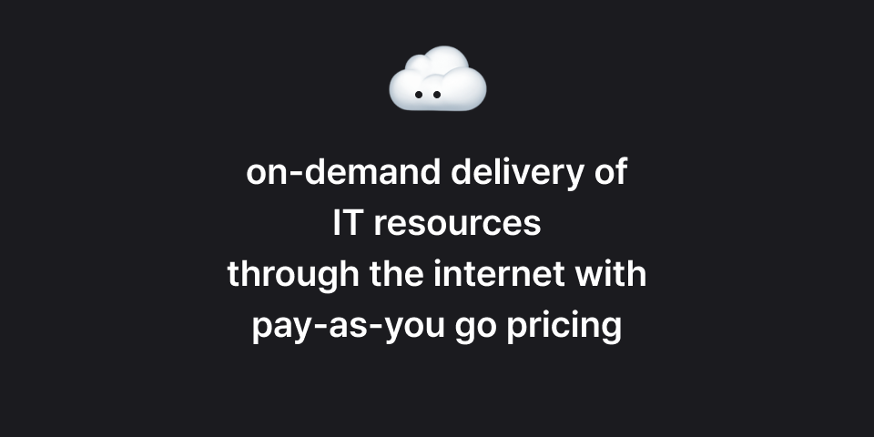
<small>클라우드란, 인터넷을 통해 필요할 때마다 IT 자원을 제공하고, 사용한 만큼 비용을 지불하는 서비스 모델이다.</small>

클라우드(Cloud)는 `컴퓨터로 할 수 있는 모든 것`을 인터넷을 통해 필요할 때마다 빌려 쓰는 서비스다.  
사용자는 서버, 스토리지, 데이터베이스, 네트워크 같은 IT 자원을 직접 구매·설치하지 않고, 쓴 만큼 비용을 지불하는 방식으로 이용할 수 있다.

## 인프라란?

클라우드의 기반은 결국 인프라(Infrastructure)다.  
인프라란 애플리케이션이나 워크로드가 동작할 수 있도록 받쳐주는 토대를 의마한다.

- 안전성: 가장 높은 보안 수준을 바탕으로 서비스 제공
- 확장성: 사용량이 늘어나도 유연하게 확장 가능
- 신뢰성: 전 세계 어디에서 접속해도 같은 가용성과 접근성을 보장
- 글로벌: AWS는 200개 이상의 서비스와 전 세계 데이터 센터 네트워크를 통해 제공

## Infrastructure Hardware

과거에는 서비스를 운영하기 위해 직접 데이터 센터를 구축해야 했고, 다양한 하드웨어 장비가 필요했다.

| 데이터센터를 구성하는 장비 | 설명                                                                          |
| -------------------------- | ----------------------------------------------------------------------------- |
| **서버 장비**              | 주로 랙 마운트 서버 같은 실제 컴퓨팅 장비                                     |
| **스토리지 장비**          | DAS / NAS / SAN 같이 데이터를 저장하는 장치                                   |
| **네트워크 장비**          | 라우터, 스위치, 로드밸런서 등 네트워크 트래픽을 관리하는 장비                 |
| **네트워크 인프라 장비**   | 케이블(광섬유, 이더넷), WAP(무선 AP), NIC 등 네트워크 연결에 필요한 물리 장비 |
| **엔드포인트 장비**        | 사용자 단말기: VDI, 노트북, 데스크탑                                          |
| **보안 장비**              | 방화벽, IPS(침입 방지 시스템)                                                 |
| **백업 장비**              | 테이프 라이브러리 같은 백업 저장 장치                                         |
| **전원 장비**              | 발전기, PDU(전원 분배 장치), UPS(무정전 전원 장치)                            |
| **냉각 장비**              | 냉각탑, HVAC 같은 데이터센터 냉각 시스템                                      |

💡 하지만 클라우드 서비스는 이런 물리적 인프라를 사용자가 직접 구매·운영하지 않아도 되도록 서비스 형태로 제공 한다. (IaaS, Infrastructure as a Service, 서비스형 인프라)

## 서비스 동작의 4계층 구조

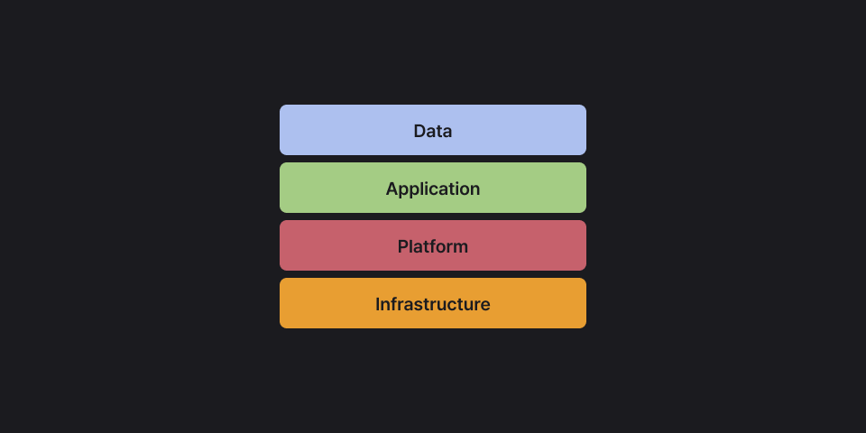

서비스는 단순히 애플리케이션 코드만으로 동작하지 않는다.  
아래와 같은 4계층 구조 위에서 작동한다.

- Infrastructure: 서버, 네트워크, 스토리지 같은 물리적 기반
- Platform: OS, 미들웨어, 런타임 환경, 데이터베이스 등
- Application: 실제 사용자와 상호작용하는 프로그램 (웹·모바일 앱 등)
- Data: 애플리케이션에서 활용되는 정보 (사용자 정보, 로그, 파일 등)

::: info 💡 데이터가 애플리케이션에서 활용되기 위해서는, 그 밑단에 플랫폼과 인프라가 반드시 필요하다.
클라우드는 이 인프라와 플랫폼을 대신 관리해 주기 때문에, 사용자는 애플리케이션과 데이터 개발에만 집중할 수 있다.
:::

## 클라우드의 특징

- Agility (민첩성): 필요한 자원을 즉시 할당하거나 해제할 수 있어 개발·배포 속도가 빨라진다.
- Elasticity (탄력성): 사용량에 따라 자동 확장/축소가 가능해, 트래픽 급증에도 안정적으로 대응한다.
- Cost savings (비용 절감): 초기 하드웨어 투자 비용 없이, 사용한 만큼만 지불한다.

## 클라우드 네트워크 구조

클라우드 서비스는 단순히 서버만 제공하는 것이 아니라, 안정적인 네트워크 연결 구조를 통해 서비스가 운영된다.

### 서버의 존재 이유

- 클라우드 서버는 물리적 데이터센터에 존재한다.
- AWS는 데이터센터 여러 개를 묶어 AZ(Availability Zone, 가용 영역) 이라 부른다.
- 여러 AZ가 모여 하나의 Region을 형성한다.
- 이를 통해 서비스는 장애 대비와 백업/복구가 가능하다.

### AWS Availability Zone(AZ) 설계 특징

- 하나 이상의 데이터 센터로 구성된 독립적 인프라
- 최대 100km 이내 간격 유지 (재해 분리와 네트워크 지연 최소화)
- 고유한 전력 인프라 보유
- 대규모(100K급) 서버 운영
- 중복된 메트로 파이버 네트워크로 연결
- 높은 처리량과 낮은 지연(latency) 보장

## AWS Region과 글로벌 인프라

클라우드는 단일 데이터센터로 끝나지 않는다.  
AWS는 `AZ(가용 영역) → Region(리전) → Global Network`의 계층적 구조를 통해 안정성과 확장성을 보장한다.

### Region

- 여러 개의 AZ(보통 3개 이상)로 구성된 지리적 단위
- 서울 `ap-northeast-2`, 버지니아 `us-east-1`. 이처럼 리전은 코드와 이름으로 구분되며, 서비스별로 지원 리전이 다를 수 있다.

### Global Infrastructure

- 전 세계 수십 개 리전과 수백 개 AZ 운영
- `AWS Global Backbone`으로 리전 간 연결
- 어디서든 낮은 지연 보장

::: info 💡 정리

- 데이터센터 → 실제 물리적 서버 건물
- AZ → 데이터센터 묶음 (장애 격리 단위)
- Region → 여러 AZ 묶음 (지리적 단위)
- Global Infra → 전 세계 리전들을 잇는 네트워크

:::

### 네트워크의 존재 이유

- 클라우드 자원은 데이터센터 내부에서만 쓰이지 않는다.
- 인터넷을 통해 전 세계 사용자와 연결되어야 하며, 이를 안전하고 빠르게 이어주는 것이 네트워크다.
- 이 네트워크 위에서 `VPC`와 `Subnet` 같은 가상 네트워크 기술이 동작한다.

 

## VPC (Virtual Private Cloud)

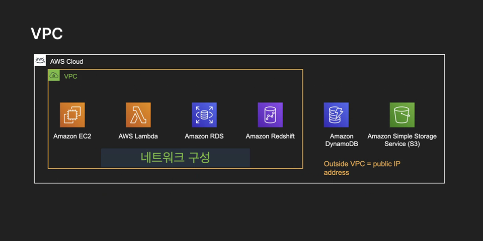

클라우드에서 제공하는 가상 네트워크 환경이다.  
실제 데이터센터 안에서 특정 공간을 `내 전용 네트워크`라고 가상으로 분리·지정하는 개념이다.

- 물리적(Physical): 실제 존재하는 서버, 스토리지, 네트워크 장비
- 논리적(Logical): 가상으로 정의된 네트워크 (VPC, Subnet, 보안 그룹 등)

💡 VPC를 통해 사용자는 네트워크 주소 범위, 서브넷, 라우팅, 게이트웨이 등을 직접 구성하며,  
마치 자기만의 데이터센터처럼 클라우드를 활용할 수 있다.

## Subnet

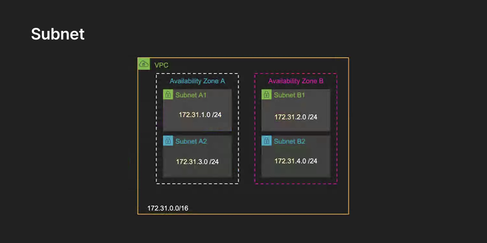

VPC 내부에서 IP 주소 대역을 쪼개어 만든 논리적 네트워크 단위다.

- 각 AZ 내부에 하나 이상의 Subnet을 생성 가능
- AZ 자체가 장애 격리를 제공하고, Subnet은 주소 공간을 나누는 역할 수행
- Subnet은 VPC CIDR 범위 안에서 IP 주소 집합을 관리

💡 쉽게 말해 IP 주소 공간을 층처럼 잘라 쓰는 것이며,  
Public Subnet(외부 인터넷 연결 가능)과 Private Subnet(내부 전용)으로 구분할 수 있다.

::: info 🧩 예시
VPC CIDR이 `10.0.0.0/16` 이라면

- Public Subnet → `10.0.1.0/24`
- Private Subnet → `10.0.2.0/24`

이처럼 큰 주소 공간을 잘라서 각 서브넷에 할당한다.
:::

## 클라우드에서의 컴퓨팅

클라우드에서 애플리케이션을 실행하는 방식은 다양하지만, 보통 3가지 주요 컴퓨팅 모델이 많이 쓰인다.

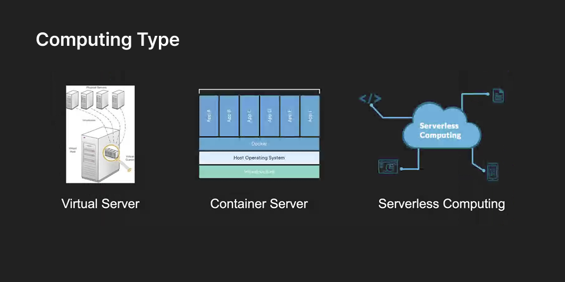

 

### 1. Virtual Server

물리적 서버를 가상화 기술로 여러 개의 독립된 서버처럼 나누어 사용

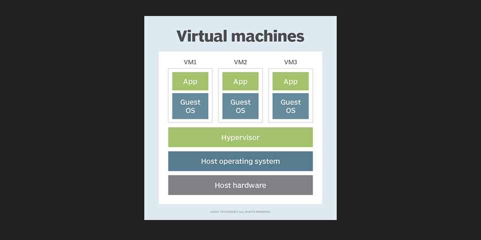

- 각 VM은 독립된 OS와 애플리케이션을 가짐
- 사용자가 직접 OS와 서버를 관리해야 함
- IaaS(서비스형 인프라)의 대표적인 형태

💡 특징: 무겁지만, 완전한 독립성을 제공 → 예: EC2

 

### 2. Container Server

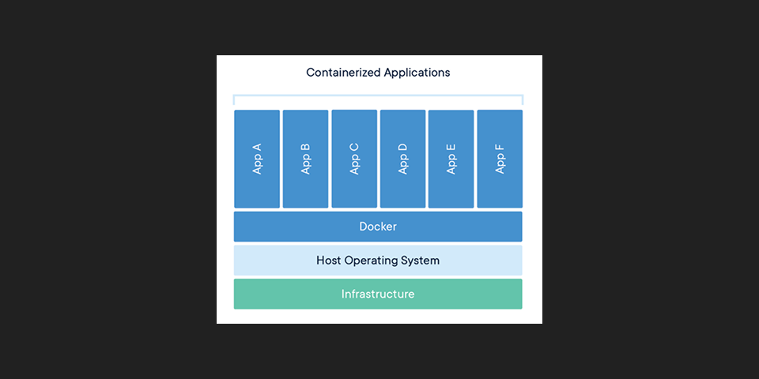

- 애플리케이션과 필요한 실행 환경(코드, 라이브러리, 런타임)을 패키징하여 컨테이너로 실행
- 호스트 OS 커널을 공유하기 때문에 가상 머신보다 훨씬 가볍고 빠름
- 컨테이너 실행을 위해 Docker, Kubernetes 같은 오케스트레이션 도구 활용
- 사용자가 OS까지는 직접 관리

💡 특징: 가볍고 빠르며 이식성이 뛰어남 → 예: ECS, EKS

 

### 3. Serverless Computing

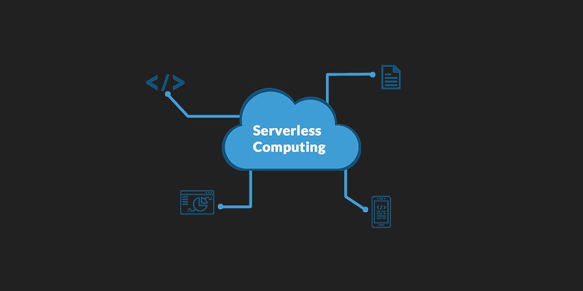

- 개발자가 서버 인프라를 직접 관리하지 않아도 애플리케이션 실행 가능
- 서버는 실제로 존재하지만, 클라우드 제공 업체가 관리
- 사용자는 코드만 작성하고, 실행 시간만큼 과금됨
- 자동 확장과 이벤트 기반 실행에 유리

💡 특징: 서버 관리 X, 코드 실행에만 집중 → 예: AWS Lambda

 

### Virtual Server vs Container vs Serverless

| 구분              | Virtual Server | Container Server        | Serverless               |
| ----------------- | -------------- | ----------------------- | ------------------------ |
| OS 관리           | 직접 관리      | 직접 관리 (공유 커널)   | 클라우드 업체가 관리     |
| 무게감            | 무거움         | 가벼움                  | 가장 가벼움              |
| 실행 단위         | VM (가상머신)  | 컨테이너                | 함수(Function) 단위 실행 |
| 확장성            | 수동 확장      | 자동화 도구로 확장 가능 | 자동 확장                |
| 예시 서비스 (AWS) | EC2            | ECS, EKS                | Lambda                   |

 

## AWS Compute

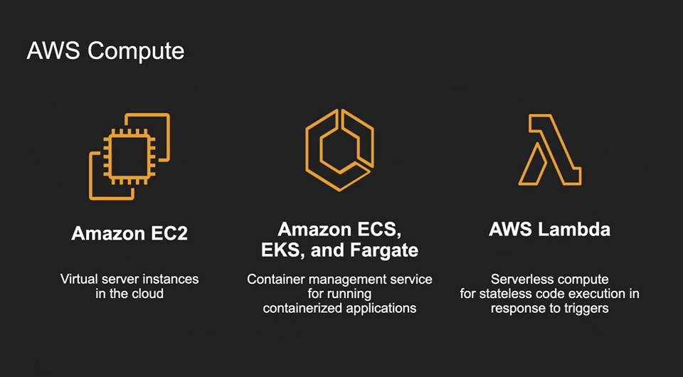

AWS의 컴퓨팅 리소스는 크게 가상 서버(EC2), 컨테이너(ECS/EKS/Fargate), 서버리스(Lambda)로 나눌 수 있다.

 

### EC2 (Virtual Server)

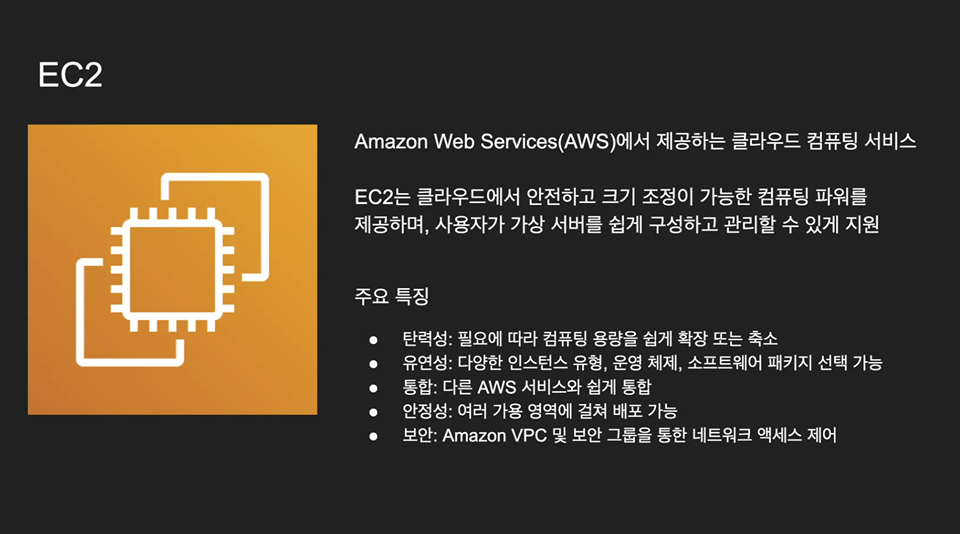

- 필요 시 컴퓨팅 리소스 확장/축소 가능 (탄력성)
- 다양한 인스턴스 유형 선택 가능
- 다른 AWS 서비스와 쉽게 통합
- VPC/보안 그룹으로 접근 제어

💡 전통적인 서버 운영 방식과 가장 유사. 사용자가 OS까지 관리해야 한다.

 

### ECS / EKS / Fargate (Container Service)

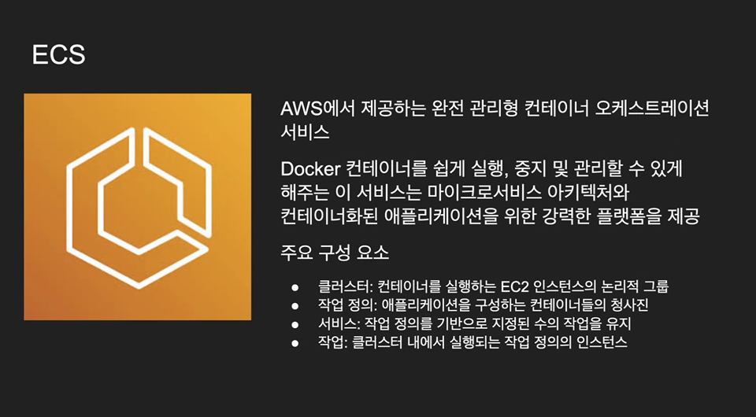

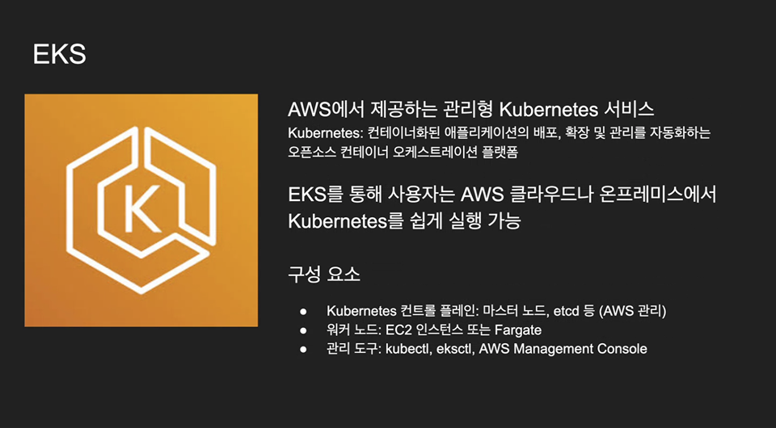

ECS: AWS 자체 컨테이너 오케스트레이션  
EKS: Kubernetes 기반 매니지드 서비스  
Fargate: 서버리스 컨테이너 실행 (서버 관리 X)

- 마이크로서비스 아키텍처에 적합
- 컨테이너 단위 배포/확장/관리 자동화
- VM보다 가볍고 빠름

💡 Virtual Server와 달리 OS 커널 공유 → 리소스 효율성 ↑

 

### Lambda (Serverless Computing)

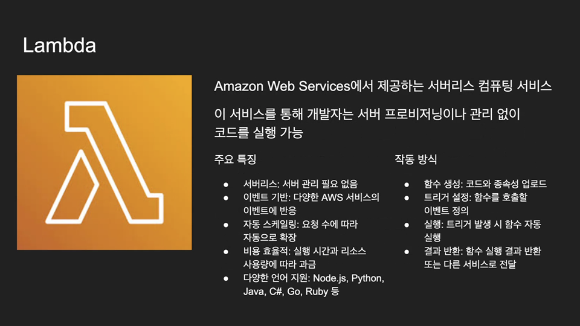

- 서버 관리 필요 없음
- 이벤트 기반 실행 (트리거 발생 시 함수 실행)
- 자동 스케일링
- 사용한 만큼 비용 지불

💡 서버는 실제로 존재하지만, 관리 책임은 AWS가 맡음 → 개발자는 코드만 집중

 

### 정리

| 방식           | 관리 주체      | 특징                       | 예시 서비스     |
| -------------- | -------------- | -------------------------- | --------------- |
| Virtual Server | 사용자가 직접  | OS/미들웨어까지 관리 필요  | EC2             |
| Container      | 일부 관리 분리 | 가볍고, 컨테이너 단위 배포 | ECS/EKS/Fargate |
| Serverless     | AWS가 관리     | 코드만 작성하면 자동 실행  | Lambda          |

 

 
<Comment/>
