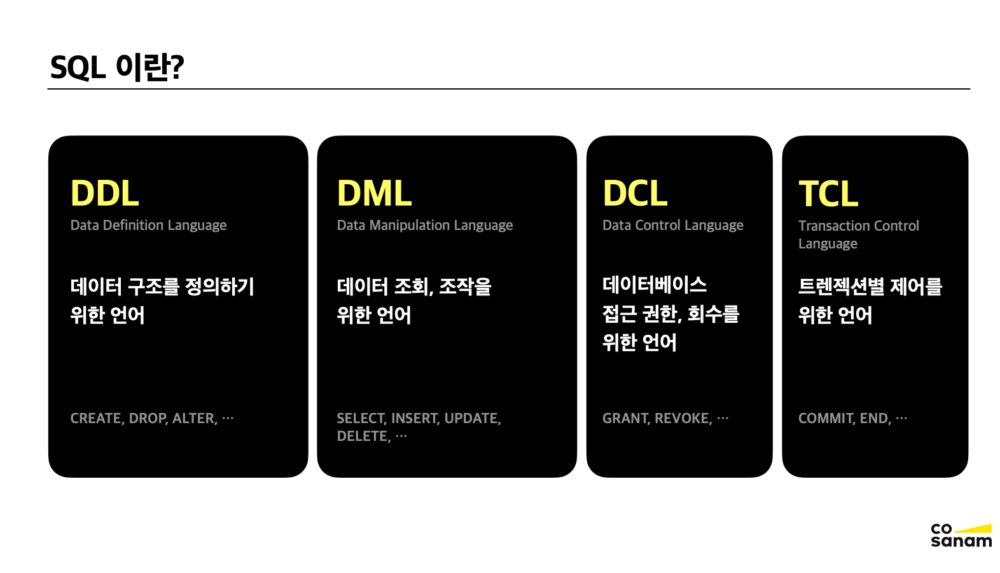
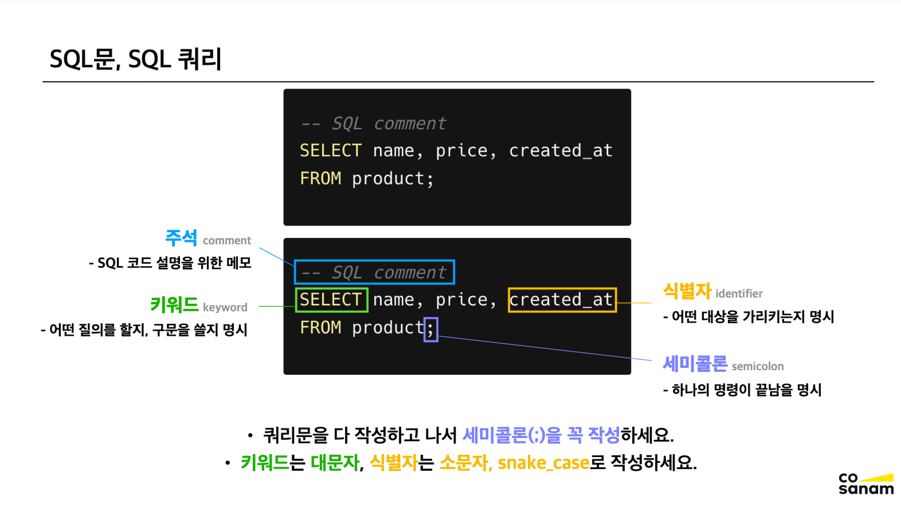
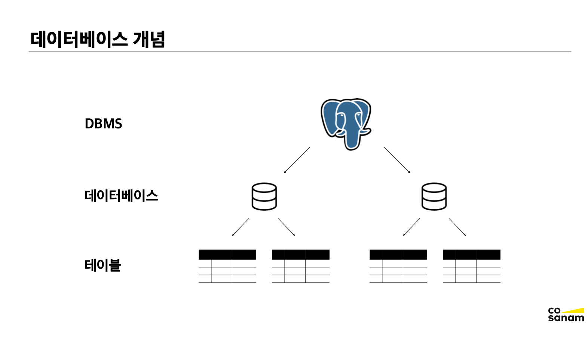
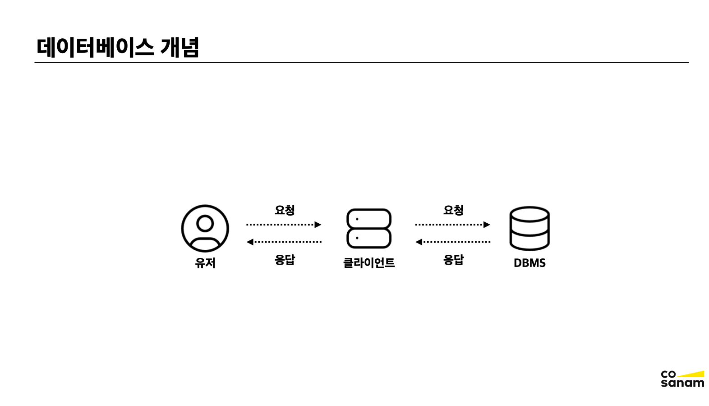
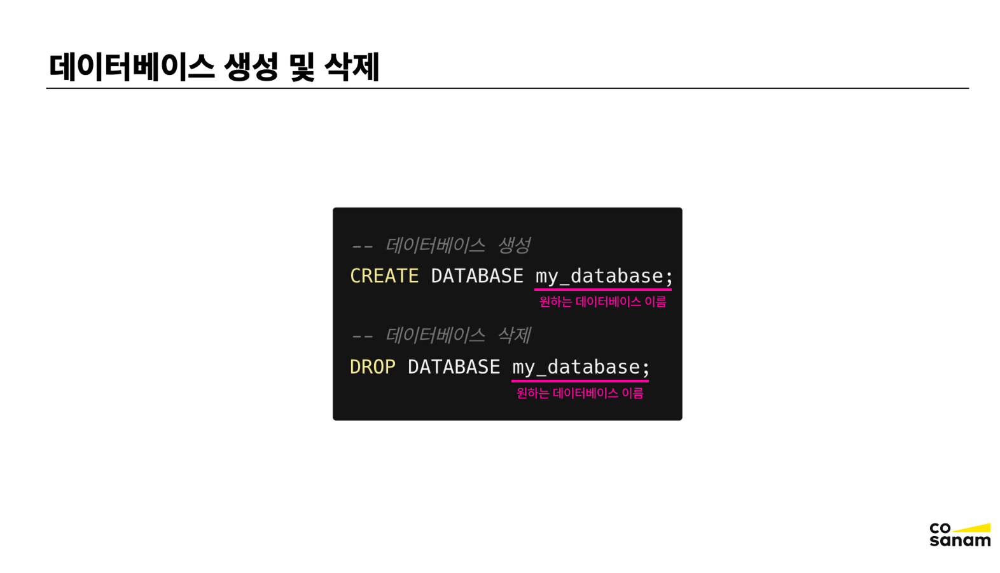
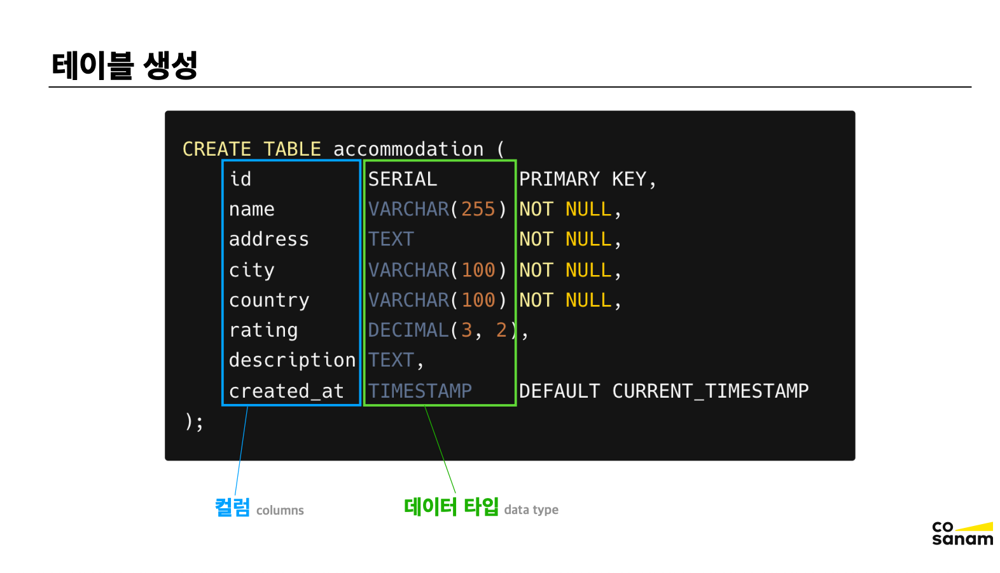
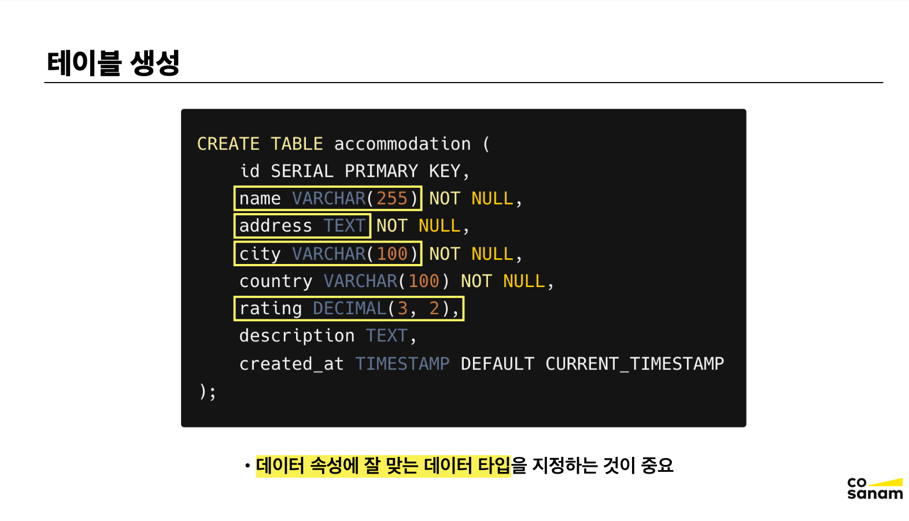
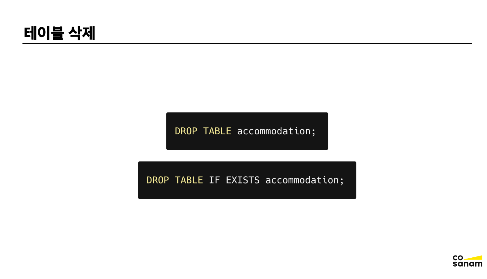
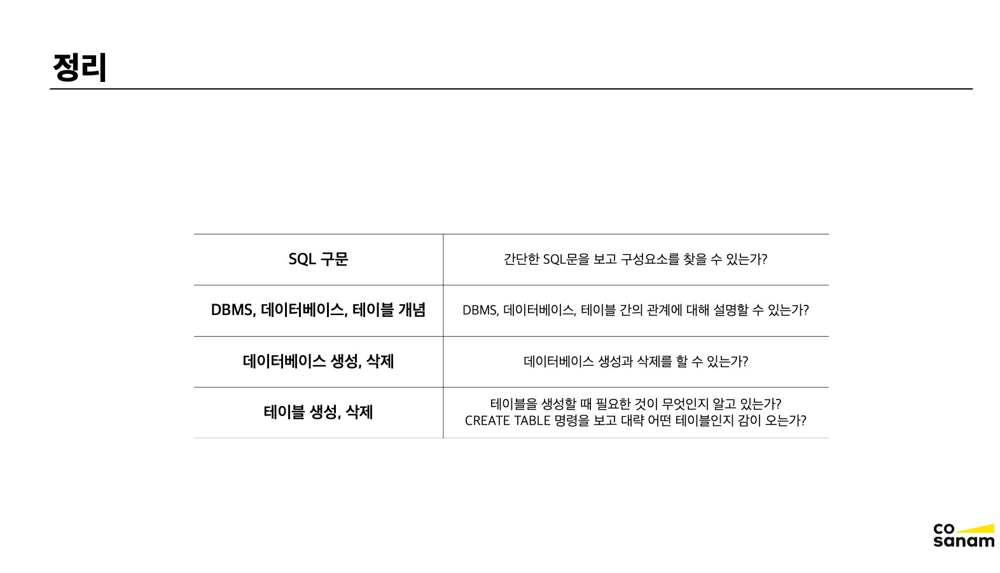

# SQL 기초

## SQL이란?

SQL (Structured Query Language)이란, 관계형 데이터베이스의 데이터를 다루는 언어이다.
대부분 RDBMS에서 SQL로 데이터 정의 및 관리를 한다.

 

## SQL 구문

### SQL 문, SQL 쿼리

SQL 코드 요소: 주석 / 키워드 / 식별자 / 세미콜론

 

### 데이터베이스 개념

- DBMS는 여러 데이터베이스를 가질 수 있다. 각자 다른 애플리케이션에 대해서 데이터베이스를 만들 수 있고, 하나의 애플리케이션에대 한 여러 데이터베이스를 만들 수도 있다.
- 데이터베이스는 여러 개의 테이블을 가질 수 있다.

 

- 테이블의 생성 삭제 등이 모두 SQL문으로 가능하다.
- 유저가 클라이언트를 통해 SQL 쿼리를 보내면, 그에 맞게 DBMS는 쿼리를 처리하고 응답한다.

 

### 데이터베이스 생성 및 삭제

### 테이블 생성

- 컬럼명과 컬럼의 데이터 타입을 지정해야 한다.

 

### 테이블 삭제

- DROP TABLE: 테이블 삭제 명령어, 테이블이 없다면 SQL 실행 시 에러가 발생한다.
- IF EXISTS 파라미터를 붙여서, 테이블이 없는 경우 해당 명령문을 실행하지 않을 수도 있다.

 

### 정리

 

 

 
<Comment/>
