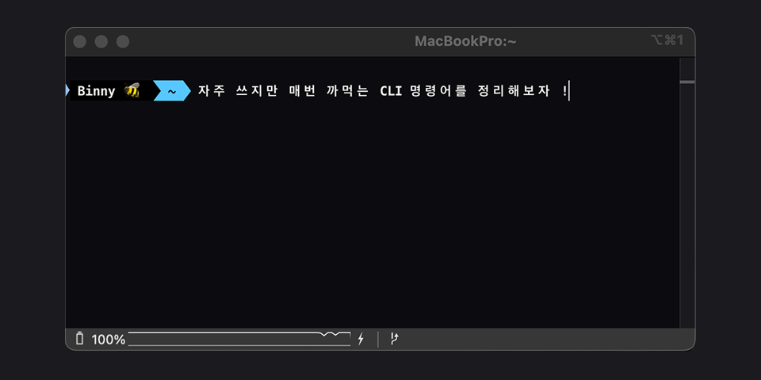

# CLI Cheatsheet <small>for me.. 🐣</small>



## 📍 Navigation & Path

> 디렉토리 이동, 위치 확인 등 자주 쓰는 명령어

```bash
# 현재 위치 확인
$ pwd
```

```bash
# 상위 폴더로 이동
$ cd ..
```

```bash
# 홈 디렉토리로 이동
$ cd ~
```

```bash
# 현재 디렉터리에서 파일 탐색기 열기 (Mac 전용)
$ open .
```

```bash
# 현재 디렉터리에서 VS Code 열기 (VS Code 설치 필요)
$ code .
```

```bash
# VS Code 특정 파일만 열기 (기본: 새 창 열림)
$ code 파일명
```

```bash
# 현재 열린 VS Code 창에서 열기 (새 창 안 뜸)
$ code -r 파일명
```

```bash
# 현재 경로의 상위 내용까지 포함해 트리 형태로 보기 (depth 조절 가능)
$ tree -L 1
```

## 📂 File & Directory

```bash
# 현재 디렉터리 목록
$ ls
```

```bash
# 디렉터리 이동
$ cd 디렉터리명
```

```bash
# 새 파일 생성
$ touch 파일명
```

```bash
# 새 폴더 생성
$ mkdir 폴더명
```

```bash
# 파일 삭제
$ rm 파일명
```

```bash
# 폴더 및 그 안의 모든 내용 삭제
$ rm -rf 폴더명
```

- ⚠️ rm -rf는 되돌릴 수 없으니 정말 조심해서 사용

## 🔧 Git Essentials

```bash
# 변경사항 확인
$ git status
```

```bash
# 현재 디렉터리 내의 모든 변경 파일 스테이징 영역에 추가
$ git add .
```

```bash
# 특정 파일 하나만 스테이징
$ git add 파일명

# 특정 폴더 내의 변경 파일만 스테이징
$ git add 디렉터리명/

# 전체 변경 파일 + 삭제된 파일 포함해서 스테이징
$ git add -A
```

```bash
# 커밋 생성
$ git commit -m "메시지"
```

```bash
# 원격 저장소로 커밋 내용 푸시
$ git push
```

```bash
# 간략 로그 보기
$ git log --oneline
```

```bash
# 커밋 하나 취소
$ git reset --hard HEAD~1
```

```bash
# 수정한 파일을 커밋 없이 되돌리기 (수정 전 상태로 복구)
$ git restore 파일명
```

```bash
# 스테이징된 파일을 스테이징 해제
$ git reset 파일명
```

```bash
# 가장 최근 커밋 메시지만 수정
$ git commit --amend -m "수정된 메시지"
```

```bash
# 나중에 push 안하고 git log만 봤을 때 유용
$ git log --oneline
```

```bash
# 현재 브랜치 확인
$ git branch
```

```bash
# 브랜치 목록 보기 (현재 브랜치는 *표시)
$ git branch -a
```

```bash
# 브랜치 만들기
$ git branch 브랜치명
```

```bash
# 브랜치 이동
$ git checkout 브랜치명
```

```bash
# 브랜치 만들고 바로 이동
$ git checkout -b 브랜치명
```

## 📦 Node.js & npm

```bash
# Node.js 버전 확인
$ node -v
```

```bash
# npm 버전 확인
$npm -v
```

```bash
# package.json 생성
$ npm init
```

```bash
# 의존성 설치
$ npm install
```

```bash
# 개발 서버 실행
$ npm run dev
```

```bash
# 패키지 삭제
$ npm uninstall 패키지명
```

```bash
# 설치된 패키지 목록 보기
$ npm list --depth=0
```

## 🛠️ VitePress Commands

```bash
# 개발 서버 실행
$ npm run docs:dev
```

```bash
# 정적 페이지 빌드
$ npm run docs:build
```

```bash
# 빌드 결과 미리보기
$ npm run docs:preview
```
