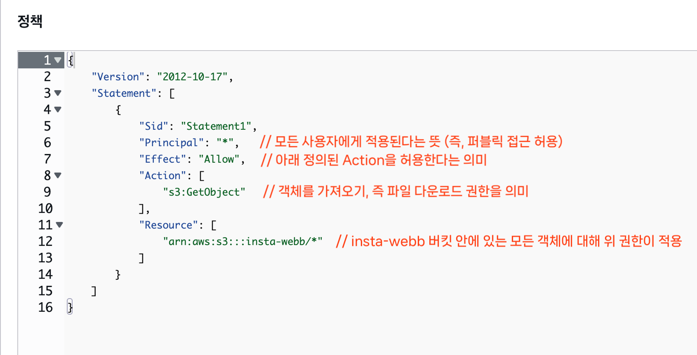
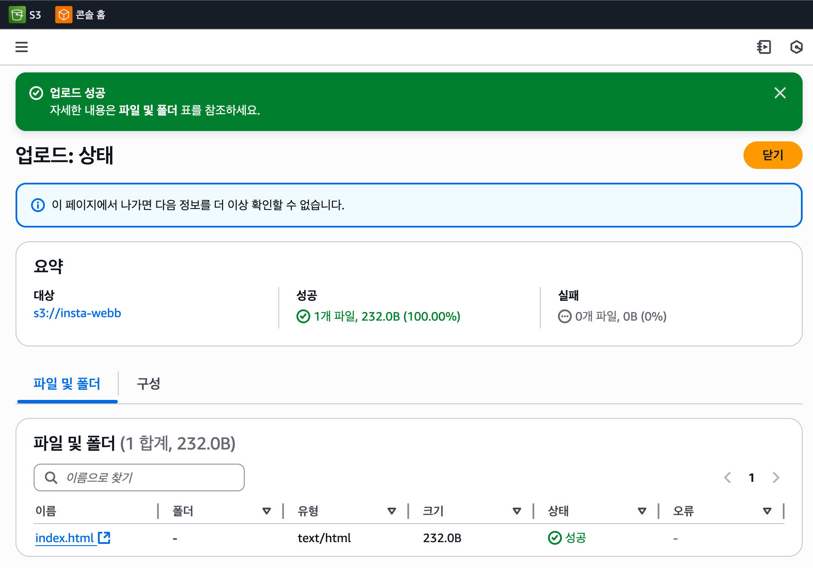

# Amazon S3 (Simple Storage Service)

Amazon S3는 AWS에서 제공하는 파일 저장소 서비스이다.  
사진, 영상, 문서, 로그 파일 같은 데이터를 안전하게 저장하고 꺼내 쓸 수 있는 서비스

## S3의 특징

1. 객체 저장소(Object Storage)

   - 데이터를 파일 단위(객체)로 저장한다.
   - 각각의 파일은 고유한 주소(URL)를 가지기 때문에 웹에서 직접 접근 가능하다.

2. 버킷(Bucket)

   - 파일을 넣는 큰 폴더 같은 개념
   - 내 프로젝트에 필요한 모든 이미지를 한 버킷 안에 저장할 수 있다.

3. 무제한 확장성

   - 몇 개의 파일이든, 수십억 개든 자동으로 확장된다.
   - 용량 제한이 사실상 없다.

4. 저렴하고 안정적

   - 사용한 만큼만 비용을 낸다.
   - AWS가 여러 지역에 데이터를 복제해 두기 때문에 안전하게 보관된다.

 

## 프론트엔드에서 S3 활용

### 백엔드에서 S3를 왜 쓸까?

- 회원 프로필 사진, 게시판 이미지 같은 파일 업로드에 자주 활용한다.
- 서버가 직접 파일을 들고 있지 않고, S3에 저장해 두고 URL만 관리하는 방식으로 쓴다.

### 프론트에서 배포에 왜 S3를 쓸까?

S3는 단순 저장소뿐만 아니라 정적 웹 호스팅 기능도 있다.
즉, HTML / CSS / JS / 이미지 파일 등을 브라우저가 다운받아 실행할 수 있도록 배포할 수 있다.

 

## S3 버킷 생성과 정적 웹 호스팅

### 버킷이란?

- 버킷은 S3에서 파일(객체)을 담아두는 큰 폴더 같은 개념이다.
- 내가 S3에 올리는 모든 파일은 반드시 어떤 버킷 안에 저장된다.

즉, `S3 = 클라우드 하드디스크`, `버킷 = 그 안의 폴더`라고 이해하면 된다.

 

### 버킷 생성 단계

#### 1. 버킷 만들기

- S3 콘솔에서 버킷 생성 클릭
- 버킷 이름과 리전을 지정

 

#### 2. 버킷 정책 설정 (권한 열기)

- 버킷 > 권한 > 버킷 정책
- 버킷 정책이란, 해당 버킷에 대한 접근 권한을 정의하는 JSON 문서이다.
- AWS는 기본적으로 보안을 위해 새로 만든 버킷을 잠신 상태(퍼블릭 접근 불가)로 둔다.
- 따라서 외부에서 접근 가능하게 하려면, 필요한 권한을 정책(JSON)으로 명시해 열어주어야 한다.

 

#### 3. 파일 업로드

- S3에 index.html 같은 정적 파일 업로드 (= 객체)

 

#### 4. 정적 웹 사이트 호스팅 활성화

- 속성 → 정적 웹 사이트 호스팅 → 편집 → 정적 웹 사이트 호스팅: 활성화
- 인덱스 문서: index.html 입력

이제 S3가 단순한 저장소를 넘어 웹 호스팅 서버처럼 동작한다.

 

#### 5. 배포 주소 확인

- S3가 제공하는 엔드포인트 URL 확인
- 이제 브라우저에서 접속하면, 올린 index.html 페이지가 표시된다.

 
<Comment/>
