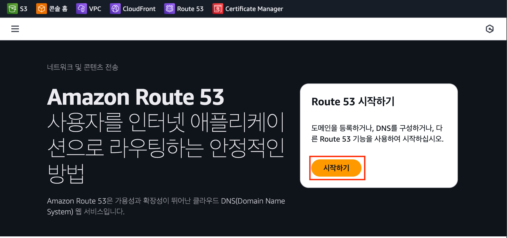
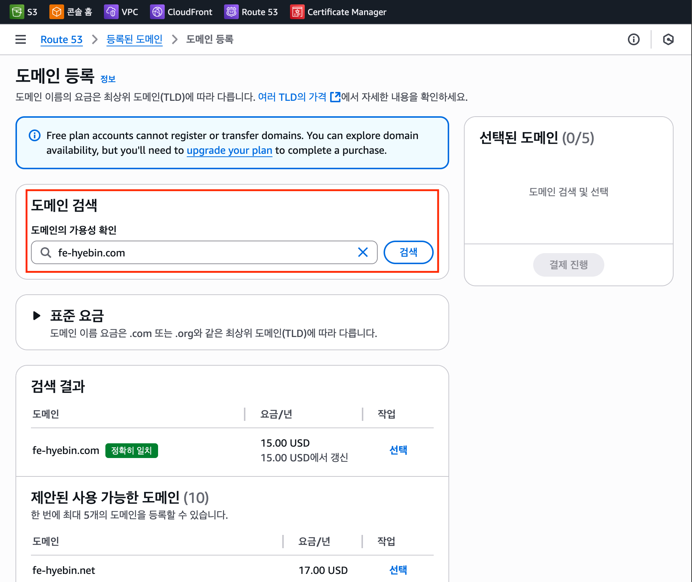
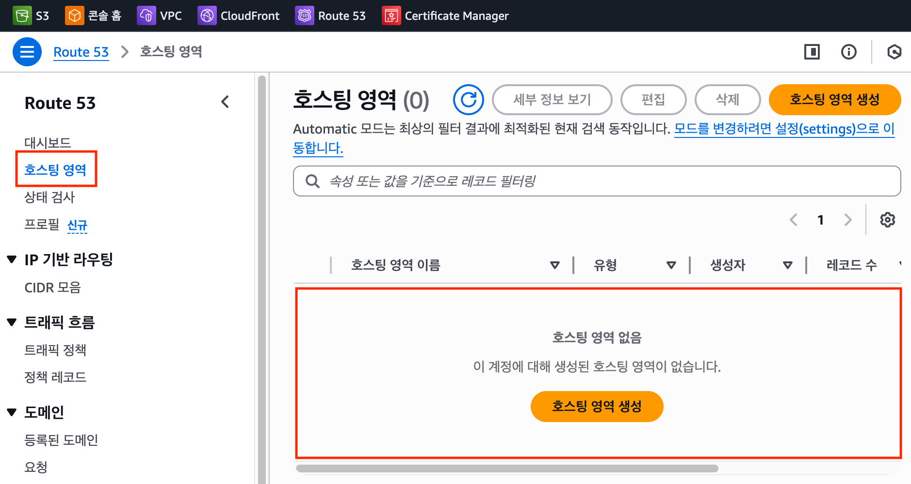
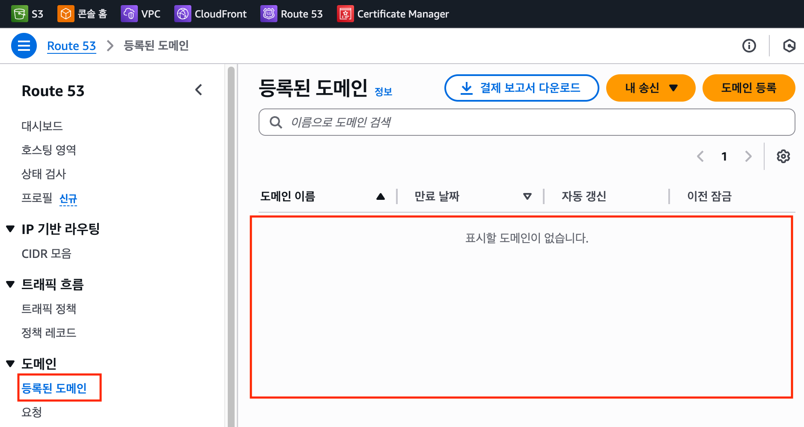

# Route 53 DNS

## 도메인과 DNS

- [What is a DNS Server? | What They Are & How They Work](https://gcore.com/learning/dns-servers-what-they-are-and-how-they-work)

## 도메인 이전의 통신 방식

과거에는 특정 컴퓨터와 통신하려면 IP 주소를 직접 입력해야 했다.  
예: 12.134.122.11

하지만 숫자로만 이루어진 IP 주소는 기억하기 어렵고, 사람이 사용하기엔 불편했다.  
그래서 사람이 기억하기 쉬운 문자 주소(도메인)가 필요해졌다.

### 도메인의 필요성

문제는, 컴퓨터는 여전히 숫자(IP)를 더 빠르게 이해한다는 것이다.  
그래서 `도메인 ↔ IP 주소`를 자동 변환해주는 시스템이 필요했고, 이것이 바로 `DNS`다.

 

## DNS(Domain Name System)의 등장

DNS는 사람이 입력한 도메인을 컴퓨터가 이해할 수 있는 IP 주소로 변환한다.

- 사람이 입력: `www.example.com`
- DNS 변환: `93.184.216.34`
- 컴퓨터: 변환된 IP 주소를 통해 해당 서버와 통신

이제 사용자는 복잡한 IP 주소를 외울 필요 없이, 기억하기 쉬운 도메인만 입력하면 된다.  
💡 즉, DNS는 사람 ↔ 컴퓨터를 이어주는 다리다.

 

## DNS 레코드 종류

| 레코드       | 설명                               | 예시                            | 실무 활용                       |
| ------------ | ---------------------------------- | ------------------------------- | ------------------------------- |
| A 레코드     | 도메인을 직접 IP 주소와 연결       | `example.com → 203.0.113.10`    | 서버 직접 연결                  |
| CNAME 레코드 | 도메인을 다른 도메인과 연결 (별칭) | `www.example.com → example.com` | www → 루트 연결                 |
| MX 레코드    | 이메일 서버 주소 지정              | `mail.example.com`              | 회사 메일 서비스                |
| TXT 레코드   | 인증/검증용 텍스트 정보 저장       | `google-site-verification=...`  | 도메인 소유권 검증, 이메일 인증 |

 

---

 

# AWS Route 53

AWS Route 53은 AWS에서 제공하는 DNS 서비스로, `도메인 발급 + DNS` 관리를 동시에 지원한다.  
즉, 도메인을 등록하고 이를 특정 서버(IP 주소)와 연결할 수 있다.

## Route 53이 중요한 이유

웹 서비스는 대부분 IP 대신 도메인 기반으로 운영된다.  
특히 HTTPS 보안 인증서 발급에는 도메인이 반드시 필요하다.

- IP 주소만으로는 SSL/TLS 인증서를 발급할 수 없다.
- 따라서 실무에서는 도메인 없이 운영하는 경우가 거의 없다.

💡 Route 53은 `도메인 관리 + 다른 AWS 서비스(EC2, S3, CloudFront)와 연동까지 지원`하므로 실무에서 매우 유용하다.

## Route 53의 활용

- 도메인 등록 및 관리
- 도메인과 서버 IP 매핑 (DNS 기능)
- 서브도메인 설정 (예: `api.example.com`, `dev.example.com`)
- EC2, S3, CloudFront 등 AWS 서비스와 연동

::: info 🌍 AWS Route 53의 특징

- 고가용성: 전 세계 리전 기반 인프라로 안정적 서비스 제공
- 유연한 라우팅 정책: 단순 라운드 로빈, 지리적 라우팅, 지연 시간 기반 라우팅 지원
- Health Check: 서버 상태를 모니터링해 비정상 서버로는 트래픽을 보내지 않음
- AWS 연동 최적화: EC2, S3, CloudFront와 원활하게 연동 가능

:::

## 도메인 등록 과정

AWS의 Route 53은 도메인 등록과 DNS 관리를 동시에 할 수 있는 서비스이다.  
실제로 도메인을 구매해서 연결하려면 아래 과정을 거친다.

 

### 1. 도메인 검색 및 등록

- 원하는 도메인 이름을 입력하고 사용 가능 여부를 확인 및 결제 진행
- 사용 가능하면 연간 요금이 표시된다.
- Route 53에서는 한 번에 최대 5개 도메인을 등록할 수 있다.

 

### 2. 호스팅 영역 확인

- 도메인을 구매하면 호스팅 영역(Hosted Zone)이 자동 생성된다.
- 이곳에서 DNS 레코드(A, CNAME, MX 등)를 추가하여 S3, CloudFront, EC2 등 다른 서비스와 연결할 수 있다.

 

### 3. 등록된 도메인

- 도메인이 정상적으로 등록되면 등록된 도메인(Registered Domains) 메뉴에서 확인할 수 있다.
- 여기서 만료일, 자동 갱신 여부 등을 관리할 수 있다.

 

## 다른 DNS 서비스와 비교

Route 53 외에도 DNS 역할을 제공하는 서비스는 많다.  
예: 가비아, 후이즈, GoDaddy 등

즉, 도메인 발급 및 관리 자체는 특정 기업의 독점이 아니라, 여러 업체가 제공하는 서비스이다.  
단, AWS 환경에서 인프라를 운영한다면 Route 53을 쓰는 것이 연동 면에서 유리하다.

 

## 무료 도메인 서버의 한계점

::: info ⚠️ 무료 도메인이나 무료 서버는 개인 학습용으로는 충분하지만, 실제 서비스 운영에는 적합하지 않다.

- 제한된 기능: HTTPS 인증서 적용, 커스텀 DNS 설정 등 핵심 기능이 제한되는 경우가 많다.
- 불안정한 서비스 품질: 서버 속도가 느리거나, 예고 없는 다운타임이 발생할 수 있다.
- 지원 부족: 문제가 생겨도 기술 지원을 받을 수 없는 경우가 많다.
- 단기적 운영: 무료 제공 기간이 끝나면 도메인/서버가 만료되어 서비스가 중단된다.

💡 따라서 학습·연습용으로는 괜찮지만, 실제 서비스 운영에서는 반드시 유료 도메인과 안정적인 호스팅을 이용하는 것이 바람직하다.
:::

 

## 정리

- DNS: 도메인 ↔ IP 주소를 연결해주는 시스템
- Route 53: AWS에서 도메인 등록과 DNS 관리, 다른 서비스와의 연동을 지원
- 실무 필수 이유: HTTPS 인증서 발급에는 반드시 도메인이 필요
- 학습/실무 차이: 학습은 무료로 가능, 실무는 반드시 유료 도메인 필요

 
<badge type=info text="#오즈코딩스쿨"></badge><badge type=info text="#초격차_프론트엔드_13기"></badge><badge type=info text="#개발기록"></badge> 
<Comment/>
