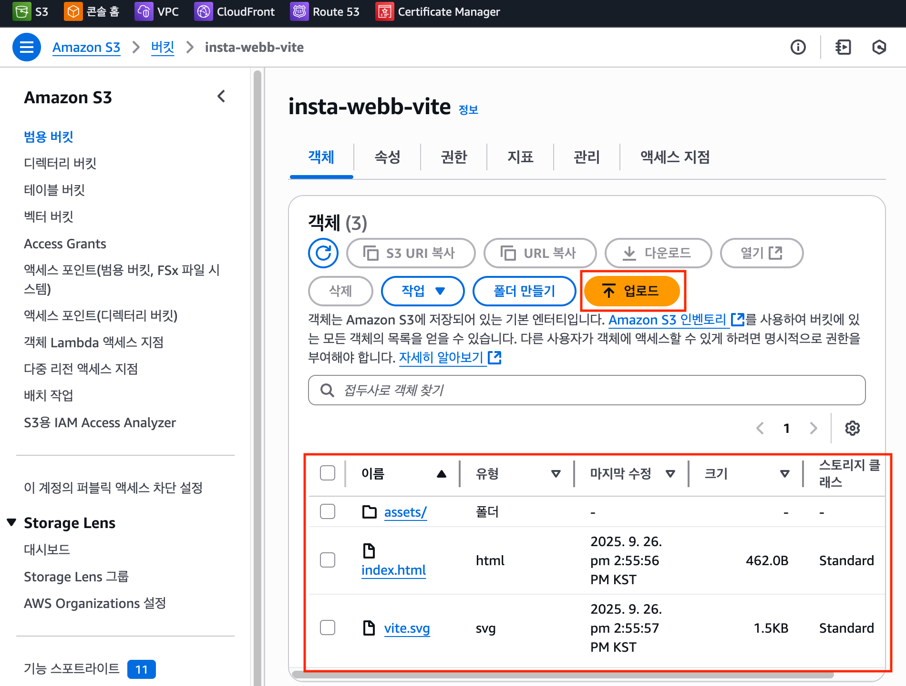
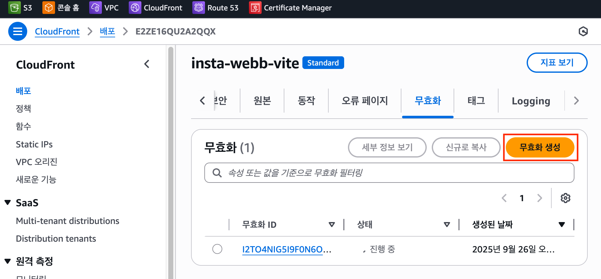
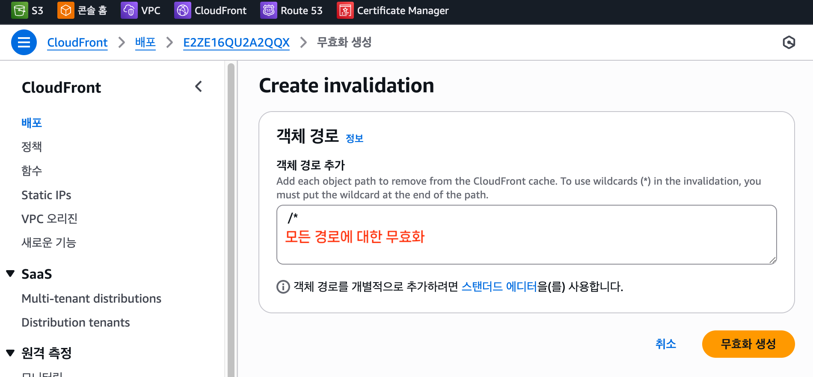

# 배포 운영 및 관리

## CloudFront에서의 코드 업데이트 방법

배포된 사이트의 코드를 업데이트하는 과정이다.  
S3에 새 코드 업로드 → CloudFront 캐시 무효화 → 브라우저 확인

 

### 1. S3에 파일 업로드

#### 주의사항

- S3에 새 파일을 업로드해도 CloudFront에는 즉시 반영되지 않는다.
- CloudFront는 일정 기간 캐시를 유지하기 때문에 업데이트가 지연된 것처럼 보일 수 있다.
- 따라서 로컬에서 빌드한 최신 파일을 S3에 업로드(기존 파일 교체)하면 S3에서는 즉시 적용된다.

#### 업로드 방법

1. AWS Console: 웹에서 직접 파일 드래그 앤 드롭
2. AWS CLI: 명령어로 일괄 업로드
3. CI/CD: 자동화된 파이프라인으로 배포

 

### 2. CloudFront 캐시 무효화(Invalidation)

#### 무효화가 필요한 이유

- CloudFront는 성능 최적화를 위해 콘텐츠를 캐시에 저장한다.
- 새로운 코드가 배포되어도 캐시 때문에 이전 버전이 계속 보일 수 있다.
- 따라서 강제로 캐시를 비워서 최신 파일을 가져오도록 해야 한다.

#### 무효화 설정

- `/\*` 패턴으로 모든 경로를 무효화하면 전체 캐시가 갱신되고, 전체 파일을 배포한다.
- 처리 시간은 보통 5-15분 소요된다.
- 비용: 월 1,000건까지 무료, 이후 건당 과금

 

### 3. 배포 확인

- 브라우저에서 사이트 접속 확인
- 개발자 도구로 네트워크 탭 확인
- 모바일/데스크톱 다양한 환경에서 테스트

 

## 자동화 필요성

위 과정은 프로젝트를 업데이트할 때마다 반복되므로 번거롭다.  
따라서 CI/CD 파이프라인을 통해 자동화하면 편리하다.

- 예: GitHub Actions, AWS CodePipeline, GitLab CI 등을 활용
- `빌드 → S3 업로드 → CloudFront 무효화` 단계를 자동 실행

 
<Comment/>
