# React 프로젝트에 CI/CD 적용하기 <badge type="tip" text="S3 + CloudFront"></badge>

::: info GitHub Actions 주요 라이브러리

- [GitHub Marketplace](https://github.com/marketplace)
- [Checkout V4](https://github.com/marketplace/actions/checkout)  
  ↳ GitHub 공식 액션 / Repository의 소스 코드를 runner(실행 서버)로 가져온다.  
  ↳ 💡 쉽게 말해, 내 로컬에서 `git clone` 하는 것과 동일한 역할을 한다.
- [Configure AWS Credentials](https://github.com/marketplace/actions/configure-aws-credentials-action-for-github-actions)  
   ↳ AWS 공식 액션  
   ↳ IAM에서 발급한 `AWS_ACCESS_KEY_ID`, `AWS_SECRET_ACCESS_KEY`를 이용해 AWS CLI에 인증 정보를 설정한다.  
   ↳ 인증이 성공하면 이후 단계에서 aws s3, aws cloudfront 명령어를 바로 사용할 수 있다.  
   ↳ 💡 이게 없으면 GitHub Actions runner는 AWS 자원에 접근할 권한이 없다.  
  :::

## CI/CD with GitHub Actions

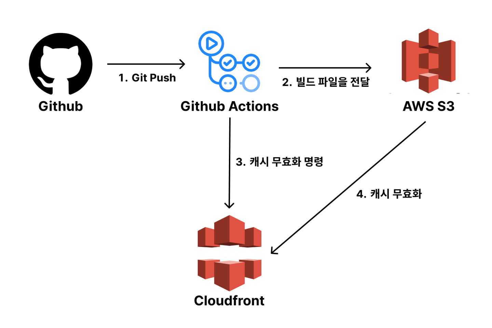

GitHub Actions를 이용해서 React 프로젝트를 자동 배포(CI/CD) 하는 과정을 정리했다.  
S3에 빌드 결과물을 올리고, CloudFront 캐시를 무효화해서 항상 최신 버전을 배포할 수 있다.

<br>

## IAM

GitHub Actions는 AWS 외부 서비스이다. 따라서 AWS 자원에 접근하려면 권한이 필요하다.

이때 사용하는 것이 IAM(Identity and Access Management) 사용자이다. 별도의 배포 전용 계정을 만들어 `Access Key를 발급`받고,  
이 Key를 `GitHub Secrets에 등록`해서 안전하게 인증을 처리한다.

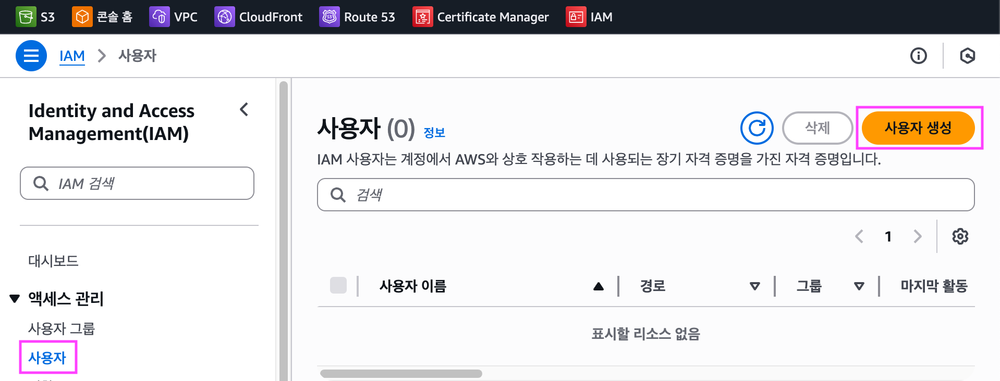

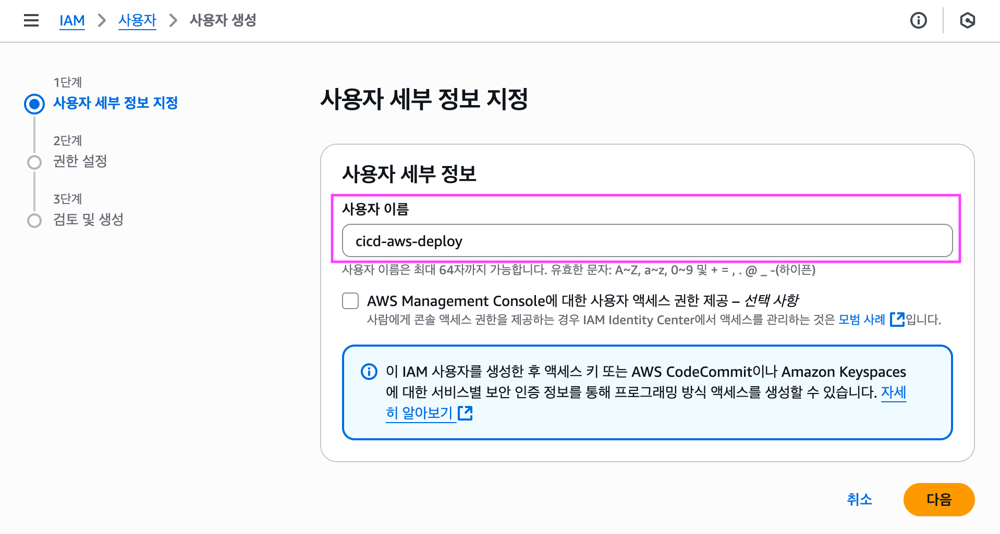

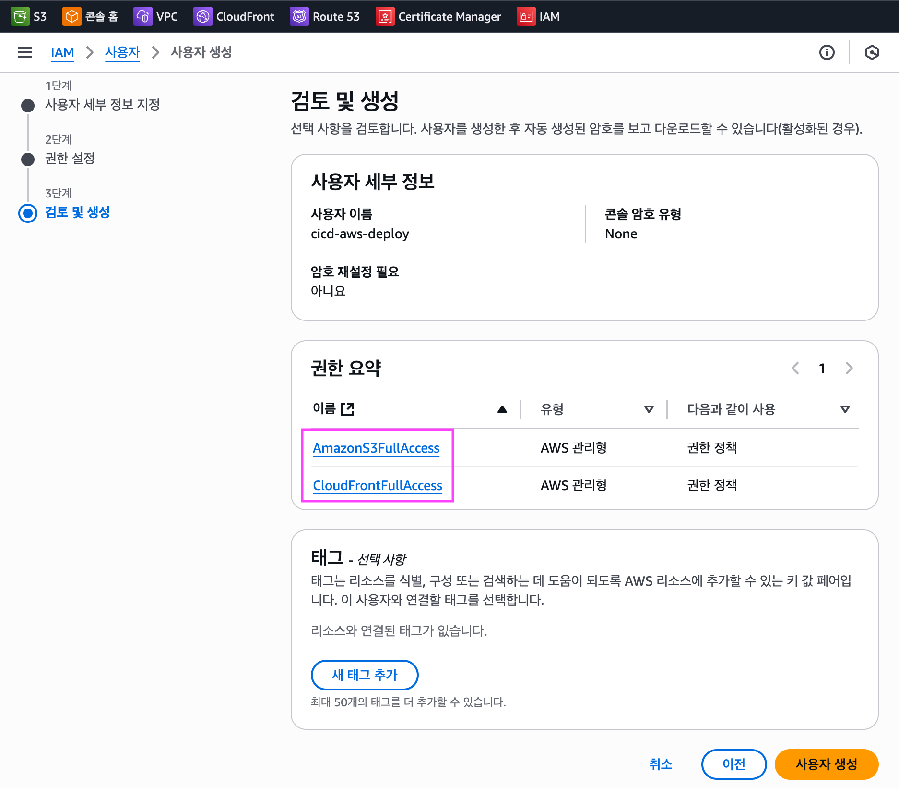

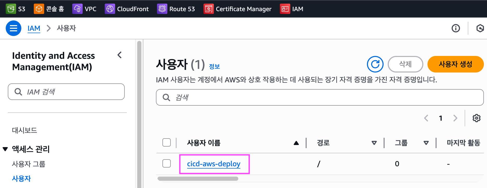

<br>

### IAM > 사용자 > 보안 자격 증명

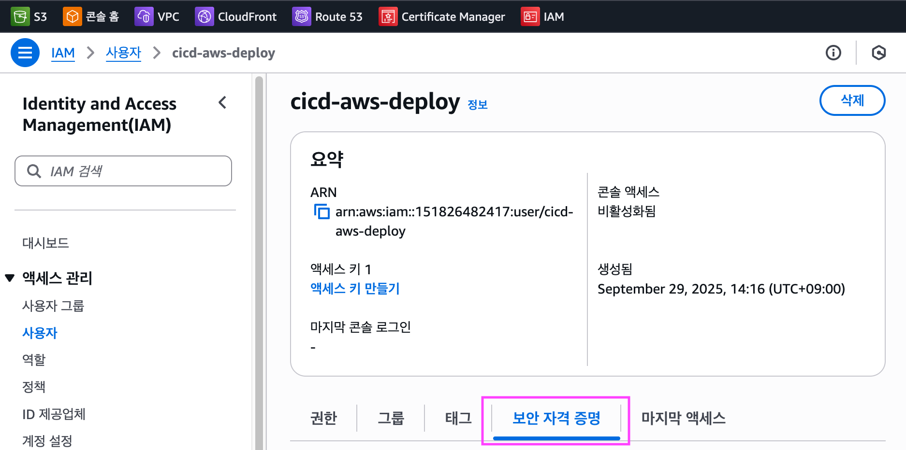
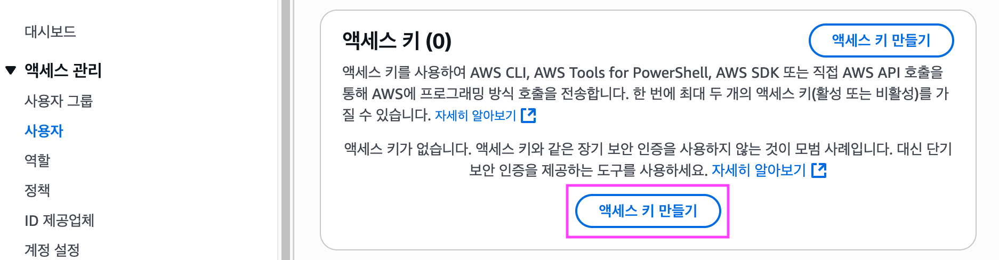

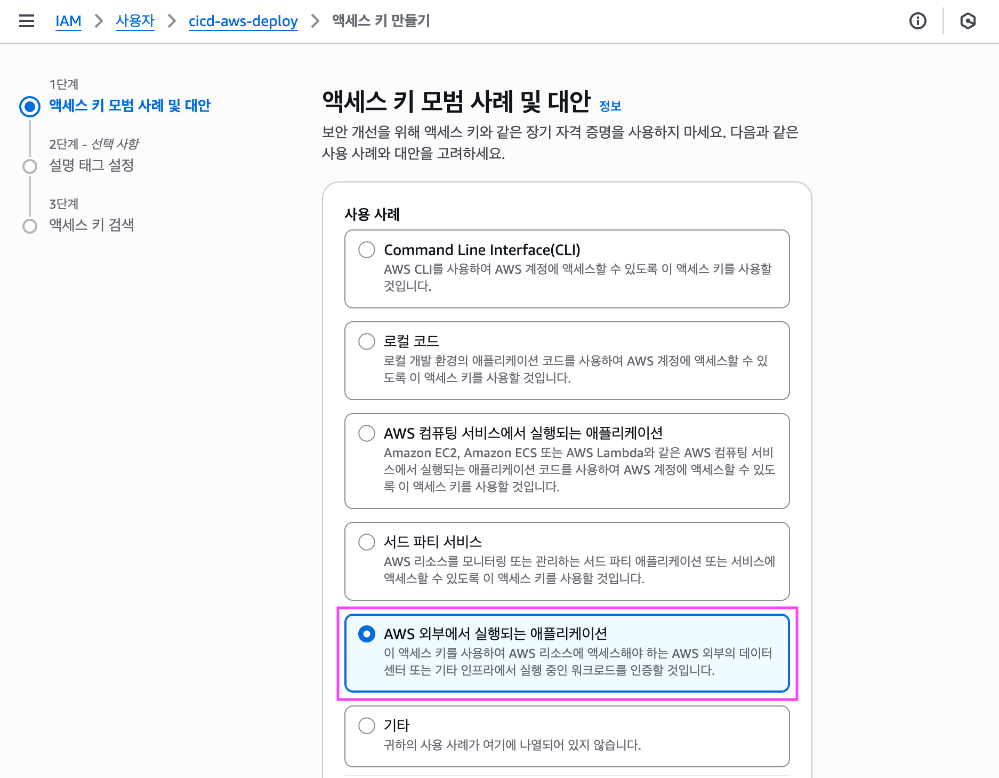

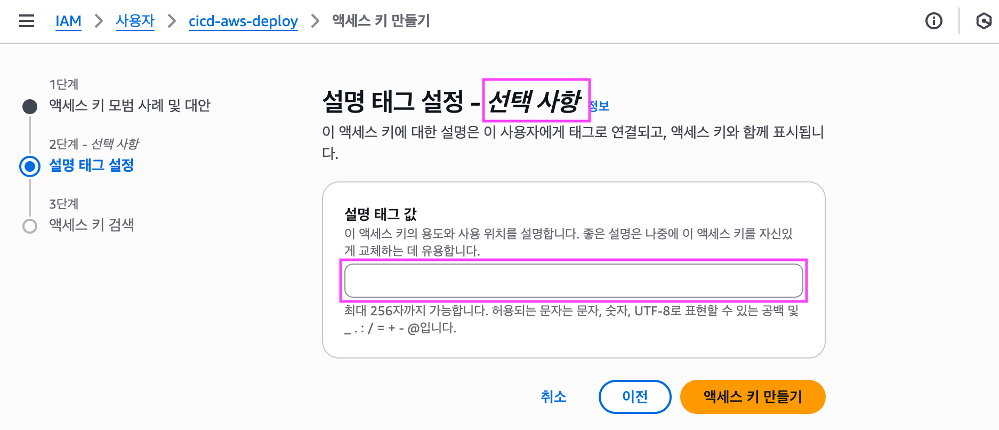

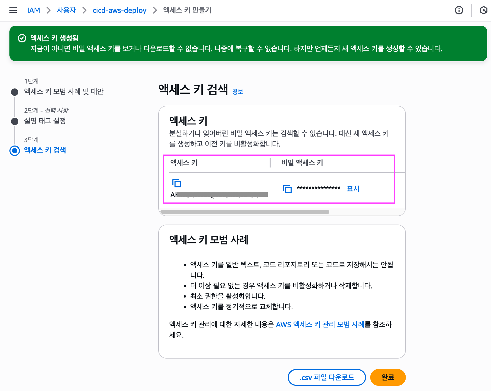

<br>

## GitHub Secrets 등록

IAM에서 발급받은 Access Key ID와 Secret Access Key를 GitHub Repository의 `Secrets`에 등록한다.

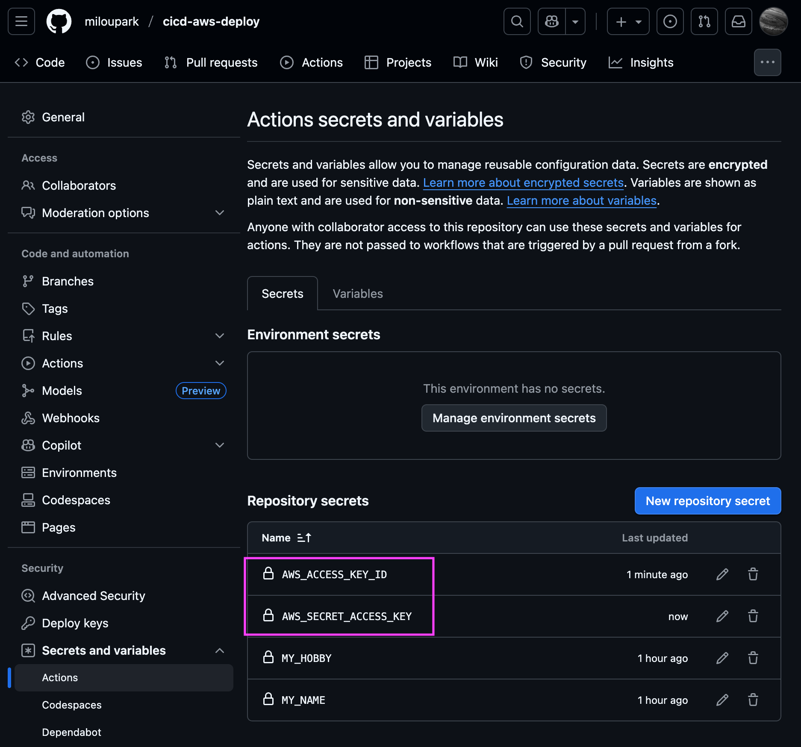

💡 워크플로우 코드에서 키 값을 직접 노출하지 않고, 안전하게 인증 정보를 사용할 수 있다.

<br>

## GitHub Actions Workflow 작성

`.github/workflows/deploy.yml 파일`을 작성  
(main 브랜치에 push 할 때마다 실행되도록 설정)

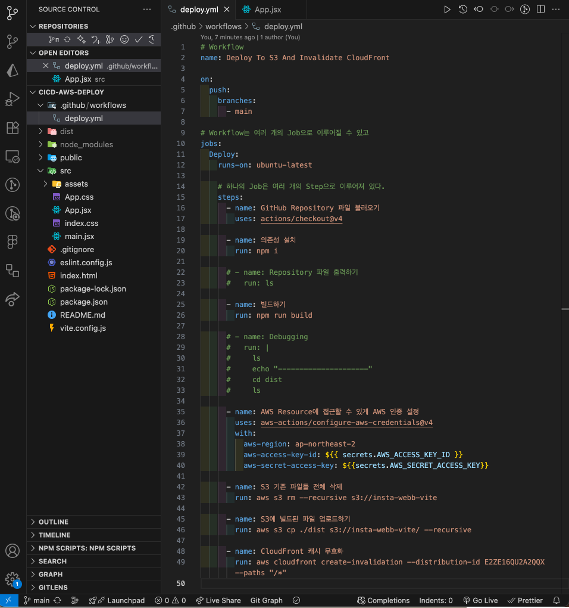

::: details 🔍 yml

```yml
# Workflow
name: Deploy To S3 And Invalidate CloudFront

on:
  push:
    branches:
      - main

# Workflow는 여러 개의 Job으로 이루어질 수 있고
jobs:
  Deploy:
    runs-on: ubuntu-latest

    # 하나의 Job은 여러 개의 Step으로 이루어져 있다.
    steps:
      - name: GitHub Repository 파일 불러오기
        uses: actions/checkout@v4

      - name: 의존성 설치
        run: npm i

      # - name: Repository 파일 출력하기
      #   run: ls

      - name: 빌드하기
        run: npm run build

      # - name: Debugging
      #   run: |
      #     ls
      #     echo "---------------------"
      #     cd dist
      #     ls

      - name: AWS Resource에 접근할 수 있게 AWS 인증 설정
        uses: aws-actions/configure-aws-credentials@v4
        with:
          aws-region: ap-northeast-2
          aws-access-key-id: ${{ secrets.AWS_ACCESS_KEY_ID }}
          aws-secret-access-key: ${{secrets.AWS_SECRET_ACCESS_KEY}}

      - name: S3 기존 파일들 전체 삭제
        run: aws s3 rm --recursive s3://insta-webb-vite

      - name: S3에 빌드된 파일 업로드하기
        run: aws s3 cp ./dist s3://insta-webb-vite/ --recursive

      - name: CloudFront 캐시 무효화
        run: aws cloudfront create-invalidation --distribution-id E2ZE16QU2A2QQX --paths "/*"
```

:::

::: info 🧩 정리하면, 이런 흐름으로 CI/CD가 동작한다.

- `actions/checkout@v4` → 소스코드 가져오기
- `aws-actions/configure-aws-credentials@v4` → AWS 인증 처리
- `aws s3, aws cloudfront` → 실제 배포 작업

:::

<br>

## AWS CLI 명령어들

- `aws s3 rm --recursive`: S3 버킷 안의 기존 파일을 전부 삭제
- `aws s3 cp ./dist s3://버킷이름/ --recursive`: 로컬의 dist 폴더 전체를 S3 버킷으로 업로드
- `aws cloudfront create-invalidation --distribution-id ... --paths "/*"`: CloudFront 캐시 무효화 실행 (모든 파일을 새로고침)

💡 덕분에 사용자는 항상 최신 빌드된 파일을 받게 된다.

<br>

## Workflow 실행 결과

코드를 push 하면 자동으로 Actions가 실행된다.  
`빌드 → S3 업로드 → 캐시 무효화` 순서로 진행되고, 성공하면 아래와 같이 체크 표시 `✓`가 뜬다.

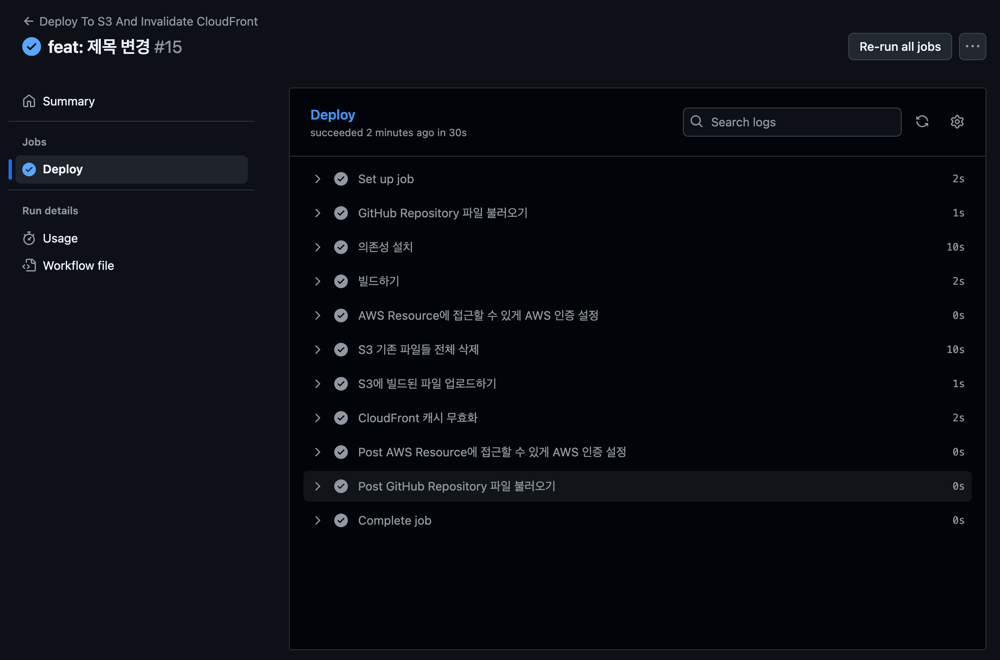

<br>

## CloudFront 캐시 무효화 확인

CloudFront에서 무효화 내역을 확인하면,  
GitHub Actions에서 실행한 무효화 명령이 기록되고 완료됨 상태가 된다.  
이제 CloudFront는 새로운 빌드 파일을 사용자에게 전달한다.


<br>

## 정리

::: info 💡

- IAM 사용자 생성 → Access Key 발급
- GitHub Secrets에 등록
- GitHub Actions Workflow 작성 (deploy.yml)
- push 시 자동 실행 → S3 업로드 + CloudFront 캐시 무효화
- CloudFront에서 최신 배포 확인

💡 이렇게 설정하면, 이제 git push origin main 한 번으로
React 프로젝트가 자동으로 AWS에 배포된다.

:::

<br>
<Comment/>
