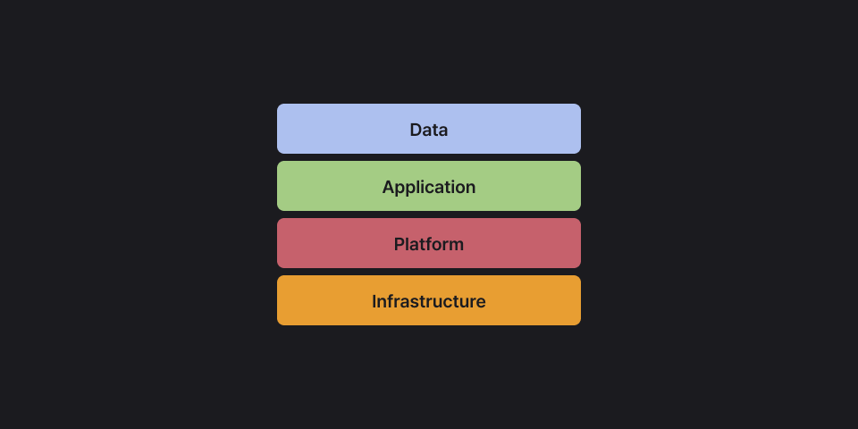

# Service Layers

## 서비스 동작의 4계층 구조

서비스는 단순히 애플리케이션 코드만으로 동작하지 않는다.  
아래와 같은 4계층 구조 위에서 작동한다.

- Infrastructure: 서버, 네트워크, 스토리지 같은 물리적 기반
- Platform: OS, 미들웨어, 런타임 환경, 데이터베이스 등
- Application: 실제 사용자와 상호작용하는 프로그램 (웹·모바일 앱 등)
- Data: 애플리케이션에서 활용되는 정보 (사용자 정보, 로그, 파일 등)

::: info 💡 데이터가 애플리케이션에서 활용되기 위해서는, 그 밑단에 플랫폼과 인프라가 반드시 필요하다.
클라우드는 이 인프라와 플랫폼을 대신 관리해 주기 때문에, 사용자는 애플리케이션과 데이터 개발에만 집중할 수 있다.
:::

 
<Comment/>
