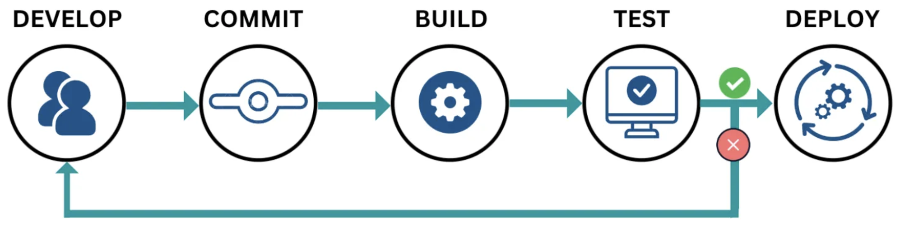
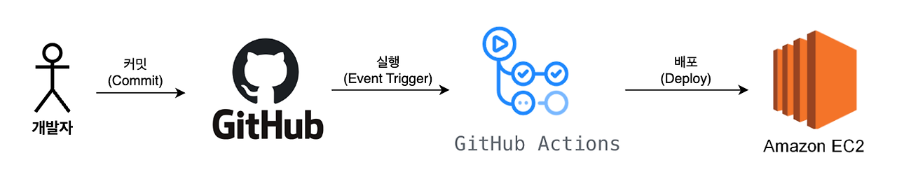

# CI/CD

### CI(Continuous Integration)/CD(Continuous Deployment or Delivery)

::: info Reference

- [카카오엔터프라이즈가 GitHub Actions를 사용하는 이유](https://tech.kakao.com/posts/516)
- [GitHub Actions 설명서](https://docs.github.com/ko/actions)
- [GitHub Actions에 대한 워크플로 명령](https://docs.github.com/ko/actions/reference/workflows-and-actions/workflow-commands)

:::

## CI/CD란?



테스트(Test), 통합(Merge), 배포(Deploy)의 과정을 자동화하는 기술 도구이다.  
즉, 코드를 수정하고 푸시하면 `검증 → 병합 → 배포`까지의 흐름이 자동으로 이어진다.

CI는 `코드 품질 보장`을, CD는 `코드 전달 자동화`를 의미한다.  
즉, CI가 끝나면 CD가 이어진다.

<br>

### CI/CD 작동 과정

#### 1. Test

- 코드가 저장소에 푸시되면 자동으로 빌드, 린트, 단위 테스트, 통합 테스트가 실행된다.
- 코드가 정상적으로 동작하고 기존 기능을 해치지 않았는지 빠르게 검증한다.

#### 2. Merge

- 테스트를 통과한 코드만 메인 브랜치(main/master)에 병합된다.
- 코드 리뷰와 자동화된 검증을 통해 여러 개발자의 작업을 안전하게 통합한다.

#### 3. 배포 (Deploy)

- 메인 브랜치에 병합되면 자동으로 배포 파이프라인이 실행된다.
- 예: 프론트엔드는 빌드 파일을 S3에 업로드하고 CloudFront 캐시를 무효화,  
  백엔드는 Docker/Kubernetes 환경에 배포하여 실서비스로 반영한다.

💡 `코드 푸시 → 자동 테스트 → 머지 → 자동 배포`

<br>

## CI와 CD의 구분

### CI, 지속적 통합

- 여러 개발자의 코드를 자주 통합하고,
- 자동 빌드 & 테스트를 통해 품질을 보장하는 단계.
- GitHub Actions, GitLab CI, Jenkins

### CD, 지속적 배포 or 전달

- CI를 통과한 코드를 스테이징/프로덕션 환경에 자동 반영.
- `Delivery`: 자동으로 스테이징까지 올라가고, 운영 배포는 승인 버튼을 눌러야 함
- `Deployment`: 승인 없이 운영 서버까지 자동 배포
- ArgoCD, Spinnaker, AWS CodePipeline

<br>

## CI/CD의 필요성

개발자가 새로운 기능을 작성하면 보통 이렇게 진행된다:

- 1. 코드를 작성하고 Commit
- 2. 브랜치에 Merge
- 3. 서버에 접속해서 최신 코드를 내려받고 실행

이 과정은 `사람이 직접 반복`해야 하므로 시간이 오래 걸리고 실수가 생기기 쉽다.  
💡 따라서 `CI/CD 파이프라인`을 구축하여 자동화하면, 개발자는 코드 작성에만 집중할 수 있다.

<br>

## CI/CD의 장점

- 사람 손으로 하던 단순 작업을 자동화 → `개발 생산성 향상`
- 테스트 자동 실행으로 `버그 조기 발견`
- 배포 속도 빨라짐 → `피드백 루프 단축`
- 배포 과정의 표준화 → `안정적인 서비스 운영`

<br>

## GitHub Actions vs Jenkins

두 도구 모두 CI/CD 자동화를 지원하지만, 상황에 따라 선택 기준이 다르다.

### Jenkins

- 오픈소스 CI/CD 툴로 높은 커스터마이징 가능
- 사내 인프라와 긴밀하게 연동할 때 유리
- 단점: 별도 서버 구축/유지 필요 → 비용과 관리 부담 발생

### GitHub Actions

- GitHub에 내장된 CI/CD 서비스
- GitHub 레포와 바로 연동되므로 설정이 간단하고 서버 구축이 필요 없음
- 단점: GitHub 생태계에 종속적

💡 복잡한 환경·자체 인프라 = Jenkins / 빠른 시작·GitHub 기반 프로젝트 = GitHub Actions

<br>

## GitHub Actions CI/CD 흐름

GitHub Actions를 로직을 실행시킬 수 있는 일종의 컴퓨터라고 생각하면 된다.  
즉, GitHub Actions는 CI/CD 과정에서 빌드, 테스트, 배포에 대한 로직을 실행시키는 서버의 역할을 한다.



- 1. 코드 작성 후 GitHub에 Commit & Push
- 2. Push를 감지해서 GitHub Actions에 작성한 로직이 실행  
     빌드(Build) → 테스트(Test) → 서버로 배포(Deploy)
- 3. 서버에서 배포된 최신 코드로 서버를 재실행

<br>

## GitHub Actions Workflow 예제


::: details 🔍 yml

```yml
# Workflow
name: GitHub Actions 실행시켜보기

on:
  push:
    branches:
      - main

# Workflow는 여러 개의 Job으로 이루어질 수 있고
jobs:
  My-Deploy-Job:
    runs-on: ubuntu-latest

    # 하나의 Job은 여러 개의 Step으로 이루어져 있다.
    steps:
      - name: Hello World 출력하기
        run: echo "Hello World"

      - name: 여러 명령어 문장 작성하기
        run: |
          echo "Good"
          echo "Morning"
          pwd

      - name: GitHub Actions 자체 저장되어 있는 변수 사용해보기
        run: |
          echo $GITHUB_REPOSITORY
          echo $GITHUB_SHA

      - name: GitHub Actions Secret 변수 사용
        run: |
          echo ${{ secrets.MY_NAME }}
          echo ${{ secrets.MY_HOBBY }}
```

:::

#### Workflow 생성

- `.github/workflows/deploy.yml` 파일 생성
- `on.push.branches: main` → main 브랜치에 push가 발생할 때 실행되도록 설정

#### Job과 Step

- `Job`: 실행 환경 단위
- `Step`: Job 안에서 실제로 실행할 작업

<br>

### Github Actions 실행 화면

워크플로우를 추가하고 main 브랜치에 push하면 Actions 탭에서 실행 로그를 확인할 수 있다.


- 각 Step이 정상적으로 실행되면 `✓` 표시와 함께 로그가 출력된다.
- 여러 Step을 통해서 명령어 실행, 변수 출력 등을 확인할 수 있다.

<br>

### Github Secrets and variables

GitHub Actions에서는 민감한 값을 코드에 직접 적지 않고, `Secrets`로 등록해서 사용한다.


- Repository → Settings → Secrets and variables → Actions에서 등록

<br>


- 로그에는 값이 그대로 노출되지 않고 `***`로 마스킹 처리된다.

<br>
<Comment/>
