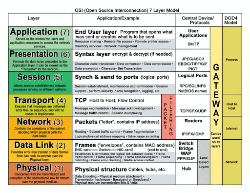
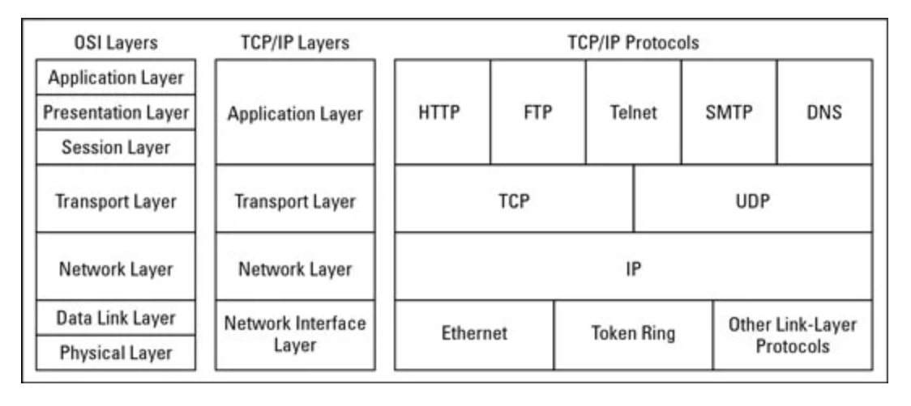

# OSI 7계층

OSI 7계층은 네트워크 통신 과정을 단계별로 나눈 이론적 모델로,  
실제 인터넷은 TCP/IP 모델을 사용하지만 개념을 정리하는 데 OSI 7계층이 훨씬 직관적이다.

프론트엔드 개발자 입장에서 가장 밀접한 계층은 `4계층(전송)`과 `7계층(응용)`이다.  
예를 들어, 우리가 다루는 `HTTP/HTTPS 요청, WebSocket 통신은 7계층`에 해당하고,  
`TCP/UDP`로 동작하는 네트워크 신뢰성과 속도는 `4계층` 개념 덕분이다.

 

## OSI 7계층 개요

::: info 💡 OSI 7계층은 네트워크 통신 과정을 단계별로 나눈 모델이다.  
프론트엔드 개발자는 특히 4계층(TCP/UDP), 7계층(HTTP/HTTPS)과 밀접하다.
:::

 

## OSI 7계층 요약 표

| 계층  | 이름 (한글)             | 주요 역할                   | 예시                |
| ----- | ----------------------- | --------------------------- | ------------------- |
| 7계층 | 응용 (Application)      | 사용자와 직접 맞닿는 서비스 | HTTP, FTP, SMTP     |
| 6계층 | 표현 (Presentation)     | 데이터 변환/암호화/압축     | JPEG, MP3, SSL/TLS  |
| 5계층 | 세션 (Session)          | 연결 유지/동기화            | API 세션, 소켓 통신 |
| 4계층 | 전송 (Transport)        | 데이터 전송 제어            | TCP, UDP            |
| 3계층 | 네트워크 (Network)      | 목적지까지 경로 설정        | IP, ICMP            |
| 2계층 | 데이터 링크 (Data Link) | 물리적 전송 단위, 오류 검출 | 이더넷, MAC 주소    |
| 1계층 | 물리 (Physical)         | 실제 전기/신호 전송         | 케이블, 리피터      |

 

## OSI 7계층 흐름

#### 7계층 - 응용 계층

- 사용자가 직접 쓰는 애플리케이션과 맞닿음
- 프론트엔드 개발자는 주로 HTTP/HTTPS, WebSocket 같은 프로토콜을 사용한다.

#### 6계층 - 표현 계층

- 데이터 인코딩/암호화/압축
- SSL/TLS(HTTPS 보안)가 이 계층에 해당한다.

#### 5계층 - 세션 계층

- 연결 수립 및 유지
- API 요청 시 세션 관리, 소켓 통신

#### 4계층 - 전송 계층

- TCP/UDP 기반 전송 제어
- TCP → 연결 지향, 신뢰성 보장 (웹 요청/응답)
- UDP → 빠른 전송, 신뢰성 없음 (스트리밍, 게임)

#### 3계층 - 네트워크 계층

- 경로 설정, IP 주소 할당
- IP 패킷을 만들어서 어디로 보낼지 경로를 정한다. (라우팅 개념이 여기서 등장한다.)

#### 2계층 - 데이터 링크 계층

- MAC 주소로 장치 식별
- 같은 네트워크 안에서 장치를 구분할 때 사용

#### 1계층 - 물리 계층

- 진짜 전기 신호, 광케이블, 무선 주파수
- 눈에 안 보이지만 데이터가 실제로 전달되는 물리적 층

 

## 왜 중요할까?

- 브라우저 ↔ 서버 통신 → 7계층(HTTP/HTTPS)을 사용
- HTTPS의 보안 → 6계층(SSL/TLS)에서 처리
- 데이터 전송 안정성 → 4계층(TCP)
- IP/포트 설정 → 3~
- HTTPS 인증서 오류 발생 → 표현 계층(6계층) 문제
- React 앱에서 `net::ERR_CONNECTION_REFUSED` 오류 → 전송 계층(TCP) 문제

 

## OSI 7계층 vs TCP/IP 4계층 비교

- OSI 7계층 = 이론적 학습 모델
- TCP/IP 4계층 = 실제 인터넷 표준 모델
- 두 모델은 계층 수는 다르지만, 역할은 거의 매칭된다.
  - 예: OSI의 5~7계층(세션/표현/응용) → TCP/IP에선 응용 계층으로 통합

 
<Comment/>
