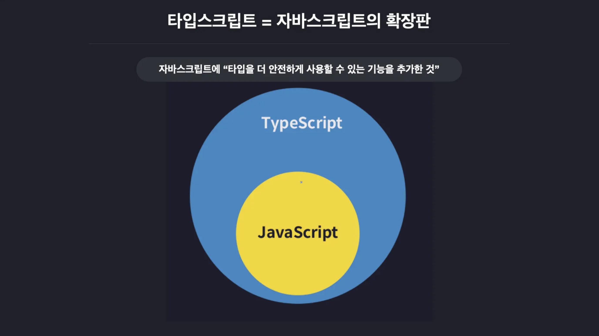

# TypeScript 개요

::: info Reference

- [TypeScript GitHub](https://github.com/microsoft/TypeScript)
- [Learn Typescript](https://learntypescript.dev/)

:::



TypeScript는 자바스크립트를 더 안전하게 사용할 수 있도록 `타입` 관련 기능들을 추가한 언어다.

<br>

```js
// JavaScript
let a = 1;
let b = 2;

console.log(a + b);
```

---

```ts
// TypeScript
let a: number = 1;
let b: number = 2;

console.log(a + b);
```

- TS는 코드 실행 전에 타입 오류를 미리 잡아낸다.

<br>

## 1. TypeScript란?

- Microsoft에서 개발 및 유지 관리하는 오픈 소스 언어
- 대규모 애플리케이션 개발을 위해 설계됨
- JavaScript에 정적 타입 검사와 타입 표기(annotation)를 추가한 언어
- 결국 JavaScript의 상위 집합(Superset)  
  → 모든 JS 코드는 그대로 TS에서도 동작하지만, TS만의 기능은 JS에는 없음

<br>

## 2. TypeScript 사용 이유

| JavaScript의 한계 | TypeScript의 해결 방식                         |
| ----------------- | ---------------------------------------------- |
| 런타임 오류       | 컴파일 시점에 타입 검사로 조기 탐지            |
| 불명확한 구조     | `Interface`, `Type Alias`로 데이터 형태 명시   |
| 협업 어려움       | 자동완성, 타입 추론으로 코드 가독성 향상       |
| 유지보수 어려움   | 타입 기반 리팩터링으로 안정적인 코드 수정 가능 |

💡 TypeScript는 자바스크립트를 대체하지 않고 확장한다.  
기존 JS 프로젝트에 점진적으로 도입할 수 있다는 게 가장 큰 강점이다.

<br>

## 3. TypeScript의 주요 특징

- 크로스 플랫폼 지원 (윈도우, 맥, 리눅스 어디서든 사용 가능)
- 객체 지향 언어 지원 (클래스, 인터페이스 등)
- 정적 타입 검사 (컴파일 단계에서 오류 발견 가능)
- 타입 추론 기능 (명시하지 않아도 타입을 유추)
- 선택적 정적 타이핑 (원하면 동적처럼도 작성 가능)
- 최신 ECMAScript 기능 포함 (ES6+ 문법 적극 지원)
- DOM 조작 가능 (브라우저 API와도 호환)

<br>

## 4. Type System이란?

모든 프로그래밍 언어는 타입 시스템을 가지고 있다.  
이 시스템은 값을 어떻게 분류하고, 언제 검사할 것인가에 따라 구분된다.

|               | `정적 타입 시스템`                   | `점진적 타입 시스템`                         | `동적 타입 시스템`             |
| ------------- | ------------------------------------ | -------------------------------------------- | ------------------------------ |
| 설명          | 코드 실행 전 모든 변수의 타입을 고정 | 실행 전 타입을 추론해 검증 <br>(필요시 명시) | 실행중 타입 결정               |
| 대표<br> 언어 | C, Java                              | TypeScript                                   | Python, JavaScript             |
| 특징          | 안전하지만 유연하지 않음             | 안전성과 유연성의 균형                       | 유연하지만 오류를 미리 못 잡음 |

💡 TypeScript는 점진적 타입 시스템을 사용한다. 즉, 필요한 곳만 타입을 명시하고 나머지는 컴파일러가 추론한다.

<br>

## 5. JavaScript vs TypeScript

| 특징              | `JavaScript`                                    | `TypeScript`                                              |
| ----------------- | ----------------------------------------------- | --------------------------------------------------------- |
| 타입 시스템       | 동적 타입<br>변수 타입은 런타임에 결정됨        | 정적 타입<br>변수 타입은 컴파일 시점에 결정됨             |
| 타입 안정성       | 오류가 런타임에서 발견됨 <br>(타입 안정성 낮음) | 오류 대부분을 컴파일 단계에서 발견 <br>(타입 안정성 높음) |
| 컴파일            | 인터프리터 언어<br>런타임에 바로 해석됨         | 컴파일 언어<br>TS 코드는 JS로 트랜스파일된 후 실행        |
| 학습 곡선         | 비교적 쉬움                                     | JS보다 다소 어려움<br>(타입 시스템과 추가 문법 학습 필요) |
| 인터페이스/제네릭 | 지원하지 않음                                   | 지원함 (대규모 프로젝트 구조화에 유리)                    |
| 호환성            | 모든 브라우저와 환경에서 기본 지원              | JS로 변환해야 브라우저/런타임에서 실행 가능               |
