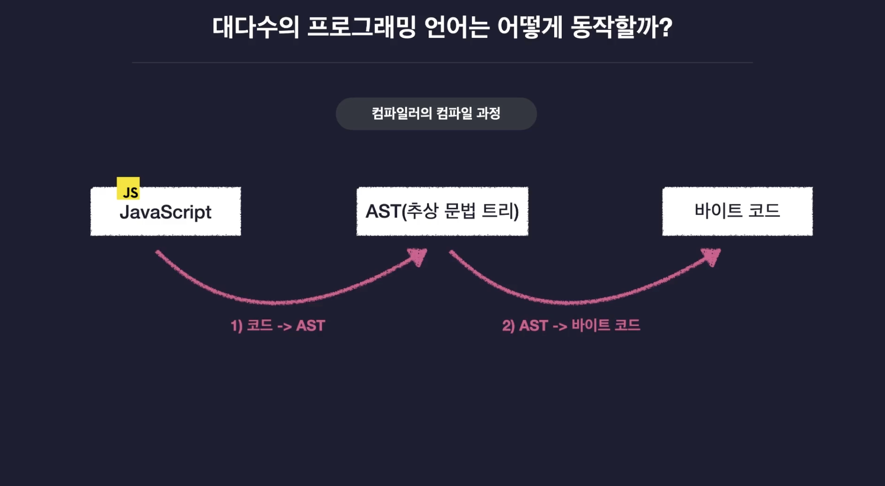
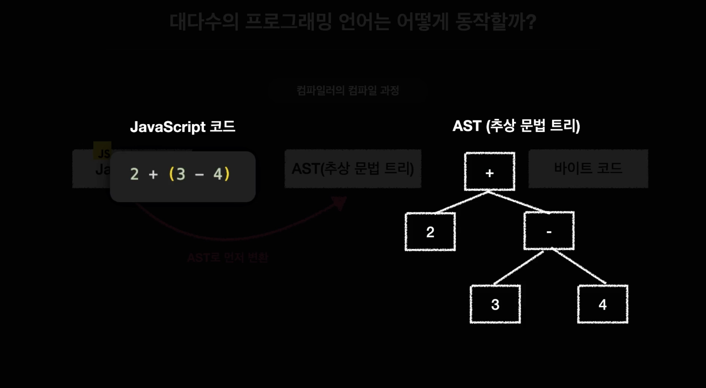
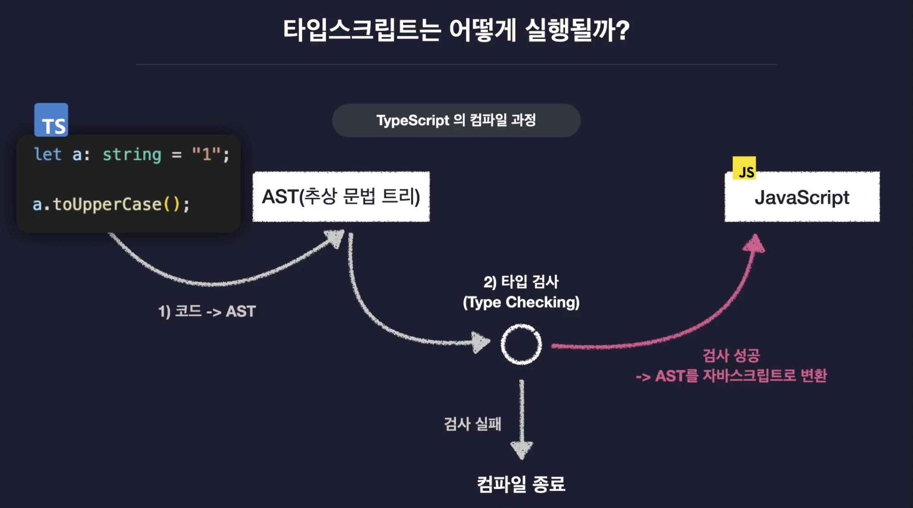
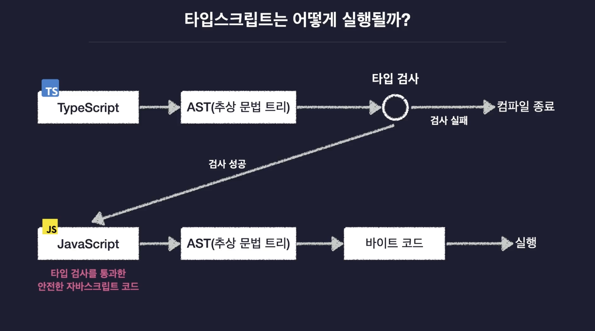

# TypeScript 동작 원리

TypeScript는 실행 전 컴파일 단계에서 타입 검사를 수행하고, 검사를 통과한 코드를 JavaScript로 트랜스파일하여 실행한다. 즉, 안전한 자바스크립트 코드를 만들어주는 전처리기라고 할 수 있다.

 

## 1. 컴파일러의 동작 흐름

대다수의 프로그래밍 언어는 코드를 `추상 구문 트리(AST)`로 변환하고, 그 구조를 기반으로 `바이트 코드`를 만들어 실행한다.  
이 과정을 통해 컴퓨터는 사람이 작성한 코드를 이해하고 실행할 수 있다.

 

## 2. JavaScript의 컴파일 과정

JavaScript 역시 실행 전 내부적으로 `AST`를 생성하지만, 타입 검사 과정이 존재하지 않아 런타임에 오류가 발생할 수 있다.

 

## 3. TypeScript의 컴파일 과정

TypeScript는 JavaScript의 컴파일 과정에 `타입 검사(Type Checking)` 단계를 추가한다.

1. TypeScript 코드를 AST로 변환
2. 타입 검사 수행
   - 검사 `통과` 시 → JavaScript 코드로 변환
   - 검사 `실패` 시 → 컴파일 중단 및 오류 메시지 출력

즉, TypeScript는 안전한 JavaScript를 생성하기 위한 전처리 언어다.

 

## 4. TypeScript → JavaScript 변환 과정

타입 검사를 통과한 후 생성된 JS는 결국 런타임에서 실행되지만, 그 이전에 오류를 미리 차단하기 때문에 코드의 안정성이 크게 향상된다.

 

## 5. TypeScript 동작 요약

| 단계                         | 설명                                          | 결과                |
| ---------------------------- | --------------------------------------------- | ------------------- |
| 1. 파싱 (Parsing)            | TS 컴파일러가 코드를 읽어 AST 생성            | 코드 구조 분석      |
| 2. 타입 검사 (Type Checking) | 변수·함수·표현식의 타입을 검사하여 오류 탐지  | 오류 시 컴파일 중단 |
| 3. 트랜스파일 (Transpile)    | AST를 기반으로 타입 주석 제거 후 JS 코드 생성 | 안전한 JS 코드 출력 |
| 4. 실행 (Execution)          | 변환된 JS 코드가 런타임에서 실행              | 프로그램 실행 완료  |

 
<Comment/>
