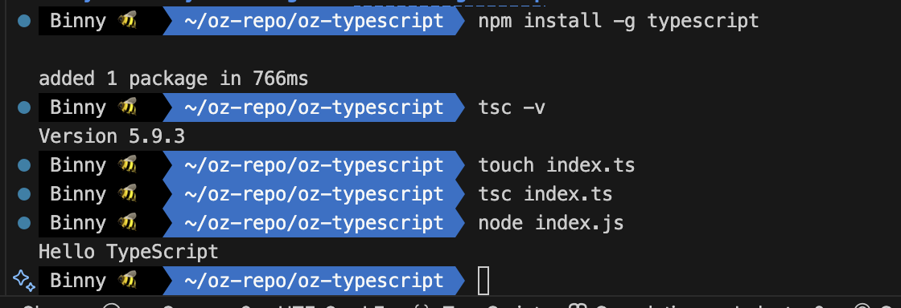

# TypeScript 설치 및 환경 설정

TypeScript는 Node.js 환경에서 npm 패키지로 설치 가능하다.  
먼저 Node.js가 설치되어 있어야 하며, npm 또는 yarn을 통해 설치 가능하다.

::: info Reference

- [Download TypeScript](https://www.typescriptlang.org/download/)
- [TS config](https://www.typescriptlang.org/tsconfig/)

:::

<br>

## 1. Install

### 프로젝트에 설치

```bash
$ npm install typescript --save-dev
```

<br>

### 전역 설치

```bash
$ npm install -g typescript
```

<br>

::: info 🔍 버전 확인

```bash
$ tsc -v
```

- `tsc` = TypeScript Compiler

:::

<br>

## 2. Compile

```bash
$ tsc index.ts
```

::: code-group

```ts [index.ts]
function hello(name: string) {
  console.log(`Hello ${name}`);
}

hello("TypeScript");
```

```js [index.js]
function hello(name) {
  console.log("Hello ".concat(name));
}
hello("TypeScript");
```

:::
::: details 🐛 실습

:::

<br>

## 3. Run with TSX (TypeScript Execute)

TypeScript 코드를 실행하려면 보통 두 단계를 거친다:

```bash
$ tsc src/index.ts     # TypeScript → JavaScript 컴파일
$ node src/index.js    # 변환된 JavaScript 실행
```

- `tsx`는 이 과정을 한 번에 실행할 수 있는 도구다.  
  (Node.js 20+ 환경에서는 ts-node 대신 tsx 사용 권장)

<br>

### 설치 방법

```bash
# 프로젝트 로컬 설치 (권장)
$ npm i -D typescript tsx

# 글로벌 설치
$ sudo npm i -g tsx
```

<br>

### 실행 방법

```bash
# npx로 실행
$ npx tsx src/index.ts
```

<br>

## 4. Compiler 설정 `tsconfig.json`

```bash
# tsconfig.json 생성
$ tsc --init
```

`tsconfig.json`은 타입스크립트 프로젝트 단위의 환경설정 파일로, 컴파일러 동작 방식, 출력 경로, 대상 JS 버전 등을 지정한다.

<br>

### tsconfig.json

```json
{
  "compilerOptions": {
    "target": "ESNext",
    "module": "ESNext",
    "outDir": "dist",
    "strict": true,
    "moduleDetection": "force",
    "esModuleInterop": true,
    "forceConsistentCasingInFileNames": true,
    "skipLibCheck": true,
    "noUncheckedIndexedAccess": true
    // "lib": ["ES2022", "DOM"]
  },
  "include": ["src/**/*"]
}
```

- `target`: 어떤 버전의 JS로 변환할지
- `module`: 모듈 시스템 설정
- `strict`: 모든 타입 검사를 활성화
- `outDir`: 결과 JS 파일 저장 위치
- `include`: TS 컴파일에 포함할 경로

<br>

- `moduleDetection`: TypeScript가 파일을 모듈로 인식하는 기준을 지정하는 옵션 (default: "auto")

  기본적으로 TypeScript 파일은 전역(글로벌) 스코프를 공유한다.  
   따라서 파일이 달라도 같은 이름의 변수를 선언하면 충돌 오류가 발생할 수 있다.

  ```ts
  // a.ts
  const message = "Hello";

  // b.ts
  const message = "Hi"; // Duplicate identifier 'message'
  ```

  해결 방법  
  TypeScript는 파일을 `모듈`로 인식해야 각 파일이 독립적인 스코프를 가지게 된다.  
  이를 위한 방법은 두 가지다:

  1. 직접 모듈 키워드 사용

  ```ts
  const message = "Hello";

  export {}; // 혹은 import 문 추가
  ```

  2. 자동 모듈 인식 강제

  ```json
  {
  "compilerOptions": {
    "moduleDetection": "force"
  }
  ```

  `import / export` 문이 없어도 모든 TS 파일을 자동으로 모듈로 간주하여 전역 충돌을 방지한다.

<br>
<Comments/>
