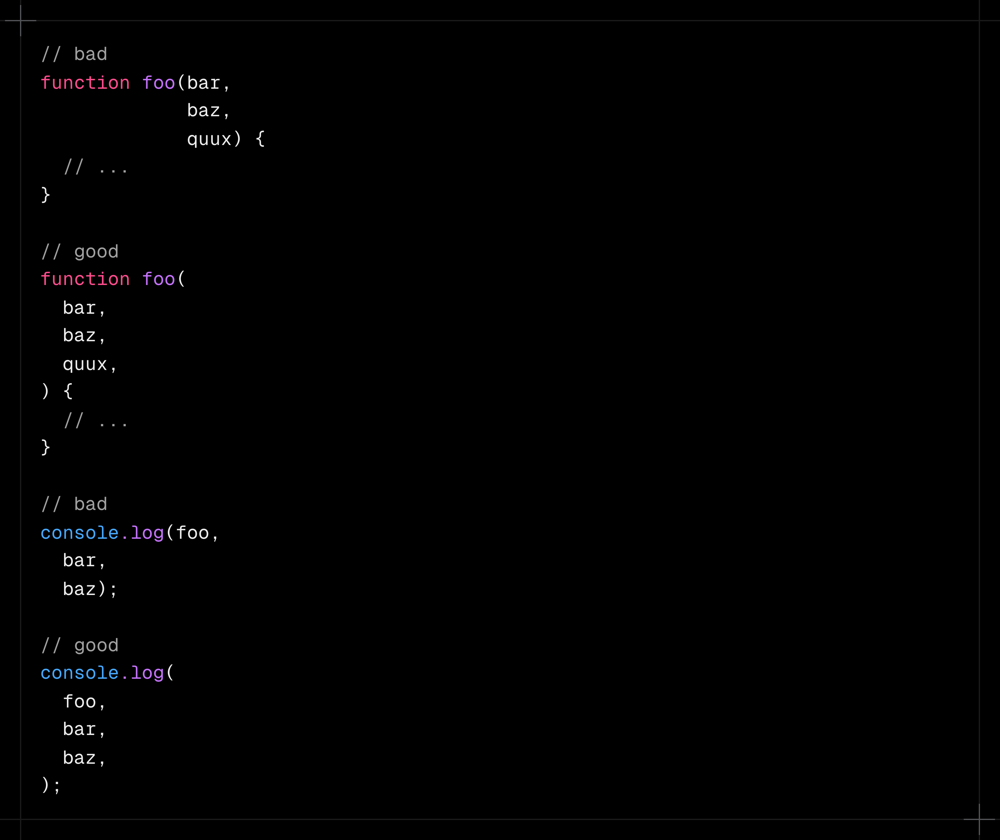

# Functions (함수)

::: info 🧩 Notes
함수는 코드의 핵심 단위다.  
Airbnb 가이드는 명확한 선언, 예측 가능한 동작, 일관된 스타일을 통해 가독성과 유지보수성을 높이는 함수를 작성하도록 권장한다.
:::

## 1. 함수 선언식 대신 `기명 함수 표현식` 사용

eslint: [func-style](https://eslint.org/docs/latest/rules/func-style)

```js
// bad
function foo() {
  // ...
}

// bad
// 익명 함수는 스택 추적이 어렵다.
const foo = function () {
  // ...
};

// good
// 변수명과 구분되는 고유한 이름(lexical name)을 지정
const short = function longUniqueMoreDescriptiveLexicalFoo() {
  // ...
};
```

- 함수 선언문은 호이스팅되어 정의 전에도 호출될 수 있으므로 코드 흐름이 불명확해진다.
- 함수가 크거나 복잡하다면 별도 모듈로 분리해야 한다.
- 함수 표현식에는 명시적 이름을 붙이면 디버깅 시 호출 스택 추적이 용이하다.

<br>

## 2. 즉시 실행 함수(IIFE)는 괄호로 감싸기

eslint: [wrap-iife](https://eslint.org/docs/latest/rules/wrap-iife.html)

```js
// 즉시 호출 함수 표현식 (IIFE)
(function () {
  console.log('Welcome to the Internet. Please follow me.');
})();
```

- IIFE는 하나의 `표현식` 단위이므로, 괄호로 감싸 명확히 표현해야 한다.
- 단, `모듈 시스템 환경`을 쓰는 환경에서는 IIFE 자체가 불필요하다.

::: details 💡 즉시 실행 함수 (IIFE, Immediately Invoked Function Expression)
즉시 실행 함수는 정의되자마자 바로 실행되는 함수다. 말 그대로 함수를 선언과 동시에 호출하는 함수 표현식이다.
함수를 괄호로 감싸서 표현식으로 만들고, 마지막에 `()`로 즉시 호출하는 형태이다.

**왜 괄호로 감싸야 할까?**  
자바스크립트는 `function foo() {}`를 `선언문`으로 인식한다.  
하지만 `선언`이 아니라 `표현식`으로서 실행하고 싶기 때문에, 괄호로 감싸서 "이건 표현식이야"라고 명확하게 알려주는 것이다.

```js
// 선언문 (호출되지 않음)
function hello() {
  console.log('hello');
}

// 표현식으로 만든 뒤 즉시 실행
(function () {
  console.log('hello');
})();
```

현대 자바스크립트(ES6+)에서는 `let`, `const`, `import/export`로 스코프가 명확해졌기 때문에
`IIFE`를 직접 쓸 일은 거의 없다.  
Airbnb 가이드에서 “모듈 시스템을 쓰는 환경에서는 불필요하다”는 말이 바로 이 뜻이다!

:::

<br>

## 3. 함수는 블록 (`if / while` 등) 안에서 선언하지 말 것

eslint: [no-loop-func](https://eslint.org/docs/latest/rules/no-loop-func.html)

```js
// bad
// if 블록 안에서 선언되었는데,
if (isUser) {
  function test() {}
}

test(); // 밖에서도 호출 가능 → 문제!

// good
let test;

if (isUser) {
  test = () => {};
}

test(); // 작동
```

- 함수 선언은 블록 범위가 아닌 `함수/전역` 스코프에서만 유효하다.
- 블록 내부 선언은 브라우저마다 다르게 동작한다.

<br>

## 4. `ECMA-262`: 함수 선언문은 블록 내부에서 허용되지 않음

ECMA-262 명세에 따르면, 블록은 단순히 여러 구문을 묶는 집합일 뿐이며,  
함수 선언문은 그 안에 포함될 수 없는 별도의 문법 요소로 간주된다.

```js
// bad
if (currentUser) {
  // 블록 내부에서 함수 선언문 사용
  function test() {
    console.log('Nope.');
  }
}

// good
let test;

if (currentUser) {
  // 함수 표현식으로 안전하게 작성
  test = () => {
    console.log('Yup.');
  };
}
```

- `bad`: ECMA-262 명세에 따르면, 함수 선언문은 함수 본문 또는 전역 코드의 최상위 수준에서만 정의할 수 있다. 즉, `if`, `for`, `while` 등 블록문 내부에서 선언하는 것은 비표준적이며, 브라우저마다 동작이 다를 수 있다.

- `good`: 함수 표현식은 `값으로 평가되는 함수`이므로 블록 내부에서도 안전하게 사용할 수 있다.
  이 방식은 명세에 부합하며, 스코프가 명확하게 `if` 블록 내부로 한정된다.

<br>

## 5. 매개변수 이름을 `arguments`로 짓지 마세요

```js
// bad
function foo(name, options, arguments) {
  // ...
}

// good
function foo(name, options, args) {
  // ...
}
```

- 자바스크립트의 모든 함수는 암묵적으로 내장 객체 `arguments`를 갖는다.  
  (이 객체에는 함수로 전달된 모든 인자가 배열 형태로 저장되어 있다.)
- 그런데 매개변수 이름을 `arguments`로 지정하면, 내장 `arguments` 객체를 덮어써버려 접근이 불가능해진다.
- 디버깅을 어렵게 만들고, 내부 로직에서 의도치 않은 동작을 일으킬 수 있다.

따라서, `args`나 `params`처럼 의미 있는 다른 이름을 사용하는 것이 안전하다.

<br>

## 6. `arguments` 대신 Rest 문법(...) 사용

eslint: [prefer-rest-params](https://eslint.org/docs/latest/rules/prefer-rest-params)

```js
// bad
function concatenateAll() {
  const args = Array.prototype.slice.call(arguments);
  return args.join('');
}

// good
function concatenateAll(...args) {
  return args.join('');
}
```

- `arguments`는 배열이 아닌 유사 배열 객체이다.
- 반면 `...args`는 진짜 배열로 생성되므로, 즉시 배열 메서드를 사용할 수 있다.
- 또한 `rest 문법`을 사용하면 명시적으로 어떤 인자들을 모으는지 표현할 수 있어,
  코드의 가독성과 의도 전달력이 훨씬 높아진다.
- `arguments`는 과거 호환성 때문에 남아 있는 구문이고, 현대 자바스크립트에서는 `rest parameters`가 대체한다.

<br>

## 7. 함수 인자를 수정하지 말고 기본 매개변수(default) 사용

```js
// really bad
function handleThings(opts) {
  // 인자를 직접 변경하면 원본 참조를 오염시킬 수 있다.
  // 더 안 좋은 경우: opts가 falsy일 때 {}로 덮어써서
  // 예기치 못한 버그를 일으킬 수 있다.
  opts = opts || {};
  // ...
}

// still bad
function handleThings(opts) {
  if (opts === void 0) {
    opts = {};
  }
  // ...
}

// good
function handleThings(opts = {}) {
  // 안전하고 의도가 명확한 기본값 설정
}
```

- 인자를 직접 수정하면 원래 호출부에서 전달된 객체나 값이 예상치 못하게 사이드 이펙트가 발생할 수 있다.
- 기본 매개변수를 사용하면 함수가 호출될 때 한 번만 안전하게 기본값을 초기화하므로,
  코드가 더 예측 가능하고 선언적이 된다.

<br>

## 8. 사이드 이펙트가 있는 기본 매개변수는 피하기

```js
var b = 1;

// bad
function count(a = b++) {
  console.log(a);
}

count(); // 1
count(); // 2
count(3); // 3
count(); // 3
```

- 기본 매개변수는 안정적인 초기값을 설정하기 위한 것이지, 실행 시점마다 변하는 값을 계산하는 곳이 아니다.
- 위 예시처럼 `b++`과 같이 상태를 변경하는 표현식을 넣으면 호출 순서나 인자 유무에 따라 다른 결과가 나와 예측 가능성이 떨어진다.
- 기본값은 항상 고정된 상수나 순수한 표현식을 사용

<br>

## 9. 기본 매개변수는 항상 뒤에

eslint: [default-param-last](https://eslint.org/docs/latest/rules/default-param-last)

```js
// bad
function handleThings(opts = {}, name) {
  // ...
}

// good
function handleThings(name, opts = {}) {
  // ...
}
```

- 매개변수 순서를 예측 가능하게 유지한다.

<br>

## 10. `Function` 생성자 사용 금지

eslint: [no-new-func](https://eslint.org/docs/latest/rules/no-new-func)

```js
// bad
var add = new Function('a', 'b', 'return a + b');

// still bad
var subtract = Function('a', 'b', 'return a - b');
```

- Function 생성자는 문자열을 받아 런타임에 새 함수를 생성한다. 내부적으로 `eval()`처럼 동작하므로 보안 취약점, 디버깅/성능 문제, 스코프 차이 등의 이유로 사용을 금지한다.

<br>

## 11. 함수 시그니처에 공백 추가

eslint: [space-before-function-paren space-before-blocks](https://eslint.org/docs/latest/rules/space-before-function-paren)

```js
// good
const x = function () {};
const y = function a() {};
```

- 공백을 일관되게 유지하면 함수 이름 추가·삭제 시 수정 범위가 최소화된다.

<br>

## 12. 매개변수를 수정하지 마세요

eslint: [no-param-reassign](https://eslint.org/docs/latest/rules/no-param-reassign.html)

```js
// bad
// f1 함수는 인자로 받은 객체의 속성을 직접 바꾼다.
function f1(obj) {
  obj.key = 1;
}

// good
// f2는 전달된 obj를 수정하지 않는다. 객체 안에 key가 존재하는지 읽기만 한다.
function f2(obj) {
  const key = Object.prototype.hasOwnProperty.call(obj, 'key') ? obj.key : 1;
}
```

- 매개변수로 전달된 객체를 조작하면 원래 호출처에서 원치 않는 사이드이펙트를 일으킬 수 있다.

<br>

## 13. 매개변수를 재할당하지 마세요

eslint: [no-param-reassign](https://eslint.org/docs/latest/rules/no-param-reassign.html)

```js
// bad
// 매개변수 a를 함수 내부에서 직접 재할당함
// → 원래 인자 값이 덮어써지고, 예측 불가능한 동작을 초래한다.
function f1(a) {
  a = 1; // 매개변수 a를 강제로 1로 바꿈
  // ...
}

// falsy 값이 들어오면 a를 1로 바꿔버림
// → 호출부 입장에서는 함수가 내부적으로 인자를 바꾸는 것을 예상하기 어렵다.
function f2(a) {
  if (!a) {
    a = 1; // 새로운 값으로 덮어씀
  }
  // ...
}

// good
// 매개변수를 그대로 두고, 새로운 변수 b에 기본값을 적용
// → 원본 a는 유지되며, 불변성 보장
function f3(a) {
  const b = a || 1;
  // ...
}

// 기본 매개변수 문법 사용
// → 함수 선언부에서 기본값을 지정해 재할당 로직 자체를 제거
function f4(a = 1) {
  // ...
}
```

- 함수 내부에서 재할당하면, 외부에서 전달된 원래 인자 의미가 사라진다.
- 특히 `arguments` 객체나 최적화 엔진(V8 등)에 부정적인 영향이 있다.

<br>

## 14. 가변 인자 함수 호출 시 전개 연산자 `...` 사용

eslint: [prefer-spread](https://eslint.org/docs/latest/rules/prefer-spread)

```js
// bad
const x = [1, 2, 3, 4, 5];
console.log.apply(console, x);

// good
const x = [1, 2, 3, 4, 5];
console.log(...x);

// bad
new (Function.prototype.bind.apply(Date, [null, 2016, 8, 5]))();

// good
new Date(...[2016, 8, 5]);
```

- 실행 컨텍스트를 따로 지정할 필요가 없고, `new`와 `apply()`를 함께 쓰기 어렵기 때문이다.

::: details 🧩 `apply()`는 원래 왜 썼을까?

`apply()`는 함수에 배열 형태의 인자들을 하나씩 풀어서 전달할 때 쓰던 옛날 방식이다.

```js
const nums = [1, 2, 3];

Math.max.apply(null, nums); // 최대값 3
```

- 첫 번째 인자: 실행 컨텍스트(this)
- 두 번째 인자: 인자 리스트 (배열 또는 배열 유사 객체)

즉, `apply()`는 `this 지정`, `배열을 인자로 펼쳐서 전달` 두 역할을 동시에 했다.

<br>

**`...` 전개 연산자가 있어서 훨씬 간단해졌다.**

```js
const nums = [1, 2, 3];

// good
Math.max(...nums); // 3
```

- `...nums`는 배열을 자동으로 펼쳐줌
- this를 별도로 지정할 필요가 없음
- 가독성, 간결함, 디버깅 모두 이 방식이 훨씬 우수

<br>

**apply()는 특히 new와 함께 쓸 수 없다.**

```js
// new + apply()는 작동하지 않음
const args = [2016, 8, 5];
new Date.apply(null, args); // TypeError 발생
```

- `apply()`는 일반 함수 호출을 흉내내는 메서드라서, 생성자 호출(new)과는 호환되지 않는다.
  즉, 배열을 인자로 받아서 인스턴스를 만들기가 불가능해졌다.

<br>

**전개 연산자는 이런 한계를 해결**

```js
const args = [2016, 8, 5];
const date = new Date(...args); // 동작
```

- 전개 연산자는 생성자 호출에서도 동작한다.
- `apply()`처럼 `Function.prototype.bind`를 억지로 쓸 필요가 없다.

<br>

| 구분        | 예시                                                              | 특징                             |
| ----------- | ----------------------------------------------------------------- | -------------------------------- |
| `apply()`   | `console.log.apply(console, arr)`                                 | this를 지정해야 함, `new` 불가능 |
| 전개 연산자 | `console.log(...arr)`                                             | 간결, 안전, `new`도 가능         |
| 복잡한 방식 | `new (Function.prototype.bind.apply(Date, [null, 2016, 8, 5]))()` | 불필요하게 복잡함                |
| 깔끔한 방식 | `new Date(...[2016, 8, 5])`                                       | 읽기 쉽고 표준적인 코드          |

<br>

`전개 연산자(...)`는 현대 자바스크립트의 표준적인 인자 전달 방식이다.  
`apply()`보다 짧고 명확하며, `new`와도 호환되므로 일관된 문법을 유지할 수 있다.
:::

<br>

## 15. 여러 줄 함수 호출은 항목별로 한 줄씩 정렬

eslint: [function-paren-newline](https://eslint.org/docs/latest/rules/function-paren-newline)



- 여러 줄에 걸친 함수 시그니처나 호출은 배열, 객체 등 다른 멀티라인 리스트와 동일하게 `각 인자를 한 줄씩 배치`한다.
- 들여쓰기를 일관되게 맞추고, 함수 인자에는 [트레일링 콤마 `,`](https://developer.mozilla.org/ko/docs/Web/JavaScript/Reference/Trailing_commas)를 사용하지 않는다.
- 인자가 짧거나 간단한 경우 한 줄로 작성해도 된다.
