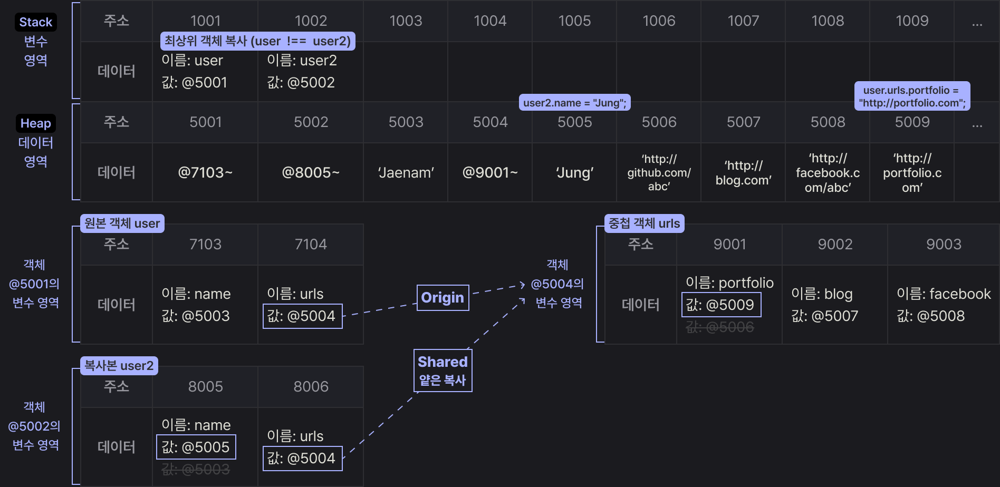

# 🔣 Data Types

:::info 🎯 Learning Goals

- 기본형과 참조형 타입이 다르게 동작하는 이유? <Badge type="tip" text="# 메모리와 데이터" /> <Badge type="tip" text="# 식별자와 변수의 개념" />

:::

<!-- [데이터 타입 종류](#데이터-타입의-종류) -->

## 01. 데이터 타입의 종류

```plaintext {7}
Primitive Type 기본형
├── Number
├── String
├── Boolean
├── null
├── undefined
└── Symbol

```

```plaintext {6,7,8}
Reference Type 참조형
└── Object
    ├── Array
    ├── Function
    ├── RegExp(Regular Expression)
    ├── Set / WeakSet
    ├── Map / WeakMap
    └── ...

※ 표시된 데이터 타입은 ES6(ECMAScript 2015)에서 도입된 것
```

자바스크립트에서 데이터는 기본형과 참조형으로 나뉜다.

- `기본형`은 실제 값을 직접 저장
- `참조형`은 값이 저장된 메모리 주소(참조)를 저장

이 차이는 변수 복사, 비교 연산, 메모리 관리에서 중요한 차이를 만든다.

<br>

### Primitive Type vs Reference Type

| 항목             | Primitive Type         | Reference Type                    |
| ---------------- | ---------------------- | --------------------------------- |
| 저장 방식        | 값 자체를 저장         | 참조(주소)를 저장                 |
| 메모리 저장 위치 | Stack                  | Heap (참조는 Stack에 저장)        |
| 복사 시 동작     | 값 복사 (깊은 복사)    | 참조 복사 (얕은 복사)             |
| 변경 가능성      | 불변 (Immutable)       | 가변 (Mutable)                    |
| 비교 방식        | 값 자체를 비교 (===)   | 주소(참조값)를 비교 (===)         |
| typeof 결과 예시 | "number", "string" 등  | "object" 또는 "function"          |
| 대표 예시        | 42, "text", true, null | {}, \[], function() {}, new Map() |

:::details 💡 `null`은 왜 typeof 결과가 "object"일까?

자바스크립트에서 `typeof null`은 `"object"`를 반환한다.

이는 자바스크립트 오래된 버그로, `null`은 실제로 객체가 아님에도 불구하고 object로 인식한다.

```js
typeof null === "object"; // true
```

이 버그는 이미 너무 많은 코드에서 사용되어 있어서 지금까지도 고쳐지지 않고 유지되고 있다.

```js
const value = null;

value === null; // true
```

정확하게 'null'인지 확인하려면 `typeof` 대신 `=== null` 비교를 하는 게 정확하다.

<br>

[📎 The history of “typeof null”](https://2ality.com/2013/10/typeof-null.html)
:::

<br>

⚠️ 기본형은 불변하다고 하는데, 변수에 값을 재할당하는 것은 문제가 되지 않는다.<br>
왜 불변인데도 변수에 새로운 값을 넣을 수 있는 걸까?

```js
let a = 10;
let b = a;

b = 20;

console.log(a); // 10
console.log(b); // 20
```

이 질문을 이해하려면 자바스크립트에서 값이 메모리에 어떻게 저장되고,  
변수(식별자)가 그 값을 어떻게 참조하는지에 대한 개념이 필요하다.

## 02. 데이터 타입에 관한 배경지식

### 2-1. 메모리와 데이터

컴퓨터는 모든 데이터를 0과 1로 저장한다. 메모리는 이진수인 `비트`로 구성되어 있으며,
각 비트는 `고유한 식별자`를 가지고 있어 데이터를 저장하고 접근할 수 있다.<br>

최소 단위인 `비트`로 데이터를 관리하는 것은 비효율적이므로, 여러 비트를 묶어 `바이트`라는 단위로 사용한다.
1바이트는 8비트로 구성되며, 256(2⁸)개의 값을 표현할 수 있어 효율적인 데이터 저장과 접근이 가능하다. <br>
따라서 컴퓨터가 메모리를 관리할 때는 `바이트 단위의 주소`를 사용한다.

```less
 1bit (= 0 or 1)
  ↓
| 0 | 1 | 0 | 1 | 1 | 0 | 0 | 1 | ← 1byte (=8 bits)

```

- `비트 (bit)`: 0 또는 1만 표현할 수 있는 메모리의 최소 단위
- `바이트 (byte)`: 1 바이트는 8개의 비트로 구성

::: info 💡
자바스크립트에서 number 타입은 64비트(8바이트)를 확보한다.
:::

<br>

### 2-2. 식별자와 변수

```js
// age라는 이름으로 변수 공간을 만들고, 그 안에 30 이라는 값을 저장
let age = 30;
```

- `변수 variable`: 변할 수 있는 데이터(숫자, 문자열, 객체, 배열 등)가 담길 수 있는 공간(메모리)

- `식별자 identifier`: 어떤 데이터를 식별하는 데 사용하는 이름, 변수명

## 03. 변수 선언과 데이터 할당

### 3-1. 변수 선언

```js
var a;
```

- `a`라는 식별자를 가진 변수를 선언한다.
- 선언 시에는 아직 어떤 값도 할당하지 않았기 때문에 `undefined`가 저장된다.
- 나중에 원하는 데이터를 이 변수에 할당할 수 있다.

<br>


<small>`var a;` 변수 선언에 대한 메모리 영역의 변화</small>

- ① 컴퓨터는 메모리에서 비어있는 공간을(@1003)를 확보한다.
- ② 확보한 공간의 식별자를 `a`라고 지정한다.

이후 사용자가 `a`에 접근하고자 하면 컴퓨터는 메모리에서 'a라는 이름을 가진 주소'를 검색해 '해당 공간에 담긴 데이터'를 반환한다.

<br>

### 3-2. 데이터 할당

```js
// 변수 선언과 할당을 분리한 경우
var a;
a = "abc";

// 변수 선언과 할당을 동시에 한 경우
var a = "abc";
```

위 두 코드는 자바스크립트 엔진 입장에서 동일한 방식으로 처리한다.<br>
즉, 데이터를 저장할 메모리 공간을 확보하고, 그 주소를 변수에 연결하는 방식으로 동작한다.

<br>


<small>데이터 할당에 대한 메모리 영역의 변화</small>

- ① 변수 영역의 빈 공간 `@1003`을 확보한다.
- ② 해당 공간의 식별자를 `a`라고 지정한다.
- ③ 데이터 영역의 빈 공간 `@5004`에 문자열 'abc'를 저장한다.
- ④ 변수 영역에서 `a` 식별자를 검색한다.
- ⑤ 앞서 저장한 문자열의 주소 `@5004`를 `@1003`의 공간에 대입한다.

<br>

#### ⚠️ 값을 변수 영역에 직접 저장하지 않는 이유

자바스크립트는 문자열처럼 크기가 가변적인 데이터를 다루기 때문에, 변수 공간에 직접 값을 저장하면 비효율적이다.

```js
var a = "abc";
a = a + "defg";
console.log(a); // abcdefg
```

위와 같이 문자열이 변경되면 더 큰 메모리 공간 필요 → 새 공간 확보 → 데이터를 복사하는 비효율적인 작업이 반복된다.

따라서 자바스크립트는 변수와 데이터를 별도의 메모리 영역에 나누어 저장함으로써 데이터 변경이 자유롭고, 메모리도 효율적으로 관리될 수 있도록 설계되어 있다.

<br>


<small>문자열 변환에 대한 메모리 영역의 변화</small>

- 기존 문자열 'abc'는 주소 `@5004`에 저장되어 있었지만,
  'abcdefg'는 기존 공간에 덮어쓰지 않고, 새롭게 확보된 `@5005`에 저장된다.
- 변수 `a`는 기존에 참조하던 `@5004` 대신, `@5005`를 참조하게 된다.
- 더 이상 참조되지 않는 `@5004`는 가비지 컬렉터(GC)에 의해 제거될 수 있다.

## 04. 기본형 데이터와 참조형 데이터

### 4-1. 불변값

변수와 상수의 차이점은 `변경 가능성`에 있다. 변경 가능성의 대상은 `변수 영역 메모리`이다.

- 변경할 수 있으면 변수
- 변경할 수 없으면 상수

<br>

불변성 여부를 구분할 때의 변경 가능성 대상은 `데이터 영역 메모리`이다.

| 구분      | 기준이 되는 메모리 영역     | 설명                                          |
| --------- | --------------------------- | --------------------------------------------- |
| 변수/상수 | 변수 영역 (Variable Memory) | 변수 공간에 새로운 값을 다시 저장할 수 있는가 |
| 불변값    | 데이터 영역 (Data Memory)   | 값 자체를 수정할 수 있는가                    |

<br>

#### 기본형 데이터는 모두 불변값

```js
var a = "abc";
a = a + "def";

var b = 5;
var c = 5;
b = 7;
```


<br>

- `b = 7`은 변수 `b`에 저장된 값 '5'를 변경하는 것이 아니라, 새로운 값 '7'을 변수에 다시 할당하는 동작이다.
  즉, 기존의 5는 변경되지 않는다.
- 'abc'에 'def'를 더해도 'abc' 문자열은 그대로 남고, 'abcdef'라는 새로운 문자열이 생성된다.
- 숫자, 문자열은 직접 수정되는 게 아니라, 새로운 값을 만들어 기존 값을 교체하는 방식으로 작동한다.
- 즉, 값의 변경은 항상 `새로 만드는` 방식으로만 이뤄지며, 이것이 바로 불변값의 본질이다.

<br>

#### 불변값의 특징

- 한 번 만들어진 값은 변경할 수 없으며, 변경하려는 시도는 항상 새로운 값을 생성하는 방식으로 처리된다.
- 메모리에서 더 이상 참조되지 않는 값만 가비지 컬렉터에 의해 제거된다.
- 참조되고 있는 값은 메모리에 계속 유지되며, 참조가 끊기기 전까지는 제거되지 않는다.

<br>

### 4-2. 가변값

참조형 데이터는 객체 자체는 불변값이지만, 변수에 다른 참조를 얼마든지 할당할 수 있어 `가변값`으로 동작한다.

<br>

#### 참조형 데이터 할당 과정

참조형 데이터는 객체 내부 프로퍼티를 위한 별도의 변수 영역을 사용한다. <br>
객체 자체는 데이터 영역에 저장되며, 내부 값들은 모두 불변값이다.<br>
그러나 변수는 언제든 다른 값을 참조할 수 있어, 참조형 데이터를 `불변하지 않다 → 가변값`이라고 한다.

```js
var obj1 = {
  a: 1,
  b: "bbb",
};
```


<br>

- ① 변수 obj1는 변수 영역 `@1002`에 선언, 할당된 객체 전체는 데이터 영역 `@5001`에 저장한다.
- ② 객체의 프로퍼티(a, b)는 객체 전용 변수 영역 `@7103~`에 따로 생성된다. 객체 내부에서만 접근 가능한 별도 변수 테이블이다.
- ③ 각 값 1, "bbb"는 데이터 영역의 `@5003`, `@5004`에 저장된다.
- ④ 그리고 변수 `@7103`, `@7104`에서 이 값을 참조(연결)한다.

<br>

#### 참조형 데이터의 프로퍼티 재할당

```js
var obj1 = {
  a: 1,
  b: "bbb",
};

obj1.a = 2;
```


<br>

- ① 데이터 영역에 `@5005`에 2를 저장하고, 이 주소를 `@7103`에 저장한다.
- 변수 obj가 바라보는 주소는 @5001로 변하지 않았다. 즉, 새로운 객체가 만들어진 것이 아니라 기존 객체 내부의 값만 바뀐 것이다.

<br>

### 중첩된 참조형 데이터(객체)의 프로퍼티 할당

```js
var obj = {
  x: 3,
  arr: [3, 4, 5],
};
```


- ① 변수 obj는 변수 영역 `@1002`에 선언, 할당된 객체 전체는 데이터 영역 `@5001`에 저장한다.
- ② 각 프로퍼티들을 저장하기 위해 객체 전용 변수 영역 `@7103~`을 생성하고, 그 주소를 `@5001`에 저장한다.
- ③ `@7104`에 저장한 배열 역시 내부 프로퍼티들을 저장하기 위해 별도의 변수 영역 `@8104~`을 생성한다.
- ④ 배열의 요소가 3개 이므로 3개의 변수 공간을 확보하고 각각 인덱스를 부여한다.(0, 1, 2)

::: details 💡 obj.arr[1]을 검색하면 메모리에서는 무슨 일이 일어날까?

1. obj 검색

- obj라는 식별자를 가진 주소를 찾는다. `@1002`
- 값이 주소이므로 그 주소로 이동한다. `@5001`
- 값이 주소이므로 그 주소로 이동한다. `@7103 ~`

<br>

2. obj.arr 검색

- arr이라는 식별자를 가진 주소를 찾는다. `@7104`
- 값이 주소이므로 그 주소로 이동한다. `@5003`
- 값이 주소이므로 그 주소로 이동한다. `@8104 ~`

<br>

3. obj.arr[1] 검색

- 인덱스 1에 해당하는 주소를 찾는다. `@8105`
- 값이 주소이므로 그 주소로 이동한다. `@5004`
- 값이 숫자형 데이터이므로 4를 반환한다.

:::

<br>

### 중첩된 참조형 데이터(객체)의 프로퍼티 재할당

```js
var obj = {
  x: 3,
  arr: [3, 4, 5],
};

obj.arr = "str";
```


- @5006에 문자열 'str'을 저장하고, 그 주소를 @7104에 저장한다.
- @5003은 더이상 자신의 주소를 참조하는 변수가 하나도 없게된다. 어떤 데이터에 대해 자신의 주소를 참조하는 변수의 개수를 참조 카운트라고 한다. @5003의 참조 카운트는 1에서 @7104에 @5006이 저장되는 순간 0이 된다.
- 참조 카운트가 0인 메모리 주소는 가비지 컬렉터의 수거 대상이 된다.
- @5003에 담겨 있던 데이터 `@8104~` 값도 사라지고, 연쇄적으로 `@8104~`의 각 데이터들의 참조 카운트도 0이 되고 이또한 GC의 대상이 되어 함께 사라진다.

::: info 🗑️ Garbage Collector
가비지 컬렉터는 특정 시점이나 메모리 사용량이 포화상태에 임박할 때마다 자동으로 수거 대상들을 수거한다.<br>
수거된 메모리는 다시 새로운 값을 할당할 수 있는 빈 공간이 된다.
:::

::: info 💡 가변값의 핵심
객체 내부 값은 불변이지만, 객체 자체를 참조하는 변수는 언제든 새로운 값을 가리킬 수 있다.
:::

<br>

### 4-3 변수 복사 비교

기본형 데이터와 참조형 데이터의 변수 복사 비교

```js
var a = 10;
var b = a;

var obj1 = { c: 10, d: "ddd" };
var obj2 = obj1;
```

## 05. 불변 객체

불변 객체(Immutable Object)란, 한 번 생성되면 그 상태(state)가 절대 바뀌지 않는 객체를 의미한다. 즉, 객체의 프로퍼티나 값이 변경되지 않고 항상 동일한 값을 유지하는 특징이 있다.

<br>

### 5-1. 불변 객체를 만드는 간단한 방법

#### 🚨 객체의 가변성에 따른 문제점

```js {7,8,12} ts:line-numbers {1}
var user = {
  name: "Jaenam",
  gender: "male",
};

var changeName = function (user, newName) {
  var newUser = user; // 기존 객체를 그대로 참조
  newUser.name = newName; // 기존 객체의 name이 변경
  return newUser;
};

var user2 = changeName(user, "Jung");

if (user !== user2) {
  console.log("유저 정보가 변경되었습니다.");
}
console.log(user.name, user2.name); // Jung Jung
console.log(user === user2); // true
```

- user와 user2는 동일한 객체를 참조하고 있으므로, 내부 값을 바꾸면 원본 객체까지 함께 변경된다.
- `changeName()` 함수는 마치 새로운 유저 객체를 만드는 것처럼 보이지만,
  실제로는 기존 객체의 참조를 복사했기 때문에, 함수 내 변경이 `외부 객체인 user`까지 영향을 준다.
- 이러한 상태 변경은 예상치 못한 사이드 이펙트를 유발할 수 있다.

<br>

#### ✅ 객체의 가변성에 따른 문제점의 해결 방법

```js {8,9,13} ts:line-numbers {1}
var user = {
  name: "Jaenam",
  gender: "male",
};

var changeName = function (user, newName) {
  return {
    name: newName, // name만 새 값으로
    gender: user.gender, // gender는 기존 값 그대로 복사
  };
};

var user2 = changeName(user, "Jung");

if (user !== user2) {
  console.log("유저 정보가 변경되었습니다."); // 유저 정보가 변경되었습니다.
}
console.log(user.name, user2.name); // Jaenam Jung
console.log(user === user2); // false
```

- changeName() 함수는 기존 객체를 복사하듯 새로운 객체를 만들어 리턴한다.
- 단, name은 `newName`으로 교체하고, `gender: user.gender`는 기존 값을 얕은 복사 형태로 가져와 새로운 객체를 만들어 반환한다.
- user, user2는 각자 다른 객체 주소를 가리킨다. user2만 바뀌었고, user는 원래 상태를 유지한다.

<br>

#### 기존 정보를 복사해서 새로운 객체를 반환하는 함수(얕은 복사)

```js {8,9,13} ts:line-numbers {1}
var copyObject = function (target) {
  var result = {};
  for (var prop in target) {
    result[prop] = target[prop];
  }
  return result;
};
```

- result라는 새로운 객체를 만들고 반환한다.
- `for-in` 문으로 target 객체의 모든 속성(prop)을 반복하면서, 각 속성의 값을 result에 복사한다.

::: info 💡 왜 이렇게 copyObject() 복사 함수를 따로 만들까?

- 속성이 많을 경우 직접 { a: x, b: y, c: z }처럼 일일이 작성하기 어렵기 때문이다.
- 어떤 객체든 `재사용` 가능한 일반 함수로 만들 수 있다.
- `불변 객체 원칙`을 지킬 수 있다.

:::

<br>

#### copyObject를 이용한 객체 복사

```js {15} ts:line-numbers {1}
var copyObject = function (target) {
  var result = {};
  for (var prop in target) {
    result[prop] = target[prop];
  }
  return result;
};

var user = {
  name: "Jaenam",
  gender: "male",
};

var user2 = copyObject(user);
user2.name = "Jung"; // 복사본만 수정

if (user !== user2) {
  console.log("유저 정보가 변경되었습니다."); // 유저 정보가 변경되었습니다.
}
console.log(user.name, user2.name); // Jaenam Jung
console.log(user === user2); // false
```

::: details 메모리 영역의 변화보기

:::

- 협업 시 user 객체 내부 변경이 필요할 때는 copyObject() 함수를 사용하기로 합의하고 그 규칙을 지킨다면 user 객체가 곧 불변객체라고 볼 수 있다.
- copyObject()는 `얕은 복사`만 수행하므로, 중첩 객체가 있다면 `깊은 복사`가 필요하다.

<br>

### 5-2. 얕은 복사와 깊은 복사

- 얕은 복사(shallow copy): 바로 아래 단계의 값만 복사하는 방법
- 깊은 복사(deep copy): 객체 내부의 모든 중첩된 값까지 재귀적으로 복사하는 방법

<br>

#### 중첩된 객체에 대한 얕은 복사

```js {19,22,25} ts:line-numbers {1}
var copyObject = function (target) {
  var result = {};
  for (var prop in target) {
    result[prop] = target[prop];
  }
  return result;
};

var user = {
  name: "Jaenam",
  urls: {
    portfolio: "http://github.com/abc",
    blog: "http://blog.com",
    facebook: "http://facebook.com/abc",
  },
};
var user2 = copyObject(user);

user2.name = "Jung";
console.log(user.name === user2.name); // false

user.urls.portfolio = "http://portfolio.com";
console.log(user.urls.portfolio === user2.urls.portfolio); // true

user2.urls.blog = "";
console.log(user.urls.blog === user2.urls.blog); // true
```

::: details 메모리 영역의 변화보기

:::

- 얕은 복사는 객체의 `최상위 프로퍼티`만 복사하기 때문에, user 객체에 직접 속한 프로퍼티인 `name`은 새로운 메모리에 복사된다.
- 반면, 중첩 객체인 `urls`는 주소(참조값)만 복사되어 user와 user2가 `같은 urls 객체를 공유`하게 된다.
- 따라서 urls 내부의 프로퍼티들은 복사되지 않고, 기존 데이터를 그대로 참조하게 된다.

<br>

⚠️ 깊은 복사 또는 불변성 유지의 중요성 <br>
얕은 복사는 중첩된 객체 구조에서 복사본과 원본이 내부 객체를 공유하기 때문에, 의도치 않은 사이드 이펙트가 발생할 수 있다. 상태의 예측 가능성을 높이고 의도치 않은 변경을 막기 위해서는 `깊은 복사` 또는 `불변성을 유지하는 설계`가 중요하다.

<br>

#### 중첩된 객체에 대한 깊은 복사

```js {19} ts:line-numbers {1}
var copyObject = function (target) {
  var result = {};
  for (var prop in target) {
    result[prop] = target[prop];
  }
  return result;
};

var user = {
  name: "Jaenam",
  urls: {
    portfolio: "http://github.com/abc",
    blog: "http://blog.com",
    facebook: "http://facebook.com/abc",
  },
};

var user2 = copyObject(user);
user2.urls = copyObject(user.urls);

user.urls.portfolio = "http://portfolio.com";
console.log(user.urls.portfolio === user2.urls.portfolio); // false

user2.urls.blog = "";
console.log(user.urls.blog === user2.urls.blog); // false
```

- `user2 = copyObject(user)` → user의 1단계 프로퍼티(name, urls)만 얕게 복사한다.
- `user2.urls = copyObject(user.urls)`→ 객체의 프로퍼티 중 값이 참조형 데이터(객체)인 경우 다시 그 내부의 프로퍼티들도 복사해야 한다.
- 따라서 `user.urls`와 `user2.urls`는 서로 다른 객체를 참조하게 되어,
  이후 각각의 변경이 독립적으로 작동하고, 불필요한 의존성도 사라진다.

::: info 📌 요약
중첩 객체를 복사할 때는 참조형 프로퍼티에 대해서도 재귀적으로 복사해 주어야, 원본과 복사본이 완전히 분리되어 안전하게 관리할 수 있다.
:::

::: details 🔁 재귀(Recursion)란?

"자기 자신을 다시 호출하는 함수나 동작 방식"을 의미한다.
재귀는 일반적으로 복잡한 구조나 중첩된 문제를 간단한 단위로 나눠서 처리할 때 사용된다.

<br>

객체 복사에 쓰이는 재귀

```js
var user = {
  name: "Hyebin",
  urls: {
    blog: "http://blog.com",
    github: {
      main: "http://github.com",
    },
  },
};
```

위처럼 객체 안에 또 객체가 있는 중첩 구조에서는, 얕은 복사로는 내부까지 모두 복사되지 않기 때문에
"깊은 복사"를 하려면 이 중첩된 구조를 전부 하나하나 따라 들어가서 모든 객체를 새로 복사해야 한다.
이때 사용하는 방식이 재귀(recursion)이다.

<br>

| 재귀 함수   | 자기 자신을 호출하는 함수 (종료 조건이 꼭 필요함)       |
| ----------- | ------------------------------------------------------- |
| 재귀적 복사 | 객체나 배열처럼 중첩된 구조를 따라가며 전부 복사하는 것 |

:::

<br>

#### 객체의 깊은 복사를 수행하는 범용 함수

```js {5} ts:line-numbers {1}
var copyObjectDeep = function (target) {
  var result = {};
  if (typeof target === "object" && target !== null) {
    for (var prop in target) {
      result[prop] = copyObjectDeep(target[prop]);
    }
  } else {
    result = target;
  }
  return result;
};
```

- copyObjectDeep()는 중첩 구조를 따라가며 깊은 복사를 수행하는 재귀 함수이다.
- `typeof target === "object" && target !== null` 조건을 통해
  null은 제외하고 객체와 배열을 구분하지 않고 모두 복사 대상으로 처리한다.
- for-in 반복문을 통해 모든 프로퍼티들을 순회하며, 그 값에 대해 다시 `copyObjectDeep()`을을 호출하여 내부에 중첩된 객체까지 재귀적으로 복사한다.
- 복사 대상이 원시값일 경우에는 재귀 호출 없이 그대로 복사된다.

```js
// 깊은 복사 결과 확인
var obj = {
  a: 1,
  b: {
    c: null,
    d: [1, 2],
  },
};
var obj2 = copyObjectDeep(obj);

obj2.a = 3;
obj2.b.c = 4;
obj.b.d[1] = 3;

console.log(obj); // { a: 1. b: { c: null, d: [1, 3] } }
console.log(obj2); // { a: 3. b: { c: 4, d: { 0: 1, 1: 2 } } }
```

<br>

#### JSON을 활용한 간단한 깊은 복사

`JSON.stringify()` `JSON.parse()`

```js {2} ts:line-numbers {1}
var copyObjectViaJSON = function (target) {
  return JSON.parse(JSON.stringify(target));
};

var obj = {
  a: 1,
  b: {
    c: null,
    d: [1, 2],
    func1: function () {
      console.log(3);
    },
  },
  func2: function () {
    console.log(4);
  },
};

var obj2 = copyObjectViaJSON(obj);

obj2.a = 3;
obj2.b.c = 4;
obj.b.d[1] = 3;

console.log(obj); // { a: 1. b: { c: null, d: [1, 3], func1: f() }, func2: f() }
console.log(obj2); // { a: 3. b: { c: 4,    d: [1, 2] } }
```

- `copyObjectViaJSON()` 함수는 객체를 JSON 문자열로 변환한 뒤 다시 객체로 파싱하여
  내부 구조를 깊은 복사하는 간단한 방법이다.
- `JSON.stringify(target)`을 통해 객체를 문자열로 직렬화한 뒤,
  `JSON.parse()`를 사용해 새로운 객체를 생성한다.
- 이 과정에서 객체의 중첩 구조는 전부 문자열로 풀어졌다가 새롭게 재구성되므로,
  원본 객체와는 완전히 분리된 새로운 객체가 생성된다.

<br>

::: info ⚠️ 주의할 점
`JSON.stringify()`는 다음과 같은 값들을 직렬화하지 못한다:

- function, undefined, Symbol, Date, Map, Set, 순환 참조 등
- 위 예제에서도 `func1`, `func2`는 obj2에 포함되지 않고 사라진 것을 볼 수 있다.
- 따라서 이 방식은 단순하고 순수한 데이터 객체에만 사용하는 것이 안전하다.

:::

<br>

> 참고 출처: 『코어 자바스크립트』, 위키북스 [예제코드 다운로드](https://wikibook.co.kr/corejs/)

## 자바스크립트 메모리 구조

```plaintext {2,6}
JavaScript Memory
├── Stack Memory
│   ├── 변수
│   ├── Primitive Type: 값 자체 저장
│   └── 정적 할당: 실행 시 고정된 크기로 메모리 할당
└── Heap Memory
    ├── Reference Type: 주소를 통해 데이터 참조
    └── 동적 할당: 런타임 중 필요에 따라 메모리 확보
```

- 기본형은 Stack에 값 자체가 저장되고, 참조형은 Heap에 데이터를 저장하고 Stack엔 주소가 저장된다.
- Stack은 접근 속도가 빠르지만 공간이 제한적이고, Heap은 유연하지만 접근 속도가 느리다.
- 이 구조를 이해하면 다음과 같은 차이를 쉽게 파악할 수 있다. <br>
  : 기본형은 값 자체가 복사되어 완전히 분리된다.<br>
  : 참조형은 같은 객체를 가리키므로 복사해도 함께 바뀐다.<br>
  : 참조형은 Heap에 데이터를 저장하고 Stack에는 주소를 저장하기 때문에, 메모리 할당 과정에서 한 단계를 더 거친다. 이로 인해 기본형은 직접 값을 다루는 반면, 참조형은 주소를 통해 간접적으로 데이터를 다룬다.

<br>

### 기본형은 왜 변수 간 영향이 없을까? (Stack에 값 자체 저장)

```js
let a = 10;
let b = a;
b = 20;
```

```less
Stack
┌────────────┐
│ a = 10     │ ← 값 자체 저장
│ b = 10     │ ← a의 값을 복사
└────────────┘

b 값을 20으로 바꾸면,
┌────────────┐
│ a = 10     │
│ b = 20     │ ← b만 바뀜 (a는 영향 없음)
└────────────┘

```

- 기본형은 값 자체를 복사해서 저장하므로 변수 간 독립적이다.

<br>

### 참조형은 왜 같이 바뀔까? (Heap에 객체 저장, 주소만 복사됨)

```js
let obj1 = { name: "Binny" };
let obj2 = obj1;
obj2.name = "Hoon";
```

```css
Stack
┌─────────────────────────────┐
│ obj1 ─┐                     │
│ obj2 ─┘                     │ ← 두 변수는 동일한 주소를 가리킴
└──────┬──────────────────────┘
       ↓
Heap
┌─────────────────────────────┐
│ { name: "Hoon" }            │ ← 실제 객체 데이터
└─────────────────────────────┘
```

- 참조형은 Heap에 데이터를 저장하고 Stack엔 주소가 저장된다.
- obj1과 obj2는 Stack에 각각 존재하지만, 같은 Heap 주소를 참조하기 때문에 하나의 객체를 공유하게 된다.
- 변수 간 복사는 데이터 복사가 아니라 주소 복사이므로, 한 변수를 수정하면 다른 변수에도 영향을 줄 수 있다.

<br>

### 중첩 객체 - 객체 내부의 배열도 참조형

```js
let user1 = {
  name: "Binny",
  hobbies: ["reading", "coding"],
};

user1.hobbies.push("traveling");
```

```less
Stack
┌───────────────────────────────────────────────────────┐
│                         user1                         │
└───────────┬─────────────────────────────┬─────────────┘
            ↓                             ↓
Heap                          또 다른 Heap
┌───────────────────────┐    ┌──────────────────────────┐
│  name: "Binny"        │    │ ["reading", "coding",    │
│  hobbies ─────────────┼───▶│  "traveling"]            │
└───────────────────────┘    └──────────────────────────┘
```

- user1은 Heap에 저장된 객체이고, Stack에는 해당 객체의 주소만 저장된다.
- 객체 내부의 hobbies는 배열(참조형)이므로, Heap의 또 다른 공간에 별도로 저장된다.
- user1.hobbies.push("traveling")을 실행하면, Heap에 있는 배열 자체가 변경된다.
- 즉, 객체 내부의 참조형 프로퍼티도 주소를 통해 직접 접근되고 수정될 수 있다.

<br>

### 가비지 컬렉션(Garbage Collection), 참조 카운트(Reference Count)

```js
let num = {
  x: 10,
  y: [3, 4],
};

num.y = "string";
```

```less
Stack
┌───────────────────────────────────────────────────────┐
│                          num                          │
└───────────┬─────────────────────────────┬─────────────┘
            ↓                             ↓
Heap                          또 다른 Heap
┌───────────────────────┐    ┌──────────────────────────┐
│  x: 10                │    │                          │
│  y ───────────────────┼───▶│ [3, 4]                   │
└───────────────────────┘    └──────────────────────────┘


num.y = "string";


Stack
┌───────────────────────────────────────────────────────┐
│                          num                          │
└───────────┬───────────────────────────────────────────┘
            ↓
Heap
┌───────────────────────┐
│  x: 10                │
│  y: "string"          │      [3, 4]: 참조 카운트 0
└───────────────────────┘      → 가비지 컬렉터가 정리
```

- 참조형 데이터는 참조가 끊기면 메모리에서 제거된다. 이것이 자바스크립트의 자동 메모리 관리 원리 중 하나다.
- 아무도 참조하지 않으면 → 참조 카운트 0 → 가비지 컬렉션의 대상이 되어 메모리에서 제거된다.
- 이처럼 자바스크립트는 개발자가 직접 메모리를 해제하지 않아도, 가비지 컬렉션이 자동으로 사용되지 않는 데이터를 정리해준다.

<br>

### Primitive vs Reference

#### Primitive 기본형

- 값을 직접 저장
- 데이터 할당 속도가 빠르다
- 값 비교 시 모든 값을 일일이 비교해야 하므로 비교 비용이 크다.
- 값이 변경될 때마다 새로 할당되므로, 메모리 낭비가 발생할 수 있다.
- 기본형 데이터는 불변 값이다. 값 자체를 변경하지 않고, 새로운 값으로 재할당된다.

#### Reference 참조형

- 값을 저장하지 않고, Heap에 저장된 데이터의 주소만 저장한다.
- 데이터 할당 시 주소를 참조하기 때문에 속도가 느릴 수 있다.
- 주소만 비교하면 되므로 비교가 빠르다.
- 여러 참조가 같은 객체를 공유하면, 불필요한 데이터 중복 없이 메모리를 효율적으로 사용할 수 있다.

<br>

## 불변 객체 (Immutable Object)

객체를 복사한 줄 알았지만, 실제로는 같은 객체를 참조하고 있어 복사본을 수정하면 원본도 함께 바뀌는 경우가 있다. 예를 들어, React에서는 setState를 사용할 때 기존 상태를 직접 수정하지 않고, 항상 새로운 객체로 대체해야 상태 변경이 정상적으로 감지된다.

- 이러한 문제를 피하려면, 기존 객체를 수정하지 않고, 항상 새로운 객체를 생성해서 사용해야 한다.
- 이렇게 원본을 유지한 채 새로운 객체를 만들어 사용하는 방식을 불변 객체라고 하며, React, Redux 등에서 상태 변경을 추적하고 비교를 최적화하는 데 널리 활용된다.

<br>

### 불변 객체와 복사의 깊이

불변 객체를 구현할 때, 단순히 `...` 연산자나 `Object.assign()`을 사용하면 `얕은 복사`만 이루어진다. 이 경우 바깥 객체는 새롭게 만들어지지만, 내부의 중첩된 객체나 배열은 여전히 원본을 참조하고 있어서 완전한 불변성을 보장하지 못한다.

```js
const state = {
  user: { name: "Binny" },
  items: ["a", "b"],
};

const copied = { ...state }; // 얕은 복사
copied.user.name = "Hoon";

console.log(state.user.name); // Hoon ← 원본도 함께 바뀜
```

- copied와 state는 user 객체를 공유하고 있기 때문에, 하나를 수정하면 다른 하나도 영향을 받는다.
- 이처럼 얕은 복사의 한계를 극복하려면, `깊은 복사`를 사용해야 한다.
  깊은 복사는 객체 내부의 모든 중첩 구조까지 새로운 객체로 복사해 완전한 분리를 만들어낸다.

```js
const deepCopied = JSON.parse(JSON.stringify(state));
deepCopied.user.name = "Hoon";

console.log(state.user.name); // Binny ← 원본은 그대로 유지됨
```

- JSON.parse(JSON.stringify())는 함수, undefined, 순환 참조 등은 복사하지 못하므로 한계가 있다.
- 복잡한 구조에서는 structuredClone() 또는 lodash.cloneDeep() 같은 도구를 사용하는 것이 안전하다.

  이처럼 복사의 깊이에 따라 불변 객체의 신뢰성이 달라지기 때문에, 구조의 복잡도에 맞는 복사를 선택하는 것이 중요하다.
