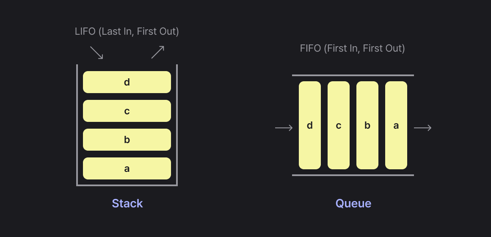
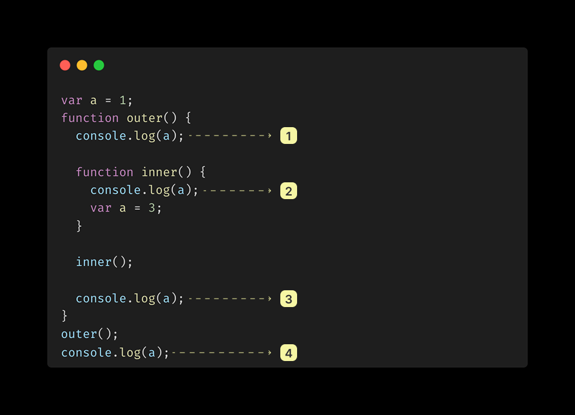
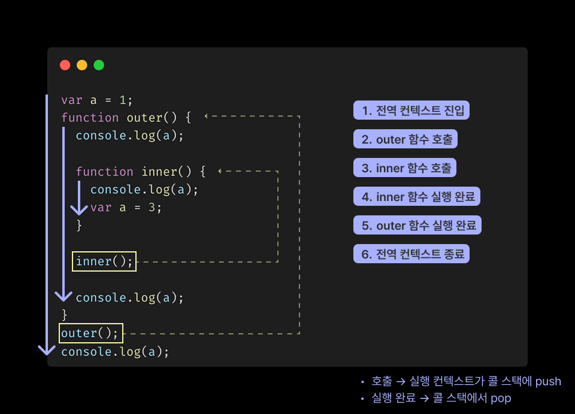
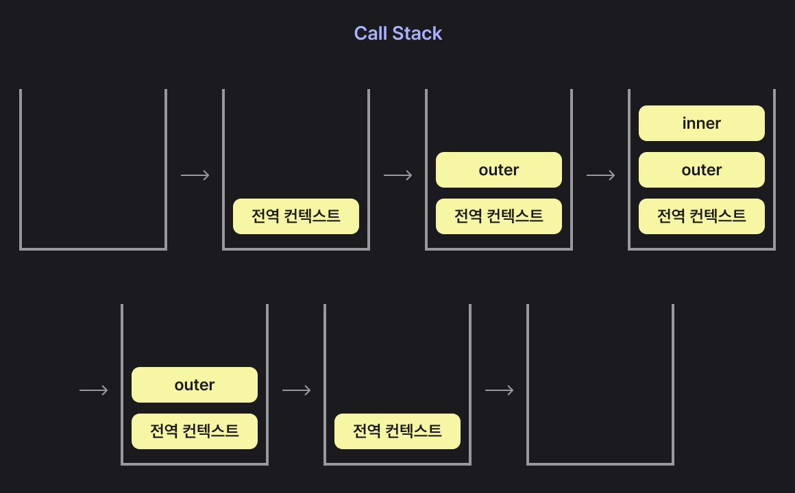

# 실행 컨텍스트 (Execution context)

## 01. 실행 컨텍스트란?

실행 컨텍스트란, 자바스크립트 `코드가 실행되기 위해 필요한 환경 정보`(스코프, 변수, this 등)를 담고 있는 내부 구조이다.
자바스크립트 엔진은 실행 컨텍스트를 통해 코드를 어떤 순서로 실행할지, 변수를 어떻게 찾을지, this는 무엇을 가리킬지 등을 결정한다.

- 같은 실행 컨텍스트 내에서는 동일한 환경을 공유한다.
- 컨텍스트가 전환되면 새로운 실행 환경이 구성된다.

<br>

### 1-1. 스택과 큐


스택과 큐는 데이터를 저장하고 꺼내는 방식에 따라 구분되는 `선형 자료구조(linear data structure)`.

#### 스택 (Stack)

- 데이터를 위로 쌓는 구조이다
- 가장 나중에 넣은 데이터가 가장 먼저 나오는 `LIFO` (Last In, First Out) 구조이다.
- 대표 메서드: push(), pop()

#### 큐 (Queue)

- 데이터를 줄 세워 처리하는 구조이다.
- 가장 먼저 넣은 데이터가 가장 먼저 나오는 `FIFO` (First In, First Out) 구조
- 대표 메서드: push(), shift()

<br>

### 실행 컨텍스트를 구성할 수 있는 방법

- `전역 공간 (Global Context)`<br>
  : 자바스크립트 파일이 처음 로드될 때 생성된다.
- `함수 호출 (Function Context)`<br>
  : 함수가 호출될 때마다 새로운 실행 컨텍스트가 만들어진다.
- `모듈 (Module)`<br>
  : 모듈이 import되는 순간, 해당 모듈에 대한 컨텍스트가 생성된다.
- `eval() 사용 비권장`<br>
  : 문자열 코드를 런타임에 실행하는 경우 별도의 컨텍스트가 생성된다.

<br>

자바스크립트에서 실행 컨텍스트를 생성할 수 있는 실질적인 코드 단위는 `함수`이다.<br>
따라서 자바스크립트의 실행 환경은 기본적으로 `함수 단위`로 나뉜다고 볼 수 있다.

::: info 💡 블록 스코프 ≠ 실행 컨텍스트
조건문이나 반복문 등 블록문은 블록 스코프는 형성하지만, 별도의 실행 컨텍스트를 생성하지 않는다.
:::

### 실행 컨텍스트와 콜 스택 흐름

아래 코드는 함수 호출에 따라 실행 컨텍스트가 생성되고 제거되는 흐름을 보여준다. <br>
실행 순서는 다음과 같다.



- 1. `outer()` 함수 호출
- 2. 내부에서 `inner()` 호출
- 3. `inner()` 종료 후 다시 `outer()` 내부 진행
- 4. 모든 실행이 끝나고 전역에서 마지막 `console.log(a)`

<br>



자바스크립트는 함수를 실행할 때마다 `실행 컨텍스트`를 생성하고, 이를 `콜 스택(Call Stack)`에 쌓아 실행 흐름을 관리한다.

- 코드 실행 시 `전역 실행 컨텍스트`가 생성되어 콜 스택에 진입한다.
- 이후 함수가 호출될 때마다 새로운 실행 컨텍스트가 생성되어 `콜 스택에 push`된다.
- 함수 실행이 끝나면 해당 컨텍스트는 `콜 스택에서 pop`되어 제거되며, 이전 컨텍스트로 복귀한다.

::: info 💡 흐름 정리

- `outer()`가 호출되면 콜 스택의 맨 위로 올라가고, 전역 컨텍스트 실행은 `일시 정지`된다.
- `outer()` 내부에서 `inner()`가 호출되면, 또 다시 `inner의 컨텍스트가 스택의 맨 위에 올라간다`.
- `inner()` 실행이 끝나면 pop → 다시 `outer()` → pop → 다시 전역 컨텍스트 실행.

즉, `콜 스택의 맨 위에 있는 컨텍스트만 실행 중`이고, 나머지는 대기 상태이다.

:::

<br>



- 자바스크립트 엔진은 함수 호출 시마다 실행 컨텍스트를 생성하고 콜 스택에 push한다.
- 실행이 완료되면 콜 스택에서 pop되어 제거되며, 이전 컨텍스트로 복귀한다.
- 콜 스택이 무한히 쌓이면 `Maximum call stack size exceeded` 에러가 발생한다.

::: info 스택과 콜 스택의 차이는?

- 스택(Stack): 데이터를 쌓고 꺼내는 `자료구조의 개념`이다.
- 콜 스택(Call Stack):스택 개념이 자바스크립트 엔진 내부에서 함수 실행 흐름을 관리하기 위해 적용된 시스템 구조이다.

함수가 호출되면 실행 컨텍스트가 콜 스택에 push되고, 실행이 종료되면 pop되어 제거된다.

즉, 스택은 자료구조의 개념이고 콜 스택은 그 개념이 실제 함수 실행 흐름 관리에 적용된 시스템 구성이다.
:::

<br>

## 실행 컨텍스트 구성 요소

실행 컨텍스트는 아래와 같은 세 가지 구성 요소로 이루어진다.

```less {2,6,10}
Execution Context
├── Variable Environment: 현재 환경과 관련된 식별자 정보 수집, 변화 반영 X
│   ├── Environment Record(snapshot)
│   └── Outer Environment Reference(snapshot)
│
├── Lexical Environment: 현재 환경과 관련된 각 식별자의 데이터 추적, 변화 반영 O
│   ├── Environment Record: 현재 컨텍스트 내부의 식발자 정보
│   └── Outer Environment Reference: 현재 문맥에 관련 있는 외부 식별자 정보
│
└── This Binding: 해당 컨텍스트의 this 값

```

<br>

### Variable Environment

LexicalEnvironment와 거의 동일하지만, 변수 선언 당시의 스냅샷처럼 초기 선언 상태를 저장하는 데 집중한다.
과거엔 var 중심의 선언을 담당했지만, ES6 이후 대부분의 실시간 추적은 LexicalEnvironment가 담당한다.

- VariableEnvironment는 초기 상태 기록
- LexicalEnvironment는 실행 중 상태 반영

<br>

### Lexical Environment

Lexical Environment는 실행 중인 코드의 스코프 정보와 외부 스코프 참조를 포함하는 객체이다.
현재 컨텍스트에서 선언된 식별자 정보(변수, 함수 등)를 기록하고, 필요시 바깥 스코프도 참조할 수 있게 한다.

#### `Environment Record`

Environment Record는 현재 실행 중인 컨텍스트 내부에서 선언된 변수와 함수 정보를 저장하는 공간이다.
실행 컨텍스트가 생성되는 시점에 이 정보를 먼저 수집하는데, 이 과정을 흔히 호이스팅(Hoisting)이라고 부른다.

호이스팅은 실제 코드가 끌어올려지는 것이 아니라, 식별자 정보가 미리 등록되는 현상을 설명하기 위한 개념적인 표현이다.

::: info Hoisting ?
호이스팅은 실행 컨텍스트 내부의 변수, 함수 선언을 코드 실행 전에 미리 등록하는 것처럼 보이는 현상이다.
var 변수는 선언만 등록되고 초기값은 undefined, 함수 선언문은 전체 함수 객체가 등록된다.
:::

::: code-group

```js [Environment Record 예시]
console.log(a());
console.log(b());
console.log(C());

function a() {
  return "a";
}

var b = function bb() {
  return "bb";
};

var c = function () {
  return "c";
};
```

```js [이해하기]
// 이해를 쉽게 하기 위한 허구의 개념
function a() {
  return "a";
}
var b;
var c;

console.log(a());
console.log(b());
console.log(C());

b = function bb() {
  return "bb";
};

c = function () {
  return "c";
};
```

:::

```js
// Environment Record
{
  function a() {...}
  var b;
  var c;
}
```

위로 끌어올려진 내용 전체가 바로 Environment Record이다. 실행 컨텍스트가 처음 생성되는 순간에 Environment Record에 이 정보들을 수집하는 것이다. 현재 컨텍스트에서 선언되어 있는 식별자들이 무엇이 있는지에 대한 정보를 코드 순서대로 수집하다보니 호이스팅한 거랑 똑같은 개념이 되어버린다.
<br>

#### `Outer Environment Reference`

현재 컨텍스트에 없는 변수나 함수는 `Outer Environment Reference`를 통해 바깥 LexicalEnvironment에서 찾는다.
이 구조가 스코프 체인(Scope Chain)을 형성하며, 바깥에서부터 안쪽으로 탐색하는 방식이다.

가까운 스코프에서 먼저 찾고, 찾으면 더 이상 탐색하지 않는다. 이처럼 가까운 선언이 우선하는 현상을 Shadowing이라고 한다.

<br>

## 스택 (Stack)

스택은 데이터를 순서대로 쌓고 꺼내는 자료구조이다. 가장 나중에 넣은 데이터가 가장 먼저 나오는 구조이기 때문에 LIFO(Last in, First Out 후입선출) 구조라고 부른다.

```js
push(); // 쌓기
pop(); // 꺼내기
```

### 콜 스택 (Call Stack)

자바스크립트 엔진은 함수 실행 흐름을 추적하고 제어하기 위해 실행 컨텍스트를 스택 구조로 관리한다. 이를 콜 스택이라고 한다.
가장 나중에 호출된 함수의 컨텍스트가 스택의 가장 위에 위치하며, 함수가 종료되면 pop되어 스택에서 제거된다.

#### 콜 스택 흐름

```less
1. Global Execution Context → push
2. outer() → Execution Context 생성 → push
3. inner() → Execution Context 생성 → push
4. inner() 종료 → pop
5. outer() 종료 → pop

```
