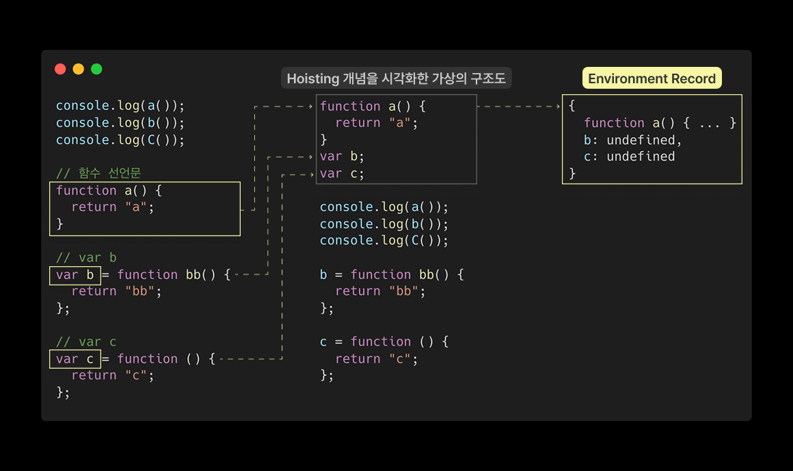

# 📦 Execution Context

## 01. 실행 컨텍스트란?

실행 컨텍스트란, 자바스크립트 `코드가 실행되기 위해 필요한 환경 정보`(스코프, 변수, this 등)를 담고 있는 내부 구조이다.
자바스크립트 엔진은 실행 컨텍스트를 통해 코드를 어떤 순서로 실행할지, 변수를 어떻게 찾을지, this는 무엇을 가리킬지 등을 결정한다.

- 같은 실행 컨텍스트 내에서는 동일한 환경을 공유한다.
- 컨텍스트가 전환되면 새로운 실행 환경이 구성된다.

<br>

### 1-1. 스택과 큐


스택과 큐는 데이터를 저장하고 꺼내는 방식에 따라 구분되는 `선형 자료구조(linear data structure)`.

#### 스택 (Stack) 🥞

- 데이터를 위로 쌓는 구조이다
- 가장 나중에 넣은 데이터가 가장 먼저 나오는 `LIFO` (Last In, First Out) 구조이다.
- 대표 메서드: push(), pop()

#### 큐 (Queue) 🚶‍♂️🚶‍♀️🚶‍♂️🚶‍♂️

- 데이터를 줄 세워 처리하는 구조이다.
- 가장 먼저 넣은 데이터가 가장 먼저 나오는 `FIFO` (First In, First Out) 구조
- 대표 메서드: push(), shift()

<br>

#### 실행 컨텍스트를 구성할 수 있는 방법

- `전역 공간 (Global Context)`<br>
  : 자바스크립트 파일이 처음 로드될 때 생성된다.
- `함수 호출 (Function Context)`<br>
  : 함수가 호출될 때마다 새로운 실행 컨텍스트가 만들어진다.
- `모듈 (Module)`<br>
  : 모듈이 import되는 순간, 해당 모듈에 대한 컨텍스트가 생성된다.
- `eval() 사용 비권장`<br>
  : 문자열 코드를 런타임에 실행하는 경우 별도의 컨텍스트가 생성된다.

자바스크립트에서 실행 컨텍스트를 생성할 수 있는 실질적인 코드 단위는 `함수`이다.<br>
따라서 자바스크립트의 실행 환경은 기본적으로 `함수 단위`로 나뉜다고 볼 수 있다.

::: info 💡 블록 스코프 ≠ 실행 컨텍스트
조건문이나 반복문 등 블록문은 블록 스코프는 형성하지만, 별도의 실행 컨텍스트를 생성하지 않는다.
:::

<br>

---

### 1-2. 실행 컨텍스트와 콜 스택

아래 코드는 함수 호출에 따라 실행 컨텍스트가 생성되고 제거되는 흐름을 보여준다. <br>
실행 순서는 다음과 같다.

#### 콘솔 출력 흐름으로 보는 실행 결과


- 1. `outer()` 함수 호출
- 2. 내부에서 `inner()` 호출
- 3. `inner()` 종료 후 다시 `outer()` 내부 진행
- 4. 모든 실행이 끝나고 전역에서 마지막 `console.log(a)`

🔍 아래에서 더 디테일하게 확인해보자.

<br>

#### 실행 컨텍스트와 콜 스택 시각화


자바스크립트는 함수를 실행할 때마다 `실행 컨텍스트`를 생성하고, 이를 `콜 스택(Call Stack)`에 쌓아 실행 흐름을 관리한다.

- 코드 실행 시 `전역 실행 컨텍스트`가 생성되어 콜 스택에 진입한다.
- 이후 함수가 호출될 때마다 새로운 실행 컨텍스트가 생성되어 `콜 스택에 push`된다.
- 함수 실행이 끝나면 해당 컨텍스트는 `콜 스택에서 pop`되어 제거되며, 이전 컨텍스트로 복귀한다.

::: info 💡 흐름 정리

- `outer()`가 호출되면 콜 스택의 맨 위로 올라가고, 전역 컨텍스트 실행은 `일시 정지`된다.
- `outer()` 내부에서 `inner()`가 호출되면, 또 다시 `inner의 컨텍스트가 스택의 맨 위에 올라간다`.
- `inner()` 실행이 끝나면 pop → 다시 `outer()` → pop → 다시 전역 컨텍스트 실행.

즉, `콜 스택의 맨 위에 있는 컨텍스트만 실행 중`이고, 나머지는 대기 상태이다.

:::

<br>

#### 콜 스택의 변화 과정


- 자바스크립트 엔진은 함수 호출 시마다 실행 컨텍스트를 생성하고 콜 스택에 push한다.
- 실행이 완료되면 콜 스택에서 pop되어 제거되며, 이전 컨텍스트로 복귀한다.
- 콜 스택이 무한히 쌓이면 `Maximum call stack size exceeded` 에러가 발생한다.

::: info 스택과 콜 스택의 차이는?

- 스택(Stack): 데이터를 쌓고 꺼내는 `자료구조의 개념`이다.
- 콜 스택(Call Stack):스택 개념이 자바스크립트 엔진 내부에서 함수 실행 흐름을 관리하기 위해 적용된 시스템 구조이다.

함수가 호출되면 실행 컨텍스트가 콜 스택에 push되고, 실행이 종료되면 pop되어 제거된다.

즉, 스택은 자료구조의 개념이고 콜 스택은 그 개념이 실제 함수 실행 흐름 관리에 적용된 시스템 구성이다.
:::

<br>

## 02. 실행 컨텍스트 내부 구조


### Execution Context 구성 요소

- `🗳️ Variable Environment`  
  : 현재 컨텍스트 내의 식별자 정보와 외부 환경 참조를 포함한다.  
  선언 시점의 Lexical Environment의 📸스냅샷으로, 이후의 변경 사항은 반영되지 않는다.

- `🗳️ Lexical Environment`  
  : 초기에는 Variable Environment와 동일하지만,  
  변경 사항이 실시간으로 반영되며 변수 값 추적이 가능하다.

- `🔗 This Binding`  
  : 해당 실행 컨텍스트에서 this가 참조해야 할 객체를 가리킨다.

<br>

> 📎 [Dmitry Soshnikov의 Lexical Environment ](https://dmitrysoshnikov.com/ecmascript/es5-chapter-3-2-lexical-environments-ecmascript-implementation/)  
> ES5 사양에 기반으로 Lexical Environment 개념을 JS 코드와 함께 설명한 참고 블로그.
> 『코어 자바스크립트』도 이 내용을 바탕으로 설명이 구성되어 있다.

<br>

## 03. VariableEnvironment


실행 컨텍스트가 생성될 때, `Variable Environment`에 정보를 수집한 뒤,  
그 내용을 그대로 복사해 `Lexical Environment`를 구성한다.

<br>

<small>이후에는 주로 `Lexical Environment`를 사용하며,</small>
두 구조는 내부적으로 모두 다음과 같은 공통 구조를 가진다.

```less {3,4,7,8}
Execution Context
├── 🗳️ Variable Environment
│   ├── Environment Record(snapshot)
│   └── Outer Environment Reference(snapshot)
│
├── 🗳️ Lexical Environment
│   ├── Environment Record
│   └── Outer Environment Reference
│
└── 🔗 This Binding

```

<br>

## 04. LexicalEnvironment


`Lexical Environment`는 실행 컨텍스트를 구성하는 '환경 정보들의 집합 객체'이다.  
실행 중 변수의 값을 실시간으로 추적하는 핵심 구조다.  
<small>💡 이 구조는 클로저, 스코프 체인, this 바인딩 동작 방식의 핵심 기반이 된다!</small>

- `Environment Record`: 현재 컨텍스트 내부에서 선언된 식별자 정보(변수, 함수 등)
- `Outer Environment Reference`: 상위 스코프를 참조해 '스코프 체인'을 구성할 수 있도록 돕는 연결 정보

<br>

---

### 4-1. EnvironmentRecord와 호이스팅

`Environment Record`는 현재 실행 컨텍스트의 식별자 정보를 수집하는 공간이다.  
실행 컨텍스트가 생성될 때, 엔진은 이 정보를 가장 먼저 수집하며 이 과정을 흔히 호이스팅(Hoisting)이라고 부른다.  
<small>호이스팅은 실제 동작이 아니라, 식별자 정보가 미리 등록되는 현상을 설명하기 위한 개념적인 표현이다.</small>

<br>

#### Environment Record 이해하기


식별자 `function a`, `var b`, `var c` 호이스팅 결과 :

- `function a`: 함수 선언문 전체가 끌어올려진다.
- `var b`, `var c`: 변수 선언만 끌어올려지고, 값은 `undefined`로 초기화된다.

이렇게 끌어올려진 정보들이 `Environment Record`에 저장되는 내용이다.

실행 컨텍스트가 생성될 때 현재 스코프에 어떤 식별자가 존재하는지를 먼저 수집하는데,  
이 과정 때문에, 마치 코드의 선언부만 위로 올라간 것처럼 보이는 현상이 발생하는 것이다.

<br>

---

### 4-2. Outer Environment Reference


`Outer Environment Reference`란 현재 실행 컨텍스트의 렉시컬 환경이 외부 환경을 참조하는 구조이다.
즉, 현재 컨텍스트에 존재하지 않은 식별자를 찾을 때, 이 참조를 따라 외부 환경(Lexical Environment)을 탐색하게 된다.

따라서, 없는 변수나 함수는 `Outer Environment Reference`를 통해 바깥 `Lexical Environment`를 참조한다. 만약 거기서도 찾지 못한다면, 더 바깥의 환경으로 계속해서 탐색한다.

이러한 참조 구조에 의해 `스코프 체인(Scope Chain)` 이 만들어진다.

<br>

#### Outer Environment Reference와 Scope Chain 이해하기



`inner` 컨텍스트는 자신의 `Environment Record` 뿐만 아니라,  
`Outer Environment Reference`를 통해 `outer`와 전역 컨텍스트의 `Lexical Environment`까지 참조할 수 있다.

::: info 🔍 흐름으로 이해하는 스코프 체인

`inner`에서 식별자를 탐색할 때는 다음과 같은 흐름을 따른다:

1. 자신의 Environment Record에서 식별자를 찾는다.
2. 없으면 Outer Environment Reference를 따라 `outer`의 Lexical Environment로 이동해 탐색한다.
3. 그래도 없으면 다시 Outer Environment Reference를 따라 `전역` Lexical Environment까지 탐색한다.

이처럼 가까운 스코프부터 바깥 스코프로 점진적으로 탐색하는 구조를 🔗스코프 체인이라고 한다.
:::

<br>

#### Scope & Scope Chain 요약

::: info 💡

#### Scope

- 변수의 유효범위를 의미하며, 실행 컨텍스트에 의해 결정된다.
- 변수는 자신이 정의된 실행 컨텍스트 내부에서만 접근 가능하다.
- 내부(자식)스코프는 외부(부모) 스코프에 접근할 수 있지만, 외부 스코프는 내부 스코프에 접근할 수 없다.  
  → 외부에서는 inner의 Lexical Environment를 참조할 수 없기 때문이다.

#### Scope Chain

- 현재 스코프에서 식별자를 찾지 못했을 때, Outer Environment Reference를 따라 바깥 스코프를 차례로 탐색하는 구조다.

#### Shadowing

- 가장 가까운 스코프에 동일한 이름의 식별자가 존재하면, 그 식별자가 우선 사용되고 바깥 식별자는 가려진다.
- 이처럼 가까운 선언이 우선하는 현상을 Shadowing이라고 한다.

:::
