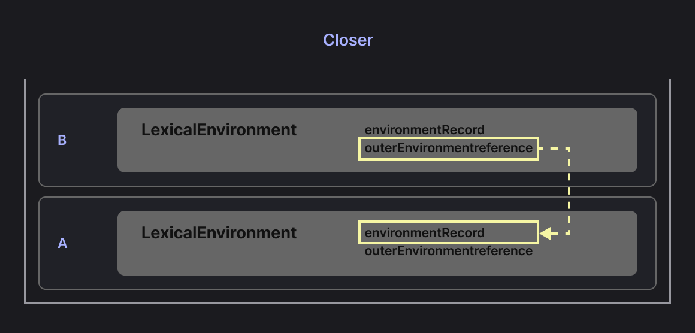

# Closure

## 01. 클로저의 의미 및 원리 이해



클로저란 내부 함수와 그 함수가 선언될 당시의 렉시컬 환경(Lexical Environment)의 조합이다.

실행 컨텍스트 A에서 함수 B를 선언하면, 함수 B는 A의 렉시컬 환경을 기억한다.  
💡 즉, A의 Lexical Environment + 내부 함수 B에서 나타나는 특별한 현상이 클로저.

::: details 관련 없는 부분

- A의 outerEnvironmentReference:  
  더 바깥을 가리키는 것이므로 B와 직접적인 관련은 없다.

- B의 environmentRecord:  
  오직 B 내부에서 선언된 식별자만 저장하므로 A와는 관련이 없다.

:::

::: info 🧩 클로저의 핵심

B의 `outerEnvironmentReference` → A의 `environmentRecord`로의 연결이 클로저에서 중요하다.

- B 내부에서 선언되지 않은 변수에 접근할 때,
- B는 자신의 outerEnvironmentReference를 통해 A의 environmentRecord에 접근한다.
- 이 연결 덕분에 A에서 선언한 변수를 B가 참조할 수 있다 → 클로저

:::

<br>

### 일반적인 스코프 규칙 (클로저가 없는 경우)

```js
function countWithoutClosure() {
  let count = 0; // 함수 내부 변수

  return count; // count 변수에 담긴 '값 0'만 반환
}

console.log(countWithoutClosure()); // 0
console.log(count); // ReferenceError: count is not defined
```

- 함수의 return 값은 잘 출력되지만, 함수 내부의 변수는 외부에서 참조할 수 없다.
- 이는 자바스크립트가 렉시컬 스코프 규칙을 따르기 때문이다.
- 함수 안에서 선언된 변수는 함수 실행 동안만 메모리에 존재하며, 함수가 종료되면 GC의 대상이 되어 제거된다.

<br>

### 일반적인 함수 호출 (즉시 소멸하는 무덤)

```js:line-numbers
function 무덤() {
  let 영혼 = 1; // 무덤의 environmentRecord

  function 주술() {
    console.log(++영혼); // 무덤 안에서 즉시 영혼을 불러 변화
  }

  주술(); // 무덤 안에서 바로 의식 수행
}

무덤(); // 2
```

- 위 예제는 주술을 무덤 안에서 즉시 실행하고, 내부 함수가 밖으로 나오지 않아서 클로저 현상이 드러나지 않는다.
- 무덤이 닫히면 그 순간 끝!

<br>

### 클로저의 탄생 (영원히 기억되는 무덤)

```js:line-numbers
// 문자열 ver.

function 무덤() {
  let 영혼 = "제가 보이세요..?"; // 지역 변수 (죽은 함수의 영혼)

  // 내부 함수 주술을 바깥으로 전달 →  밖에서 영혼을 계속 불러낼 수 있음
  return function 주술() {
    console.log(영혼);
  };
}

// 클로저 생성 (무당 + 무덤의 LexicalEnvironment )
let 무당 = 무덤();

무당(); // 제가 보이세요..?

무당 = null;
// 참조 해제: 이후엔 호출 불가, 영혼은 GC 대상

무당(); // TypeError: 무당 is not a function
```

- `무당`이 살아있는 동안에 `무덤의 Lexical Environment(영혼)` 에 계속 접근 가능
- 참조를 끊으면 더 이상 호출 불가 → GC가 영혼을 수거할 수 있는 상태

<br>

```js:line-numbers
// 상태 ver. (영혼이 상태처럼 보존/변경됨)

function 무덤() {
  let 영혼 = 1; // 보존될 상태

  return function 주술() {
    return ++영혼; // 호출할 때마다 살아있는 상태를 수정
  };
}

let 무당 = 무덤();
console.log(무당()); // 2
console.log(무당()); // 3
```

- 무당 변수로 내부 함수 주술을 무덤 밖으로 끌고 나옴  
  → 무당 (내부 함수 무덤) + 선언 당시 무덤의 Lexical Environment 영혼이 함께 살아서 클로저가 성립
- 무덤 함수가 끝났어도 주술의 outerEnvironmentReference가 무덤의 environmentRecord로 이어져 변수 영혼에 계속 접근
- 영혼의 상태가 계속 보존된다.

<br>

## 02. 클로저와 메모리 관리

### 클로저와 메모리 누수 위험

```js:line-numbers
function 거대한무덤() {
  // 거대한 영혼 배열
  // 문자열은 불변이라 공유될 수 있지만, 배열 슬롯은 개수만큼 메모리를 차지
  let 거대한영혼 = new Array(1000000).fill("무거운 데이터");
  let 작은영혼 = "가벼운 데이터";

  return function 작은주술() {
    // 작은영혼만 사용하지만, 거대한영혼도 함께 메모리에 남음
    console.log(작은영혼);
  };
}

let 무당 = 거대한무덤();
// 거대한영혼이 불필요하게 메모리를 차지하고 있음
```

- 작은 주술 함수는 사실 가벼운 데이터만 필요로 하지만, 외부 스코프 전체를 참조하기 때문에, 거대한 영혼 배열도 메모리에서 해제되지 못한다.
- 필요 없는 대규모 데이터를 계속 참조하면 해제되지 않아 사실상 누수처럼 보일 수 있다.

<br>

### 클로저에서의 메모리 관리 방법

```js:line-numbers
function 개선된무덤() {
  let 거대한영혼 = new Array(1000000).fill("무거운 데이터");
  let 작은영혼 = "가벼운 데이터";

  // 필요한 영혼만 추출
  let 영혼처리 = 거대한영혼[0];

  // 명시적으로 큰 데이터 해제 (리턴 전에!)
  거대한영혼 = null;

  return function 작은주술() {
    console.log(작은영혼, `${영혼처리}`);
  };
}

// 사용 후 참조 해제
let 무당 = 개선된무덤();
무당(); // 가벼운 데이터 무거운 데이터

// 더 이상 필요하지 않을 때
무당 = null; // 더 이상 참조가 없으므로 GC 수거 대상
```

- 필요한 데이터만 추출해서 첫 번째 요소만 영혼처리 변수에 저장
- 리턴 전 명시적 해제 (리턴 후에는 실행되지 않기 때문)
- 무당 = null로 클로저 자체의 참조도 해제해서 메모리 정리

::: details 🧩 리턴 전에 데이터를 해제하는 이유
JavaScript 엔진이 클로저를 생성할 때, 리턴되는 함수가 어떤 변수들을 참조하는지 미리 분석하기 때문이다.

위 예제는

- `거대한영혼 = null;`이 리턴 전에 실행된다.
- 그래서 리턴되는 함수가 나중에 `거대한영혼`을 참조해도 이미 null.
- 거대한 배열은 이미 사라졌고, 필요한 데이터(영혼처리)만 남는다.

<br>

```js:line-numbers
function 잘못된무덤() {
  let 거대한영혼 = new Array(1000000).fill("무거운 데이터");

  return function 작은주술() {
    console.log("함수 실행");
  };

  거대한영혼 = null; // 리턴 이후 실행 X
}
```

- 즉, 리턴 전에 정리하는 것이 중요하다.

:::

<br>

## 03. 클로저의 활용 사례

아래 예시들은 모두 클로저가 바깥 스코프의 값을 기억한다는 성질을 활용한다.  
콜백에서 바깥 변수 읽기, 프라이빗 상태 캡슐화, 그리고 부분 적용/커링처럼 인자를 미리 저장해 두는 패턴은
모두 클로저 덕분에 동작한다.

<br>

### 3-1. 콜백 함수 내부에서 외부 데이터를 사용하고자 할 때

```js
// 영혼의 이름을 기억해야 함
let 영혼들 = ["영혼1", "영혼2", "영혼3"];

// 잘못된 방법
for (var i = 0; i < 영혼들.length; i++) {
  setTimeout(function () {
    console.log(`${i}번째 영혼: ${영혼들[i]}`);
  }, 100);
}
// "3번째 영혼: undefined"
// "3번째 영혼: undefined"
// "3번째 영혼: undefined"

// 클로저
for (let i = 0; i < 영혼들.length; i++) {
  setTimeout(function () {
    console.log(`${i}번째 영혼: ${영혼들[i]}`);
  }, 100);
}
// "0번째 영혼: 영혼1"
// "1번째 영혼: 영혼2"
// "2번째 영혼: 영혼3"
```

- var를 썼을 때 클로저가 없으면 의도대로 동작하지 않는다.  
  var는 루프 전체에서 단 하나의 i 바인딩을 공유해서, 타이머가 실행될 때 이미 i === 3인 상태. 그래서 영혼들[3] → undefined.
- let은 반복마다 새로운 바인딩 생성 → 각 콜백이 자기 i를 닫아둠
- 타이머 콜백이 실행될 때도, 콜백은 바깥의 i/배열을 기억(클로저)하고 있어서 접근 가능하다.

<br>

### 3-2. 접근 권한 제어(정보 은닉)

```js
function 안전한무덤() {
  let 영혼상태 = 100; // private 변수
  let 영혼이름 = "헥토르";

  return {
    // public 메서드들
    영혼확인() {
      return `${영혼이름}의 상태: ${영혼상태}`;
    },

    영혼치료(회복량) {
      영혼상태 += 회복량;
      return `${회복량}만큼 회복! 현재 상태: ${영혼상태}`;
    },

    영혼손상(피해량) {
      영혼상태 = Math.max(0, 영혼상태 - 피해량);
      return `${피해량}만큼 손상... 현재 상태: ${영혼상태}`;
    },
  };
}

const 내영혼 = 안전한무덤();
console.log(내영혼.영혼확인()); // "헥토르의 상태: 100"
console.log(내영혼.영혼치료(20)); // "20만큼 회복! 현재 상태: 120"

// 외부에서 직접 접근 불가, public 메서드 통해서만 간접적으로 다룰 수 있다.
console.log(내영혼.영혼상태); // undefined
```

- 반환된 객체 메서드들이 바깥 함수의 영혼상태 등을 계속 참조 (클로저로 프라이빗 상태 유지)
- 반환된 메서드들이 바깥의 영혼상태를 기억하고 갱신한다(클로저로 정보 은닉)

<br>

### 3-3. 부분 적용 함수

부분 적용 함수(Partial Application)는
여러 인자를 받는 함수에서 일부 인자를 미리 고정해두고, 나머지만 나중에 전달하는 함수를 만드는 기법이다.

<br>

#### 할인율 예시

```js
function 할인(율, 가격) {
  return 가격 * (1 - 율);
}

// 30% 할인율을 미리 고정
const 블랙프라이데이할인 = (가격) => 할인(0.3, 가격);

console.log(블랙프라이데이할인(10000)); // 7000
console.log(블랙프라이데이할인(20000)); // 14000
```

<br>

#### 세금 계산 예시

```js
function 세금(세율, 금액) {
  return 금액 * (1 + 세율);
}

// 한국 부가세(10%)를 미리 고정
const 한국부가세 = (금액) => 세금(0.1, 금액);

console.log(한국부가세(10000)); // 11000
console.log(한국부가세(25000)); // 27500
```

- 부분 적용 함수는 공통 인자(율, 세율 등)를 먼저 고정해두고, 매번 달라지는 값만 받아서 사용하는 패턴이다.
- 즉, 클로저로 값을 기억한다.
- 고정한 인자값을 새 함수가 계속 기억하므로, 나머지 인자만 받아 동작한다(클로저)

<br>

### 3-4. 커링 함수

커링(currying)이란 여러 개의 인자를 받는 함수를 인자 하나씩 나눠 받아 실행할 수 있도록 변환하는 기법이다.
즉, 함수를 "쪼개 호출"하는 방식으로 생각하면 쉽다.

<br>

#### 기본 예시

```js
// 밀루를 꼬시는 커링 함수

function 밀루커링(간식1) {
  // (간식1)을 기억하는 함수(클로저)를 반환
  return function (간식2) {
    // (간식1, 간식2)를 기억하는 함수(클로저)를 반환
    return function (간식3) {
      // 세 값을 모두 사용해 결과 생성
      return `${간식1} + ${간식2} + ${간식3}으로 밀루 꼬시기!`;
    };
  };
}

// 단계별로 간식 추가
const 첫간식 = 밀루커링("당근"); // 간식1 = "당근"을 기억하는 함수
const 두간식 = 첫간식("양치껌"); // 간식1, 간식2를 기억하는 함수
const 마지막 = 두간식("밀크껌"); // 최종 문자열 반환
console.log(마지막); // "당근 + 양치껌 + 밀크껌으로 밀루 꼬시기!"

console.log(밀루커링("당근")("양치껌")("밀크껌"));
// "당근 + 양치껌 + 밀크껌으로 밀루 꼬시기!"

// 나의 이해용
console.log(typeof 첫간식); // "function"
console.log(typeof 두간식); // "function"
console.log(typeof 마지막); // "string"
```

- 한 번에 3개의 간식을 넣는 대신, 하나씩 순차적으로 호출하면서 값을 전달할 수 있다.
- 마지막 호출이 끝날 때 최종 결과가 나온다.

<br>

#### 화살표 함수로 간단하게

```js
const 화살표밀루 = (간식1) => (간식2) => (간식3) =>
  `${간식1} + ${간식2} + ${간식3}으로 밀루 꼬시기!`;

console.log(화살표밀루("당근")("양치껌")("밀크껌"));
// "당근 + 양치껌 + 밀크껌으로 밀루 꼬시기!"
```

- 화살표 함수를 쓰면 더 간결하게 적을 수 있고, 커링 함수의 구조가 더 잘 보인다.

<br>

#### 실용적인 예시

```js
// 커링: (종) 고정 → (주인) 고정 → (이름) 넣으면 최종 문자열
const 반려동물기록 = (종) => (주인) => (이름) =>
  `${주인}님의 ${종}, ${이름}의 기록을 남겨보세요.`;

// 공통 인자를 먼저 고정
const 강아지기록 = 반려동물기록("강아지"); // (종="강아지)를 클로저로 기억하는 함수 반환
const 울집강아지 = 강아지기록("바켸빈"); // (종, 주인)을 모두 기억하는 함수 반환

console.log(울집강아지("밀루"));
// "바켸빈님의 강아지, 밀루의 기록을 남겨보세요."

console.log(반려동물기록("강아지")("바켸빈")("밀루"));
// "바켸빈님의 강아지, 밀루의 기록을 남겨보세요."

// 나의 이해용
console.log(typeof 강아지기록); // "function"
console.log(typeof 울집강아지); // "function"
```

- 먼저 종과 주인을 고정해두면, 반려동물 이름만 입력해도 메시지를 완성할 수 있다.
- 커링은 공통 인자를 먼저 설정해두고, 나중에 필요한 값만 채워 넣는 패턴에 적합하다.
- 인자 하나씩 받으며 다음 함수를 리턴하고, 이전 인자들을 계속 붙잡아 둠 → 클로저 체인
- 앞에서 받은 인자들을 다음 함수가 계속 기억하며 연결된다(클로저 체인)

<br>

## ⚠️ 🏗️ 작성중.. React의 useState와 클로저

### 함수형 컴포넌트의 특징

```jsx
function Counter() {
  const [count, setCount] = React.useState(0);

  return (
    <>
      <p>Count: {count}</p>
      <button onClick={() => setCount(count + 1)}>+</button>
    </>
  );
}
```

- Counter는 함수다. 렌더링이 일어날 때마다 이 함수는 다시 실행되고, 내부 변수들은 원래대로라면 매번 초기화되어야 한다.
- 그런데 count는 매번 0으로 초기화되지 않고, 우리가 누른 값이 계속 이어진다..🤔

<br>

### useState의 클로저 원리

리액트는 내부적으로 상태 저장소를 두고, 그 안에 상태들을 순서대로 저장한다.
그리고 useState를 호출하면 두 가지를 반환한다.

1. 현재 사태 값 (count)
2. 상태를 갱신하는 함수 (setCount)

💡 핵심은 `setCount` 이다.

<br>

setCount는 단순히 새로운 값을 집어넣는 함수가 아니라, 클로저를 통해 리액트의 상태 저장소에 접근하는 함수이다.

```jsx
function useState(initialValue) {
  let _val = initialValue; // 상태 저장소 (실제로는 React 내부에서 관리)

  function setState(newValue) {
    _val = newValue; // 클로저로 _val에 접근
  }

  return [_val, setState];
}
```

- 위처럼 단순화해서 보면, setState가 \_val을 기억하는 클로저이기 때문에 값이 계속 유지될 수 있다.
- 컴포넌트 함수는 재실행되지만, 리액트가 \_val 같은 상태 저장소를 별도로 관리하고 setState가 그 저장소를 참고하는 구조이다.

<br>

### 왜 클로저가 중요한가?

- 상태보존: 함수가 다시 실행돼도 setState는 여전히 이전 상태 저장솔르 가리킨다.
- 은닉성: 외부에서는 \_val에 직접 접근할 수 없고, 반드시 setState를 통해 갱신해야 한다.
- 예측 가능성: 상태 관리 흐름이 일정해지고, 컴포넌트 외부에서 무분별하게 상태가 바뀌지 않는다.

즉, useState는 클로저를 활용해 프라이빗 상태 캡슐화를 구현한 것이다.

<br>

### 순수 JS로 흉내내기

```js:line-numbers
function createState(initialValue) {
  let state = initialValue;

  function setState(newValue) {
    state = newValue;
  }

  function getState() {
    return state;
  }

  return [getState, setState];
}

const [getCount, setCount] = createState(0);

console.log(getCount()); // 0
setCount(5);
console.log(getCount()); // 5
```

- state는 함수 createState의 지역 변수지만, getState, setState가 클로저를 기억하고 있기 때문에 계속 살아있다.
- 이것이 바로 useState의 핵심 원리와 닮아있다.

### 정리

- 리액트의 useState는 클로저를 이용해 상태를 보존한다.
- 함수형 컴포넌트는 호출될 때마다 새로 실행되지만, 리액트는 별도의 저장소를 유지하고 setState같은 클로저를 반환해 그 저장소를 지속적으로 참조하게 만든다.

결국 클로저를 이해하면, 리액트의 상태 관리가 어떻게 동작하는지 깊게 이해할 수 있다.
그리고 이 원리는 useReducer, useRef 등 다른 훅에도도 똑같이 적용된다.

🤔 찾아보기! 그럼 React Hook은 클로저 기반의 설계인 것인가..?

<br>
<Comment/>
