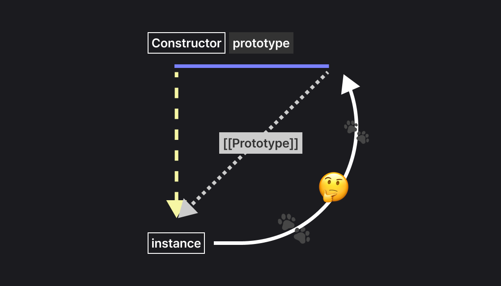

# Prototype

::: info Reference

- [MDN-Object prototypes](https://developer.mozilla.org/ko/docs/Learn_web_development/Extensions/Advanced_JavaScript_objects/Object_prototypes)
- [MDN-상속과 프로토타입](https://developer.mozilla.org/ko/docs/Web/JavaScript/Guide/Inheritance_and_the_prototype_chain)

- [모던JS-함수의 prototype 프로퍼티](https://ko.javascript.info/function-prototype)

:::

자바스크립트의 객체 지향 상속은 `클래스가 아닌 프로토타입(Prototype)`을 기반으로 동작한다.  
프로토타입은 객체들이 속성과 메서드를 공유하게 하며, 메모리를 효율적으로 사용할 수 있도록 하는 자바스크립트의 핵심 메커니즘이다.

<br>

## 1. Prototype이란?

prototype은 객체 간 상속과 메서드 공유의 기반이 되는 원형 객체이다.

- `Constructor.prototype`: 생성자 함수가 가지는 프로퍼티. 인스턴스들이 공유할 원형 객체.
- `[[Prototype]]`: 모든 객체가 가지는 내부 슬롯. 자신의 부모 프로토타입 객체를 가리킨다.
- `constructor`: 프로토타입 객체가 가지는 기본 프로퍼티. 자신을 만든 생성자 함수를 참조

<br>

## 2. 기본 구조 이해하기 <badge type="tip" text="생성자 - 프로토타입 - 인스턴스"></badge>

`new` 키워드로 생성자 함수를 호출해 인스턴스를 만들면, 아래 그림과 같은 연결 고리가 자동으로 형성된다.


<br>

### 2-1. 인스턴스 생성과 연결 원리

인스턴스를 생성하면, 그 인스턴스의 [[Prototype]]은 생성자의 `prototype` 객체를 참조한다.

::: info `Constructor.prototype` === `instance.[[Prototype]]`이 성립한다.  
즉, 인스턴스는 Constructor(생성자 함수)의 prototype 객체를 [[Prototype]]으로 참조한다.
:::


1. `new` 키워드: 생성자를 호출하여 인스턴스 생성
2. `[[Prototype]]`: 인스턴스의 `[[Prototype]]`이 생성자의 prototype에 연결
3. `메서드 공유`: `prototype`에 정의한 메서드는 모든 인스턴스가 공유 (메모리 절약 + 일관성)

<br>

#### 코드 예시: 메서드 공유

```js:line-numbers
function Person(name) {
  this.name = name;
}

Person.prototype.sayHi = function () {
  return `Hi, I'm ${this.name}`;
};

const me = new Person("Hyebin");

console.log(me.sayHi()); // Hi, I'm Hyebin
```

- `sayHi`는 각 인스턴스에 복제되지 않고, 하나의 Person.prototype.sayHi를 함께 사용한다.

<br>

### 2-2. [[Prototype]] (\_\_proto\_\_ )

[[Prototype]]은 모든 객체가 가지는 내부 슬롯으로, 자신이 어떤 객체를 프로토타입으로 삼는지 가리킨다.


```js:line-numbers
const obj = {};
console.log(Object.getPrototypeOf(obj) === Object.prototype); // true
```

- [[Prototype]]은 내부 슬롯일 뿐 직접 접근은 불가능하다.
- 표준 접근: `Object.getPrototypeOf(obj)`
- 비표준 접근: `obj.__proto__`

<br>

<br>

::: info ⚠️ 주의
`Person.prototype`을 통째로 교체하면 `constructor` 참조가 끊어진다.

    ```js
    Person.prototype = { sayHi() {} }; // 이렇게 하면 constructor가 사라짐!
    Person.prototype = { sayHi() {}, constructor: Person }; // 복원
    ```

:::

<br>

### 2-3. constructor 프로퍼티

`constructor`는 프로토타입 객체 안에 기본적으로 들어 있는 프로퍼티로, 자신을 만든 생성자 함수를 가리킨다.

```js:line-numbers
function Person(name) {
  this.name = name;
}

console.log(Person.prototype.constructor === Person); // true
```

<br>

### 2-4. 생성자에 도달하는 다양한 경로

아래 예시는 원본 인스턴스 `bin`으로부터 여러 경로를 따라 동일한 `생성자 함수(Person)`에 도달해 새 인스턴스를 만드는 방식이다.

```js:line-numbers
function Person(n, a) {
  this.name = n;
  this.age = a;
}

// 원본
var bin = new Person("바켸빈", 30);

// 모두 Person 생성자를 가리킴
var binClone1 = new bin.__proto__.constructor("바켸빈_클론1", 10); // 비권장
var binClone2 = new bin.constructor("바켸빈_클론2", 15);
var binClone3 = new Object.getPrototypeOf(bin).constructor("바켸빈_클론3", 20);
var binClone4 = new Person.prototype.constructor("바켸빈_클론4", 25);
```

- binClone1부터 binClone4 생성 구문은 결국 동일한 생성자 함수 Person을 사용하여 인스턴스를 생성한다.

<br>

::: info 프로토타입과 생성자 함수에 도달하는 경로 구분

프로토타입(Person.prototype)에 도달

```js
Object.getPrototypeOf(instance); // 표준
instance.__proto__; // 비표준
Person.prototype; // 생성자의 이름을 알고 있을 때 직접 참조
```

생성자 함수(Person)에 도달

```js
Person; // 직접 참조
Object.getPrototypeOf(instance).constructor; // 표준
instance.constructor; // 보통은 가능, 하지만 prototype 교체 시 깨질 수 있음
Person.prototype.constructor; // prototype에서 따라 올라감
```

💡 경로 유지의 중요성: `constructor.prototype.constructor === constructor` 관계가 유지되어야 위 모든 경로가 동일하게 동작한다.
:::

<br>

## 3. 내장 객체의 프로토타입 구조

### 3-1. Array (참조 타입)


배열 리터럴 `[]`과 `new Array()`는 생성 경로는 다르지만, 결과로 만들어지는 배열 인스턴스의 프로토타입 체인은 동일하다.

- 인스턴스([1, 2, 3])의 [[Prototype]]은 `Array.prototype`을 가리킨다.
- `Array.prototype`에는 push(), map(), filter() 등의 `인스턴스 메서드`가 정의되어 모든 배열이 공유한다.
- `Array` 생성자 함수 자체에는 Array.from(), Array.isArray() 등의 `정적 메서드`가 있다.

::: info 참고
`new Array(3)`은 길이가 3인 희소 배열을 만들고, `[3]`은 요소가 3 하나인 배열을 만든다.  
표현식은 같아 보여도 생성 결과가 다를 수 있음을 기억!
:::

<br>


위는 `console.dir(Array)` 결과이다.

- `Array` 생성자 함수 자체에 from, isArray, of 같은 정적 메서드가 있고
- 그 안의 `prototype` 객체에는 map, forEach, filter 등 배열 인스턴스가 공유하는 메서드들이 정의되어 있다.

<br>


위는 `console.dir([1,2,3])` 결과이다.

- 배열 인스턴스의 `[[Prototype]]`은 `Array.prototype`을 가리킨다.
- 따라서 배열 리터럴로 만든 것도 결국 같은 구조를 따른다.

<br>


즉, 배열 리터럴로 만든 배열도 결국 Array 생성자를 거쳐 만들어지며, constructor 역시 동일하다.

```js
[1, 2, 3].constructor
= [1, 2, 3].[[Prototype]].constructor
= Array.prototype.constructor
= Array

console.log([1, 2, 3].constructor === Array); // true
```

또한, `Array.prototype`의 상위 프로토타입은 `Object.prototype`을 가리킨다.  
따라서 배열 역시 최종적으로는 모든 객체와 마찬가지로 `Object.prototype`을 기반으로 동작한다.

<br>

### 3-2. 원시 타입 (Number, String 등)

원시값은 객체가 아니지만 점 표기법으로 메서드를 호출할 수 있다.  
이때 엔진은 내부적으로 일시적인 래퍼 객체를 만들어 `prototype` 메서드를 빌려 쓴 후 즉시 폐기한다.


- 숫자 원시값 → 내부적으로 `new Number(10)`같은 임시 객체 생성 → `Number.prototype.toFixed` 실행 → 폐기


- 문자열 원시값 → 내부적으로 `new String('abc')` → `String.prototype.repeat` 실행 → 폐기

<br>

### 3-3. 참조 타입 (Array, Function, 사용자 정의 객체)

배열, 함수, 생성자로 만든 객체는 처음부터 인스턴스이므로 바로 프로토타입 메서드를 참조한다.


- 예:
  - `[1,2,3].map()` → `Array.prototype.map`
  - `function a(){}.call()` → `Function.prototype.call`

<br>

<!-- ### 모든 데이터 타입의 공통 구조


- null, undefined를 제외한 모든 데이터 타입은 생성자 함수(Constructor)가 존재한다.
- 각 생성자 함수의 prototype에는 그 타입 전용 메서드들이 정의되어 있다.
  - Array.prototype → push, pop, map
  - String.prototype → charAt, repeat
  - Number.prototype → toFixed, toString -->

## 프로토타입도 객체다



- prototype도 결국 객체이므로, Object 생성자 함수의 인스턴스다.
- 따라서 모든 프로토타입은 다시 Object.prototype과 연결된다.

<br>

## 프로토타입 체인


- 인스턴스는 자신이 가진 속성이 없으면 [[Prototype]]을 따라 상위 프로토타입에서 검색한다.
- 이 연결 고리를 프로토타입 체인(Prototype Chain) 이라고 부른다.
- 결국 모든 데이터 타입은 Object.prototype에 도달하게 된다.

<br>

### Object.prototype의 역할


- Object.prototype은 자바스크립트 전체를 통괄하는 공통 메서드들을 정의해둔 최상위 프로토타입이다.
- 예: hasOwnProperty(), toString(), valueOf(), isPrototypeOf()
- 모든 데이터 타입은 프로토타입 체인을 통해 이 메서드들에 접근할 수 있다.

<br>

### 객체 전용 메서드가 없는 이유


- 만약 Object.prototype에 객체 전용 메서드를 정의하면,  
  배열/문자열/숫자 등 다른 타입도 전부 접근할 수 있게 된다.
- 그래서 Object.keys(), Object.values()처럼 정적 메서드(Object.메서드명) 로 제공된다.
- 이는 프로토타입 체인으로 인한 부작용을 방지하기 위한 설계다.

<br>

## 정리


::: info 💡 정리

- 원시 타입: 메서드 호출 순간 임시 wrapper 객체 생성 → prototype 메서드 실행 → 즉시 폐기
- 참조 타입: 처음부터 인스턴스이므로 prototype 메서드를 바로 참조
- 모든 프로토타입은 객체이므로, 결국 Object.prototype으로 연결된다.
- Object.prototype은 모든 데이터 타입이 공유하는 최상위 프로토타입이다.

따라서 모든 값은 `데이터 자신에게 메서드가 있는 것이 아니라, 생성자 함수의 prototype에 있는 메서드를 [[Prototype]]을 통해 빌려 쓰는 구조`를 따른다.

:::

<br>

## 메소드 상속 및 동작 원리

인스턴스마다 동일한 메서드를 직접 정의하면 중복이 발생한다.

```js:line-numbers
function Person(n, a) {
  this.name = n;
  this.age = a;
}

// Person 생성자로부터 user1 객체, user2 두 개의 인스턴스 생성
var user1 = new Person("박유저", 20);
var user2 = new Person("빈유저", 30);

// 인스턴스마다 중복 정의
// setOlder 메서드
user1.setOlder = function () {
  this.age += 1;
};

// getAge 메서드
user1.getAge = function () {
  return this.age;
};

// setOlder 메서드
user2.setOlder = function () {
  this.age += 1;
};

// getAge 메서드
user2.getAge = function () {
  return this.age;
};
```

- user1, user2의 메서드가 동일한 내용임에도 각 인스턴스가 별도로 보관한다.
- 이는 `DRY(Don't Repeat Yourself)` 원칙에 어긋난다.  
  (매번 직접 반복하지말고 최대한 반복을 줄이라는 의미)

<br>

## prototype에 메서드 정의

```js:line-numbers
function Person(n, a) {
  this.name = n;
  this.age = a;
}

// 공통 메서드는 prototype에 정의
Person.prototype.setOlder = function () {
  this.age += 1;
};

Person.prototype.getAge = function () {
  return this.age;
};

// Person 생성자로부터 user1 객체, user2 두 개의 인스턴스 생성
var user1 = new Person("박유저", 20);
var user2 = new Person("빈유저", 30);

user1.setOlder();
console.log(user1.getAge()); // 21
```

💡 이렇게 하면,

- 모든 인스턴스가 같은 메서드를 공유한다.  
  각 인스턴스들은 마치 자신의 메서드인 것처럼 다양한 명령을 수행할 수 있게 된다.
- 인스턴스는 자신의 고유 데이터만 보관하고, 공통 동작은 prototype을 참조한다.
- 메모리 사용 효율을 높이고, 일관된 동작을 유지할 수 있다.

💡 즉, 메모리 사용 효율을 상당히 끌어올릴 수 있다. 또한 특정 집단의 공통된 속성을 파악할 수 있는 수단이 되기도 한다.

<br>

## Prototype Chaining

자바스크립트는 객체의 프로퍼티를 탐색할 때 `자기 자신 → [[Prototype]] → 상위 프로토타입` 순으로 거슬러 올라간다. 이 과정을 프로토타입 체인이라고 한다.

```js:line-numbers
const arr = [1, 2, 3];

console.log(arr.map(x => x * 2)); // Array.prototype에서 찾음
console.log(arr.toString());      // Object.prototype에서 찾음
```

- `map` → `Array.prototype`에서 발견
- `toString` → `Array.prototype`에 없음 → `Object.prototype`에서 발견
- 최종적으로 `Object.prototype`까지 올라가도 없으면 `undefined`

<br>

```js:line-numbers
function Person(name) {
  this.name = name;
}

Person.prototype.sayHi = function () {
  return `Hi, I'm ${this.name}`;
};

const me = new Person("Hyebin");

console.log(me.sayHi()); // Person.prototype에서 찾음
console.log(me.toString()); // Object.prototype에서 찾음
```

- `me.sayHi` → `Person.prototype`에서 발견
- `me.toString` → `Person.prototype`에 없음 → `Object.prototype`에서 발견
- `Object.prototype`까지 올라가도 없으면 `undefined`

<br>

### 특징

1. 모든 객체는 [[Prototype]]을 통해 부모와 연결된다.
2. 이 연결이 연속되면서 체인을 형성한다.
3. 따라서 모든 객체가 Object.prototype의 메서드(toString, hasOwnProperty 등)를 사용할 수 있다.

<br>

## 오버라이딩 (Override)

인스턴스에 동일한 이름의 메서드를 직접 정의하면, 체인보다 우선한다.

```js:line-numbers
me.toString = function () {
  return `Person: ${this.name}`;
};

console.log(me.toString()); // "Person: Hyebin"

```

<br>

## 정리

- Constructor.prototype: 생성자 함수가 가지는 프로퍼티, 인스턴스가 참조할 원형 객체
- [[Prototype]]: 모든 객체에 존재하는 내부 슬롯, 부모 프로토타입 참조
- constructor: prototype 객체가 가지는 프로퍼티, 자신을 만든 생성자 함수 참조
- 인스턴스는 prototype에 정의된 메서드를 공유하며, 탐색은 프로토타입 체인을 따른다.
- 직접 정의된 프로퍼티가 있으면 체인보다 우선 실행된다.

<br>
<Comment/>
