# Summary of Node.js <badge type="info" text="oz"></badge>

## 네트워크

### 네트워크 종류

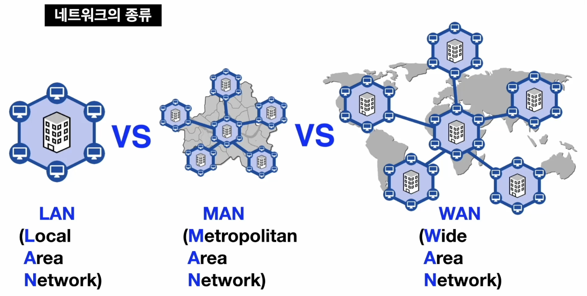

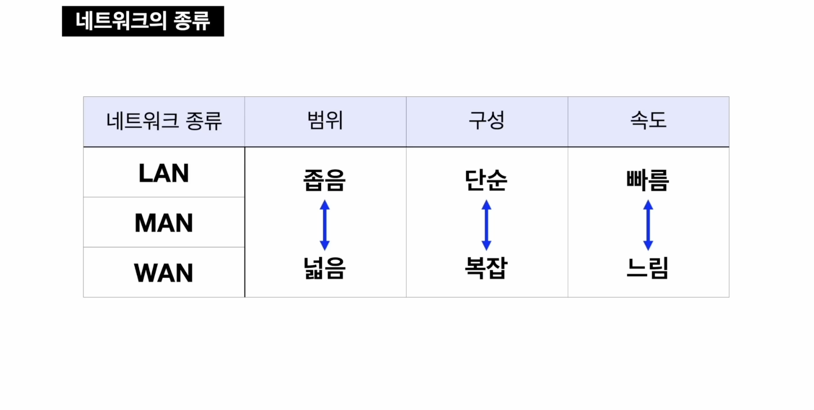

| 종류 | LAN (Local Area Network)                           | MAN (Metropolitan Area Network)                   | WAN (Wide Area Network)                      |
| ---- | -------------------------------------------------- | ------------------------------------------------- | -------------------------------------------- |
| 개념 | 작은 단위의 지역 내에서 장치들을 연결하는 네트워크 | 도시 규모의 넓은 지역을 연결하는 네트워크         | 전 세계적으로 넓은 지역을 연결하는 네트워크  |
| 범위 | 집, 사무실, 학교 등 소규모 지역                    | 도시, 캠퍼스, 대규모 기관 네트워크                | 국가, 대륙, 전 세계 인터넷                   |
| 구성 | 스위치, 라우터, 케이블, 무선AP 등                  | 여러 LAN을 연결하는 백본망, 광케이블, 고속 라우터 | 대규모 인터넷 백본망, 국제 해저 케이블, 위성 |
| 속도 | 빠르다                                             | LAN보다는 느리지만 비교적 빠르다                  | 가장 느리다                                  |

 

### 네트워크 계층

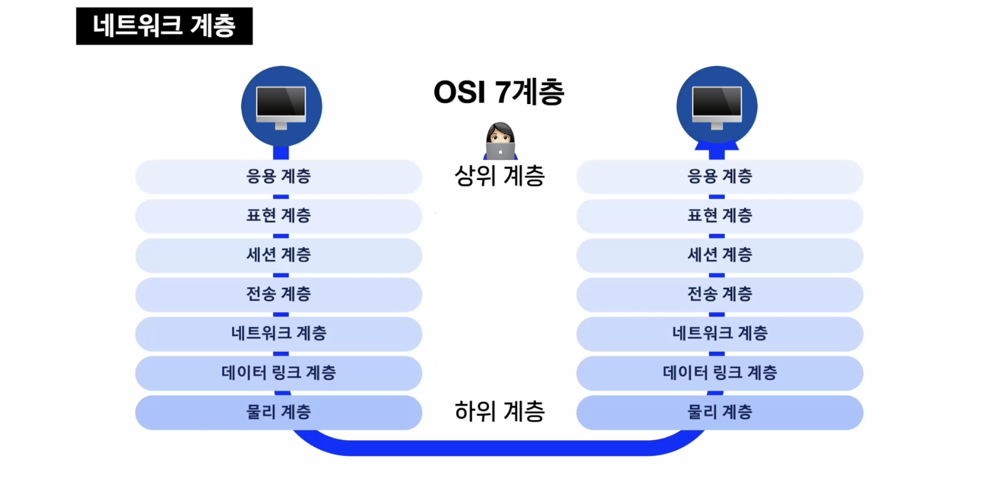

- 사용자와 가까운 `응용 계층`이 상위 계층, 가장 먼 물리 계층이 하위 계층
- 데이터 전송: 상위 → 하위
- 데이터 수신: 하위 → 상위
- 이론적으로는 `OSI 7계층`, 실제 인터넷에서는 `TCP/IP 4계층`으로 단순화해 사용

::: info 📌
프론트에서는 `응용 계층(HTTP, HTTPS, WebSocket)`이 가장 중요하다.
:::

 

### 데이터 캡슐화

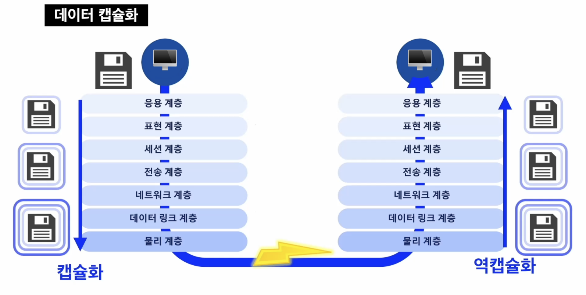

#### 캡슐화

- OSI 7 계층 기준, `응용 계층 → 물리 계층`으로 내려가면서 데이터를 포장하는 방식

#### 역캡슐화

- OSI 7 계층 기준, `물리 계층 → 응용 계층`으로 올라오면서 원본 데이터를 해석하는 방식

::: info 📌
즉, 브라우저에서 보낸 요청이 네트워크를 거쳐 서버까지 도달하고, 다시 돌아오는 과정을 이해하는 데 중요하다.
:::

 

## HTTP (HyperText Transfer Protocol)

`웹 기반 응용 프로그램에서 가장 많이 사용되는 프로토콜`로, OSI 7계층 중 `응용 계층`에 속한다.

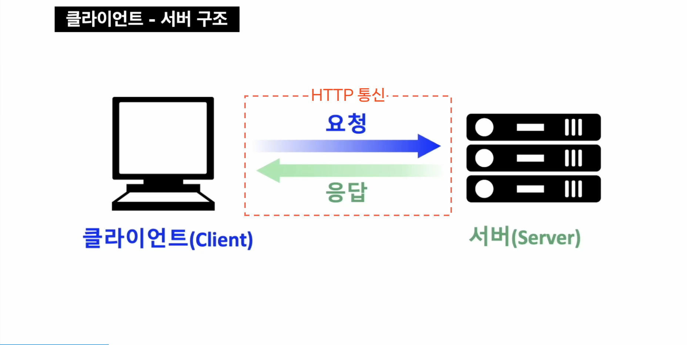

- 클라이언트-서버 구조
- 클라이언트가 URL로 요청을 보내면 서버가 응답을 반환하는 방식

 

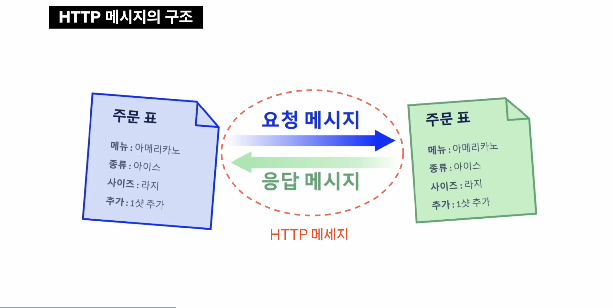
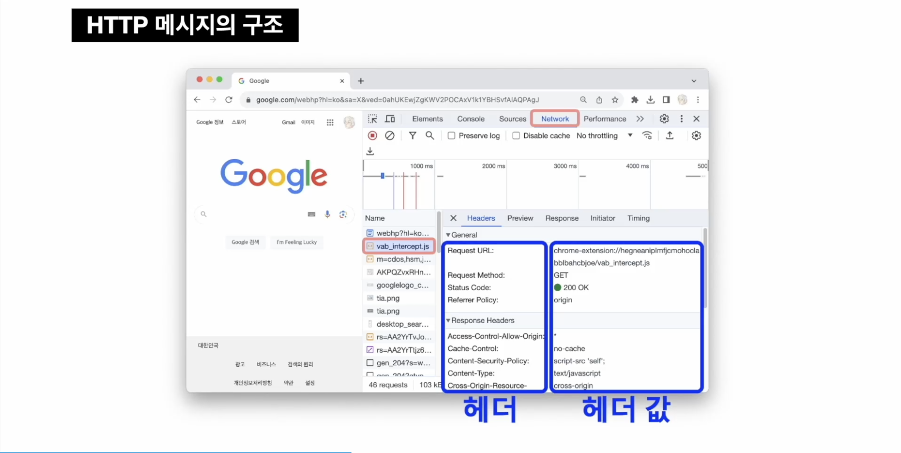

- 요청과 응답 모두 헤더 + 바디 구조로 이루어져 있다.

 

### HTTP 특징

#### 무상태성 (Stateless)

- 서버는 클라이언트의 이전 요청을 기억하지 않는다.
- 각 요청은 독립적으로 처리되고, 저장되지 않는다.

💡 그래서 로그인 유지 같은 기능에는 `쿠키`, `세션`, `JWT`가 필요하다.

#### 비연결성 (Connectionless)

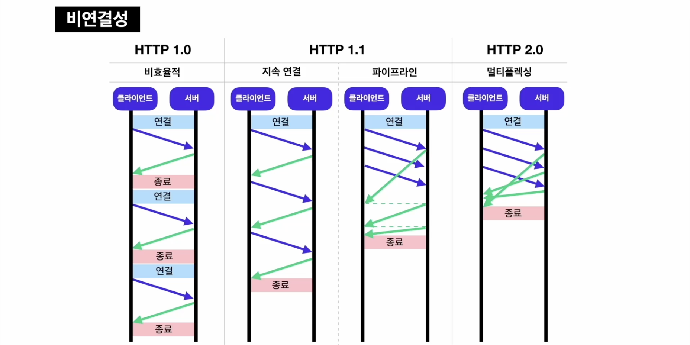

- 요청-응답 1회 처리 후 연결 종료 (리소스 절약 목적)
- HTTP/1.1부터는 지속 연결(Keep-Alive), 파이프라이닝, 멀티플렉싱 같은 보완책 사용
- 최신 브라우저는 HTTP/2, HTTP/3를 지원해 성능 개선

 

## HTTPS (HTTP Secure)

HTTP 요청/응답 데이터를 `암호화`하여 전송하는 방식.

- 보안성을 위해 대칭키 + 비대칭키 방식을 모두 사용
- 브라우저-서버 간 안전한 통신을 보장

::: details 🔑 대칭키 & 비대칭키

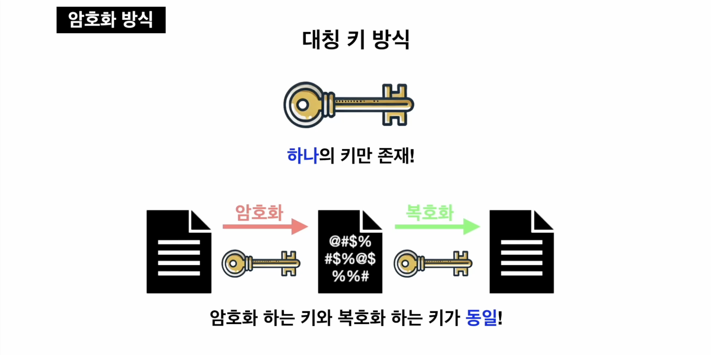

- 하나의 키를 사용하여 암호화하는 방식
- 암호화/복호화 키가 동일하다.

 

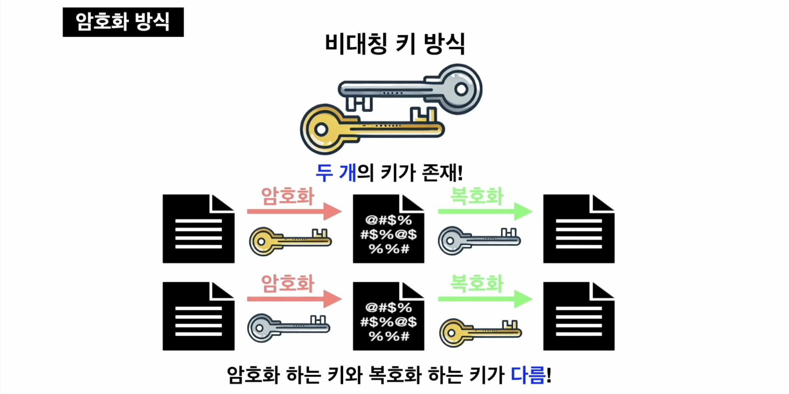

- 두 개의 키를 사용하여 암호화하는 방식
- 암호화/복호화 키가 다르다.

:::

 

### HTTPS 주체

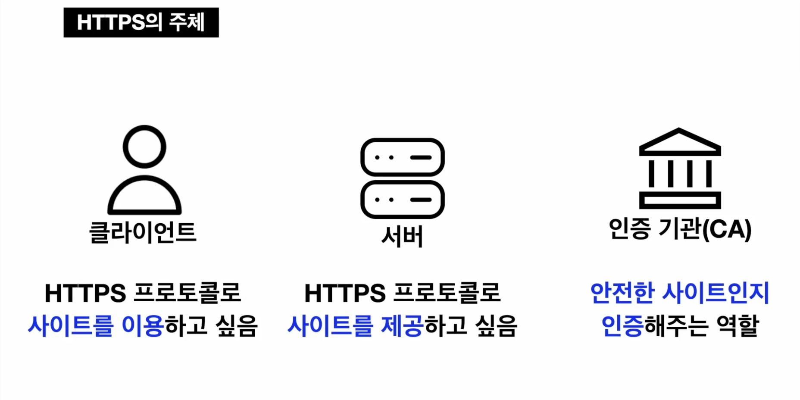

#### 클라이언트(Client)

- 웹 브라우저(Chrome, Safari, Edge 등)
- 서버에 HTTPS 요청을 보내고, 서버가 보낸 인증서를 검증함
- 이후 대칭키(세션키)를 만들어 서버와 안전하게 교환

#### 서버(Server)

- 웹 서비스가 실제로 동작하는 곳 (Node.js, Express, Spring 등)
- 인증서를 발급받아 클라이언트에 제공
- 클라이언트가 전송한 대칭키를 받아서 이후 암호화된 통신에 사용

#### 인증 기관(CA, Certificate Authority)

- 서버의 인증서가 진짜인지 보증해주는 신뢰 기관
- 서버가 스스로 만든 인증서(Self-Signed)는 브라우저가 신뢰하지 않음

 
 
### HTTPS 인증 방식 요약

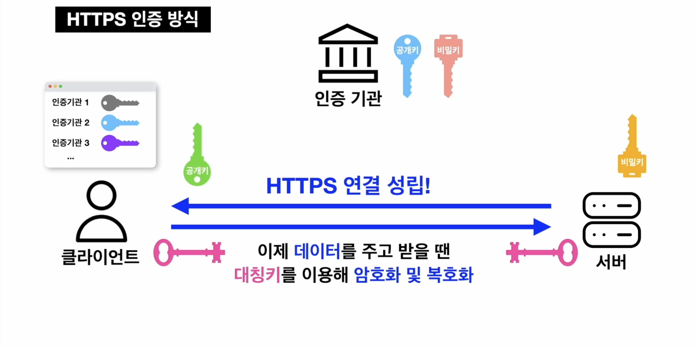

1. 서버가 인증서(공개키 포함)를 브라우저에 전달
2. 브라우저는 인증 기관(CA)으로부터 신뢰 여부 확인
3. 브라우저는 공개키로 세션키(대칭키)를 암호화해 서버에 전달
4. 이후 통신은 세션키(대칭키)로 암호화해 빠르고 안전하게 진행

 

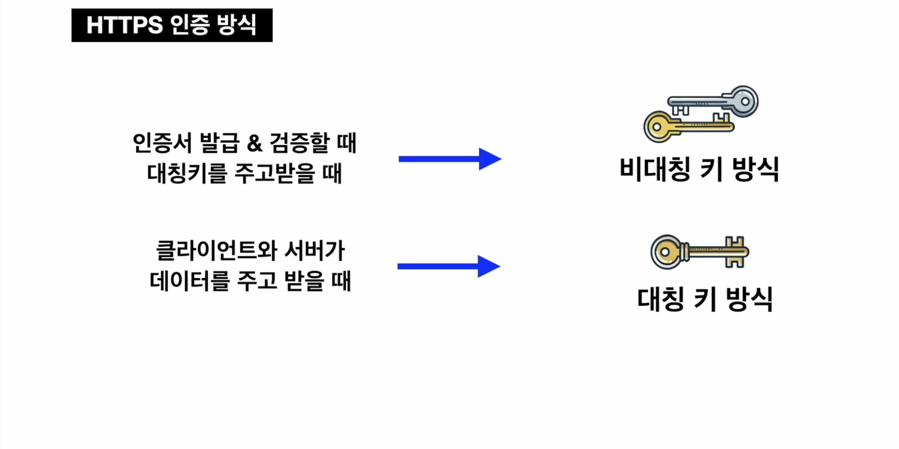

즉, HTTPS는 인증 + 암호화를 동시에 제공한다.

::: details 🔍 HTTPS 인증방식 자세히 보기
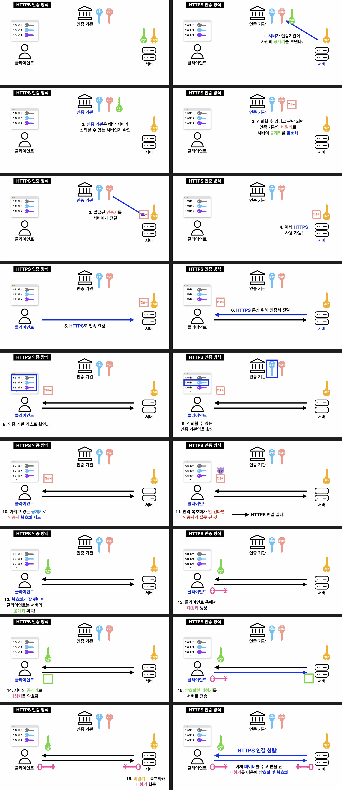
:::
 

### 왜 HTTPS가 필수인가?

- HTTP는 평문 전송이라 도청 및 위변조 공격에 취약하다. → HTTPS는 인증(신뢰성) + 암호화(기밀성) 두 가지를 제공한다.
- 브라우저는 HTTPS가 아닌 요청에 보안 경고를 띄우거나 일부 기능을 제한한다.  
  예: `navigator.geolocation`, `Notification API`는 HTTPS 환경에서만 동작.
- 최신 프로토콜인 HTTP/2, HTTP/3는 HTTPS 기반에서만 동작  
  → 성능 향상(멀티플렉싱, 헤더 압축, 서버 푸시)까지 연결된다.

즉, 보안된 통신의 기반을 마련하는 게 HTTPS.

 

## SOP (Same-Origin Policy)

동일 출처 정책

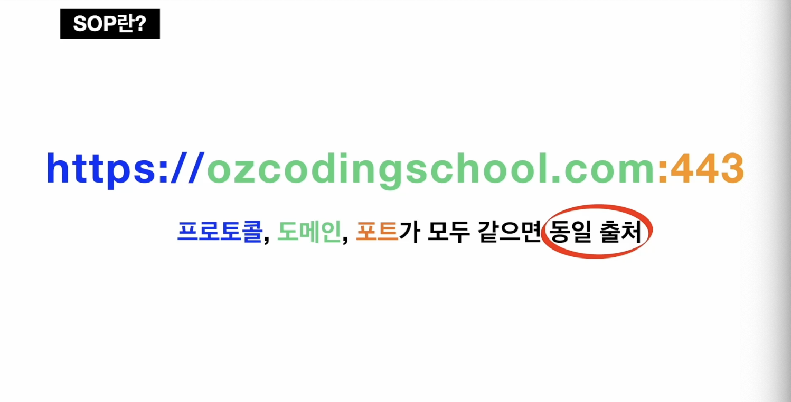

- HTTPS로 전송 자체는 안전해졌다. 하지만, 악성 스크립트가 다른 출처의 민감한 데이터를 가져오는 문제는 여전히 남아있다. 이를 막는 것이 SOP이다.
- 동일 출처 정책은 웹 브라우저의 핵심 보안 정책으로, 다른 출처(origin)에서 불필요하게 접근하지 못하도록 제한하는 정책이다.
- 동일 출처의 리소스만 가져올 수 있으며, 프로토콜, 도메인, 포트가 동일하지 않다면 브라우저가 리소스 전송을 제한한다.

 

## CORS

교차 출처 리소스 공유 (Cross-Origin Resource Sharing)

- 소셜로그인, 공개 API, 오픈데이터 등 다른 출처에서 리소스를 사용하는 경우가 많아졌다. 그래서 SOP를 완전히 풀지 않고 서버가 허용한 경우만 교차 출처 접근 가능하도록 만든 게 CORS다.
- 즉, 서로 다른 출처에서 리소스를 안전하게 주고받기 위한 방법.
- Preflight Request로 브라우저가 미리 CORS를 확인하여 서버에게 물어본다.
- 서버가 Access-Control-\* 헤더를 내려주면 브라우저가 본 요청을 실행한다.

 

#### 단순 요청 (Simple Request)

브라우저가 바로 서버로 요청을 보내는 경우, 특정 조건을 만족하면 Preflight를 생략한다.

- 조건:
  - GET, POST, HEAD 메서드만 사용
  - `Content-Type`이 `application/x-www-form-urlencoded`, `multipart/form-data`, `text/plain`
  - 커스텀 헤더 사용 안 함

 

#### Preflight 요청

- 위 조건을 벗어나면 브라우저가 먼저 OPTIONS 메서드로 서버에 사전 확인(Preflight Request).
  서버가 CORS 허용 응답을 보내야 실제 요청을 진행한다.

 

### CORS 에러 주요 원인

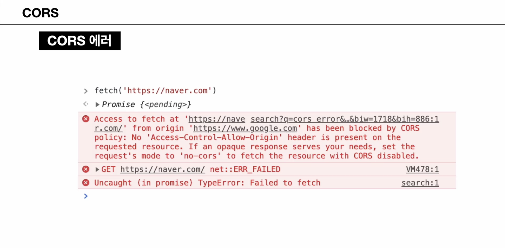

- 서버에서 `Access-Control-Allow-Origin` 헤더 누락
- 프론트에서 `credentials: 'include'` 사용했는데, 서버 응답에 `Access-Control-Allow-Credentials: true` 없음
- 허용하지 않은 메서드/헤더를 사용
- Preflight 요청(OPTIONS)에 대한 서버 응답을 잘못 처리

 

### CORS 응답 헤더 정리

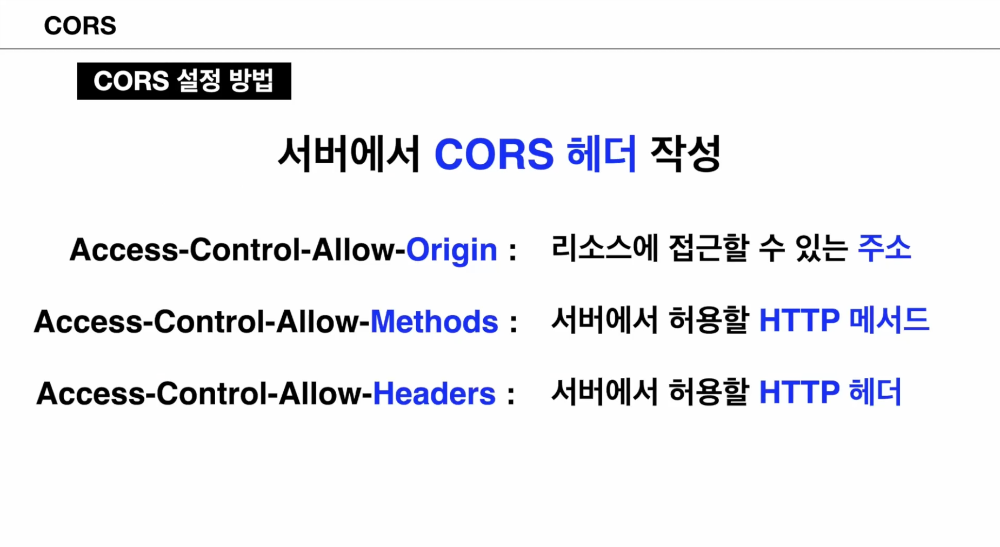

- `Access-Control-Allow-Origin`: 허용할 출처, `*`로 설정하면 모든 출처 허용  
  없다면, 브라우저가 요청을 막아버린다.
- `Access-Control-Allow-Methods`: 허용할 HTTP 메서드 목록 (GET, POST, PUT, DELETE 등)
- `Access-Control-Allow-Headers`: 클라이언트에서 사용할 수 있는 요청 헤더 지정
- `Access-Control-Allow-Credentials`: 쿠키, 인증 정보 포함 여부(true 설정 시)  
  없으면, 로그인된 상태의 API 호출이 실패한다.
- `Access-Control-Max-Age`: Preflight 요청 결과를 캐싱할 시간(초 단위)

 

### CORS 작동 방식

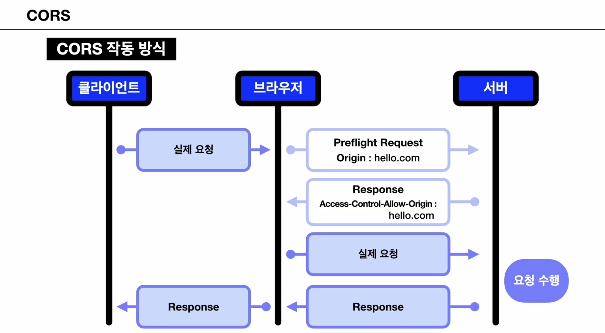

- 클라이언트: 사용자가 API 요청을 보냄 → 브라우저가 이를 처리
- 브라우저: 먼저 서버에게 사전 요청을 전송  
  이때 `Origin: hello.com`같은 출처 정보를 함께 보낸다. (내 출처에서 보내는 요청 허용해주겠니)
- 서버: Preflight 요청을 받고 응답 헤더를 내려줌  
  즉, `hello.com` 출처에서 오는 요청은 허용한다는 의미
- 브라우저: 허용 헤더가 있으니 실제 요청을 서버에 보냄
- 서버: 요청을 정상적으로 처리하고 Response를 반환
- 클라이언트: 최종적으로 응답 데이터를 안전하게 받음

 

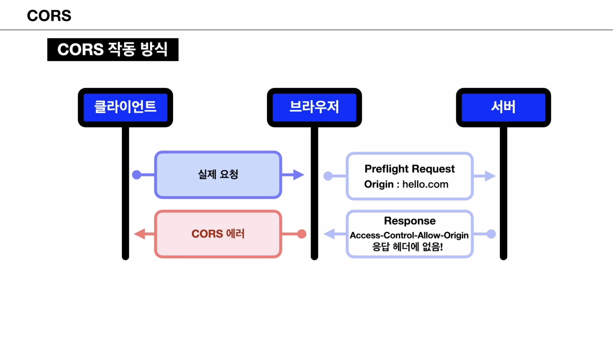

- 클라이언트: 실제 요청을 브라우저에 보냄
- 브라우저: 다른 출처에 대한 요청이므로 먼저 사전 요청을 서버에 보냄
- 서버: 응답 헤더에 `Access-Control-Allow-Origin`이 없음
- 브라우저: 서버가 CORS 허용을 안했네? 보안상 막아야지~ 😈  
  실제 요청을 차단하고 CORS 에러 발생

 

::: info 💡

- SOP는 브라우저의 보안 제한이고, CORS는 이를 합법적으로 우회할 수 있는 방법
- CORS 문제는 서버에서 Access-Control 헤더를 어떻게 내려주느냐에 달려있다.

즉, HTTPS는 안전한 통신, SOP는 브라우저 보안, CORS는 SOP의 예외 규칙
:::

 

## Token

토큰이란? 출입증 역할을 하는 도구로 클라이언트가 소지하고 있다.

### [JWT의 구조 ↗️](https://www.jwt.io/)

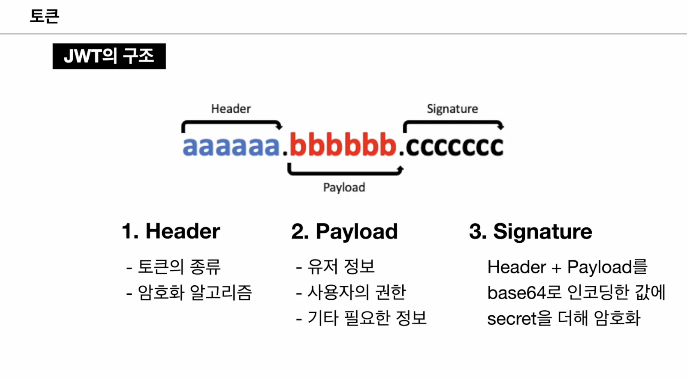

JWT (Json Web Token): JSON 객체에 정보를 담고 이를 토큰으로 암호화해서 만들어진 토큰

 

### JWT의 검증

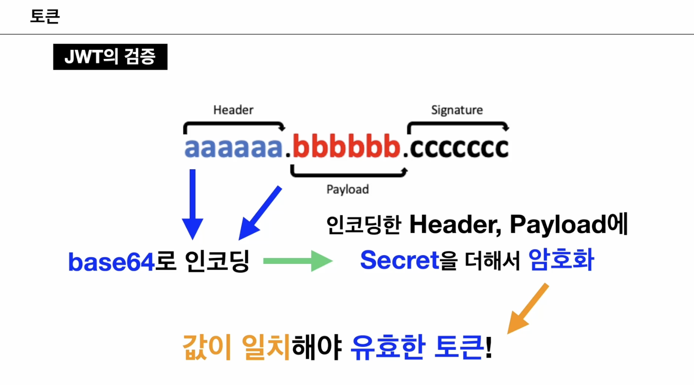

토큰의 유효성 === 사용자의 인증 (클라이언트에서 인증 상태 보관)

::: info 💡 주의사항

- [base64](https://www.base64decode.org/) 인코딩 방식은 원한다면 얼마든지 디코딩 가능
- payload에 민감한 정보 넣지 않기

:::
 

### 토큰의 종류

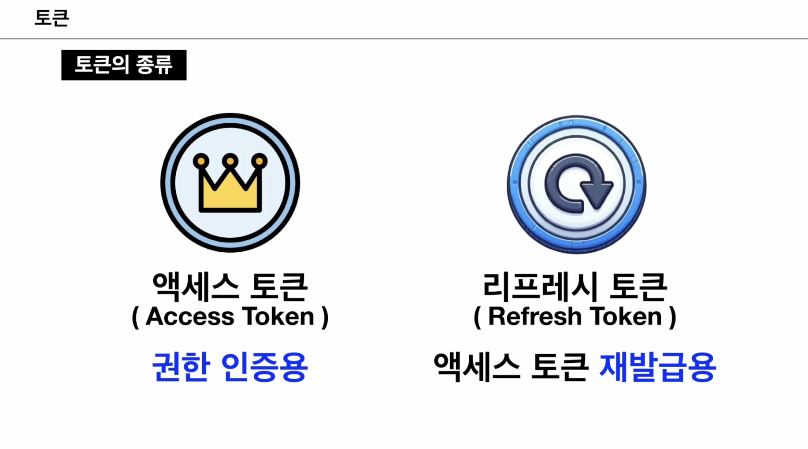

 

### 토큰 인증의 흐름

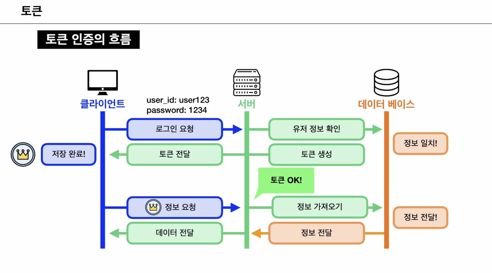

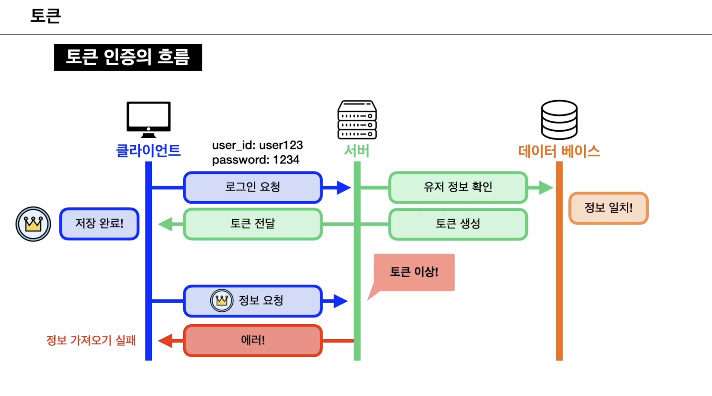

## cookie vs session vs token

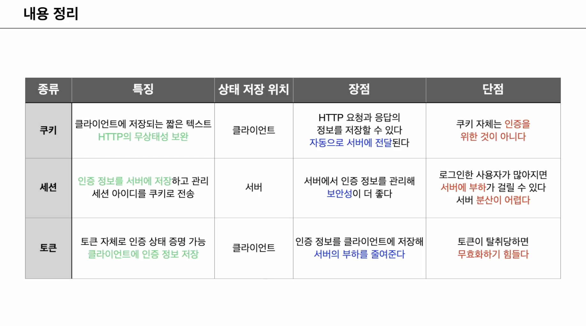

 

 
<Comment/>
