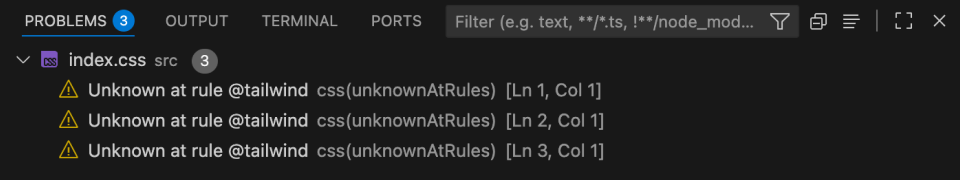
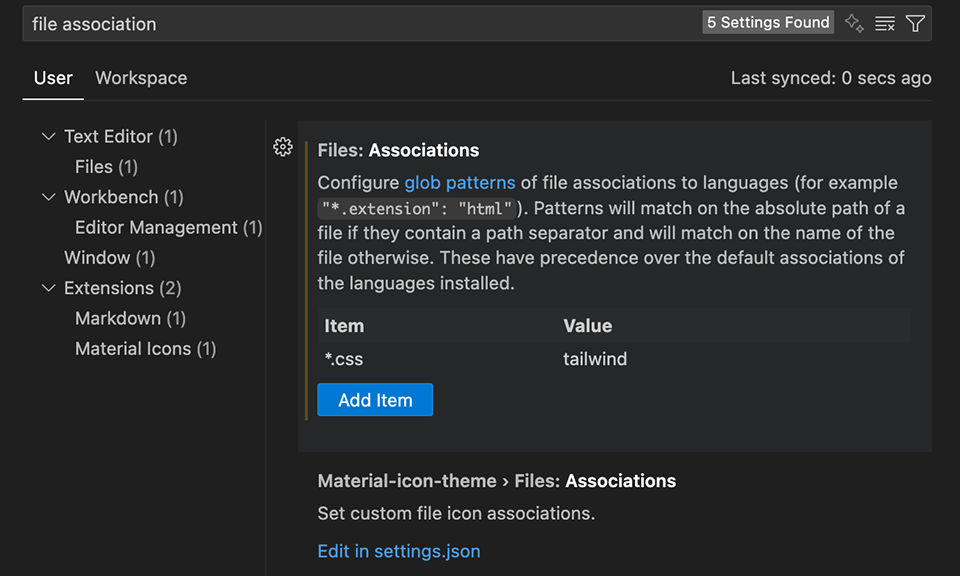

# Get started with Tailwind CSS

## Installation (v3.4.17)

> [Tailwind CSS v3.4.17](https://v3.tailwindcss.com/docs/guides/vite)  
> 본 문서는 Tailwind CSS v3.4.17를 기준으로 작성되었습니다.

```bash
# 설치
$ npm install -D tailwindcss@3 postcss autoprefixer

# config 파일들 설치
$ npx tailwindcss init -p
```

::: details 🧩 `-D` 옵션과 `@3` 버전 명시
<br>

##### 1. `-D` 옵션 여부

```bash
$ npm install tailwindcss postcss autoprefixer
```

- 기본적으로 dependencies(프로덕션 의존성)에 기록된다.
- 즉, 배포 시에도 포함되는 패키지로 취급된다.

```bash
$ npm install -D tailwindcss postcss autoprefixer
```

- devDependencies(개발 의존성)에 기록된다.
- 보통 Tailwind, PostCSS, Autoprefixer는 개발 단계에서만 필요한 도구이다.  
  (빌드할 때 CSS를 생성해주고, 최종 결과물은 plain CSS만 배포됨)  
  그래서 공식 문서도 -D를 붙여서 설치하도록 안내한다.

<br>

##### 2. `@3` 버전 명시 여부

```bash
$ npm install -D tailwindcss postcss autoprefixer
```

- tailwindcss: 최신 버전(latest)이 설치된다.  
  (현시점으로, v4가 나왔으니 v4가 설치된다.)

```bash
$ npm install -D tailwindcss postcss autoprefixer
```

- tailwindcss@3: 3.x대 최신 버전이 설치된다.  
  (현재 v3.4.x 기준으로 3버전대만 따라간다.)

`@3`처럼 메이저 버전을 고정해두면, `v4`가 릴리즈돼도 갑자기 프로젝트가 깨지는 것을 막을 수 있다.
즉, 안정성이 높아진다.

<br>
:::

<br>

### tailwind.config.js

`tailwind.config.js`: Tailwind의 커스터마이징 설정 파일이다. 아래와 같은 설정들을 관리한다.

- 어떤 파일에서 Tailwind 클래스를 찾아야 하는지 (content)
- 테마 확장 (색상, 폰트, spacing 단위 등)
- 플러그인 설정

::: code-group

```js [tailwind.config.js]
/** @type {import('tailwindcss').Config} */
export default {
  content: ["./index.html", "./src/**/*.{js,ts,jsx,tsx}"],
  theme: {
    extend: {},
  },
  plugins: [],
};
```

:::

#### content

- `content`: 여기 적힌 경로 안의 파일에서 실제로 사용된 Tailwind 클래스만 빌드 결과물에 포함된다.
  (안 적으면 CSS 파일이 엄청 커진다 → Purge 기능)
- 예를 들어, `./src/components/Button.jsx` 안에서 `bg-blue-500`을 쓰면, Tailwind가 그걸 보고 최종 CSS에 `bg-blue-500` 규칙을 포함시킨다.

즉, 이 경로 설정이 “Tailwind가 어떤 파일을 스캔해야 하는지” 알려주는 부분이다.

#### theme

```js
theme: {
  extend: {
    colors: {
      brand: "#1da1f2",
    },
  },
},
```

- `theme`: 기본 theme(색상, 폰트 등)에 추가/확장할 값을 넣을 수 있다.

#### plugins

```js
plugins: [],
```

- `plugins`: Tailwind 생태계 플러그인을 추가하는 자리이다.
- 예를 들어, typography, forms, aspect-ratio 같은 공식 플러그인

::: info 🧩 요약

- content: 어떤 파일을 스캔해서 필요한 CSS만 뽑아낼지 지정
- theme.extend: 기본 디자인 시스템 확장
- plugins: 추가 기능 붙이기

:::

<br>

### index.css

::: code-group

```css [index.css]
@tailwind base;
@tailwind components;
@tailwind utilities;
```

:::

::: details 🚨 VSCode에서 @tailwind Unknown at rule 오류 해결
<br>

##### 1. 문제 현상



- index.css에 @tailwind 지시문 작성 시 Unknown at rule @tailwind css(unknownAtRules) 경고 발생.

##### 2. 원인

- VSCode 기본 CSS 언어 서버는 Tailwind 전용 at-rule을 알지 못한다.
- Tailwind CSS IntelliSense 확장은 설치돼 있어도, .css 파일을 Tailwind 모드로 인식하지 않으면 경고

##### 3. 해결 방법


- (1) Tailwind CSS IntelliSense 익스텐션 설치



- (2) VSCode 설정에서 files.associations 추가 or settings.json 직접 편집 적용  
  나는 직접 세팅에서 추가해주었다!
- vscode settings > file associations > \*.css: tailwind 추가

:::

<br>

<Comment/>
