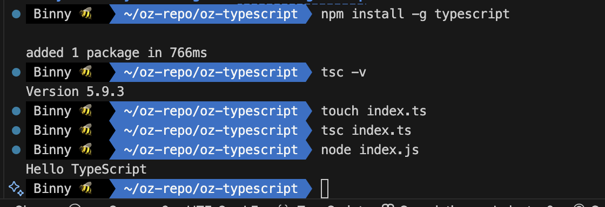

# TypeScript

<!--  -->

::: info Reference

- [TypeScript GitHub](https://github.com/microsoft/TypeScript)
- [Docs](https://www.typescriptlang.org/)
- [코딩문T 유튜브](https://www.youtube.com/@codingmoon/videos)

:::

<br>

## TypeScript란?

- Microsoft에서 개발 및 유지 관리하는 오픈 소스 언어
- 대규모 애플리케이션 개발을 위해 설계됨
- JavaScript에 정적 타입 검사와 타입 표기(annotation)를 추가한 언어
- 결국 JavaScript의 상위 집합(Superset)  
  → 모든 JS 코드는 그대로 TS에서도 동작하지만, TS만의 기능은 JS에는 없음

<br>

## TypeScript의 주요 특징

- 크로스 플랫폼 지원 (윈도우, 맥, 리눅스 어디서든 사용 가능)
- 객체 지향 언어 지원 (클래스, 인터페이스 등)
- 정적 타입 검사 (컴파일 단계에서 오류 발견 가능)
- 타입 추론 기능 (명시하지 않아도 타입을 유추)
- 선택적 정적 타이핑 (원하면 동적처럼도 작성 가능)
- 최신 ECMAScript 기능 포함 (ES6+ 문법 적극 지원)
- DOM 조작 가능 (브라우저 API와도 호환)

<br>

## 왜 TypeScript를 사용할까?

JavaScript만으로도 웹 개발은 충분히 가능하지만, 프로젝트 규모가 커지면 다음과 같은 문제가 발생한다.

- 타입 관련 오류가 런타임에 발견되어 디버깅 비용이 커짐
- 협업 시 코드 의도가 불분명해져 유지보수가 어려워짐

💡 TypeScript는 이러한 문제를 사전에 방지하고, 더 안정적인 개발 경험을 제공한다.

<br>

## JS vs TS

### JavaScript

JavaScript는 웹의 표준 언어로, 동적인 웹사이트와 애플리케이션을 만드는 데 필수적인 도구이다. 하지만 JavaScript만으로는 프로그램의 복잡성이 커질 때 발생할 수 있는 여러 문제들을 해결하기 어렵다.

### TypeScript

TypeScript는 JavaScript의 상위 집합으로, JavaScript의 모든 기능을 포함하면서도 정적 타입 검사와 같은 강력한 기능을 추가한다.

| 특징              | JavaScript                                      | TypeScript                                                |
| ----------------- | ----------------------------------------------- | --------------------------------------------------------- |
| 타입 시스템       | 동적 타입<br>변수 타입은 런타임에 결정됨        | 정적 타입<br>변수 타입은 컴파일 시점에 결정됨             |
| 타입 안정성       | 오류가 런타임에서 발견됨 <br>(타입 안정성 낮음) | 오류 대부분을 컴파일 단계에서 발견 <br>(타입 안정성 높음) |
| 컴파일            | 인터프리터 언어<br>런타임에 바로 해석됨         | 컴파일 언어<br>TS 코드는 JS로 트랜스파일된 후 실행        |
| 학습 곡선         | 비교적 쉬움                                     | JS보다 다소 어려움<br>(타입 시스템과 추가 문법 학습 필요) |
| 인터페이스/제네릭 | 지원하지 않음                                   | 지원함 (대규모 프로젝트 구조화에 유리)                    |
| 호환성            | 모든 브라우저와 환경에서 기본 지원              | JS로 변환해야 브라우저/런타임에서 실행 가능               |

<br>

## TypeScript 설치

TypeScript는 Node.js 환경에서 npm 패키지로 설치 가능하다.  
먼저 Node.js가 설치되어 있어야 하며, npm 또는 yarn을 통해 설치 가능하다.

[Download TypeScript](https://www.typescriptlang.org/download/)

### 프로젝트에 설치

```bash
$ npm install typescript --save-dev
```

<br>

### 전역 설치

```bash
$ npm install -g typescript
```

::: info 🔍 버전확인

```bash
$ tsc -v
```

- `tsc` = typescript compiler

:::

<br>

## TypeScript Compile

```bash
$ tsc index.ts
```

::: code-group

```ts [index.ts]
function hello(name: string) {
  console.log(`Hello ${name}`);
}

hello("TypeScript");
```

```js [index.js]
function hello(name) {
  console.log("Hello ".concat(name));
}
hello("TypeScript");
```

:::
::: details 🐛 실습

:::

<br>

## TypeScript 동작 원리

### Type System

::: info 타입스크립트 + 타입시스템 → 자바스크립트 생성
:::

- 데이터의 종류를 구분하는 분류 체계
- 프로그램의 안정성과 신뢰성을 높이는 역할

<br>

### 핵심 개념

#### 1. Type Safety (타입 안정성)

- 프로그램이 예상치 못한 방식으로 데이터를 해석하는 오류를 미리 방지

#### 2. Type Inference (타입 추론)

- 명시적으로 타입을 지정하지 않아도, 컴파일러가 자동으로 데이터의 타입을 결정하는 프로세스

#### 3. 정적 vs 동적 타입

- 정적(Static): 컴파일 시점에 결정 → 안정성 ↑
- 동적(Dynamic): 런타임 시점에 결정 → 유연성 ↑

#### 4. Generics (제네릭)

- 다양한 타입에 대해 동작하는 재사용 가능한 코드 작성 가능

<br>

### 동작 흐름

- 1. 파싱: 타입스크립트 컴파일러가 코드를 파싱하여 추상 구문 트리(AST) 모델 생성
- 2. 타입검사: 컴퍼일러는 코드를 검토하여 변수/함수/표현식 타입 검토 & 오류 탐지
- 3. JS 코드 생성: 타입스크립트 코드가 타입 검사를 거친 후, 컴파일러는 자바스크립트 코드를 생성하며 생성된 자바스크립트 코드에서는 타입 주석(annotation) 제거

<br>

## 컴파일러 환경설정

tsconfig.json 파일로 프로젝트 단위 설정을 한다.

- [TS config](https://www.typescriptlang.org/tsconfig/)

```bash
# tsconfig.json 생성
$ tsc --init
```

### tsconfig.json

- 환경 설정은 타입스크립트 프로젝트에서 컴파일러의 동작 방식을 정의하는 과정
- `tsconfig.json` 파일을 통해 이루어 진다.
- 프로젝트 구조, 옵션, 타겟 환경 등을 지정한다.

```json
{
  "compilerOptions": {
    "target": "es2016",
    "module": "commonjs",
    "esModuleInterop": true,
    "forceConsistentCasingInFileNames": true,
    "strict": true,
    "skipLibCheck": true,
    "outDir": "dist",
    "noUncheckedIndexedAccess": true
    // "lib": ["ES2022", "DOM"]
  },
  "include": ["src/**/*"]
}
```

<br>

## 타입 주석 (Type Annotation)

변수, 함수, 객체 등에 명시적으로 타입을 지정하는 문법. 컴파일러는 이 정보를 바탕으로 타입 검사를 수행한다.

```ts
let text: string = "Hello";
let count: number = 42;
let isDone: boolean = true;
let nothing: null = null;
let notDefined: undefined = undefined;
let anything: any = "유연하게";
let union: string | number = "hello";
```

## 기본 타입

타입스크립트의 기본 타입에는 string, number, boolean, null, any 등이 있다.

| 타입        | 설명                                      | 예시 코드                                        |
| ----------- | ----------------------------------------- | ------------------------------------------------ |
| `string`    | 문자열                                    | `let name: string = "Binny";`                    |
| `number`    | 정수, 소수, 음수, 지수 표현 모두 가능     | `let age: number = 25;`                          |
| `boolean`   | 참/거짓 값                                | `let isOpen: boolean = true;`                    |
| `null`      | 값이 없음을 명시적으로 표현               | `let empty: null = null;`                        |
| `undefined` | 값이 할당되지 않음을 의미                 | `let notDefined: undefined;`                     |
| `any`       | 모든 타입 허용 (타입 검사에서 제외)       | `let flexible: any = "문자열";`                  |
| `unknown`   | `any`와 유사하지만 사용 전 타입 검사 필요 | `let input: unknown = 5;`                        |
| `void`      | 함수가 값을 반환하지 않을 때 사용         | `function log(): void {}`                        |
| `never`     | 절대 발생할 수 없는 타입                  | `function error(): never { throw new Error(); }` |

<br>
<Comment/>
